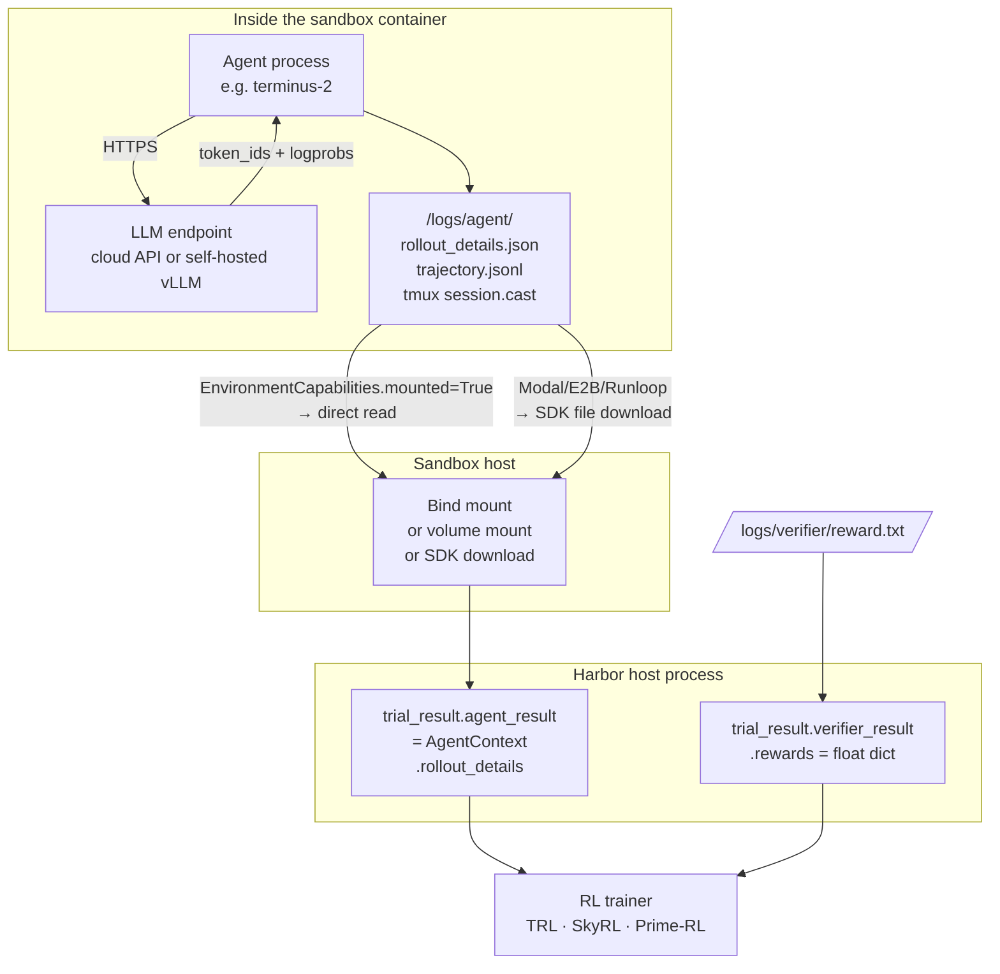

# Agent harnesses + how RL traces leave the sandbox

A reference for what's possible when consumers run Repo2RLEnv-emitted Harbor tasks: which agent harnesses can run them, what inputs each agent accepts (LLM endpoint, model, etc.), and the data path that makes RL training possible — how token IDs and logprobs flow out of the sandbox into a trainer.

This is **Harbor's responsibility**, not Repo2RLEnv's — but understanding it matters because it determines what kinds of consumers our datasets work with out of the box.

## TL;DR

- Harbor ships **25 agent harnesses** (≈22 distinct coding agents + 2 testing helpers + 1 alias) — see [§1](#1-the-25-built-in-agents)
- Every agent extends `BaseAgent` with shared params (`logs_dir`, `model_name`, `mcp_servers`) plus declarative `CliFlag` / `EnvVar` mappings — see [§2](#2-agent-contract)
- The LLM **never runs inside the task sandbox** — agent makes outbound HTTPS calls to wherever it's hosted (cloud API or your tunneled vLLM) — see [§3](#3-llm-hosting)
- Token IDs and logprobs are captured **inside the agent's container** to `/logs/agent/`, then read back via volume mount or SDK download into `trial_result.agent_result.rollout_details` — see [§4](#4-rl-traces--logprobs--how-data-leaves-the-sandbox)
- Terminus 2 self-reports rollout details; for other agents, an OpenAI-compatible proxy in front of vLLM works as an alternative — see [§5](#5-two-paths-for-token-id-capture)

## 1. The 25 built-in agents

From [`src/harbor/models/agent/name.py`](../references/harbor/src/harbor/models/agent/name.py) — the canonical enum.

### Real coding agents (22)

**CLI-based proprietary agents:**
- `claude-code` — Anthropic's official CLI
- `codex` — OpenAI Codex CLI
- `gemini-cli` — Google
- `copilot-cli` — GitHub
- `cursor-cli` — Cursor
- `rovodev-cli` — Atlassian Rovo
- `kimi-cli` — Moonshot
- `qwen-coder` — Alibaba (enum const is `QWEN_CODE`, value is `"qwen-coder"`)

**Open-source coding agents:**
- `aider`
- `goose` — Block's Goose
- `openhands` and `openhands-sdk` — OpenHands (formerly OpenDevin)
- `cline-cli` — Cline as CLI
- `swe-agent` — Princeton SWE-agent
- `mini-swe-agent` — minimal SWE-agent variant
- `opencode`
- `trae-agent` — ByteDance Trae
- `hermes`
- `pi`
- `nemo-agent` — NVIDIA NeMo

**Harbor-native:**
- `terminus-1` and `terminus-2` — Harbor's reference agents (mono-tool tmux design, RL-friendly with native logprobs/token-id capture)

### Testing harnesses (2)

- `oracle` — applies the ground-truth solution; useful to verify a task is internally consistent (oracle should always score 1.0)
- `nop` — does nothing; for debugging the harness pipeline itself

### Plus 1 alias

- `terminus` — alias resolving to one of the terminus variants

### Architecture: how they plug in

From `src/harbor/agents/factory.py`, `_AGENT_MAP: dict[AgentName, type[BaseAgent]]` is built dynamically from a `_AGENTS` list. Custom (third-party) agents register via `harbor run --agent-import-path my_pkg.agents:MyAgent` — no Harbor patch needed.

Two base patterns:

| Base class | When to use | Examples |
|---|---|---|
| `BaseAgent` | Agent runs as an external process and talks to the container via `bash` exec | most CLIs |
| `BaseInstalledAgent` | Agent installs into the container with `install()` and runs there directly | openhands, terminus-2, claude-code (in some configs) |

## 2. Agent contract

### Shared params (every agent)

```python
class BaseAgent(ABC):
    SUPPORTS_ATIF: ClassVar[bool] = False     # Harbor's trajectory format
    SUPPORTS_WINDOWS: ClassVar[bool] = False

    def __init__(
        self,
        logs_dir: Path,                          # written to /logs/agent inside container
        model_name: str | None = None,           # LiteLLM-style "provider/model"
        logger: logging.Logger | None = None,
        mcp_servers: list[MCPServerConfig] | None = None,  # task-declared MCP tools
        skills_dir: str | None = None,           # path to skills config inside container
        *args, **kwargs,
    ): ...
```

### Declarative kwarg → CLI flag / env var mapping

For installed agents (CLI tools that run inside the container), Harbor uses two declarative dataclasses to wire kwargs to the agent's launch:

```python
@dataclass
class CliFlag:
    kwarg: str
    cli: str                                              # e.g. "--max-turns"
    type: Literal["str", "int", "bool", "enum"]
    choices: list[str] | None = None
    default: Any = None
    env_fallback: str | None = None                       # also resolves from this env
    format: str | None = None

@dataclass
class EnvVar:
    kwarg: str
    env: str                                              # e.g. "ANTHROPIC_API_KEY"
    type: Literal["str", "int", "bool", "enum"]
    # ...
    bool_true: str = "true"
    bool_false: str = "false"
```

A subclass declares `CLI_FLAGS: list[CliFlag]` and the base auto-generates the agent's launch command. This is how Harbor stays DRY across 22+ agents.

### Concrete: what `claude-code` accepts

```python
class ClaudeCode(BaseInstalledAgent):
    SUPPORTS_ATIF: bool = True

    CLI_FLAGS = [
        CliFlag("max_turns",            cli="--max-turns",            type="int",  env_fallback="CLAUDE_CODE_MAX_TURNS"),
        CliFlag("reasoning_effort",     cli="--effort",               type="enum", choices=["low","medium","high","xhigh","max"]),
        CliFlag("thinking",             cli="--thinking",             type="enum", choices=["enabled","adaptive","disabled"]),
        CliFlag("thinking_display",     cli="--thinking-display",     type="enum", choices=["summarized","omitted"]),
        CliFlag("max_thinking_tokens",  cli="--max-thinking-tokens",  type="int",  env_fallback="MAX_THINKING_TOKENS"),
        CliFlag("max_budget_usd",       cli="--max-budget-usd",       type="str"),
        CliFlag("fallback_model",       cli="--fallback-model",       type="str"),
        CliFlag("append_system_prompt", cli="--append-system-prompt", type="str"),
        # ... more
    ]
```

`ANTHROPIC_API_KEY` is resolved by the Claude Code CLI itself; Harbor passes the env through.

### Concrete: what `terminus-2` accepts (RL-targeted)

The RL story lives here. `terminus-2` is purpose-built to capture token IDs + logprobs natively.

```python
class Terminus2(BaseInstalledAgent):
    def __init__(
        self,
        logs_dir: Path,
        model_name: str | None = None,
        max_turns: int | None = None,
        parser_name: str = "json",                          # or "xml"
        api_base: str | None = None,                        # ← self-hosted endpoint URL
        temperature: float | None = None,
        reasoning_effort: Literal[
            "none","minimal","low","medium","high","xhigh","max","default"
        ] | None = None,
        collect_rollout_details: bool = False,              # ← FLIP THIS ON FOR RL
        session_id: str | None = None,
        enable_summarize: bool = True,
        proactive_summarization_threshold: int = 8000,
        max_thinking_tokens: int | None = None,
        model_info: dict | None = None,                     # max_input_tokens, cost-per-token, ...
        trajectory_config: TrajectoryConfig | None = None,  # raw_content, linear_history (for SFT export)
        tmux_pane_width: int = 160,
        tmux_pane_height: int = 40,
        store_all_messages: bool = False,
        record_terminal_session: bool = True,
        interleaved_thinking: bool = False,
        suppress_max_turns_warning: bool = False,
        use_responses_api: bool = False,
        llm_backend: LLMBackend | str = LLMBackend.LITELLM,  # litellm | openai-direct | hf-router | ...
        llm_kwargs: dict | None = None,                      # passed to backend constructor
        llm_call_kwargs: dict[str, Any] | None = None,       # per-call (top_p, top_logprobs, ...)
        extra_env: dict[str, str] | None = None,
    ): ...
```

The two important ones for hosted-LLM scenarios:

- **`api_base`**: pointing at vLLM / SGLang / Ollama / your cloudflared tunnel
- **`llm_backend`**: which Python client driver to use (LiteLLM is default, with adapters for direct providers)

## 3. LLM hosting

**The LLM never runs inside the task sandbox.** The agent process inside the sandbox makes outbound HTTPS calls to wherever the LLM is hosted.

| Where the LLM runs | How the agent reaches it |
|---|---|
| Cloud API (Anthropic / OpenAI / etc.) | `model_name="anthropic/claude-sonnet-4-6"` + `ANTHROPIC_API_KEY` env. No `api_base`. |
| Self-hosted vLLM / SGLang on your laptop or tunnel | `model_name="vllm/Qwen3.5-4B"` + `api_base="https://your-tunnel/v1"` + `OPENAI_API_KEY="dummy"` |
| HF Inference Router (Together / Nscale / Scaleway) | `model_name="huggingface/Qwen/...:together"` + `HF_TOKEN`; LiteLLM auto-points at the router |
| Bedrock / Vertex / etc. | LiteLLM provider strings + provider-specific env auth |

### Implications

- Sandbox network policy must allow outbound (or run with `network: open` for build phase)
- The LLM endpoint sees only the agent's prompts, never the verifier's reward
- A self-hosted LLM behind your tunnel keeps both code AND prompts internal
- Cold-API agents (Claude Code, Codex CLI) need their provider env var passed through `task.toml`'s `[environment].env` map

## 4. RL traces + logprobs — how data leaves the sandbox

This is the pipe that makes RL training possible. It has four layers.



### Layer 1 — agent stores rollout per turn

Inside `terminus_2.py`, on each LLM response:

```python
if response.prompt_token_ids is not None:
    rollout_detail["prompt_token_ids"] = [response.prompt_token_ids]
if response.completion_token_ids is not None:
    rollout_detail["completion_token_ids"] = [response.completion_token_ids]
if response.logprobs is not None:
    rollout_detail["logprobs"] = [response.logprobs]
```

Accumulated in `self._rollout_details: list[RolloutDetail]`. **Only collected when `collect_rollout_details=True`** — default off because the data is large (~500B/token, see HF inference doc).

### Layer 2 — written to `/logs/agent/` inside the container

The agent's `logs_dir` is set to `/logs/agent` by Harbor convention. At end-of-turn the rollout dicts get serialized to JSONL there, alongside:

- `trajectory.jsonl` — per-step ATIF format (chat history, tool calls, observations)
- `tmux_session.cast` — full asciinema recording of the terminal (Terminus 2 specifically)

### Layer 3 — Harbor pulls them out post-trial

Two paths depending on the sandbox provider's `EnvironmentCapabilities.mounted`:

| Provider | `mounted` | How rollout data exits |
|---|:-:|---|
| Local Docker | ✅ True | Bind mount — Harbor reads `/logs/agent/*` directly from the sandbox host |
| Apple Container | ✅ True | Bind mount |
| Daytona | ✅ True | Volume mount at `/harbor/logs/agent` on the sandbox |
| Islo | ✅ True | Bind mount + CA bundle for TLS |
| Modal / E2B / Runloop | ❌ False | Harbor calls the provider SDK's `download_file()` to pull each file |

Both paths populate the same end state: `trial_result.agent_result.rollout_details` is a list of `RolloutDetail` Pydantic objects, each with `prompt_token_ids: list[list[int]]`, `completion_token_ids: list[list[int]]`, `logprobs: list[list[float]]`.

### Layer 4 — trainer consumes

```python
trial = job.run(...)
for trial_result in trial.results:
    reward = trial_result.verifier_result.rewards.get("reward", 0)   # float ∈ [0, 1]
    for rd in trial_result.agent_result.rollout_details:             # one per turn
        prompt_ids = rd.prompt_token_ids                             # list[list[int]]
        completion_ids = rd.completion_token_ids                     # list[list[int]]
        logprobs = rd.logprobs                                       # list[list[float]]
        # Feed into TRL / SkyRL / Prime-RL policy gradient computation
```

Same shape every Harbor-compatible trainer uses today — `harbor-cookbook/sky-rl`, `harbor-cookbook/prime-rl`, `harbor-cookbook/tinker-rl`, `harbor-cookbook/harbor-rl` all consume this interface.

## 5. Two paths for token-ID capture

Token IDs and logprobs can be captured at two different layers, depending on how cooperative your agent is.

### Path A — agent self-reports (Terminus 2)

The LLM API response carries token IDs and logprobs (vLLM/SGLang return these natively; HF Router returns them per-provider — see [`references/hf_inference.md`](../references/hf_inference.md)). Agent unpacks them directly. Cleanest path; works whenever the agent and LLM endpoint cooperate.

**Requires:**

- Agent supports rollout capture (Terminus 2 does; most CLI agents don't)
- LLM endpoint returns `logprobs` (cloud APIs that don't return logprobs are unusable here)

### Path B — vLLM proxy intercept

For agents that don't natively support `collect_rollout_details` (most CLI agents — Claude Code, Codex, etc.), Harbor can run a vLLM-compatible proxy in front of your hosted model. The proxy logs every `(prompt, completion, logprobs)` triple keyed by trial ID, regardless of which agent makes the call.

**Requires:**

- Self-hosted LLM (or any OpenAI-compatible endpoint you can put a proxy in front of)
- Agent talks to the proxy URL (set `OPENAI_BASE_URL` in the agent's env)

### Comparison

| | Path A (self-report) | Path B (proxy intercept) |
|---|---|---|
| Cleanliness | Cleanest — data flows through one channel | Two data sources to reconcile |
| Agent support | Only Terminus 2 today | Any agent that talks OpenAI-compatible HTTPS |
| LLM support | Endpoint must return logprobs | Endpoint must return logprobs (proxy logs them) |
| Cost overhead | Zero | One extra hop per LLM call |
| Best when | You control the agent and use Terminus 2 | You want to use Claude Code / Codex / etc. and still do RL |

Path A is cheaper and cleaner; Path B works for any harness that talks to an OpenAI-compatible endpoint.

## 6. What this means for Repo2RLEnv

When we ship full pipelines (v0.2+), the loop looks like:

1. Generate dataset with `repo2rlenv generate ... --pipeline pr_mining`
2. Push to HF Hub
3. User trains with their RL framework of choice:
   ```python
   from harbor import Job, JobConfig, TaskConfig
   tasks = TaskConfig(dataset="myorg/django-r2e@1.0", ...)
   job = Job(JobConfig(...), tasks)
   results = job.run()
   for r in results:
       reward = r.verifier_result.rewards.get("reward", 0)
       rollout = r.agent_result.rollout_details
       # ... policy gradient update
   ```
4. Standard policy-gradient update from there

We don't need to touch the rollout-capture pipe at all — Harbor already plumbs it end to end. **Repo2RLEnv just produces tasks; everything from "agent runs in sandbox" through "trainer gets rollout tensor" is Harbor's responsibility.**

The only RL-relevant Repo2RLEnv concern is **emitting tasks tagged with the right `reward_kinds`** (see [SPEC.md](./SPEC.md)):

| Pipeline class | Reward kinds emitted | Rollout pipe used? |
|---|---|---|
| Lite (`pr_mining_lite`) | `diff_similarity` only | No — trainer compares text directly |
| Full (`pr_mining`, `mutation`, etc.) | `test_execution` (and optionally `diff_similarity`) | Yes — full Harbor rollout pipe |

For TRL specifically (HF's RL library), no Harbor integration exists in the upstream cookbook today. Building a thin TRL adapter is on our v0.3 roadmap and is a small isolated piece — it just maps Harbor's `(prompt_ids, completion_ids, logprobs, reward)` quadruple into TRL's `RolloutGenerator` interface.

## 7. References

- [`src/harbor/models/agent/name.py`](../references/harbor/src/harbor/models/agent/name.py) — `AgentName` enum
- [`src/harbor/agents/base.py`](../references/harbor/src/harbor/agents/base.py) — `BaseAgent`
- [`src/harbor/agents/installed/base.py`](../references/harbor/src/harbor/agents/installed/base.py) — `BaseInstalledAgent`, `CliFlag`, `EnvVar`
- [`src/harbor/agents/installed/claude_code.py`](../references/harbor/src/harbor/agents/installed/claude_code.py) — example CLI-based agent
- [`src/harbor/agents/terminus_2/terminus_2.py`](../references/harbor/src/harbor/agents/terminus_2/terminus_2.py) — Harbor's RL-friendly reference agent
- [`src/harbor/models/agent/rollout_detail.py`](../references/harbor/src/harbor/models/agent/rollout_detail.py) — `RolloutDetail` schema
- [`src/harbor/agents/factory.py`](../references/harbor/src/harbor/agents/factory.py) — registration + dynamic `_AGENT_MAP`
- [`references/hf_inference.md`](../references/hf_inference.md) — per-provider HF Router logprobs support matrix
- [Harbor agents docs](https://www.harborframework.com/docs/agents)
- [Terminus 2 docs](https://www.harborframework.com/docs/agents/terminus-2)
- [SPEC.md](./SPEC.md) — Repo2RLEnv reward_kinds and how they map to this pipe
