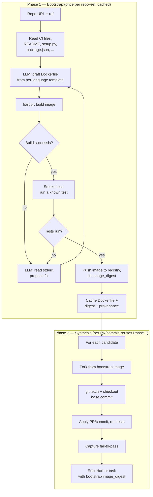

# Environment Bootstrap (v0.2)

Design doc for the **bootstrap phase** that all sandbox-required pipelines (`pr_mining`, `mutation`, `commit_mining`, `oss_instruct`, `equivalence_tests`, `cve_mining`) share.

> Status: **planned for v0.2**. Lite pipelines (`pr_mining_lite`) don't need this. `pr_mining_lite` shipped without bootstrap and runs without Docker.

## The problem

Every sandbox-required pipeline needs the same prerequisite: a **working Docker image where the target repo builds cleanly and tests run**. Different repos have wildly different setup needs:

- Python: uv / poetry / pip / conda + system libs (gcc, libpq, …)
- JS/TS: pnpm / yarn / npm / bun, sometimes monorepos
- Go: modules + build tags + CGO toolchain occasionally
- Rust: cargo + specific toolchain pins
- Java: maven / gradle + JDK version
- C/C++: cmake / make / bazel / meson + system deps

Hand-curating per-repo install scripts (the SWE-bench approach) is **O(N)** human work and goes stale every time the repo changes its build system. Repo2RLEnv targets any repo, so this is unworkable.

## The solution

**An LLM agent iterates on the Dockerfile until it builds + tests pass.** This is exactly what [RepoLaunch](https://github.com/microsoft/RepoLaunch) (Microsoft, split out of SWE-bench-Live for reuse) and [R2E-Gym SWE-GEN](https://github.com/R2E-Gym/R2E-Gym) do. We adopt RepoLaunch rather than reinventing.

The key architectural call: **bootstrap is a separate phase, run once per (repo, ref) and cached.** Inline iteration inside the per-task synthesis loop would be wasteful and slow.



Bootstrap amortizes across all tasks for that repo. SWE-bench-Live runs it once per repo per month and reuses the image for ~50 new PRs.

## Cache strategy

Bootstrap is expensive (multi-minute, real LLM cost). Reuse aggressively.

**Cache key** — these inputs together identify a reusable bootstrap:

| Component | Why |
|---|---|
| `repo` (owner/name) | Obviously |
| `bootstrap_commit` (often equals `ref` at gen time) | Build systems change over time; pin to a specific commit |
| Language set detected from repo files | Bootstrap fragments differ |
| `repo2rlenv` version | If our prompts change, regenerate |
| RepoLaunch version | Their LLM agent improvements should propagate |

Cache hit ⇒ reuse. Cache miss ⇒ run RepoLaunch.

**Cache layout** — local first, registry-pushable later:

```
./envs/<owner>__<name>/<short_commit>/
├── Dockerfile             # the LLM-iterated recipe (final iteration)
├── image_digest           # ghcr.io/.../bootstrap@sha256:...
├── bootstrap.json         # provenance (LLM used, iteration count, build_time, cost_estimate)
└── repolaunch_trace/      # RepoLaunch's iteration log (for debugging)
```

The pinned image lives in a container registry (GHCR / ECR / Docker Hub / HF Hub registry). Once pushed, the cache directory only needs to remember `image_digest` to reuse.

## CLI surface

Two equivalent invocation patterns — implicit (default) and explicit (debugging).

### Implicit — bootstrap fires automatically when needed

```bash
# Cache miss → run bootstrap, then run pr_mining; cache hit → just run pr_mining
repo2rlenv generate \
  --repo huggingface/trl \
  --pipeline pr_mining \
  --pipeline-opt limit=100 \
  --llm anthropic/claude-sonnet-4-6 \
  --image-registry ghcr.io/myorg/r2e-trl \
  --out hf://AdithyaSK/trl-r2e
```

### Explicit — separate verb, useful for debugging or one-off image building

```bash
# Phase 1 only
repo2rlenv bootstrap \
  --repo huggingface/trl \
  --ref main \
  --llm anthropic/claude-sonnet-4-6 \
  --max-iterations 8 \
  --image-registry ghcr.io/myorg/r2e-trl \
  --out ./envs/trl/

# Phase 2 with the cached env
repo2rlenv generate \
  --repo huggingface/trl \
  --pipeline pr_mining \
  --env-from ./envs/trl/ \
  --out hf://AdithyaSK/trl-r2e
```

Use the explicit form when:
- Debugging a build that fails repeatedly (RepoLaunch trace + manual inspection)
- Pre-warming an image for many subsequent generation runs
- Sharing a working image with collaborators (push the env dir + image_digest)

## Spec changes (`v0.1.x` minor bump)

New `BootstrapSpec` sub-model + a new `[metadata.repo2env.bootstrap]` table per task.

```python
class BootstrapSpec(BaseModel):
    """How to set up the per-repo build environment.

    Lite pipelines ignore this; only sandbox-required pipelines use it.
    """
    enabled: bool = True
    max_iterations: int = 8
    base_image: str | None = None       # override the per-language default
    extra_apt: list[str] = []           # hints injected into the prompt
    extra_pip: list[str] = []
    user_dockerfile: Path | None = None # bypass LLM iteration entirely
    cache_dir: Path = Path("./envs")
    image_registry: str | None = None   # where to push the built image
```

Added to `GenerationInput`:

```python
class GenerationInput(BaseModel):
    spec_version: Literal["0.1.0"] = "0.1.0"
    # ... existing fields ...
    bootstrap: BootstrapSpec = BootstrapSpec()    # ← new
```

### Per-task metadata block

Every task generated by a sandbox-required pipeline records the bootstrap that built its image:

```toml
[metadata.repo2env.bootstrap]
image_digest = "ghcr.io/myorg/r2e-trl/bootstrap@sha256:..."
bootstrap_commit = "a1b2c3d..."
llm = "anthropic/claude-sonnet-4-6"
iterations = 3
build_time_sec = 247
repolaunch_version = "0.4.2"
```

This lets consumers verify reproducibility — same digest ⇒ same environment.

## Per-pipeline integration

Each sandbox-required pipeline calls a shared `ensure_bootstrap()` helper at the start of `run()`:

```python
class PRMiningPipeline:
    name: ClassVar[PipelineName] = PipelineName.PR_MINING

    def run(self, out_dir: Path) -> PipelineResult:
        # Phase 1 (cached)
        env = ensure_bootstrap(self.input.repo, self.input.bootstrap, self.input.llm)
        # env.image_digest is now pinned and pullable

        # Phase 2
        for pr in self._discover():
            task = self._build_task_from_pr(pr, env)
            write_harbor_task(task, out_dir)
        ...
```

`ensure_bootstrap()` lives in `src/repo2rlenv/bootstrap/` (new module) and is the single entry point. All pipelines share it.

## RepoLaunch integration

RepoLaunch is the LLM agent. We wrap it in a thin adapter:

```python
# src/repo2rlenv/bootstrap/runner.py (planned)

def ensure_bootstrap(
    repo: RepoSpec,
    spec: BootstrapSpec,
    llm: LLMSpec,
) -> BootstrapResult:
    """Either return a cached working image, or run RepoLaunch to build one."""
    cache_key = _compute_cache_key(repo, spec)
    cached = _load_from_cache(spec.cache_dir / cache_key)
    if cached and cached.image_digest_pullable():
        logger.info("bootstrap cache hit: %s", cached.image_digest)
        return cached

    logger.info("running RepoLaunch (max_iterations=%d)", spec.max_iterations)
    result = _invoke_repolaunch(repo, spec, llm)
    _save_to_cache(spec.cache_dir / cache_key, result)
    return result
```

The `_invoke_repolaunch` function either:
1. **Imports RepoLaunch as a Python package** (preferred — direct access to its iteration loop)
2. **Shells out to its CLI** (fallback if license-incompatible for direct import)

License posture is open until we audit RepoLaunch's repo. If we can't import, we shell out — the boundary is small.

## Edge cases — must design for

### 1. Bootstrap fails after N iterations

RepoLaunch can't make the repo build. Options:

- **Skip the repo with a clear error** — `BootstrapError` with the last RepoLaunch trace
- **Fall back to a user-supplied Dockerfile** — if `spec.user_dockerfile` is set, use it instead of iterating
- **Don't silently use a broken image** — would produce all-failing tasks, polluting the dataset

### 2. Repo requires services (Postgres / Redis / a web service)

RepoLaunch can detect this from `docker-compose.yml` in the repo or from CI files. If it emits a multi-container spec, the bootstrap output is `environment/docker-compose.yaml` not `Dockerfile`. Only Daytona supports multi-container at synthesis time, so document that constraint.

### 3. Repo requires GPU at build time

Liger-Kernel and similar can't even build without CUDA. The bootstrap sandbox itself must have GPU access. Lower onto a GPU-enabled Harbor backend (Modal A100/H100). The `BootstrapSpec` doesn't need a GPU field — it inherits from `SandboxSpec.gpu`.

### 4. PR introduces a new dependency

A PR may introduce a dep the bootstrap image doesn't have. Two strategies in `pipeline.options`:

- **`reinstall_deps_on_apply: bool = True`** (default) — after `git checkout`, run `pip install -e .` / `npm install` / language-equivalent. Catches additive deps. This is what SWE-bench's instance install scripts do.
- **`rebootstrap_on_dep_change: bool = False`** — if the PR touches `requirements.txt` / `package.json` / `Cargo.toml`, re-run RepoLaunch for that PR specifically. More correct, much slower.

### 5. Stale cached image

A bootstrap from 6 months ago may have outdated base images (security patches, broken pins). Mitigation:

- Auto-invalidate cache after `cache_max_age_days` (default 90)
- `repo2rlenv bootstrap --force` to ignore cache
- Record `bootstrap.json.created_at` for audit

### 6. Cost guardrails

LLM iteration can run up real money. Enforce a budget cap:

```python
class BootstrapSpec(BaseModel):
    max_llm_spend_usd: float | None = 5.0   # per-bootstrap cap
```

If the cost estimate at iteration N exceeds the cap, abort with a clear message.

## Provenance + reproducibility

A consumer pulling a Repo2RLEnv dataset gets, per task:

- `image_digest` — pinned content-addressed image
- `bootstrap_commit` — which repo state the bootstrap built against
- `repolaunch_version` + `llm` — what built the image

That's enough to **rebuild from scratch if the registry image is ever lost** (`Dockerfile` is also stored in the env cache directory). Reproducibility-by-design.

## Open questions

1. **Should `bootstrap` be its own pipeline** (registered in `PIPELINES` and visible in `--pipeline` list) or a phase of every sandbox-required pipeline? Leaning **separate phase** — it doesn't emit Harbor tasks, just images. The CLI verb `repo2rlenv bootstrap` handles the standalone case.

2. **Where does the cache live by default?** Options:
   - Per-project: `./envs/`
   - Per-user: `~/.cache/repo2rlenv/envs/`
   - Both, with `--cache-dir` override

   Probably per-project default, since you'd want bootstraps colocated with the dataset run.

3. **Multi-arch images** (linux/amd64 + linux/arm64)? Bootstrap on ARM Mac developer laptops often produces ARM-only images that fail on AMD64 sandboxes. Either force `--platform linux/amd64` in build args, or build multi-arch via buildx. Probably the former for simplicity.

4. **Should the bootstrap image be Repo2RLEnv-namespaced or per-user?** If we ship `r2e/bootstrap-trl@sha256:...` under our own org, anyone can pull it. But we don't want to host arbitrary user code under an `r2e` namespace. Answer: per-user; the user supplies `--image-registry`.

5. **Failure recovery UX** — when bootstrap fails after N iterations, what does the user see? Probably:
   - Last iteration's stderr (truncated)
   - A pointer to the full RepoLaunch trace at `./envs/<key>/repolaunch_trace/`
   - A suggestion to retry with `--bootstrap-opt user_dockerfile=./my-dockerfile`

## Implementation checklist (for whoever ships v0.2)

- [ ] Audit RepoLaunch license — confirm we can import vs. need to shell out
- [ ] `src/repo2rlenv/bootstrap/__init__.py` — package skeleton
- [ ] `src/repo2rlenv/bootstrap/spec.py` — `BootstrapSpec`, `BootstrapResult`
- [ ] `src/repo2rlenv/bootstrap/cache.py` — load/save under `./envs/`
- [ ] `src/repo2rlenv/bootstrap/runner.py` — `ensure_bootstrap()` + RepoLaunch adapter
- [ ] `repo2rlenv bootstrap` CLI subcommand
- [ ] Hook into `pr_mining` (the first sandbox-required pipeline to ship)
- [ ] Per-task `[metadata.repo2env.bootstrap]` schema
- [ ] Conformance test in `tests/test_pipeline_contract.py` — sandbox-required pipelines must call `ensure_bootstrap()` before emitting tasks
- [ ] Doc updates: SPEC.md (new fields), API.md (new module), pipelines/pr_mining.md (link to this doc)

## See also

- [SPEC.md](./SPEC.md) — input/output contract
- [pipelines/](./pipelines/) — per-pipeline docs
- [`references/RepoLaunch/`](../references/RepoLaunch/) — the agent we wrap (gitignored, clone is local)
- [SWE-bench-Live paper](https://arxiv.org/abs/2505.23419) — the broader context for live, automated curation
