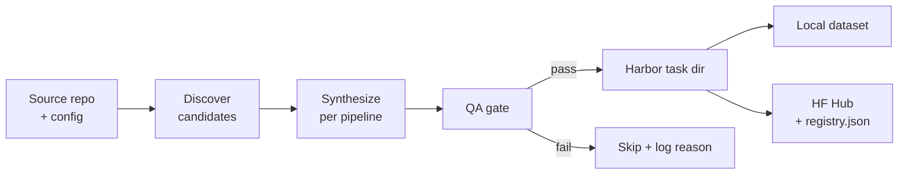

# Pipelines

A pipeline is a synthesis method that takes a repo and emits Harbor-shaped tasks. They share the same input shape (`GenerationInput`) and output shape (Harbor task dirs); they differ in **how** they manufacture verifiable tasks.

## Common shape

Every pipeline follows the same skeleton — only the box labelled "synthesize" varies.



## Pipelines

All 9 pipelines are shipped. See per-pipeline pages for the recipe + options + Harbor verification status.

| Pipeline | What it produces | Sandbox | LLM use | GPU helpful? | Reference dataset | Inspiration |
|---|---|:-:|---|:-:|---|---|
| [`pr_diff`](./pr_diff.md) | Harbor-runnable env + 6-component diff-similarity reward (deterministic 5 + LLM judge) | thin¹ | at verify (judge, optional) | No | [`AdithyaSK/repo2rlenv-pr-diff`](https://huggingface.co/datasets/AdithyaSK/repo2rlenv-pr-diff) (100) | [SWE-RL](https://github.com/facebookresearch/swe-rl) |
| [`pr_runtime`](./pr_runtime.md) | Sandbox-verified PR with F2P/P2P test oracle | ✅ | at bootstrap (cached) | ML repos | — | [SWE-bench](https://github.com/SWE-bench/SWE-bench) |
| [`pr_stream`](./pr_stream.md) | Watermarked `pr_runtime` for continuous mining | ✅ | at bootstrap (cached) | Same as `pr_runtime` | — | [SWE-bench-Live](https://github.com/microsoft/SWE-bench-Live) + [RepoLaunch](https://github.com/microsoft/RepoLaunch) |
| [`commit_runtime`](./commit_runtime.md) | Commit-level oracle (bypass PR-review filters) | ✅ | at bootstrap (cached) | ML repos | — | [R2E-Gym SWE-GEN](https://github.com/R2E-Gym/R2E-Gym) |
| [`mutation_bugs`](./mutation_bugs.md) | AST mutation that breaks a test; agent must restore green | ✅ | at synthesis (rank candidates) | Same as test suite | — | [SWE-smith](https://github.com/SWE-bench/SWE-smith) |
| [`code_instruct`](./code_instruct.md) | LLM-authored problem + executable verifier anchored to real source | ✅ | at synthesis (problem + verifier) | Sometimes | — | [Magicoder](https://github.com/ise-uiuc/magicoder) |
| [`equivalence_tests`](./equivalence_tests.md) | Extract a function; LLM writes equivalence tests vs `reference_<name>` | ✅ | at synthesis (tests) | If function uses GPU | — | [R2E](https://github.com/r2e-project/r2e) |
| [`cve_patches`](./cve_patches.md) | OSV CVE → fix commit → Harbor task (reuses `pr_runtime` verifier) | ✅ | at bootstrap (cached) | Rarely | — | [PatchSeeker](https://github.com/hungkien05/PatchSeeker) / CVE-Bench |
| [`refactor_synthesis`](./refactor_synthesis.md) | Rename-refactor commits + multi-criteria verifier | ✅ | at bootstrap (cached) | Rarely | — | Python-native rename detector (drops [RefactoringMiner](https://github.com/tsantalis/RefactoringMiner)) |

- **Sandbox** ✅ = needs Docker + the bootstrap-built env. `thin¹` = needs Docker but ships a lightweight `python:3.12-slim` env baked at generation time (no bootstrap LLM agent, ~30 s build). `—` = pure text, no execution.
- **LLM use**: every pipeline calls an LLM at *some* stage. `at synthesis` = the pipeline itself authors task content (problems, mutations, tests) — this is the heavy spend. `at bootstrap (cached)` = the pipeline doesn't call the LLM, but the per-repo env construction does — that runs **once per repo**, content-addressed, then cached. `at verify` = an LLM is invoked at reward time (only `pr_diff`'s LLM-judge component).

¹ `pr_diff` is the unusual case — it skips bootstrap entirely (no per-repo image build), ships a generic env, and only uses the LLM at *verify* time. The judge degrades gracefully on missing API key (`status=no_api_key`), and the remaining 5 components renormalize.

Reference repos are cloned shallowly under `references/` (gitignored).

## Spotlight: `pr_diff` (v0.8.3 reference dataset)

The first pipeline to ship a published 100-env reference dataset. Pull and run it on a fresh machine in two commands:

```bash
repo2rlenv pull AdithyaSK/repo2rlenv-pr-diff /tmp/pr-diff
harbor run -p /tmp/pr-diff -a oracle --env docker   # → 1.000 on every task
```

### What each task contains

```
default/<repo>__<pr_number>/
├── task.toml                  # Harbor task spec + [metadata.repo2env] (provenance,
│                              #   reward_calibration baseline, difficulty bucket)
├── instruction.md             # PR title + description (info-leak stripped)
├── solution/
│   ├── patch.diff             # the merged PR's diff = oracle
│   └── solve.sh               # `git apply patch.diff` (used by harbor's oracle agent)
├── environment/
│   └── Dockerfile             # python:3.12-slim + repo @ base_commit + base64-baked
│                              #   oracle.patch, instruction.md, verifier.py
└── tests/
    └── test.sh                # extract verifier from base64; run on the agent's diff
```

### The 6-component reward

| Component | Weight | What it captures |
|---|--:|---|
| `format_valid` | 0.00 | Parses as a unified diff (always 1.0 for `claude-code` — kept as a guard, weight=0) |
| `size_sanity` | 0.08 | `min(oracle_loc, predicted_loc) / max(...)` — catches over/under-generation |
| `file_targeting` | 0.12 | F1 over the changed-file sets (not Jaccard — F1 properly credits TP) |
| `region_overlap` | 0.20 | Predicted hunks overlap oracle hunks (5-line slack) |
| `similarity` | 0.10 | `SequenceMatcher` over `+`/`-` lines only (no free credit for context) |
| `llm_judge` | 0.50 | Haiku 4.5 rates semantic correctness; graceful degradation on missing API key |

Plus a **catastrophic-size hard cap**: clamps reward to ≤ 0.40 when `size_sanity < 0.10`, so a charitable judge can't inflate scores on patches that are wildly the wrong size.

Weights were retuned via an LLM-driven reward-engineering pass on a 23-task pilot: Sonnet 4.6 analyzed per-task component data and recommended these weights (data-grounded; the original guesses scored `format_valid` and `similarity` too high).

### Reproduction recipe (the exact pipeline that produced the 100 envs)

```bash
# Generate
repo2rlenv generate \
  --repo pallets/click --pipeline pr_diff \
  --pipeline-opt limit=4 \
  --out /tmp/pr-diff-click

# Validate (structural, fast)
repo2rlenv validate /tmp/pr-diff-click

# Score with oracle (sanity-check verifier)
harbor run -p /tmp/pr-diff-click -a oracle --env docker

# Score with an actual agent. We used `claude-code` + Sonnet 4.6 to
# verify the published reference dataset:
harbor run -p /tmp/pr-diff-click -a claude-code \
  -m anthropic/claude-sonnet-4-6 \
  --ae ANTHROPIC_API_KEY=$ANTHROPIC_API_KEY \
  --ve ANTHROPIC_API_KEY=$ANTHROPIC_API_KEY \
  --env docker --max-retries 2

# Same env, different agent. Harbor has 25+ harnesses — swap `-a` and
# `-m` and the corresponding `--ae <PROVIDER>_API_KEY=...`:
#   -a claude-code        -m anthropic/claude-sonnet-4-6
#   -a openhands          -m openai/gpt-4o
#   -a codex              -m openai/o1
#   -a aider              -m anthropic/claude-sonnet-4-6
#   -a gemini-cli         -m gemini/gemini-2.5-pro
#   -a opencode           -m anthropic/claude-sonnet-4-6
#   -a qwen-coder         -m qwen/qwen3-coder
#   -a copilot-cli        (uses GH_TOKEN)
#   -a mini-swe-agent · swe-agent · cursor-cli · kimi-cli · goose · ...
# The verifier's LLM-judge always uses Anthropic (Haiku) — pass
# ANTHROPIC_API_KEY via `--ve` regardless of which agent you run.

# Publish
repo2rlenv push /tmp/pr-diff-click <your-org>/<dataset-name>
```

For the full design rationale + dataset card layout + pilot evidence, see [`pr_diff.md`](./pr_diff.md) and [`docs/release_notes/v0.8.3/findings-pr_diff.md`](../release_notes/v0.8.3/findings-pr_diff.md).

## Reward kinds emitted

| Pipeline | `diff_similarity` | `test_execution` |
|---|:-:|:-:|
| `pr_diff` | ✅ | — |
| `pr_runtime` | ✅ | ✅ |
| `commit_runtime` | ✅ | ✅ |
| `mutation_bugs` | (oracle as diff) | ✅ |
| `code_instruct` | optional | ✅ |
| `equivalence_tests` | — | ✅ |
| `pr_stream` | ✅ | ✅ |
| `cve_patches` | ✅ | ✅ |
| `refactor_synthesis` | ✅ | ✅ |

`diff_similarity` works without a sandbox; `test_execution` requires one.

## Adding a new pipeline

See the **[cookbook](../contributing/ADDING_A_PIPELINE.md)** for the full step-by-step walkthrough — covers the enum + Options + Pipeline class + tests + doc page, with template snippets and conventions taken from `pr_diff`.

TL;DR: every pipeline must satisfy the [`Pipeline` Protocol](../../src/repo2rlenv/pipelines/base.py):

```python
class Pipeline(Protocol):
    name: ClassVar[PipelineName]
    def __init__(self, input: GenerationInput, options: BaseModel) -> None: ...
    def run(self, out_dir: Path) -> PipelineResult: ...
```

`tests/test_pipeline_contract.py` verifies every registered pipeline conforms to the Protocol — adding a new one without finishing the registration steps will fail there.
