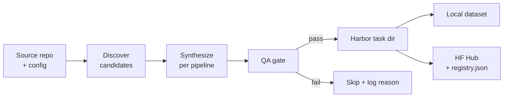

# Pipelines

A pipeline is a synthesis method that takes a repo and emits Harbor-shaped tasks. They share the same input shape (`GenerationInput`) and output shape (Harbor task dirs); they differ in **how** they manufacture verifiable tasks.

## Common shape

Every pipeline follows the same skeleton — only the box labelled "synthesize" varies.



## Pipelines

All 6 pipelines are shipped — 3 stable (`pr_diff`, `pr_runtime`, `commit_runtime`), 3 experimental. See per-pipeline pages for the recipe + options + Harbor verification status.

| Pipeline | What it produces | Source | Sandbox | LLM use | GPU helpful? | Reference dataset | Inspiration |
|---|---|:-:|:-:|---|:-:|---|---|
| [`pr_diff`](./pr_diff.md) | Harbor-runnable env + 6-component diff-similarity reward (deterministic 5 + LLM judge) | GitHub · GitLab | thin¹ | at verify (judge, optional) | No | [`AdithyaSK/repo2rlenv-pr-diff`](https://huggingface.co/datasets/AdithyaSK/repo2rlenv-pr-diff) (100) | [SWE-RL](https://github.com/facebookresearch/swe-rl) |
| [`pr_runtime`](./pr_runtime.md) | Sandbox-verified PR with F2P/P2P test oracle | GitHub · GitLab | ✅ | at bootstrap (cached) | ML repos | [`AdithyaSK/repo2rlenv-pr-runtime`](https://huggingface.co/datasets/AdithyaSK/repo2rlenv-pr-runtime) (100) | [SWE-bench](https://github.com/SWE-bench/SWE-bench) |
| [`commit_runtime`](./commit_runtime.md) | Commit-level oracle (bypass PR-review filters) | GitHub · GitLab · local | ✅ | at bootstrap (cached) | ML repos | — | [R2E-Gym SWE-GEN](https://github.com/R2E-Gym/R2E-Gym) |
| [`code_instruct`](./code_instruct.md) | LLM-authored problem + executable verifier anchored to real source | GitHub · GitLab · local | ✅ | at synthesis (problem + verifier) | Sometimes | — | [Magicoder](https://github.com/ise-uiuc/magicoder) |
| [`equivalence_tests`](./equivalence_tests.md) | Extract a function; LLM writes equivalence tests vs `reference_<name>` | GitHub · GitLab · local | ✅ | at synthesis (tests) | If function uses GPU | — | [R2E](https://github.com/r2e-project/r2e) |
| [`cve_patches`](./cve_patches.md) | OSV CVE → fix commit → Harbor task (reuses `pr_runtime` verifier) | GitHub | ✅ | at bootstrap (cached) | Rarely | [`AdithyaSK/repo2rlenv-cve-patches`](https://huggingface.co/datasets/AdithyaSK/repo2rlenv-cve-patches) (19) | [PatchSeeker](https://github.com/hungkien05/PatchSeeker) / CVE-Bench |

- **Source** — where `--repo` can point. `GitHub · GitLab · local` = a GitHub `owner/name`, a `gitlab.com` URL, or a local path (`/abs`, `./rel`, `~`, `file://`); these need only git + source files. `GitHub · GitLab` = PR/MR-mining pipelines (github.com or gitlab.com, not a bare local clone). `GitHub` = needs the GitHub commit API + OSV CVE data (`cve_patches`). `generate` blocks an unsupported source up front with a clear error.
- **Sandbox** ✅ = needs Docker + the bootstrap-built env. `thin¹` = needs Docker but ships a lightweight `python:3.12-slim` env baked at generation time (no bootstrap LLM agent, ~30 s build). `—` = pure text, no execution.
- **LLM use**: every pipeline calls an LLM at *some* stage. `at synthesis` = the pipeline itself authors task content (problems, mutations, tests) — this is the heavy spend. `at bootstrap (cached)` = the pipeline doesn't call the LLM, but the per-repo env construction does — that runs **once per repo**, content-addressed, then cached. `at verify` = an LLM is invoked at reward time (only `pr_diff`'s LLM-judge component).

¹ `pr_diff` is the unusual case — it skips bootstrap entirely (no per-repo image build), ships a generic env, and only uses the LLM at *verify* time. The judge degrades gracefully on missing API key (`status=no_api_key`), and the remaining 5 components renormalize.

Reference repos are cloned shallowly under `references/` (gitignored).

## Yield: how many tasks you actually get

**Yield** = emitted tasks ÷ candidates examined. It is *not* `limit`: `limit` caps
the output, but each pipeline discards candidates that fail its quality gate, so
the realized count is usually lower. Plan your `limit` and repo list around the
yield band below.

| Pipeline | Typical yield | Dominant factor | Knobs that move it |
|---|:-:|---|---|
| `pr_diff` | **80–95%** | almost every merged PR qualifies (text-only, no execution gate) | `min_loc_changed`, `max_files_per_pr`, `skip_drafts` |
| `pr_runtime` | **15–40%** | does a PR ship a *new* test that flips fail→pass, and does the suite run green in the container? | `require_fail_to_pass`, `require_new_test_funcs`, `lite_filter`, `min_problem_statement_words` |
| `commit_runtime` | **10–35%** | same F2P gate as `pr_runtime`, on commits — **~0% on squash/merge-PR repos** (use `pr_runtime` there) | `skip_merge_commits`, `require_new_test_funcs`, `min_message_words`, `synthesize_with_llm` |
| `code_instruct` | **40–70%** | fraction of seed snippets where the LLM's test fails-without / passes-with the oracle | `max_attempts_per_seed`, LLM quality, `seed_min/max_loc` |
| `equivalence_tests` | **30–60%** | fraction of extracted functions where the LLM writes a test that fails-with-stub / passes-with-oracle | `max_attempts_per_function`, `min/max_loc`, LLM quality |
| `cve_patches` | **5–25%** | does the CVE fix have a verifiable test (shipped *or* agent-synthesized) **and** does the repo's suite collect in a slim container? | `synthesize_poc_test`, `poc_agent`, `require_fail_to_pass`, `min_severity` |

**The single biggest lever for every execution-gated pipeline (`*_runtime`,
`cve_patches`, the synthesis pipelines) is repo health** — if the suite doesn't
collect and run green inside the bootstrap container, yield is ~0 regardless of
options. (Real example: `urllib3` → 0/16 CVEs, because its tests need network
and collect nothing in a slim image; `sqlparse` → 2/4, because its suite runs
clean.) Pick library-shaped, CPU-only, pytest-clean repos.

### Numerical example — targeting 100 `pr_runtime` tasks

At ~25% yield you need ~400 candidate PRs. Spread across repos (one bootstrap
each, cached after the first run):

```
8 repos × limit=60  →  ~480 PRs examined  →  ~120 pass F2P  →  cap at 100
```

Bump `lite_filter`/`require_new_test_funcs` and yield drops (stricter), but the
surviving tasks are higher quality. For `pr_diff` the same 100 tasks need only
~110 candidate PRs (one or two repos). For `cve_patches`, budget **many** repos:
at ~15% yield, 100 tasks ≈ 15–20 CVE-rich, test-clean repos (see
`plans/cve_repo_scout.py`).

## Spotlight: `pr_diff` (v0.8.3 reference dataset)

The first pipeline to ship a published 100-env reference dataset. Pull and run it on a fresh machine in two commands:

```bash
repo2rlenv pull AdithyaSK/repo2rlenv-pr-diff /tmp/pr-diff
harbor run -p /tmp/pr-diff -a oracle --env docker   # → 1.000 on every task
```

### What each task contains

```
default/<repo>__<pr_number>/
├── task.toml                  # Harbor task spec + [metadata.repo2env] (provenance,
│                              #   reward_calibration baseline, difficulty bucket)
├── instruction.md             # PR title + description (info-leak stripped)
├── solution/
│   ├── patch.diff             # the merged PR's diff = oracle
│   └── solve.sh               # `git apply patch.diff` (used by harbor's oracle agent)
├── environment/
│   └── Dockerfile             # python:3.12-slim + repo @ base_commit + base64-baked
│                              #   oracle.patch, instruction.md, verifier.py
└── tests/
    └── test.sh                # extract verifier from base64; run on the agent's diff
```

### The 6-component reward

| Component | Weight | What it captures |
|---|--:|---|
| `format_valid` | 0.00 | Parses as a unified diff (always 1.0 for `claude-code` — kept as a guard, weight=0) |
| `size_sanity` | 0.08 | `min(oracle_loc, predicted_loc) / max(...)` — catches over/under-generation |
| `file_targeting` | 0.12 | F1 over the changed-file sets (not Jaccard — F1 properly credits TP) |
| `region_overlap` | 0.20 | Predicted hunks overlap oracle hunks (5-line slack) |
| `similarity` | 0.10 | `SequenceMatcher` over `+`/`-` lines only (no free credit for context) |
| `llm_judge` | 0.50 | Haiku 4.5 rates semantic correctness; graceful degradation on missing API key |

Plus a **catastrophic-size hard cap**: clamps reward to ≤ 0.40 when `size_sanity < 0.10`, so a charitable judge can't inflate scores on patches that are wildly the wrong size.

Weights were retuned via an LLM-driven reward-engineering pass on a 23-task pilot: Sonnet 4.6 analyzed per-task component data and recommended these weights (data-grounded; the original guesses scored `format_valid` and `similarity` too high).

### Reproduction recipe (the exact pipeline that produced the 100 envs)

```bash
# Generate
repo2rlenv generate \
  --repo pallets/click --pipeline pr_diff \
  --pipeline-opt limit=4 \
  --out /tmp/pr-diff-click

# Validate (structural, fast)
repo2rlenv validate /tmp/pr-diff-click

# Score with oracle (sanity-check verifier)
harbor run -p /tmp/pr-diff-click -a oracle --env docker

# Score with an actual agent. We used `claude-code` + Sonnet 4.6 to
# verify the published reference dataset:
harbor run -p /tmp/pr-diff-click -a claude-code \
  -m anthropic/claude-sonnet-4-6 \
  --ae ANTHROPIC_API_KEY=$ANTHROPIC_API_KEY \
  --ve ANTHROPIC_API_KEY=$ANTHROPIC_API_KEY \
  --env docker --max-retries 2

# Same env, different agent. Harbor has 25+ harnesses — swap `-a` and
# `-m` and the corresponding `--ae <PROVIDER>_API_KEY=...`:
#   -a claude-code        -m anthropic/claude-sonnet-4-6
#   -a openhands          -m openai/gpt-4o
#   -a codex              -m openai/o1
#   -a aider              -m anthropic/claude-sonnet-4-6
#   -a gemini-cli         -m gemini/gemini-2.5-pro
#   -a opencode           -m anthropic/claude-sonnet-4-6
#   -a qwen-coder         -m qwen/qwen3-coder
#   -a copilot-cli        (uses GH_TOKEN)
#   -a mini-swe-agent · swe-agent · cursor-cli · kimi-cli · goose · ...
# The verifier's LLM-judge always uses Anthropic (Haiku) — pass
# ANTHROPIC_API_KEY via `--ve` regardless of which agent you run.

# Publish
repo2rlenv push /tmp/pr-diff-click <your-org>/<dataset-name>
```

For the full design rationale + dataset card layout + pilot evidence, see [`pr_diff.md`](./pr_diff.md) and [`docs/release_notes/v0.8.3/findings-pr_diff.md`](../release_notes/v0.8.3/findings-pr_diff.md).

## Reward kinds emitted

| Pipeline | `diff_similarity` | `test_execution` |
|---|:-:|:-:|
| `pr_diff` | ✅ | — |
| `pr_runtime` | ✅ | ✅ |
| `commit_runtime` | ✅ | ✅ |
| `code_instruct` | optional | ✅ |
| `equivalence_tests` | — | ✅ |
| `cve_patches` | ✅ | ✅ |

`diff_similarity` works without a sandbox; `test_execution` requires one.

## Contamination defenses

A published fix lives on the package index and the code host, so an agent with
open egress (or a leaky container) can fetch the gold patch for the very repo it
is asked to fix. We saw this in practice: an agent blocked from the web fell back
to `git diff origin/main`, and when that was closed it ran `pip download
<pkg>==<fixed>` and read the fix out of the wheel. The principle we settled on:
**the environment enforces, the prompt never asks.** Every sandbox-verified task
(`pr_runtime`, `commit_runtime`, `cve_patches`, and `pr_diff`'s thin env) ships
three defenses, all baked in at generation time by `pipelines/_env_guard.py`:

- **Git-history scrub** — after checking out `base_commit`, the env removes the
  `origin` remote and prunes every ref/commit past the base (then `gc`), so the
  fix commit and hidden tests can't be read offline via `git diff origin/main` or
  `git show origin/main:<testfile>`. `base_commit` stays reachable for the
  verifier's anti-tamper reset.
- **Egress guard** — an `environment/docker-compose.yaml` overlay blackholes the
  package index + code host (`pypi.org`, `files.pythonhosted.org`, `github.com`,
  their CDNs), so `pip download` / `git fetch` / web fetches against them fail
  while the model API and the agent's installer stay reachable. This is a
  denylist (the realistic control at the compose layer); a default-deny egress
  allowlist proxy or a date-pinned package mirror is the stricter follow-up.
- **Instruction leak-strip** — synthesized/CVE instructions drop fix-pointers
  (CVE/GHSA ids, PR/commit URLs, "fixed in vX.Y"), leaving only the symptom.

These reduce the attack surface but the real guarantee is network isolation;
for trustworthy eval numbers, run with `allow_internet=false` (offline,
self-contained image) or the allowlist proxy. The full investigation that drove
these is in `plans/reward_hacking_writeups.md`.

## Adding a new pipeline

See the **[cookbook](../contributing/ADDING_A_PIPELINE.md)** for the full step-by-step walkthrough — covers the enum + Options + Pipeline class + tests + doc page, with template snippets and conventions taken from `pr_diff`.

TL;DR: every pipeline must satisfy the [`Pipeline` Protocol](../../src/repo2rlenv/pipelines/base.py):

```python
class Pipeline(Protocol):
    name: ClassVar[PipelineName]
    def __init__(self, input: GenerationInput, options: BaseModel) -> None: ...
    def run(self, out_dir: Path) -> PipelineResult: ...
```

`tests/test_pipeline_contract.py` verifies every registered pipeline conforms to the Protocol — adding a new one without finishing the registration steps will fail there.
