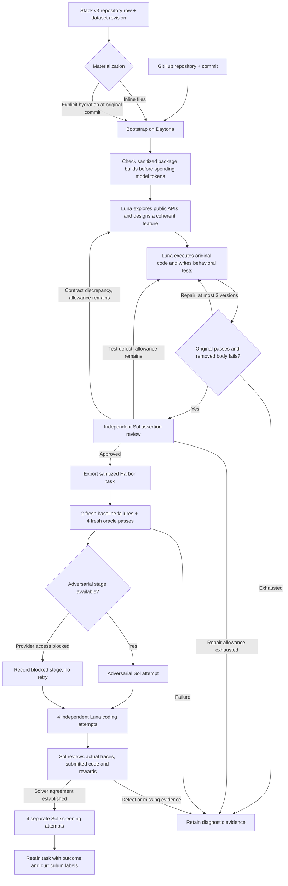

# CodeMidas

CodeMidas turns **working source code into a reconstruction task**. An agent
explores a feature, writes its behavioral contract, and removes the implementation.
A second stage runs the original code to construct private tests. The original
source becomes the Harbor oracle; training reward comes only from executable tests.

This is an independent reproduction of the [CodeMidas method](https://arxiv.org/abs/2609.22068),
initially for offline Python libraries on CPU. Exact upstream prompts, construction
models, and generator code were not published. Our choices are recorded in
[RFC 0031](../rfcs/0031-codemidas-recipe.md).

## What happens



The **100-task campaign target means generated tasks**, not 100 guaranteed training
acceptances. Exported, execution-verified, method-reviewed, and curriculum-selected
counts must remain separate. All-pass and all-fail tasks remain useful artifacts;
they are outside this model's mixed-outcome curriculum, not automatically defective.
The task contract and verifier are frozen before blind attempts.

Generated `task.toml` files use the shared evaluation schema with
`profile = "codemidas-v1"`, stage `controls`, and reason `codemidas_controls_passed`.
After audit, `AUDIT_DIRECTORY/retained/AUDIT_REVISION/TASK` contains a labeled copy bound to the
same executable bundle. A sound task records `codemidas_method_sound` and its
curriculum outcome; defects record `needs_repair`. The generic `verified` label
is reserved for the separate shared quality-loop profile and its semantic probes.
Raw task and trial directories remain unchanged.

If provider access blocks the adversarial stage, generation and ordinary solver
checks can continue. A task with passing solver review then records `blocked`,
`provider_policy_blocked`, and `codemidas_solver_review_passed`. Its full method
check remains incomplete and it cannot enter the paper's selected curriculum.
The campaign's `codemidas-adversarial-policy-block.json` prevents new adversarial
dispatches; it does not silently substitute a different model or prompt.
Explicit model refusals also stop the affected stage. They are metered and
preserved separately from malformed output, and never trigger format-recovery retries.

## Prompts and evidence

| Stage | Model | What it receives | Required result |
|---|---|---|---|
| Design | GPT-6 Luna | Pinned source, anchor, source roots, read-only remote shell | Public instruction, requirement IDs, selected function/method bodies |
| Verifier | GPT-6 Luna | Frozen feature, working reference shell, execution feedback | Pytest tests, assertion-to-requirement map, observed examples |
| Assertion review | GPT-6 Sol | Instruction, tests, original source, observations, contrast, read-only reference shell | Material defects or an explicit approval |
| Adversarial attempt | GPT-6 Sol | Only the learner task and isolated terminal | Concrete evidence of accessible answers or reward bypasses |
| Four solver attempts | GPT-6 Luna | Only the learner task and isolated terminal | Independent patches and deterministic rewards |
| Rollout review | GPT-6 Sol | Immutable task, traces, submitted source and rewards | Evidence-backed agreement or false positives/negatives |
| Curriculum screen | GPT-6 Sol | Four fresh learner environments | `mixed`, `all_pass`, `all_fail`, or `incomplete` |

Read the [complete prompts and request assembly](prompts/codemidas.md), including
the solver and adversarial instructions. Before freezing a task, assertion review
can route a correction to its tests or its description. Description repairs keep
the selected implementation boundary and reconcile an observed public API
discrepancy. All repairs share the same maximum of three executed verifier versions.
Invalid Python is returned as authoring feedback before execution. An author can
explicitly reject an unsuitable candidate with an observed reason; the pipeline
retains that diagnosis and continues. A reconstruction must describe behavior
already present in the original code, rather than a proposed extension.
Solver outcomes never drive a change to the task contract.
Review can execute a few targeted reference probes when broad claims or missing
option interactions are uncertain. Early audits found both an incorrect promise
about empty output shapes and a verifier that tested options separately while
missing their combined behavior. Construction prompts now explicitly check those
boundaries; existing frozen tasks keep their original results and defect labels.
The controller renders every requirement into `instruction.md` as an acceptance
criterion. Tests and independent review receive that exact text. The private
requirement map links tests to public behavior; it cannot introduce extra rules.
This addresses a pilot failure where a filename restriction appeared only in the
hidden tests and misleadingly looked like model difficulty.
All API effects reserve spend first. Exact requests, responses, cache usage,
tool outputs, model settings and costs are retained in the ignored campaign folder.
There is no Anthropic route or automatic provider fallback in this profile.
One bounded regeneration is allowed for a completed API request whose output is
incomplete; its usage remains charged and none of its partial tool actions execute.
Unknown transport outcomes keep their budget reservation. Curriculum screening
can replace a known provider-output failure once, preserving both receipts; valid
successes and failures are never retried to change the difficulty label.

## Run

Install the normal optional execution libraries and initialize a campaign with
the [shared worker and budget commands](owned_recipes.md#accounting-and-workers). Generation uses the normal
CLI and progress display:

```bash
repo2rlenv pipelines describe repo_reconstruct --recipe codemidas
repo2rlenv generate --config codemidas.yaml
```

```yaml
repo:
  url: owner/library
  ref: REPLACE_WITH_COMMIT_SHA
  access: public
pipeline:
  name: repo_reconstruct
  recipe: codemidas
  options:
    source_paths: [library]
    target: 2
    max_candidates: 6
    max_rounds: 3
    candidate_budget_usd: 2
llm:
  provider: openai
  model: gpt-6-luna
output:
  destination: workspace/codemidas/tasks
  org: HuggingEnvs
  dataset_name: CodeMidas
execution:
  worker_receipt: workspace/codemidas/workers/worker.json
  runtime_wheel: dist/repo2rlenv-0.9.1-py3-none-any.whl
  campaign_dir: workspace/codemidas
  run_id: library-pilot-01
  timeout_sec: 3600
```

After generation, the explicit audit command reuses matching control receipts:

```bash
repo2rlenv codemidas audit workspace/codemidas/tasks/TASK \
  --controls workspace/codemidas/runs/RUN/tasks/CANDIDATE \
  --campaign workspace/codemidas \
  --worker-receipt workspace/codemidas/workers/worker.json \
  --runtime-wheel dist/repo2rlenv-0.9.1-py3-none-any.whl \
  --out workspace/codemidas/audits/TASK
```

Independent solver attempts run two at a time by default. Set
`--attempt-concurrency 1` for serial execution or up to `4` for a larger worker.
Each attempt has its own learner environment, receipt and spend reservation;
parallelism does not reduce the required four audited solutions or screen sample.
The reviewer receives changed-line ranges for each submitted file and can read
the full immutable file when needed. This keeps long source files navigable without
replacing source evidence with a model-generated summary. A review interrupted by
its context limit remains incomplete; it is never counted as a task failure or pass.

Use `--resume` for unchanged attempts. If observation was interrupted after dispatch,
the audit can retrieve the original completed remote job after checking its worker,
command and cleanup receipt; it never launches another solve during recovery.
If both the controller receipt and the remote supervisor check prove that a trial
never launched, its reservation can be released and one separately identified
replacement started. The abandoned receipt remains available. A timeout after a
model request has an unknown billing outcome and retains its maximum reservation.
Unknown provider outcomes retain their reservation; changing prompts, source,
runtime or verifier requires a new run identity. Keep versioned runtime wheels.
When developing during a campaign, run the controller from the same installed
wheel as the worker. An editable controller is intentionally refused if its code
no longer matches the pinned runtime. Concurrent controllers share an installation
lock on each remote worker, so they cannot create the same environment twice.

## Stack v3 input

Supply `stack_manifest` in the recipe options. Its JSON object contains `dataset`
(`HuggingFaceCode/stack-v3-train`), `dataset_revision` (commit SHA), and `row` (the
complete bounded repository row). The configured repository and commit must match
the row. `stack_materialization: inline` uses its actual files; `hydrated` explicitly
restores the GitHub checkout at that same commit. No silent HEAD substitution.

```bash
repo2rlenv codemidas source workspace/stack-row.json --materialization inline
```

Rows have inline `files[].content`. The full Stack v3 corpus is a **bucket with a
different schema** and is not accepted by this adapter. Missing build resources
and redacted or filtered files can prevent an inline build. These are source
limitations, not task failures. The current distribution profile requires explicit
permissive file licenses and rejects unsafe paths and oversized rows.

## Limits and economics

The first implementation removes existing Python function/method bodies while
preserving interfaces. It supports related symbols across files; the learner can
edit existing Python files under configured roots. It does not yet support arbitrary
new implementation files, non-Python builds, GPU tasks or external services.
Structural anchor selection is our engineering choice; unlike the paper's broader
generation, it currently selects multiline public functions and methods.
Private helper modules are excluded from directory-wide discovery. An explicitly
listed Python file can override this filter when it implements an exported public
API, as is common in Hugging Face libraries.

Report spend over **all attempted candidates**, including failures, model calls and
Daytona compute. Keep cost per generated task separate from cost per reviewed or
curriculum-selected task. The initial campaign has a $300 hard cap. Pilot results
and measured economics will be added after the end-to-end evidence is inspected;
no projected yield is represented as a measured result.
