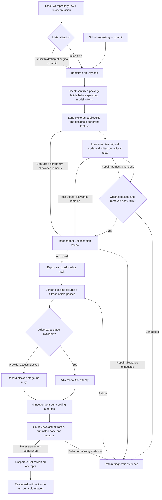

# CodeMidas

CodeMidas turns **working source code into a reconstruction task**. An agent
explores a feature, writes its behavioral contract, and removes the implementation.
A second stage runs the original code to construct private tests. The original
source becomes the Harbor oracle; training reward comes only from executable tests.

This is an independent reproduction of the [CodeMidas method](https://arxiv.org/abs/2609.22068),
initially for offline Python libraries on CPU. Exact upstream prompts, construction
models, and generator code were not published. Our choices are recorded in
[RFC 0031](../rfcs/0031-codemidas-recipe.md).

## What happens



The **100-task campaign target means generated tasks**, not 100 guaranteed training
acceptances. Exported, execution-verified, method-reviewed, and curriculum-selected
counts must remain separate. All-pass and all-fail tasks remain useful artifacts;
they are outside this model's mixed-outcome curriculum, not automatically defective.
The task contract and verifier are frozen before blind attempts.

Generated `task.toml` files use the shared evaluation schema with
`profile = "codemidas-v1"`, stage `controls`, and reason `codemidas_controls_passed`.
After audit, `AUDIT_DIRECTORY/retained/AUDIT_REVISION/TASK` contains a labeled copy bound to the
same executable bundle. A sound task records `codemidas_method_sound` and its
curriculum outcome; defects record `needs_repair`. The generic `verified` label
is reserved for the separate shared quality-loop profile and its semantic probes.
Raw task and trial directories remain unchanged.

If provider access blocks the adversarial stage, generation and ordinary solver
checks can continue. A task with passing solver review then records `blocked`,
`provider_policy_blocked`, and `codemidas_solver_review_passed`. Its full method
check remains incomplete and it cannot enter the paper's selected curriculum.
The campaign's `codemidas-adversarial-policy-block.json` prevents new adversarial
dispatches; it does not silently substitute a different model or prompt.
Explicit model refusals also stop the affected stage. They are metered and
preserved separately from malformed output, and never trigger format-recovery retries.

## Prompts and evidence

| Stage | Model | What it receives | Required result |
|---|---|---|---|
| Design | GPT-6 Luna by default | Pinned source, anchor, source roots, read-only remote shell | Public instruction, requirement IDs, selected function/method bodies |
| Verifier | Same configured author | Frozen feature, working reference shell, execution feedback | Pytest tests, assertion-to-requirement map, observed examples |
| Assertion review | GPT-6 Sol | Instruction, tests, original source, observations, contrast, read-only reference shell | Material defects or an explicit approval |
| Adversarial attempt | GPT-6 Sol | Only the learner task and isolated terminal | Concrete evidence of accessible answers or reward bypasses |
| Four solver attempts | GPT-6 Luna | Only the learner task and isolated terminal | Independent patches and deterministic rewards |
| Rollout review | GPT-6 Sol | Immutable task, traces, submitted source and rewards | Evidence-backed agreement or false positives/negatives |
| Curriculum screen | GPT-6 Sol | Four fresh learner environments | `mixed`, `all_pass`, `all_fail`, or `incomplete` |

Read the [complete prompts and request assembly](prompts/codemidas.md), including
the solver and adversarial instructions. To author with Sol, explicitly set
`pipeline.options.author_model: openai/gpt-6-sol` and the matching
`llm.model: gpt-6-sol`. Each task records its author and reviewer models; independent
review uses a separate context even when both stages select Sol.
Before freezing a task, assertion review
can route a correction to its tests or its description. Description repairs keep
the selected implementation boundary and reconcile an observed public API
discrepancy. All repairs share the same maximum of three executed verifier versions.
Invalid Python is returned as authoring feedback before execution. An author can
explicitly reject an unsuitable candidate with an observed reason; the pipeline
retains that diagnosis and continues. A reconstruction must describe behavior
already present in the original code, rather than a proposed extension.
Solver outcomes never drive a change to the task contract.
Review can execute a few targeted reference probes when broad claims or missing
option interactions are uncertain. Early audits found both an incorrect promise
about empty output shapes and a verifier that tested options separately while
missing their combined behavior. Construction prompts now explicitly check those
boundaries; existing frozen tasks keep their original results and defect labels.
Graph pilots exposed another pattern: an optional filter was exercised on inputs
where every result matched, and a repair replaced an earlier useful case. Prompts
now require contrasting selection fixtures and preserve justified checks during
repair. These changes improve construction; they do not rewrite audited tasks.
The controller renders every requirement into `instruction.md` as an acceptance
criterion. Tests and independent review receive that exact text. The private
requirement map links tests to public behavior; it cannot introduce extra rules.
This addresses a pilot failure where a filename restriction appeared only in the
hidden tests and misleadingly looked like model difficulty.
All API effects reserve spend first. Exact requests, responses, cache usage,
tool outputs, model settings and costs are retained in the ignored campaign folder.
There is no Anthropic route or automatic provider fallback in this profile.
One bounded regeneration is allowed for a completed API request whose output is
incomplete; its usage remains charged and none of its partial tool actions execute.
Unknown transport outcomes keep their budget reservation. Curriculum screening
can replace a known provider-output failure once, preserving both receipts; valid
successes and failures are never retried to change the difficulty label.

## Run

Install the normal optional execution libraries and initialize a campaign with
the [shared worker and budget commands](owned_recipes.md#accounting-and-workers). Generation uses the normal
CLI and progress display:

```bash
repo2rlenv pipelines describe repo_reconstruct --recipe codemidas
repo2rlenv generate --config codemidas.yaml
```

```yaml
repo:
  url: owner/library
  ref: REPLACE_WITH_COMMIT_SHA
  access: public
pipeline:
  name: repo_reconstruct
  recipe: codemidas
  options:
    source_paths: [library]
    target: 2
    max_candidates: 6
    max_rounds: 3
    candidate_budget_usd: 2
llm:
  provider: openai
  model: gpt-6-luna
output:
  destination: workspace/codemidas/tasks
  org: HuggingEnvs
  dataset_name: CodeMidas
execution:
  worker_receipt: workspace/codemidas/workers/worker.json
  runtime_wheel: dist/repo2rlenv-0.9.1-py3-none-any.whl
  campaign_dir: workspace/codemidas
  run_id: library-pilot-01
  timeout_sec: 3600
```

After generation, the explicit audit command reuses matching control receipts:

```bash
repo2rlenv codemidas audit workspace/codemidas/tasks/TASK \
  --controls workspace/codemidas/runs/RUN/tasks/CANDIDATE \
  --campaign workspace/codemidas \
  --worker-receipt workspace/codemidas/workers/worker.json \
  --runtime-wheel dist/repo2rlenv-0.9.1-py3-none-any.whl \
  --out workspace/codemidas/audits/TASK
```

Independent solver attempts run two at a time by default. Set
`--attempt-concurrency 1` for serial execution or up to `4` for a larger worker.
Each attempt has its own learner environment, receipt and spend reservation;
parallelism does not reduce the required four audited solutions or screen sample.
The reviewer receives changed-line ranges for each submitted file and can read
the full immutable file when needed. This keeps long source files navigable without
replacing source evidence with a model-generated summary. A review interrupted by
its context limit remains incomplete; it is never counted as a task failure or pass.

Use `--resume` for unchanged attempts. If observation was interrupted after dispatch,
the audit can retrieve the original completed remote job after checking its worker,
command and cleanup receipt; it never launches another solve during recovery.
If both the controller receipt and the remote supervisor check prove that a trial
never launched, its reservation can be released and one separately identified
replacement started. The abandoned receipt remains available. A timeout after a
model request has an unknown billing outcome and retains its maximum reservation.
Unknown provider outcomes retain their reservation; changing prompts, source,
runtime or verifier requires a new run identity. Keep versioned runtime wheels.
When developing during a campaign, run the controller from the same installed
wheel as the worker. An editable controller is intentionally refused if its code
no longer matches the pinned runtime. Concurrent controllers share an installation
lock on each remote worker, so they cannot create the same environment twice.

## Stack v3 input

Supply `stack_manifest` in the recipe options. Its JSON object contains `dataset`
(`HuggingFaceCode/stack-v3-train`), `dataset_revision` (commit SHA), and `row` (the
complete bounded repository row). The configured repository and commit must match
the row. `stack_materialization: inline` uses its actual files; `hydrated` explicitly
restores the GitHub checkout at that same commit. No silent HEAD substitution.

```bash
repo2rlenv codemidas source workspace/stack-row.json --materialization inline
```

Rows have inline `files[].content`. The full Stack v3 corpus is a **bucket with a
different schema** and is not accepted by this adapter. Missing build resources
and redacted or filtered files can prevent an inline build. These are source
limitations, not task failures. The current distribution profile requires explicit
permissive file licenses and rejects unsafe paths and oversized rows.

## Limits and economics

The first implementation removes existing Python function/method bodies while
preserving interfaces. It supports related symbols across files; the learner can
edit existing Python files under configured roots. It does not yet support arbitrary
new implementation files, non-Python builds, GPU tasks or external services.
Structural anchor selection is our engineering choice; unlike the paper's broader
generation, it currently selects multiline public functions and methods.
`max_per_module` limits eligible, non-excluded anchors, not attempted slots.
Use `exclude_candidate_ids` when continuing a repository with a new run identity;
the default per-module cap is two and an explicit campaign can raise it to 100.
The candidate pool can be smaller than `target`, and different anchors can select
the same missing implementation. Such duplicates do not count as new tasks.
Private helper modules are excluded from directory-wide discovery. An explicitly
listed Python file can override this filter when it implements an exported public
API, as is common in Hugging Face libraries.

### Reproduction boundary

| Aspect | This implementation |
|---|---|
| Source-driven design | Working repository code supplies the behavior and original-source oracle. No PR, issue, docstring or existing test is required. |
| Execution and agreement | Six fresh control trials and four independently reviewed solver attempts follow the published method. |
| Generation choices | Public Python AST anchors, Sol/Luna, bounded repairs and the owned prompts are our choices; they are not upstream code or undisclosed paper settings. |
| Scope | Python CPU libraries. Multi-symbol and multi-file removal is supported; measured task scope must be reported separately from this capability. |
| Final screening | Four Sol attempts are our explicit sample size. All-pass/all-fail artifacts are retained, but do not satisfy the paper's mixed-outcome selection. |
| Adversarial coverage | Implemented; blocked in the initial campaign by provider access. A blocked check never establishes soundness. |
| Training and generalization | No RL training, benchmark improvement, or benchmark-contamination clearance is claimed. Public sources may appear in model pretraining. |

Compare these boundaries with [Sections 3.1–3.5 of the paper](https://arxiv.org/html/2609.22068v1#S3).
The emitted Dockerfiles retain the source profile's package constraints and base
image tag. Remote receipts identify the images used in this campaign, but rebuilds
are not a fully locked, permanently archived dependency closure.

## Measured local campaign

The 2026-09-25 campaign staged **100 Harbor tasks locally**. All selected tasks passed
two fresh baseline-failure controls, four oracle-success controls, and an independent
review of four Luna solver attempts. Each then received four Sol screening attempts;
their rewards are reported separately below.
Adversarial checks were blocked by provider access; the user approved continuing
with explicit blocked-stage labels. **Zero tasks are claimed as fully method-validated
or paper-curriculum accepted.** No dataset was published and no RL training was run.

| Outcome | Count |
|---|---:|
| Current-collection construction attempts | 213 |
| Unique exports passing all six execution controls | 128 |
| Ordinary solver reviews passed | 101 |
| Reviews with demonstrated false positives or false negatives | 26 |
| Reviews unresolved without a demonstrated false positive/negative | 1 |
| Curated local tasks | 100 |

Construction yield was **60.1%**;
ordinary-review yield among exports was **78.9%**. These denominators
exclude unattempted discovery candidates; the attempt count includes two candidates
stopped at a safe control boundary after the goal was reached. Rejected candidates, diagnosed exports and
nine older pilot folders remain available locally, outside the curated collection.

| Source repository | Generated | Ordinary review passed | Curated |
|---|---:|---:|---:|
| [ShipDataProcess](https://github.com/GlobalFishingWatch/ShipDataProcess) | 2 | 2 | 2 |
| [pydash](https://github.com/dgilland/pydash) | 10 | 8 | 8 |
| [filesystem_spec](https://github.com/fsspec/filesystem_spec) | 3 | 1 | 1 |
| [python-sortedcontainers](https://github.com/grantjenks/python-sortedcontainers) | 4 | 2 | 2 |
| [huggingface_hub](https://github.com/huggingface/huggingface_hub) | 3 | 3 | 3 |
| [boltons](https://github.com/mahmoud/boltons) | 32 | 24 | 24 |
| [more-itertools](https://github.com/more-itertools/more-itertools) | 32 | 28 | 27 |
| [networkx](https://github.com/networkx/networkx) | 28 | 22 | 22 |
| [packaging](https://github.com/pypa/packaging) | 5 | 4 | 4 |
| [toolz](https://github.com/pytoolz/toolz) | 9 | 7 | 7 |

The curated set contains 98 GitHub-sourced tasks and
2 tasks from actual inline Stack v3 files.
It has **17 multi-symbol tasks and 0 multi-file tasks**.
These are Python CPU library tasks; multi-file and broader domain capability should
not be confused with measured coverage in this campaign.

### Difficulty and quality

Sol's four-attempt screening produced **90 all-pass,
4 mixed and 6 all-fail tasks** in the curated set.
Sol solved 370/400 attempts and at least one attempt on
94/100 tasks. Luna solved 358/400
attempts and at least one attempt on 92/100 tasks.
Most tasks are easy for Sol; an ordinary-review pass establishes sampled agreement,
not frontier difficulty or exhaustive verifier correctness. Only the mixed subset
meets the screening-outcome filter, and blocked adversarial checks prevent full
method acceptance even there.

Review caught missed boundary cases, contradictory requirements and tests that
accepted implementations violating the public contract. Construction controls alone
did not catch these defects. Reference probes, contrasting fixtures and preserving
coverage during repairs improved subsequent generation. Repository profiles and
candidate pools were selected and adjusted during development; this campaign does
not demonstrate unattended success on arbitrary repositories.

### Measured economics

The $300 cap covered the whole campaign, including failed construction, older
pilots, review, screening and compute. Accounted cost is **$99.91**, plus
**$1.47 reserved** for API calls whose billing outcome remained unknown after
a connectivity interruption. All workers are stopped. The accounted amount includes
**$11.71 of conservative Daytona compute estimates**, not an invoice; the
remaining **$88.20** comes from recorded API usage.

| Stage | Accounted USD |
|---|---:|
| Task design | $2.58 |
| Verifier construction and repair | $4.14 |
| Independent assertion review | $28.32 |
| Ordinary Luna rollouts | $2.13 |
| Independent rollout review | $27.49 |
| Sol screening | $23.14 |
| Adversarial attempts before the access block | $0.39 |
| Daytona compute estimate | $11.71 |
| Other recorded pilot calls | $0.00 |

Across the entire campaign, this is **$0.78 per current export**,
**$0.99 per passing ordinary review**, and **$1.00 per curated task**
(up to **$1.01** per curated task if every unresolved reservation is charged).
These are observed averages for this source/model mix, not a price guarantee for
other repositories. There is no cost per fully accepted task because none completed
the blocked adversarial stage.

The ignored local campaign directory contains the 100-task archive, retained
`task.toml` labels, checksummed release manifest, source provenance, per-task trials,
usage receipts and a detailed report. Only implementation, tests, prompts and this
measured summary belong in the PR. See [PR #165](https://github.com/huggingface/Repo2RLEnv/pull/165).

## Release status and audit

[Release notes and the pre-merge audit](../release_notes/codemidas.md) distinguish
implementation readiness, local dataset readiness and the later package release.
The [central results](releases.md#local-collections-awaiting-publication) and
[economics](economics.md#codemidas-generation-and-evaluation) include this cohort
without changing existing published totals.

Inconclusive or infrastructure-limited reviews retain `blocked` labels; only
demonstrated false positives, false negatives or confirmed exploits produce
`needs_repair`. This fixes the initial annotation of one unresolved task outside
the selected 100. It changes no task instruction, verifier or oracle.
