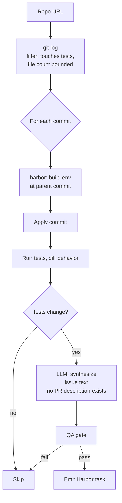

# `commit_runtime`

R2E-Gym SWE-GEN-style: walk **commits**, not PRs. Trades signal quality for yield — no PR-review filter, much larger candidate pool.

| | |
|---|---|
| Status | **shipped (v0.5)** |
| Sandbox required at gen | Yes |
| LLM required at gen | Yes (synthesizes instruction text since there's no PR description) |
| Reward kinds emitted | `test_execution`, `diff_similarity` |
| Inspiration | [R2E-Gym (SWE-GEN)](https://github.com/R2E-Gym/R2E-Gym) (UC Berkeley + ANU, COLM '25) |
| Reference clone | `references/R2E-Gym/` |

## Why commits, not PRs

R2E-Gym's paper finding: *"instead of using human-written PRs, good-quality execution environments can directly be curated from commits."* They reach 34.4% on SWE-Bench Verified using SWE-GEN data alone — no PR-review-filtered tasks. Commit-based curation:

- Has no PR-review bottleneck (works on any repo with commit history, even ones that never use PRs)
- Yields a much larger candidate pool
- Has noisier signal per task (no human reviewed it)

`commit_runtime` is a **sibling** of `pr_runtime`, not a replacement. They produce complementary task pools.

## Algorithm sketch



1. Clone repo at HEAD
2. Walk commits in date range matching filters (touches tests, file-count bounded)
3. For each commit: parent = pre-fix state, HEAD = post-fix state
4. Build env at parent, apply commit, identify which tests change behavior
5. **LLM authors a plausible "issue"** describing the symptom (no human PR text exists)
6. Emit Harbor task
7. QA gate (4 layers)

## Options

```python
class CommitMiningOptions(BaseModel):
    limit: int = 500
    since: date | None = None
    until: date | None = None
    require_test_changes: bool = True   # commit must touch test files
    min_changed_files: int = 1
    max_changed_files: int = 10         # filter sweeping refactors
    languages: list[str] = ["python"]
```

## What we'd reuse from `references/R2E-Gym/`

- Their commit-selection heuristics (which commits qualify as task candidates)
- The "synthesize an issue from a code change" prompt templates
- Their hybrid verifier design (execution + LLM judge)
