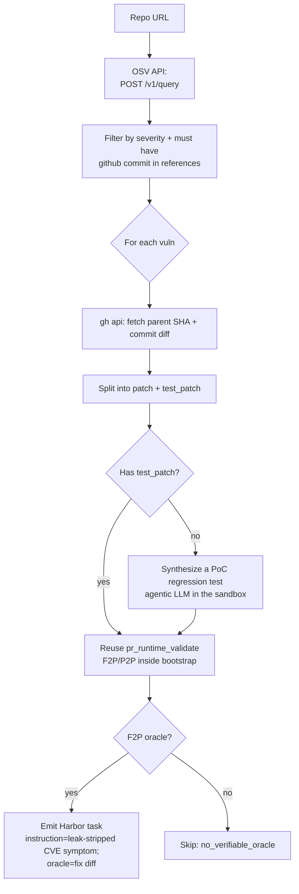

# `cve_patches`

Map OSV vulnerability records to fixing commits in the target repo,
replay the pre-fix state in a sandbox, and emit a Harbor task whose
oracle is the upstream security patch.

| | |
|---|---|
| Status | **experimental** — Python ecosystem |
| Sandbox required at gen | Yes |
| LLM required at gen | For bootstrap always; the pipeline also calls the LLM to synthesize a PoC regression test when a CVE ships no test (`synthesize_poc_test`, default on) |
| Reward kinds emitted | `test_execution`, `diff_similarity` |
| Reference dataset | [`AdithyaSK/repo2rlenv-cve-patches`](https://huggingface.co/datasets/AdithyaSK/repo2rlenv-cve-patches) (19 verified envs) |
| Inspiration | [PatchSeeker](https://github.com/hungkien05/PatchSeeker), CVE-Bench (NAACL '25) |

## Why this pipeline matters

Lots of *datasets* of CVE-fix pairs exist (PatchSeeker covers 5K CVEs;
PATCHEVAL has 1K). What didn't exist before v0.7: a **reusable pipeline**
that takes a repo + the OSV vuln database and turns the pair into
Repo2RLEnv-shaped tasks. Plenty of paper-only artifacts; no library —
until now.

## Algorithm



## Data source: OSV (Open Source Vulnerabilities)

We hit OSV's public `/v1/query` endpoint with `{"package": {"name": <pkg>,
"ecosystem": <eco>}}`. The response includes vulns for the target package
across CVE / GHSA / PYSEC identifiers, with structured `references[]`
that often link directly to fix commits.

Why OSV (vs NVD or GitHub Security Advisories):
- No auth required (free, no API key)
- Pre-resolves CVE → fix-commit URLs in `references[]` (saves us from
  building a PatchSeeker-style LLM mapper)
- Covers PyPI / npm / crates.io / Go / Maven / Debian / Alpine / ...
- Records are cross-linked (a single OSV id often carries CVE + GHSA + PYSEC aliases)

## Filters

1. Severity ≥ `min_severity` (default `low`; CVSS-like ranks)
2. At least one `references[].url` of the form
   `https://github.com/<owner>/<repo>/commit/<sha>` matching the
   target repo (handles fork URLs gracefully — they're rejected)
3. `gh api commits/<sha>` resolves to a parent (skip root commits)
4. Source patch must be non-empty (some "fix" commits are CI-only)
5. `len(source_files) ≤ max_source_files_per_fix` (default 50)

## Validation + PoC synthesis

Reuses `pipelines/pr_runtime_validate.py` verbatim for the two-stage F2P/P2P
check, with a graded reward (`f2p_rate × p2p_rate`, same as `pr_runtime`).

The catch: most CVE fixes ship **no regression test in the fixing commit**, so
the diff alone gives a 0-reward env. So when `test_patch` is empty and
`synthesize_poc_test` is on (the default), an **LLM agent with shell access in
the vulnerable sandbox** (`poc_agent`, default on) explores the repo, writes a
regression test, runs it, and iterates until it fails for the vulnerability's
reason. The pipeline then validates that synthesized test fail-pre / pass-post
on a clean checkout. A CVE that yields no fail→pass oracle (shipped or
synthesized) is **dropped** as `no_verifiable_oracle` rather than emitted as a
dead 0-reward task.

Anti-contamination (a published CVE fix is reachable many ways, so the
environment enforces, it does not ask):
- **Instruction is leak-stripped** — the CVE/GHSA id, fixing PR/commit URLs, and
  "fixed in version X" lines are removed; the agent sees only the symptom + CWE.
- **Git history is scrubbed** to the base commit (remove the remote, prune every
  ref/commit past base) so `git diff origin/main` can't read the fix offline.
- **Egress guard** — the emitted task ships an `environment/docker-compose.yaml`
  that blackholes the package index + code host, so `pip download <pkg>==<fixed>`
  / `git fetch github.com` / web fetches fail while the model API stays reachable.

These ship with every emitted task; see `pipelines/_env_guard.py` and
`docs/pipelines/README.md`.

## Options

See `CVEPatchesOptions` in `src/repo2rlenv/spec/options.py`.

| Field | Default | Notes |
|---|---|---|
| `osv_ecosystem` | `None` (auto from owner) | `PyPI` / `npm` / `crates.io` / ... |
| `osv_package` | `None` (= repo name lowercased) | package identifier in the ecosystem |
| `min_severity` | `"low"` | `low` / `medium` / `moderate` / `high` / `critical` |
| `limit` | 50 | max emitted tasks |
| `synthesize_poc_test` | **True** | LLM-write a PoC regression test when the CVE ships none |
| `poc_agent` | **True** | agentic synth (shell in the sandbox) vs one-shot prompt |
| `poc_agent_max_spend_usd` | 1.5 | per-CVE budget for the agentic synthesizer |
| `require_fail_to_pass` | **True** | with PoC synthesis we demand a real F2P oracle; CVEs without one are dropped |
| `min_fail_to_pass` | 1 | minimum fail→pass tests |
| `max_pass_to_pass` | 50 | cap the regression set (bounds flaky reward + runtime) |
| `max_source_files_per_fix` | 50 | reject sprawling fixes |
| `require_new_test_funcs` | False | security commits often don't add new tests |
| `skip_validation` | False | emit raw without sandbox run (debug) |
| `validation_timeout_sec` | 600 | per-candidate cap |

## Yield

**Yield = emitted tasks ÷ in-scope CVEs (those with a fix commit).** Expect
**~5–25%** — the **lowest** of any pipeline, and the most repo-sensitive. A CVE
becomes a task only if it has a **verifiable oracle**: either the fix commit
shipped a regression test that flips fail→pass, *or* the agentic PoC synthesizer
writes one that does. CVEs that resist a deterministic test (timing/network/
environment-dependent) are dropped.

| Knob | Default | Effect on yield |
|---|:-:|---|
| repo test health | — | **the dominant factor.** If the suite won't collect/run green in a slim container, yield ≈ 0. (Real pilot: `urllib3` → 0/16, tests need network; `sqlparse` → 2/4, suite clean.) |
| `synthesize_poc_test` | True | the multiplier for no-test CVEs — off, those become 0-reward dead envs and are dropped |
| `poc_agent` | True | agentic synth (shell in the sandbox) lands far more PoCs than the one-shot prompt fallback |
| `require_fail_to_pass` | True | drops CVEs with no verifiable oracle (keeps the dataset honest) |
| `min_severity` | low | ↑ shrinks the candidate pool to higher-severity CVEs |
| `max_source_files_per_fix` | 50 | ↓ excludes sprawling fixes |

Two further realities: most repos have a **bounded** number of fix-commit-bearing
CVEs (often single digits), so you must mine **many** repos; and a published CVE
is a contamination magnet — the emitted instruction is **leak-stripped** (no
CVE/GHSA id, PR/commit URLs, or "fixed in vX.Y"), and solvability checks should
run with the agent's web tools disabled.

**Worked example:** at ~15% yield, 100 tasks ≈ ~670 in-scope CVEs spread over
**15–20** CVE-rich, test-clean repos (≈5–8 emitted each). Use
[`plans/cve_repo_scout.py`](https://github.com/huggingface/Repo2RLEnv/blob/main/plans/cve_repo_scout.py) to rank repos by
fix-commit-bearing CVE count straight from the OSV dump.

## `[metadata.repo2env.cve_patches]` schema

```toml
[metadata.repo2env.cve_patches]
cve_id = "CVE-2024-49767"
osv_id = "GHSA-q34m-jh98-gwm2"
aliases = ["CVE-2024-49767"]
cwe_ids = ["CWE-407"]
severity = "HIGH"
published = "2024-10-25T00:00:00Z"
fix_commit = "50cfeebcb0727e18cc52ffbeb125f4a66551179b"
parent_commit = "f8c2a3a..."
fail_to_pass = []
pass_to_pass = []
validation_status = "no_test_patch"  # or "verified" when F2P is non-empty
```

## End-to-end smoke

```bash
repo2rlenv generate \
  --repo pallets/werkzeug \
  --pipeline cve_patches \
  --pipeline-opt limit=1 \
  --pipeline-opt min_severity=high \
  --llm anthropic/claude-sonnet-4-6 \
  --out ./datasets/werkzeug-cve

harbor run -a oracle -p ./datasets/werkzeug-cve/<task-id>
# Mean reward 1.000
```

## v0.7 trade-offs (to revisit)

- **No PoC synthesis.** When `test_patch` is empty, the verifier signal
  is weak (just "suite passes with fix applied"). A future v0.8 mode
  can LLM-synthesize a PoC test that exercises the vulnerability —
  with a gate around that (security implications of distributing PoCs).
- **No NVD-direct path.** We rely on OSV's pre-resolved fix URLs. For
  CVEs OSV hasn't curated, we miss them. A PatchSeeker-style
  LLM+embedding fallback is on the roadmap.
- **Single ecosystem auto-guess per owner.** Repos owned by users not
  in our table (Pallets / PSF / Django / etc.) default to PyPI; the
  user can always override with `--pipeline-opt osv_ecosystem=npm`.

## What we adapted from inspiration projects

| What | Where | How we apply it |
|---|---|---|
| OSV `/v1/query` API | osv.dev (Google public service) | Direct HTTPS POST, stdlib only |
| Severity rank ordering | CVSS conventions | `_SEVERITY_RANK` constant |
| CVE-→commit reference pattern | PatchSeeker recipe | `OSVVuln.fix_commits` regex on `references[].url` |
| F2P/P2P validation harness | SWE-bench / pr_runtime | Reused verbatim (no new code) |

No code is copied from inspiration projects. The pipeline is original Python stdlib + reuses pr_runtime's emission helpers.
