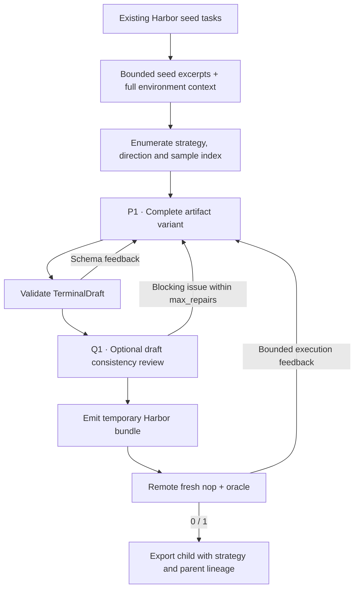

# `terminal_synth / dataarc`

This DataArc-inspired recipe augments complete Harbor tasks with few-shot,
self-instruct, in-depth evolution and in-breadth evolution. Recipe version 2
keeps those stages and input options, using Repo2RLEnv-authored prompt wording.

The September expansion completed **100 Harbor tasks** (20 retained, 80 new),
published as [HuggingEnvs/repo2rlenv-dataarc](https://huggingface.co/datasets/HuggingEnvs/repo2rlenv-dataarc).
All 80 new exports have hash-matched baseline reward 0 and reference reward 1.
The expansion accounted for **$26.57**, approximately **$0.33 per new export**,
including unsuccessful model attempts and estimated worker/build costs. The
[published manifest](https://huggingface.co/datasets/HuggingEnvs/repo2rlenv-dataarc/resolve/main/manifest.json) separates those
controls from independent quality acceptance, which remains unestablished.
These results describe version 1. Version 2 has contract tests, but has not yet
been evaluated in a paid generation campaign; the figures above are not a
measurement of the replacement prompts.

## Pipeline, step by step

`P1`, `P2`, … identify actual model calls. Unlabelled stages are code or remote execution.

**Read a seed.** Selected instruction, reference and test excerpts provide the task context; environment files are also supplied in full within the supported text-size bound. Native canary-line filtering is retained and documented in provenance.

**Enumerate transformations.** few_shot makes a close variant; self_instruct makes a related task; evol_instruct chooses in_depth or in_breadth. Samples are independent variants of the selected parent, not a chained curriculum.

**Generate complete artifacts.** The deterministic design function wraps the seed. The first and only authoring stage creates a complete TerminalDraft. Retries use the same strategy and seed with real execution feedback.

## Every prompt and its data

The artifact author can be followed by
[Q1 consistency review](prompt_reference.md#optional-review-before-execution)
when `review_drafts: true`. This adds a model call on each complete draft before
execution. Its blocking findings return to the same bounded artifact-author loop.

One artifact-author call on the first attempt. There is no separate design LLM call.

| Call | System prompt composition | User / input material | Output | Retry or branch |
|---|---|---|---|---|
| P1 · Artifact / repair | artifact_prompt.md with strategy text from strategies.json + common materialization + owned adaptation | Selected seed excerpts are substituted into the system template; user JSON contains environment_context and feedback. | TerminalDraft | Initial call plus max_repairs; default three attempts. |

Read the [complete dataarc prompt reference](https://huggingface.github.io/Repo2RLEnv/pipelines/prompts/dataarc/) for every retained template, appended instruction, substitution, example and output schema. The [shared prompt guide](prompt_reference.md) explains how to inspect the fully resolved request from a real run.

## Follow one task

Illustration: a scheduling seed becomes a related scheduling problem with a new constraint. The generated environment, solution and tests must agree on that constraint and preserve the seed’s actual tools.

## What repeats, what is checked

Retries rebuild the same variant from the original seed context plus previous failure evidence. Null evolution direction for non-evolution strategies is omitted from TOML metadata. Full independent validation is deferred; strategy labels are not quality scores.

An exported bundle is a generation result. Independent leakage review, shortcut probes and blind solver traces belong to the later quality campaign.

## Implementation map

- [`dataarc/recipe.py`](https://github.com/huggingface/Repo2RLEnv/blob/main/src/repo2rlenv/pipelines/recipes/dataarc/recipe.py)
- [`dataarc/strategies.json`](https://github.com/huggingface/Repo2RLEnv/blob/main/src/repo2rlenv/pipelines/recipes/dataarc/strategies.json)
- [`terminal/runner.py`](https://github.com/huggingface/Repo2RLEnv/blob/main/src/repo2rlenv/pipelines/recipes/terminal/runner.py)
- [`terminal/draft.py`](https://github.com/huggingface/Repo2RLEnv/blob/main/src/repo2rlenv/pipelines/recipes/terminal/draft.py)
- [`terminal/grade.py`](https://github.com/huggingface/Repo2RLEnv/blob/main/src/repo2rlenv/pipelines/recipes/terminal/grade.py)

## Run and supported profile

Run `repo2rlenv generate --config examples/owned-dataarc.yaml`. The input directory
contains seed task subdirectories, each with `task.toml`, `instruction.md` and
`solution/solve.sh`. The first profile accepts text assets in a single CPU Linux
container. Native examples cover portfolio optimization, asynchronous task
cancellation and constraint scheduling. Users may supply their own Harbor seeds.

`strategies`, `evol_directions` and `samples_per_strategy` control enumeration.
Each variant is authored directly from its seed. There is no separate design
model. The seed's domain and tools must survive any execution-informed repairs.
Parent hashes and strategy names remain in the generated lineage.

Shared options control `target`, `max_candidates`, `max_repairs`, token limits
and test timeouts. The initial 20-task target has expanded to **100 generated tasks**. Baseline failure
and reference success are generation checks; detailed quality validation follows
the full generation campaign. See the [remote execution and CLI guide](owned_recipes.md).

Credit: [DataArc-SynData-Toolkit](https://github.com/DataArcTech/DataArc-SynData-Toolkit),
terminal branch `2a1d65ec8dcfaea2458d67e1fb18078cce6420b9`. That revision has no
recorded license grant. Version 2 replaces the previously retained prompts and
removes the license from a different branch. The method remains credited;
existing version 1 artifacts retain their historical provenance. See
[RFC 0022](../rfcs/0022-dataarc-terminal-recipe.md) and
[`provenance.md`](https://github.com/huggingface/Repo2RLEnv/blob/main/src/repo2rlenv/pipelines/recipes/dataarc/provenance.md)
for the source and licensing boundary.
