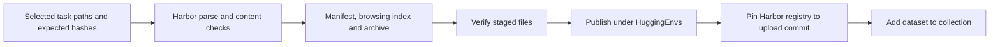

# Releasing Harbor task collections

Use an explicit selection to publish a recipe's retained and newly generated tasks
as one dataset. This workflow does not change the task artifacts or their quality
labels. See [RFC 0029](../rfcs/0029-campaign-expansion-and-release.md) for the contracts.



A release plan is JSON. Paths refer to the local selected exports; evidence and
costs must describe actual receipts, with missing evidence stated explicitly.

```json
{
  "repo_id": "HuggingEnvs/repo2rlenv-swe-smith",
  "recipe": "swe_smith",
  "title": "Repo2RLEnv SWE-smith",
  "description": "Coding tasks produced by owned procedural mutation.",
  "methodology": "Mutate real repository functions, verify test contrast, then write an issue.",
  "code_revision": "COMMIT_SHA",
  "tasks": [{
    "path": "workspace/campaign/generated/swe-smith/TASK_ID",
    "bundle_hash": "sha256:EXPECTED_HASH",
    "evidence": {"baseline_reference": "not assessed in this example"},
    "diagnostics": []
  }],
  "economics": {},
  "citations": [],
  "limitations": ["Generation exports are not independently accepted tasks."]
}
```

```bash
repo2rlenv release stage release-plan.json --out workspace/releases/swe-smith
repo2rlenv release verify workspace/releases/swe-smith
repo2rlenv release publish workspace/releases/swe-smith \
  --receipt workspace/releases/swe-smith-publication.json \
  --collection HuggingEnvs/COLLECTION_SLUG
```

`stage` and `verify` perform local reads, hashing, copying and archiving; they do
not execute tasks or build images. `publish` requires configured Hub credentials.
It uploads selected artifacts only, retaining model/worker receipts locally.
Existing incomplete publication receipts must be inspected and reconciled before
another attempt. A completed receipt is returned without uploading twice.

Each dataset contains:

| Path | Purpose |
|---|---|
| `tasks/<task_id>/` | Original Harbor instruction, environment, verifier and reference |
| `tasks.tar.gz` | Same tasks with executable file modes preserved |
| `data/tasks.jsonl` | Searchable task instruction and evidence index |
| `manifest.json` | Provenance, quality labels, diagnostics, economics and citations |
| `bundle-files.json` | Original task file hashes and modes |
| `release-files.json` | Staged release identity |
| `registry.json` | Harbor task paths pinned to the artifact upload commit |
| `README.md`, `LICENSES.md` | Method, limitations, usage and source licensing |

A corrected task replaces its predecessor in the selected collection; it does not
increase the task count. Preserve the original bundle and repair evidence outside
the release selection. An unsolved/reference pair, a consistency review and a
blind solver rollout are different evidence, and must remain separately labeled.
