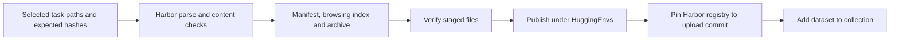

# Releasing Harbor task collections

Use an explicit selection to publish a recipe's retained and newly generated tasks
as one dataset. The default preserves task files and existing labels. An explicit
normalization option adds missing evaluation metadata to release copies, as
described below. See [RFC 0030](../rfcs/0030-campaign-expansion-and-release.md) for the contracts.
Release summaries prefer the uniform `metadata.repo2env.evaluation.status` when
present, validate its revision binding, and preserve the legacy `quality_status`
as `generation_status`. An old `exported`
generation label must not hide a later `verified` or `needs_repair` assessment.

Set `normalize_evaluation_labels: true` in the release plan to add the common
evaluation block to historical tasks that lack it. Only release copies change:
they receive `status = "unverified"`, their unchanged executable bundle identity,
and the original configuration's hash and path. Existing evaluation blocks and
legacy generation labels remain intact. This adds no review, control, rollout
or acceptance claim. The changed configuration bytes and archive are recorded as
a new release; old staging directories and published commits remain available.



A release plan is JSON. Paths refer to the local selected exports; evidence and
costs must describe actual receipts, with missing evidence stated explicitly.
An optional `task_id` selects the published directory name for delivery layouts
such as `entries/<id>/<hash>/task/`. It must match the name in `[task]` and does
not change any bundle contents or hashes. Ordinary exports use their directory
name by default.

```json
{
  "repo_id": "HuggingEnvs/repo2rlenv-swe-smith",
  "recipe": "swe_smith",
  "title": "Repo2RLEnv SWE-smith",
  "description": "Coding tasks produced by owned procedural mutation.",
  "methodology": "Mutate real repository functions, verify test contrast, then write an issue.",
  "code_revision": "COMMIT_SHA",
  "normalize_evaluation_labels": true,
  "tasks": [{
    "path": "workspace/campaign/generated/swe-smith/TASK_ID",
    "bundle_hash": "sha256:EXPECTED_HASH",
    "evidence": {"baseline_reference": "not assessed in this example"},
    "diagnostics": []
  }],
  "economics": {},
  "citations": [],
  "limitations": ["Generation exports are not independently accepted tasks."]
}
```

```bash
repo2rlenv release stage release-plan.json --out workspace/releases/swe-smith
repo2rlenv release verify workspace/releases/swe-smith
repo2rlenv release publish workspace/releases/swe-smith \
  --receipt workspace/releases/swe-smith-publication.json \
  --collection HuggingEnvs/COLLECTION_SLUG
```

`stage` and `verify` perform local reads, hashing, copying and archiving; they do
not execute tasks or build images. `publish` requires configured Hub credentials.
It uploads selected artifacts only, retaining model/worker receipts locally.
Existing incomplete publication receipts must be inspected and reconciled before
another attempt. A completed receipt is returned without uploading twice.

For a new large dataset, add `--batch-size 500` to `release publish`. This requires
an empty destination repository and writes bounded, parent-guarded commits with
a receipt for each batch. The card and release identity are written last; registry
and collection entries are added only after every staged file is present. A
partially uploaded repository is not a completed release. Uncertain batches stop
for reconciliation; restarting with a new receipt would discard that evidence.

Each dataset contains:

| Path | Purpose |
|---|---|
| `tasks/<task_id>/` | Original Harbor instruction, environment, verifier and reference |
| `tasks.tar.gz` | Same tasks with executable file modes preserved |
| `data/tasks.jsonl` | Auxiliary task instruction and evidence index; not the executable task |
| `manifest.json` | Provenance, quality labels, diagnostics, economics and citations |
| `bundle-files.json` | Original task file hashes and modes |
| `release-files.json` | Staged release identity |
| `registry.json` | Harbor task paths pinned to the artifact upload commit |
| `README.md`, `LICENSES.md` | Method, limitations, usage and source licensing |

The dataset card links to **Harbor Visualiser**, the full `tasks/` tree and a
concrete task's configuration, instruction, verifier and oracle. The generic
tabular Hub viewer is disabled with `viewer: false`; it cannot display the
executable environment represented by these folders. This follows the browsing
pattern used by the earlier PR-runtime and commit-runtime datasets.

The current bundles use Harbor's `schema_version = "1.3"`, including separate
verifier environments and declared agent artifacts. Older datasets use the legacy
top-level `version = "1.0"` spelling. Both are Harbor configurations; changing
the field spelling alone is not a compatibility or execution test. See the
[Harbor task format](https://www.harborframework.com/docs/tasks) and
[Hub viewer setting](https://huggingface.co/docs/hub/datasets-viewer-configure).

Publication checks that **every staged file** exists at the uploaded revision
before adding registry or collection entries, including build contexts, verifier
helpers and oracle files. Finding only `task.toml` does not establish a complete
upload. Parsing and publication completeness remain distinct from running the
task's baseline, oracle and blind solver controls remotely.

The [2026-09-14 publication audit](evidence/harbor-hub-publication-20260914.json)
compared all 82,127 released files across six datasets (600 tasks) against Hub
Git/LFS content identities, with no missing or changed files. The live Harbor
Visualiser listed all 100 tasks in each dataset and loaded a complete example
from each. Dataset cards were corrected to use this viewer; original task files,
archives and quality labels were preserved. The report records artifact commits
separately from the later card corrections. This is publication integrity evidence,
not an additional rollout or quality acceptance result.

The [subsequent publication audit](evidence/harbor-hub-publication-additions-20260914.json)
checks another **325 tasks and 22,028 files** across Endless Terminals, CLI-Gym,
DataArc and SWE-Flow. Every staged file matches its published artifact revision.
Harbor Visualiser lists the expected counts and loads each sampled instruction,
configuration, environment, verifier and reference. SWE-Flow's two diagnosed
instruction issues remain explicitly labeled `needs_repair` in its task files.

The [Tasksmith and SETA Evol publication audit](evidence/harbor-hub-publication-tasksmith-evol-20260914.json)
checks another **150 tasks and 106,715 files**, including the full 50-task Tasksmith
release. Both datasets load in Harbor Visualiser. Each audit names the exact
published revision; subsequent annotation releases require their own file audit.

The [current recipe release audit](evidence/harbor-release-label-audit.json) covers
**1,280 tasks across all fourteen owned recipe datasets**, including uniform-label
revisions, TMax's 55 tasks, Seed2Synth's 100 and TerminalWorld's final 100.
These overlap the earlier recipe cohorts; do not add their counts together.
Tasksmith's 50-task release is checked separately. The
[registry and collection audit](evidence/harbor-registry-collection-audit.json)
covers all **1,330 published tasks in fifteen datasets** and their artifact pins.
The [release inventory](releases.md) records each completed generation target and
its published count. The final labels are 50 verified, 5 needing repair and 1,275
without established independent quality acceptance. Publication preserves these
distinctions; generation controls do not promote tasks to verified.

The [final publication audit](evidence/harbor-final-publication-audit.json) rechecks
all fifteen final artifact revisions: **214,097 files and 1,330 Harbor tasks**,
including Tasksmith. The registry audit verifies that consumers resolve those
same revisions. These are artifact and format checks, not semantic acceptance.

A corrected task replaces its predecessor in the selected collection; it does not
increase the task count. Preserve the original bundle and repair evidence outside
the release selection. An unsolved/reference pair, a consistency review and a
blind solver rollout are different evidence, and must remain separately labeled.

If a large artifact upload timed out before creating a commit, use
`release publish ... --recover-empty` with its original receipt. The command first
checks that the remote repository contains only its initial `.gitattributes`.
It then uploads bounded batches with parent-commit guards and records every
confirmed commit. If any task artifacts already exist, or a recovery batch itself
has an uncertain outcome, it stops for reconciliation instead of overwriting or
replaying blindly. Dataset card license links use absolute HTTPS URLs, as required
by the Hub's metadata validator.
