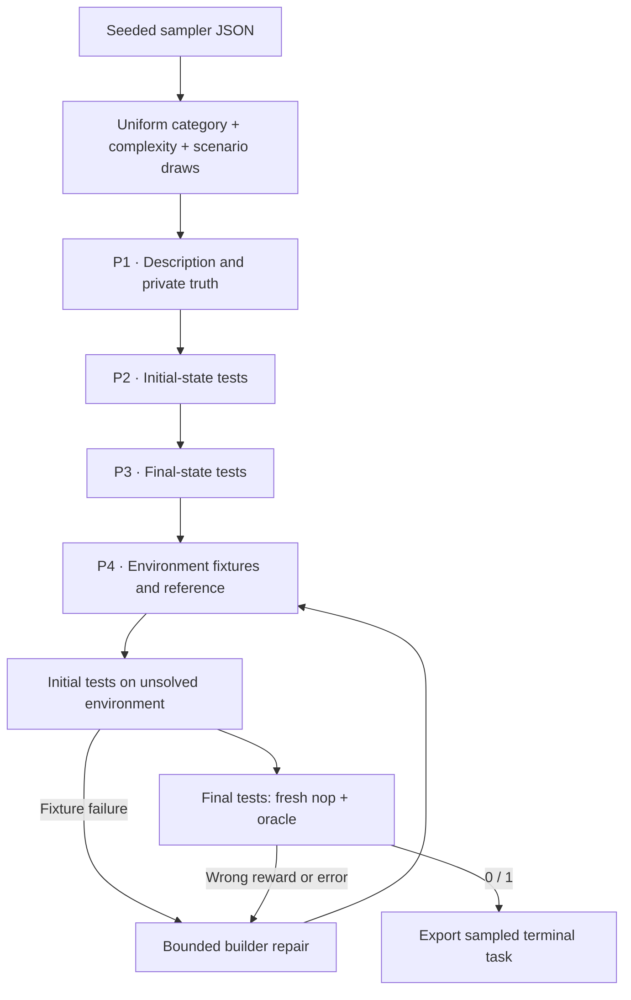

# `terminal_synth / endless_terminals`

Endless Terminals generates terminal tasks from a category, complexity and
scenario. Its native category list covers files, text, databases, configuration,
software tools and other terminal workflows.

## Pipeline, step by step



`P1`, `P2`, … identify actual model calls. Unlabelled stages are code or remote execution.

**Sample without a repository.** Category, complexity and scenario are independent uniform draws from retained native lists. The seed contains the request constructed from those choices.

**Generate the task and tests.** The description/truth call is followed by separate initial-state and completion-test calls. The final-test author sees the initial tests.

**Construct a runnable environment.** The fourth call writes starting text fixtures and a reference solution. The same remote preflight and bounded builder-repair machinery as TMax executes the result.

## Every prompt and its data

Four calls on the first successful attempt; the environment builder is the stage repeated during repair.

| Call | System prompt composition | User / input material | Output | Retry or branch |
|---|---|---|---|---|
| P1 · Template | template_prompt.md + shared adaptation | Sampled category, complexity, scenario and constructed request. | TaskTemplate: description, truth | One call per design. |
| P2 · Initial tests | initial_prompt.md + shared adaptation | Description and truth. | TestProgram: code | Five to ten top-level pytest tests. |
| P3 · Final tests | final_prompt.md + shared adaptation | Description, truth and initial_tests. | TestProgram: code | One separate call. |
| P4 · Build / repair | environment_prompt.md + templates.builder_prompt additions + common materialization | TemplateDesign and actual failures. | TerminalDraft | Initial call plus max_repairs. |

Read the [complete endless_terminals prompt reference](prompts/endless_terminals.md) for every retained template, appended instruction, substitution, example and output schema. The [shared prompt guide](prompt_reference.md) explains how to inspect the fully resolved request from a real run.

## Follow one task

Illustration: the SQLite category and a backup scenario become a database export task with supplied records and a precise archive format. The initial checks assert that inputs exist; final checks inspect the requested archive.

## What repeats, what is checked

This shares execution machinery with TMax, but not TMax’s taxonomy or weighted language sampling. No training, adaptive sampler or blind-agent acceptance step is part of this generation recipe.

An exported bundle is a generation result. Independent leakage review, shortcut probes and blind solver traces belong to the later quality campaign.

## Implementation map

- [`endless_terminals/sampler.py`](https://github.com/huggingface/Repo2RLEnv/blob/codex/owned-generation-pipelines/src/repo2rlenv/pipelines/recipes/endless_terminals/sampler.py)
- [`endless_terminals/recipe.py`](https://github.com/huggingface/Repo2RLEnv/blob/codex/owned-generation-pipelines/src/repo2rlenv/pipelines/recipes/endless_terminals/recipe.py)
- [`terminal/templates.py`](https://github.com/huggingface/Repo2RLEnv/blob/codex/owned-generation-pipelines/src/repo2rlenv/pipelines/recipes/terminal/templates.py)
- [`terminal/preflight.py`](https://github.com/huggingface/Repo2RLEnv/blob/codex/owned-generation-pipelines/src/repo2rlenv/pipelines/recipes/terminal/preflight.py)
- [`terminal/runner.py`](https://github.com/huggingface/Repo2RLEnv/blob/codex/owned-generation-pipelines/src/repo2rlenv/pipelines/recipes/terminal/runner.py)

## Run and supported profile

Run `repo2rlenv generate --config examples/owned-endless-terminals.yaml`.
The input is a sampler JSON file:

```json
{"count":40,"seed":24,"categories":["text processing and manipulation","backup and archiving","SQLite database operations via CLI"]}
```

Omit `categories` to sample the full native list. All three axes use uniform
sampling, preserving the original method. TMax's separate recipe uses its own
domain/skill taxonomy and language weights. They share the metered authoring
and remote execution stages.

The first profile uses text fixtures in an offline CPU Docker container. The
solver runs as `user`; dependencies are installed at build time. Initial tests
execute on a fresh environment before the final baseline/reference pair.
The builder can repair inconsistent fixtures or a failing reference within
`max_repairs`. Every attempted input and execution outcome remains in the run.

The target is **20 generated tasks**, with detailed quality evaluation and
blind rollouts deferred. Upstream's sampled solutions and training run are
outside this generation milestone. Options and cloud setup follow the
[shared interface](owned_recipes.md); the configuration records the actual
author model rather than claiming the original Qwen settings.

Credit: [Endless Terminals](https://github.com/kanishkg/endless-terminals),
Apache-2.0, commit `99f4c74b75faacf21e53d3dc01df170902e924cb`.
See [RFC 0020](../rfcs/0020-endless-terminals-recipe.md) and packaged
`recipes/endless_terminals/provenance.md` for the source map and adaptations.
