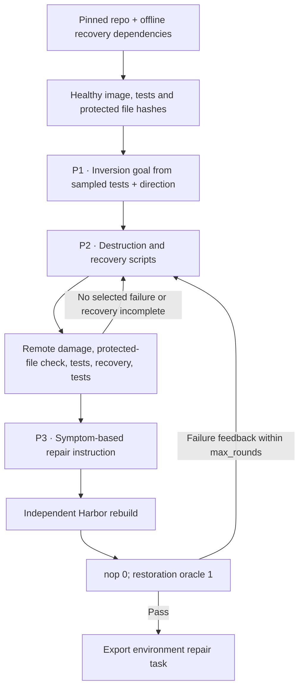

# `env_repair / cli_gym`

CLI-Gym derives repair tasks by deliberately breaking a healthy development
environment and verifying that a recovery restores its existing tests.

## Pipeline, step by step

`P1`, `P2`, … identify actual model calls. Unlabelled stages are code or remote execution.

**Establish a healthy system.** Collect real passing test identities, installed packages and file paths, plus hashes protecting source/tests. The author samples at most fifty test identities per candidate.

**Invert and restore.** The goal specifies an environment failure. Scripts must change persistent filesystem state without editing protected repository code/tests. A valid inversion affects at least one selected test; recovery restores the healthy suite.

**Describe symptoms.** The instruction author gets actual baseline results and a recovery goal, not a license to invent assertion failures. A fresh Harbor rebuild verifies the packaged destruction/restoration path.

## Every prompt and its data

One goal call, then up to max_rounds inversion calls. Instruction writing occurs only for a successful disruption/recovery attempt.

| Call | System prompt composition | User / input material | Output | Retry or branch |
|---|---|---|---|---|
| P1 · Goal | inversion_prompt.md with candidate_uts_list, directions and existing_tasks substitutions | Candidate, installed packages and file paths. | InversionGoal: title, category, selected_tests, description, expected_result, recovery_strategy | Existing titles discourage repeats within a run. |
| P2 · Inversion / repair | Inline system prompt in CLIGymPipeline.author_export | Goal, observed healthy environment and feedback. | Inversion: destruction_shell, recovery_shell, explanation | Up to max_rounds, default three. |
| P3 · Instruction | instruction_prompt.md with task_description and symptoms_UTs + adaptation | Actual baseline and goal.recovery_strategy. | RepairInstruction: instruction | Called after a valid contrast; repeated if a later Harbor failure returns to the loop. |

Read the [complete cli_gym prompt reference](prompts/cli_gym.md) for every retained template, appended instruction, substitution, example and output schema. The [shared prompt guide](prompt_reference.md) explains how to inspect the fully resolved request from a real run.

## Follow one task

Illustration: a Python path configuration causes the healthy CLI package to stop importing. The learner sees the failure and offline wheel cache, and must restore the environment. The source implementation itself must remain unchanged.

## What repeats, what is checked

P1 is fixed for the candidate. P2 receives destruction/recovery failures and later Harbor feedback. The final task runs as root because it is an environment repair problem; its isolation/shortcut risks still require the later quality review. Neither empty tests nor incomplete recovery is a successful generation.

An exported bundle is a generation result. Independent leakage review, shortcut probes and blind solver traces belong to the later quality campaign.

## Implementation map

- [`cli_gym/models.py`](https://github.com/huggingface/Repo2RLEnv/blob/codex/owned-generation-pipelines/src/repo2rlenv/pipelines/recipes/cli_gym/models.py)
- [`cli_gym/pipeline.py`](https://github.com/huggingface/Repo2RLEnv/blob/codex/owned-generation-pipelines/src/repo2rlenv/pipelines/recipes/cli_gym/pipeline.py)
- [`cli_gym/worker.py`](https://github.com/huggingface/Repo2RLEnv/blob/codex/owned-generation-pipelines/src/repo2rlenv/pipelines/recipes/cli_gym/worker.py)
- [`cli_gym/export.py`](https://github.com/huggingface/Repo2RLEnv/blob/codex/owned-generation-pipelines/src/repo2rlenv/pipelines/recipes/cli_gym/export.py)
- [`cli_gym/grade.py`](https://github.com/huggingface/Repo2RLEnv/blob/codex/owned-generation-pipelines/src/repo2rlenv/pipelines/recipes/cli_gym/grade.py)

## Run and supported profile

Run `repo2rlenv generate --config examples/owned-cli-gym.yaml`. This first profile
supports public GitHub Python repositories with a `tests/` directory. The
configuration supplies source paths, test/build dependencies, offline recovery
assets and optional disruption directions. The target repository is cloned in
the remote bootstrap; the CLI-Gym research repository is never a runtime dependency.

The inversion author samples up to fifty real passing test identities, proposes
a distinct environment failure, then revises its scripts using actual execution
feedback. Source and test files are protected. Changes must persist in files;
temporary shell exports cannot represent a separate environment state.

The baseline must lose at least one selected test and the recovery must restore
all required healthy tests. Empty, malformed and incomplete results cannot earn
success. A broken Python import or collection step is a valid environment
failure, but is reported accurately. The final Harbor bundle undergoes another
fresh baseline/reference pair before export.

The solver repairs the container as root, offline, without changing repository
source or tests. The example makes dependency wheels available in `/opt/wheelhouse`.
The exported image preinstalls `tmux` so Harbor's Terminus-2 agent can start
without downloading terminal tooling. Baseline/reference success alone does not
test this agent setup path; include a blind solver run in the quality pilot.
The build-time destruction script stays outside the learner filesystem; its
inverse remains a private reference. Full adversarial review of the root runtime
is deferred to the later quality campaign.

Options include `target`, `max_candidates`, `max_rounds`, `seed`, `directions`
and the common Python build/test profile. The first target is **20 generated
tasks**, using the [shared Modal/Daytona and progress interface](owned_recipes.md).

Credit: [CLI-Gym](https://github.com/LiberCoders/CLI-Gym), MIT, commit
`48bb920b728a25a55a5b442303e901919654599e`. See
[RFC 0021](../rfcs/0021-cli-gym-recipe.md) and packaged
`recipes/cli_gym/provenance.md` for source mapping and profile restrictions.
