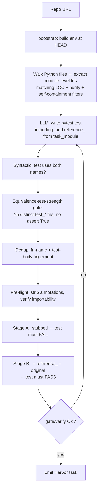

# `equivalence_tests`

R2E-style function-level synthesis. Extract a real Python function from the
target repo as a frozen oracle (`reference_<name>`); ask the LLM to write
equivalence tests that compare a `<name>` candidate against the oracle on
crafted inputs; emit a Harbor task whose gold patch fills in the candidate
with the original implementation.

| | |
|---|---|
| Status | **shipped (v0.7), hardened v0.8.7** — Python module-level functions |
| Sandbox required at gen | Yes |
| LLM required at gen | Yes (writes the test only; retries with feedback on failure) |
| Reward kinds emitted | `test_execution` |
| Reference dataset | *pending v0.8.8 — the 5-repo (click/flask/requests/attrs/starlette) survey yielded only ~8 pure candidates combined; surveying a broader utility-lib set* |
| Inspiration | [R2E](https://github.com/r2e-project/r2e) (ICML '24) |

## What's different vs `code_instruct`

| | `code_instruct` | `equivalence_tests` |
|---|---|---|
| Seed | LLM-invented problem | **Real function** from the repo |
| LLM writes | problem + test + solution | **test only** (we already have the solution) |
| Failure surface | LLM might invent unsolvable / wrong problems | LLM might write a bad test (filtered) |
| Yield per repo | one per seed snippet | **one per qualifying function** |

`equivalence_tests` is lower-variance because the ground truth is real
working code, not LLM-imagined behavior.

## Algorithm



**Quality gates (added v0.8.7)** — the v0.7 pipeline emitted the full source in the instruction (leak) and never retried a failing candidate. Baseline audit found 97% of extracted candidates failed Stage-B with `oracle_does_not_satisfy_test` because the standalone `task_module.py` we bake couldn't import (referenced click-internal types like `Argument`, `FC`). The v0.8.7 pass layers:

- **Leak-free instruction** — signature + docstring + `...` body only (via `signature_only_source` in `_eval_script.py`). Agent no longer sees the reference implementation in `instruction.md`.
- **Recursion-safe rename** — `rename_function_ast` uses `ast.unparse` instead of a regex on the `def` line, so recursive functions actually recurse on the renamed name.
- **Annotation strip at bake time** — `def foo(x: Argument) -> FC` → `def foo(x)` before writing `task_module.py`. Annotations are decorative at runtime, so this doesn't change behaviour, but it makes the standalone module importable even when the original signature referenced repo-internal types.
- **Purity + self-containment filter** — extractor now rejects functions whose bodies reference names outside stdlib + own args + a small allowlist. Turns off the whole "task_module.py fails to import" tail. On click this cuts extractable candidates 32 → 2, but every survivor is actually verifiable.
- **`is_module_importable` pre-flight** — before spending sandbox time, compile the baked stub and check every top-level Name resolves. Catches remaining bad candidates cheaply.
- **Retry with feedback** — `max_attempts_per_function` (default now `3`, was documented but not wired pre-v0.8.7). On Stage-B failure, the last 1200 chars of the failure log are fed back to the LLM in the next attempt so it can pick better inputs.
- **Test-strength gate** — `check_equivalence_test_strength` rejects tests with fewer than 5 `def test_*` functions, functions that don't reference both names, or `assert True` / trivial constant asserts.
- **Task dedup** — `_equivalence_fingerprint` (function name + normalized test-body hash) catches the LLM re-emitting the same test suite on retry.
- **Debug dumps** — every skipped candidate writes its last-attempt test + Stage-B log to `<out_dir>/.debug_skips/<fn_name>/` so failure-mode audits don't need a full pipeline re-run.

## Function extractor (R2E-style filters)

Walks `clone_dir.glob("**/*.py")`, applies in order:

1. Exclude path globs (`tests/**`, `docs/**`, `**/__init__.py`, ...)
2. AST parse; skip on `SyntaxError`
3. Module-level `FunctionDef` only (no class methods in v0.7)
4. No `async def`
5. Drop names: dunder, `test_*`, `main`, `setup`, `run`, `init`, `cli`, `wrapper`, `_*`
6. Must have ≥1 positional/keyword arg (no zero-arg)
7. Body LOC ∈ `[min_loc, max_loc]` (default 5–60)
8. Must contain `return <expr>` (not bare `return`)
9. Body must NOT contain side-effect markers (`open(`, `subprocess.`,
   `os.environ`, `requests.`, `print(`, `sys.exit`, `input(`, ...)

Filters are conservative — they keep the candidate pool small but
high-quality. Use `--pipeline-opt min_loc=1 --pipeline-opt max_loc=200`
to loosen for low-LOC repos.

## Reference oracle pattern

The emitted `task_module.py` ships **two** function definitions:

```python
def reference_<name>(...):
    # original implementation, frozen — used as the oracle
    ...

def <name>(...):
    # in the environment image: stubbed (raise NotImplementedError)
    # after the gold patch: identical to reference_<name>
    ...
```

The LLM-generated test imports both and asserts equality across multiple
inputs:

```python
from task_module import <name>, reference_<name>

def test_basic():
    assert <name>(1, 2) == reference_<name>(1, 2)

def test_edge_zero():
    assert <name>(0, 0) == reference_<name>(0, 0)
```

## Verification (two-stage)

| Stage | Module state | Required outcome |
|---|---|---|
| A — stub | `<name>` raises `NotImplementedError`; `reference_<name>` is original | FAIL (else the test is trivial) |
| B — oracle | `<name>` = `reference_<name>` = original | PASS (else the test is buggy) |

Stage A catches the LLM "cheating" with a test that doesn't call `<name>`.
Stage B catches buggy tests (e.g., asserts on outputs that aren't
deterministic across re-runs).

## Options

See `EquivalenceTestsOptions` in `src/repo2rlenv/spec/options.py`.

| Field | Default | Notes |
|---|---|---|
| `limit` | 50 | max emitted tasks |
| `min_loc` / `max_loc` | 5 / 60 | body-LOC range |
| `file_glob` / `exclude_glob` | `**/*.py` / tests/etc. | source selection |
| `seed` | `None` | RNG seed for reproducibility |
| `llm_temperature` | 0.5 | lower than `code_instruct` — tests should be stable |
| `require_test_fails_with_stub` | `True` | Stage A invariant |
| `require_test_passes_with_oracle` | `True` | Stage B invariant |
| `validation_timeout_sec` | 90 | per-candidate test run cap |
| `skip_validation` | `False` | debug; emits without sandbox run |

## Yield

**Yield = emitted tasks ÷ functions extracted.** Expect **~30–60%**. A function
survives only if the LLM writes an equivalence test that **fails when `<name>` is
stubbed and passes against the frozen `reference_<name>` oracle**. Pure, total
functions (deterministic, no I/O, no global state) convert well; functions with
side effects, randomness, or heavy dependencies usually fail the gate and are
dropped.

| Knob | Default | Effect on yield |
|---|:-:|---|
| `max_attempts_per_function` | 1 | ↑ retries failed synthesis → higher yield, more spend |
| `min_loc` / `max_loc` | 5 / 60 | the band that balances "too trivial to test" vs "too complex to cover" |
| `exclude_glob` | tests/docs/`__init__`/setup | keeps extraction on real logic |
| LLM model quality | — | stronger models craft discriminating inputs more often |
| `llm_temperature` | 0.5 | lower than `code_instruct` on purpose — we want *stable* tests, which also helps yield |

Function **purity is the dominant factor**: a repo of pure utility functions
(parsers, encoders, math) yields far above one dominated by I/O-bound or
stateful code. Repo test health doesn't gate (the verifier is self-contained),
but the env must bootstrap.

**Worked example:** at ~45% yield, 100 tasks ≈ ~220 qualifying functions across
one or two utility-heavy repos. Raising `max_attempts_per_function` to 2 trades
spend for ~10–15 points of yield.

## End-to-end smoke

```bash
repo2rlenv generate \
  --repo pallets/click \
  --pipeline equivalence_tests \
  --pipeline-opt limit=1 --pipeline-opt seed=42 \
  --llm anthropic/claude-sonnet-4-6 \
  --out ./datasets/click-eqv

harbor run -a oracle -p ./datasets/click-eqv/<task-id>
# Mean reward 1.000
```

## Known v0.7 trade-offs (to revisit)

- **Module-level only.** Class methods (with `self` / `cls`) need either
  dependency slicing (include class context) or method-to-function
  conversion. Deferred to v0.8.
- **Recursion.** `_rename_function_source` rewrites only the `def` line;
  if a function calls itself by name, the renamed `reference_<name>`
  still calls `<name>` internally — usually trips Stage B and the
  candidate is dropped. Acceptable skip rate in practice.
- **No iterative test refinement** (R2E's "feedback → fix_error → improve_coverage"
  loop). Single LLM call per candidate; if the LLM writes a flaky or buggy
  test, we skip rather than retry. The retry loop is on the v0.8 roadmap.

## What we adapted from `references/r2e/`

- Function extractor filter set (`repo_builder/fut_extractor/extract_base.py`):
  LOC bounds, must-have-return, name + decorator + side-effect exclusions.
- The reference-oracle test pattern (`generators/testgen/prompt.py:27-28`):
  `reference_<name>` naming convention; test imports BOTH names.
- The "test must exercise candidate" syntactic guard.

No code is copied. The implementation is original Python stdlib.
