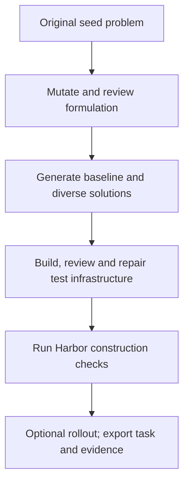
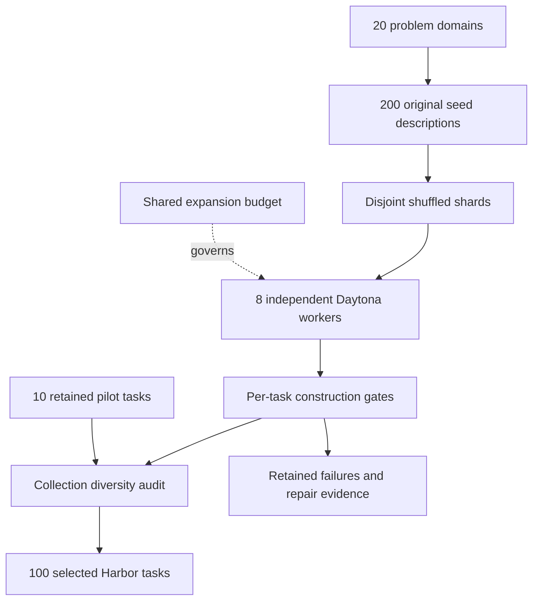

`optimization_synth / frontiersmith` turns a closed-ended programming problem into
an optimization challenge. Agents submit a reusable Python program; deterministic
private tests measure feasibility and solution quality on a continuous `[0,1]`
scale. A better solution can earn more reward without there being a known optimum.

**Status:** experimental; 100-task local collection completed on 2026-09-29. This is an owned,
paper-inspired adaptation, not the unreleased upstream generation implementation.
See [RFC 0032](../rfcs/0032-frontiersmith-recipe.md) for exact differences.



## What each prompt does

Every call uses the configured OpenAI model in a separate context. This is not a
cross-model ensemble: the first feasibility call is authored from the instruction,
and repairs can see previous infrastructure through diagnostic feedback. All exact
requests and responses are retained in the campaign; the
[complete prompt reference](prompts/frontiersmith.md) is generated from source.

| Stage | Model receives | Required output and gate |
|---|---|---|
| Mutation | Seed problem and provenance | Public instruction, objective, feasibility, score and simple baseline |
| Formulation review | Design | Approve or list concrete ambiguities and triviality concerns |
| Baseline | Public instruction and simple strategy | Deterministic feasible program |
| Sampled solutions | Public instruction and strategy brief | Three independently authored programs by default |
| Idea divergence | Sample programs | One algorithmic-distinction judgment per pair |
| Test generation | Design and sampled strategies | Seeded generator with 8–16 edge, adversarial and larger cases |
| Scoring | Design and generated tests | Feasibility checker and exact public score calculation |
| Feasibility | Public instruction; previous infrastructure and diagnostic feedback on retries | Separate `is_feasible` checker; valid zero-reward solutions remain valid |
| Infrastructure review | Instruction, tests, scorer, validity checker and programs | Approve or route concrete defects to bounded repair |
| Optional rollout | Learner-visible Harbor task only | Independent agent attempt, transcript and observed reward |

Harbor execution itself uses no LLM judge. The no-op must score zero; a sampled
reference must improve on the baseline and repeat its per-case scores. The baseline
and at least two sampled programs must be feasible on every generated case. A
separate boolean validity verdict distinguishes a legal zero score from an invalid
submission. Sample
score vectors must differ (default mean absolute difference of at least 0.001
for at least 30% of sampled pairs). This is a sensitivity threshold on deterministic
scores, not a minimum task reward or a claim about training benefit. A reference score below one is normal. Generated but
rejected artifacts remain in the campaign for diagnosis.

## Run

Install the normal package with cloud and Harbor extras. Set `OPENAI_API_KEY` and
`DAYTONA_API_KEY` through your environment or `.env`. No upstream research package
is installed. Build the wheel after source changes so the remote runtime matches.

```bash
uv sync --extra daytona --extra harbor
uv build --wheel
repo2rlenv campaign init workspace/frontiersmith --budget-usd 30
repo2rlenv workers start --campaign workspace/frontiersmith \
  --provider daytona --name frontiersmith-pilot --reserve-usd 2 \
  --timeout-sec 14400
repo2rlenv pipelines describe optimization_synth --recipe frontiersmith
repo2rlenv generate --config examples/owned-frontiersmith.yaml
```

Use `--resume` with unchanged settings and the same runtime wheel. An unresolved
request cannot be blindly redispatched. Live connection errors skip the affected
candidate while retaining its reservation and diagnosis; later seeds can continue.
The CLI shows named stage events; `--json` emits the same events as JSON Lines.
The ledger counts reservations as well as settled spend. Terminate the worker when
finished and reconcile its cost from provider evidence:

```bash
repo2rlenv workers stop workspace/frontiersmith/workers/frontiersmith-pilot.json
repo2rlenv campaign status workspace/frontiersmith
```

## Task and evidence layout

```text
tasks/frontiersmith-<seed>/
  task.toml                  # Harbor configuration, lineage and evaluation label
  instruction.md             # Complete public contract
  environment/Dockerfile     # CPU-only, offline Python runtime
  solution/solve.sh           # Installs the best sampled reference
  solution/solution.py
  tests/test.sh
  tests/grade.py              # Owned process isolation and reward writer
  tests/generator.py          # Private reproducible test instances
  tests/scorer.py             # Feasibility and graded objective
  tests/feasibility.py        # Independently authored validity verdict
  tests/contract.json
```

Each generator is also smoke-tested at the configured seed and its next two
values. This catches seed-dependent construction failures; it does not establish
solver generalization to those extra inputs. Seed-family metadata is carried into
each task so collection diversity can be measured. Exhausted structured-output
repairs reject the candidate and preserve its receipts while later seeds continue.

The campaign separately retains model receipts, review findings, trial results,
per-case score vectors and a `quality.json` for each emitted task. The generic
evaluation label remains `unverified` until the broader review/probe/rollout
evidence required by the repository is established. Construction verification
must not be confused with full quality acceptance.

The shared `quality` review/repair loop currently checks the oracle and valid
alternatives against one fixed `success_reward`. Changing that number does not
make it an optimization profile: distinct feasible programs can legitimately earn
different rewards. Do not apply that binary-style acceptance contract to this
recipe or flatten scores to obtain a `verified` label. This recipe uses its own
construction checks; broader optimization-aware acceptance is not yet integrated
into the shared quality loop.

The Dockerfile currently uses the `python:3.12-slim` tag and installs build-time
system packages without a repository snapshot. Task hashes bind the Dockerfile and
verifier bytes, not a permanently pinned base-image digest. Recorded runs establish
what executed during this campaign; future image rebuilds need their own checks.
Execution evidence uses Harbor 0.22.0 and the repository's offline Docker adapter
inside Daytona. Other execution backends were not validated by this collection.

## Scope, economics and credit

This recipe supports Python standard-library algorithms, not GPU or service tasks.
The existing FrontierSmith release uses C++ and a privileged judge sidecar; this
adapter does not copy or require it. We use original seed descriptions and prompts.

Candidate filtering and repair can dominate cost. Report spend per attempted seed
and per exported task, including rejected candidates, and keep cloud billing
distinct from token estimates. Report the observed acceptance fraction alongside cost. The development pilot
and the broader collection are separate measurement scopes.

Method credit: [FrontierSmith paper](https://arxiv.org/abs/2605.14445),
[upstream repository](https://github.com/FrontierCS/FrontierSmith), and
[provenance](https://github.com/huggingface/Repo2RLEnv/blob/main/src/repo2rlenv/pipelines/recipes/frontiersmith/provenance.md).

## Measured 100-task collection

**100 local Harbor tasks across 20 problem families:** 10 retained pilot tasks and
90 new exports. All use OpenAI `gpt-6-sol` and Daytona execution. This is an assisted
collection measured on 2026-09-29, not a fully unattended yield benchmark.

| Evidence | Result |
|---|---:|
| Candidate attempts / distinct seeds | 153 / 152 |
| Initial exports / final selected tasks | 101 / 100 |
| Final selection yield | 65.4% |
| Harbor parsing, content integrity and construction checks | 100 / 100 |
| Finished-task static contract reviews without unresolved concrete findings | 100 / 100 |
| Tasks with a blind rollout attempt | 24 / 100 |
| Tasks with completed, fully feasible blind rollouts | 21 / 24 attempted |
| Post-construction generator repairs | 2 tasks |
| Full quality acceptance | 0; all remain `unverified`, stage `construction` |

Construction means a zero-reward no-op, a fully feasible baseline, at least two
fully feasible sampled programs, a reference improving on that baseline,
distinguishable score vectors and repeated reference scores. It does not require a
proven optimum. Generator smoke checks cover seeds 42, 43 and 44; solution grading
uses seed 42. For the retained pilot, the extra generator smoke check was a separate
remote audit. It does not establish solution generalization across those seeds.

Blind rollouts attempted at least one task in every family. There were 26
attempts on 24 final bundles, including two retries with larger output budgets
after truncated model responses. All 21 completed rollouts were feasible on
every graded case. Three tasks stopped during agent commands before grading:
`bipartite-matching`, `sequence-reordering-parallel-swap-rounds`, and
`communication-priced-frame-slots`. Their timeouts remain recorded; the tasks were
not weakened to make the agent succeed. The other 76 tasks have construction
evidence without a blind rollout. Scores across different objectives are not a
shared performance benchmark.

The collection review checked all 20 families and cross-family mathematical
summaries. It found no unresolved near-duplicate formulations; exact instruction
and executable-bundle hashes are also unique. This is model-assisted curation,
not proof of semantic uniqueness or broad adversarial safety. Two generators were
repaired after concrete findings, and one required a second repair after a targeted
branch probe. Original and intermediate bundles remain available with diagnoses.

| Problem family | Tasks |
|---|---:|
| Combinatorial design | 4 |
| Communication | 4 |
| Compiler optimization | 4 |
| Data representation | 3 |
| Energy systems | 4 |
| Geometric layout | 9 |
| Image grid processing | 5 |
| Logic constraints | 4 |
| Network design | 6 |
| Numerical approximation | 5 |
| Query planning | 3 |
| Resource allocation | 8 |
| Scheduling | 6 |
| Search structures | 5 |
| Sequence reordering | 4 |
| Software testing | 7 |
| State space planning | 5 |
| Storage systems | 6 |
| Strings compression | 4 |
| Transport routing | 4 |

| Generation rejection or interruption | Candidate attempts |
|---|---:|
| `formulation_rejected` | 1 |
| `infrastructure_repair_exhausted` | 4 |
| `insufficient_successful_programs` | 6 |
| `low_execution_diversity_or_improvement` | 13 |
| `low_semantic_divergence` | 24 |
| `provider_response_unavailable` | 4 |

These generation outcomes precede collection curation: the pilot also excluded one
initial export, and repaired versions of two expansion tasks replace their parents
without increasing the selected count.

Accounted cost is **USD 68.42**, or **USD 0.684 per selected task**,
including seed authoring, rejected candidates, reviews, repairs and sample rollouts.
A further **USD 0.67 remains reserved for four lost API responses**; their
actual charges are unknown. Combined accounted cost plus those reservations is
USD 69.09, within the USD 100 cap. All 13
campaign workers have been terminated. API costs use recorded usage and configured
rates; compute is a resource-duration estimate, not an invoice. Interactive
assistant usage is excluded. See [economics](economics.md#frontiersmith-optimization-synthesis)
for the stage breakdown.

The [machine-readable collection manifest](../data/frontiersmith-campaign.json)
records task identities, family, baseline/reference scores, rollout attempts,
repair lineage, costs and generation revision. Pilot bundles are unchanged; their
family tags are assigned only in the collection manifest. The original expansion
runtime wheel is preserved locally before the post-campaign code fixes.

Local artifacts are under `workspace/frontiersmith-scale/`:

- `collection/tasks/`: the 100 selected standalone Harbor directories.
- `frontiersmith-100.tar.gz` and `frontiersmith-100.sha256`: portable task archive and checksum.
- `manifest.json`: collection evidence summary; `runs/`, `audit/`, `repairs/` and
  `recoveries/` retain the detailed local receipts and operator decisions.

Generated tasks and raw campaign receipts stay out of Git. They have not been
published to the Hub and are excluded from published-dataset totals.

## Measured local pilot

**10 selected Harbor tasks from 15 candidate attempts across 14 original seeds.**
Eleven tasks initially exported; one graph-coloring candidate was retained with a
`needs_repair` label after explicit feasibility checks. Ten passed the final
construction profile, with a feasible baseline and at least two fully feasible
sampled programs, no-op zero, baseline improvement, score diversity and repeated
reference scores. All ten parse with Harbor and pass artifact-integrity checks.

| Task | Cases | Baseline | Best sampled reference |
|---|---:|---:|---:|
| bipartite-matching | 13 | 0.894 | 0.916 |
| cache-replacement | 12 | 0.328 | 0.577 |
| edit-distance | 14 | 0.105 | 0.823 |
| load-balancing | 12 | 0.583 | 0.797 |
| matrix-chain | 14 | 0.500 | 0.920 |
| rectangle-packing | 15 | 0.853 | 0.912 |
| set-coverage | 13 | 0.512 | 0.628 |
| spanning-tree | 12 | 0.185 | 0.542 |
| string-compression | 12 | 0.000 | 0.369 |
| topological-order | 12 | 0.000 | 0.638 |

Rewards use different objectives and normalizers; compare strategies within a
task, not scores between these rows. References are feasible sampled solutions,
not proofs of optimality.

A fresh run of the final pipeline generated the set-coverage task, repaired its
test set within the configured allowance, and completed a blind GPT-6 Sol rollout.
The rollout was feasible on all 13 cases and scored **0.628**, matching the sampled
reference. An earlier spanning-tree rollout scored 0.545, but used an earlier
bundle and does not establish rollout validation of the final collection.

All ten remain **`unverified`, stage `construction`**. Broad adversarial testing,
independent quality acceptance and Hub publication have not been completed. The
excluded graph-coloring candidate exposed why reward and feasibility must be
separate: only one sampled strategy was fully valid, and review also found a
seed-dependent generator boundary error.

Recorded OpenAI usage cost was **\$5.27**, with **\$0.34 estimated Daytona compute**:
**\$5.61 total, about \$0.56 per selected task**. This includes rejected attempts,
development retries, two rollouts and repeated construction checks. It excludes
interactive assistant usage. These are usage/resource estimates, not invoices.
All three workers were terminated; no unresolved reservations remain.

This was an assisted development campaign with evolving checks, not a controlled
unattended-yield benchmark. Initial export yield was 11/15 (73.3%); final selection
was 10/15 (66.7%). [Machine-readable results and bundle identities](../data/frontiersmith-pilot.json)
record the exact sample. Generated tasks and raw receipts stay in the ignored
campaign directory; the selected archive is `workspace/frontiersmith/frontiersmith-pilot.tar.gz`.

## Expanding the problem range

The expansion uses 200 original OpenAI-authored closed-ended seeds in
`examples/frontiersmith-diverse-seeds.json`, with ten per domain. It covers: network
design, transport, scheduling, allocation, geometry, strings/compression, storage,
query planning, compilers, logic, numerical approximation, combinatorial design,
sequence reordering, energy systems, communication, search structures, image/grid
processing, data representation, software testing and state-space planning.

Seeds include their family and provenance. The mutation stage preserves each
seed's core domain rather than converting unrelated problems into the same generic
selection task. All resulting environments remain Python standard-library coding
challenges with deterministic objectives; domain variety does not imply GPU,
repository-editing or service-based environments.

Independent workers receive disjoint, shuffled seed shards and share one expansion
budget ledger. The expansion cap is the \$100 combined allowance minus the pilot's
\$5.606553, preserving the settled pilot ledger. Accepted pilot tasks are retained
unchanged. The expansion produced 90 additional construction-checked tasks and completed
a collection-level diversity audit. Generated campaign files remain ignored.



The recorded expansion shuffled the 200 seeds with `random.Random(20260929)` and
split them as `seeds[i::8]` for `i = 0..7`. Shard targets were
`[12, 12, 11, 11, 11, 11, 11, 11]`, totaling 90 new tasks. Each configuration has
its own `source.path`, `execution.run_id` and `execution.worker_receipt`; they share
`execution.campaign_dir` and the output directory. Seed IDs are disjoint. Per-run
candidate limits are 25, with two concurrent solution calls and one blind rollout
per shard. This partition and the seed-file hash are recorded in the final manifest.

Parallelism is at the campaign level: each worker runs the same public `generate`
command against its own seed shard and worker receipt. Within a candidate,
independent solution calls can overlap; reference trials run sequentially on that
worker to keep timing comparable. Collection curation is separate from the
single-shard recipe command. Every selected task retains its original executable
bundle hash and construction evidence; the collection audit must not silently
rewrite a tested task.

## Collection review

A collection needs checks beyond one successful construction run:

1. Parse every selected task with Harbor and verify its content identity against
   the recorded trial receipts. Check no-op zero, baseline feasibility, at least
   two feasible samples, improvement and repeated reference scores from per-case
   evidence, not just an aggregate success flag.
2. Review the finished instruction, generator, scorer and feasibility validator in
   a fresh context without the sampled programs. Require a concrete counterexample
   for any reported defect; distinguish limitations from actual contract failures.
3. Compare formulations within each problem family and across mathematical
   summaries. Shared algorithms or topics do not make tasks duplicates; renamed
   decisions, constraints and objectives do. Exact file hashes alone cannot detect
   semantic duplication.
4. Preserve a flagged original with its diagnosis. A repair creates a new bundle,
   with its parent identity recorded, and reruns the construction profile. Do not
   copy old execution evidence onto changed tests or instructions.

For example, an energy-storage task passed its original construction checks but
contained one generated input with simultaneous surplus and demand, contrary to
its public domain. The additional review found that mismatch. A bounded generator
repair corrected the input, preserved the instruction and scoring formula, and
passed fresh no-op, baseline, sample and repeated-reference trials. The original
remains available with a `needs_repair` label. A network generator also needed to
reserve its complete connected backbone before adding optional edges; repeated
seeds and a targeted dense-branch check exposed an incomplete first repair.
These cases illustrate why agreement among sampled programs is useful evidence
but does not prove the tests are valid.

These collection checks are an assisted curation step outside the single-shard
`generate` command. They use the same model accounting and remote execution
primitives; their requests, findings and repair receipts remain in the campaign.
They do not upgrade tasks to the broader `verified` label automatically.


## What the environments ask agents to do

The variety comes from decisions, constraints and objectives, not renamed stories.
Representative generated tasks include:

| Domain | Program output | What the verifier measures |
|---|---|---|
| Energy systems | Per-store charging and discharge schedules | Served demand value, subject to inventory and minimum charging-run constraints |
| Compiler optimization | Ordered expression-tree tiles, including fused operations | Operation cost, transition penalties and peak live values |
| Communication | Packet fragments assigned to priced frame slots | Transmission cost including headers, capacities and exact delivery |
| Numerical approximation | Nonnegative integer quadrature weights | Worst monomial integration error under a fixed weight budget |
| Software testing | Dependency paths from tests to edited modules | Shared setup cost plus path traversals, with bounded detours |
| Data representation | Tile palette assignments and pixel encodings | Exact reconstruction and encoded bit count including palette overhead |

These are compact algorithm-design environments. They do not exercise large-repo
navigation, dependency installation, GPU execution or service deployment. A model
may produce a feasible program yet leave substantial optimization headroom. Report
feasibility and reward together instead of converting every positive score into a
claim that the problem is solved.

## Operational lessons

- **Closed-ended seeds can remain too easy after mutation.** Different sampled
  programs sometimes converge on the same algorithm or identical scores. Treat
  that as a failed diversity gate; do not manufacture score differences by changing
  the public objective. Seed family names alone do not establish task variety.
- **Independent feasibility matters.** Zero can mean a valid but poor objective
  value. Keep validity separate, and require the baseline and multiple samples to
  be feasible on every graded case.
- **Review generators against the public domain.** Successful reference execution
  does not establish that generated inputs satisfy every promised constraint.
  Check boundary cases and the exact control-flow branch implicated by a finding.
- **Repair evidence belongs to new bytes.** Preserve the original, issue a new
  bundle identity and rerun the construction profile. A successful repair on a few
  seeds can still miss a dense or adversarial branch.
- **Agent failures are a separate outcome.** Preserve command timeouts and output
  truncations. An incomplete rollout neither disproves the verifier nor establishes
  task difficulty. Do not change the task to make a chosen agent pass.
- **Lost responses are not free.** Stop the affected run and retain its API
  reservation. During this collection, four uncertain authoring operations were
  retained and their candidates skipped through an explicit recovery record before
  the unchanged shards resumed. The campaign needed that operator recovery. A post-campaign fix now skips
  candidates on live connection errors automatically, preserving their reservations;
  previously unresolved receipts still require reconciliation before redispatch.
- **Fixed shards create a long tail.** Disjoint targets make resume and accounting
  straightforward, but finished workers do not take work from slower shards. This
  campaign used fixed shards. A future shared queue could shorten elapsed time with
  durable seed claims and a global stop condition; it must not lower acceptance gates.
- **Cost and yield need their scope.** Include rejected seeds, seed authoring,
  reviews, repairs, sample rollouts and worker idle time. Report an assisted
  development collection separately from an unattended production benchmark.
