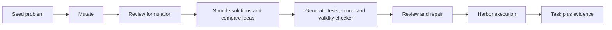
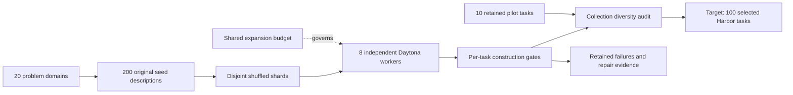

# FrontierSmith: optimization tasks

`optimization_synth / frontiersmith` turns a closed-ended programming problem into
an optimization challenge. Agents submit a reusable Python program; deterministic
private tests measure feasibility and solution quality on a continuous `[0,1]`
scale. A better solution can earn more reward without there being a known optimum.

**Status:** experimental; ten-task local pilot completed on 2026-09-29. This is an owned,
paper-inspired adaptation, not the unreleased upstream generation implementation.
See [RFC 0032](../rfcs/0032-frontiersmith-recipe.md) for exact differences.



## What each prompt does

Every call uses the configured OpenAI model in a separate context. All exact
requests and responses are retained in the campaign; the
[complete prompt reference](prompts/frontiersmith.md) is generated from source.

| Stage | Model receives | Required output and gate |
|---|---|---|
| Mutation | Seed problem and provenance | Public instruction, objective, feasibility, score and simple baseline |
| Formulation review | Design | Approve or list concrete ambiguities and triviality concerns |
| Baseline | Public instruction and simple strategy | Deterministic feasible program |
| Sampled solutions | Public instruction and strategy brief | Three independently authored programs by default |
| Idea divergence | Sample programs | One algorithmic-distinction judgment per pair |
| Test generation | Design and sampled strategies | Seeded generator with 8–16 edge, adversarial and larger cases |
| Scoring | Design and generated tests | Feasibility checker and exact public score calculation |
| Feasibility | Public instruction only | Independent `is_feasible` checker; valid zero-reward solutions remain valid |
| Infrastructure review | Instruction, tests, scorer, validity checker and programs | Approve or route concrete defects to bounded repair |
| Optional rollout | Learner-visible Harbor task only | Independent agent attempt, transcript and observed reward |

Harbor execution itself uses no LLM judge. The no-op must score zero; a sampled
reference must improve on the baseline and repeat its per-case scores. The baseline
and at least two sampled programs must be feasible on every generated case. A
separate boolean validity verdict distinguishes a legal zero score from an invalid
submission. Sample
score vectors must differ (default mean absolute difference of at least 0.001
for at least 30% of sampled pairs). This is a sensitivity threshold on deterministic
scores, not a minimum task reward or a claim about training benefit. A reference score below one is normal. Generated but
rejected artifacts remain in the campaign for diagnosis.

## Run

Install the normal package with cloud and Harbor extras. Set `OPENAI_API_KEY` and
`DAYTONA_API_KEY` through your environment or `.env`. No upstream research package
is installed. Build the wheel after source changes so the remote runtime matches.

```bash
uv sync --extra daytona --extra harbor
uv build --wheel
repo2rlenv campaign init workspace/frontiersmith --budget-usd 30
repo2rlenv workers start --campaign workspace/frontiersmith \
  --provider daytona --name frontiersmith-pilot --reserve-usd 2 \
  --timeout-sec 14400
repo2rlenv pipelines describe optimization_synth --recipe frontiersmith
repo2rlenv generate --config examples/owned-frontiersmith.yaml
```

Use `--resume` only with unchanged settings and resolved prior provider operations.
The CLI shows named stage events; `--json` emits the same events as JSON Lines.
The ledger counts reservations as well as settled spend. Terminate the worker when
finished and reconcile its cost from provider evidence:

```bash
repo2rlenv workers stop workspace/frontiersmith/workers/frontiersmith-pilot.json
repo2rlenv campaign status workspace/frontiersmith
```

## Task and evidence layout

```text
tasks/frontiersmith-<seed>/
  task.toml                  # Harbor configuration, lineage and evaluation label
  instruction.md             # Complete public contract
  environment/Dockerfile     # CPU-only, offline Python runtime
  solution/solve.sh           # Installs the best sampled reference
  solution/solution.py
  tests/test.sh
  tests/grade.py              # Owned process isolation and reward writer
  tests/generator.py          # Private reproducible test instances
  tests/scorer.py             # Feasibility and graded objective
  tests/feasibility.py        # Independently authored validity verdict
  tests/contract.json
```

Each generator is also smoke-tested at the configured seed and its next two
values. This catches seed-dependent construction failures; it does not establish
solver generalization to those extra inputs. Seed-family metadata is carried into
each task so collection diversity can be measured. Exhausted structured-output
repairs reject the candidate and preserve its receipts while later seeds continue.

The campaign separately retains model receipts, review findings, trial results,
per-case score vectors and a `quality.json` for each emitted task. The generic
evaluation label remains `unverified` until the broader review/probe/rollout
evidence required by the repository is established. Construction verification
must not be confused with full quality acceptance.

## Scope, economics and credit

This pilot supports Python standard-library algorithms, not GPU or service tasks.
The existing FrontierSmith release uses C++ and a privileged judge sidecar; this
adapter does not copy or require it. We use original seed descriptions and prompts.

Candidate filtering and repair can dominate cost. Report spend per attempted seed
and per exported task, including rejected candidates, and keep cloud billing
distinct from token estimates. Do not extrapolate ten-task cost without reporting
the observed acceptance fraction. The measured development pilot is below.

Method credit: [FrontierSmith paper](https://arxiv.org/abs/2605.14445),
[upstream repository](https://github.com/FrontierCS/FrontierSmith), and
[provenance](https://github.com/huggingface/Repo2RLEnv/blob/main/src/repo2rlenv/pipelines/recipes/frontiersmith/provenance.md).

## Measured local pilot

**10 selected Harbor tasks from 15 candidate attempts across 14 original seeds.**
Eleven tasks initially exported; one graph-coloring candidate was retained with a
`needs_repair` label after explicit feasibility checks. Ten passed the final
construction profile, with a feasible baseline and at least two fully feasible
sampled programs, no-op zero, baseline improvement, score diversity and repeated
reference scores. All ten parse with Harbor and pass artifact-integrity checks.

| Task | Cases | Baseline | Best sampled reference |
|---|---:|---:|---:|
| bipartite-matching | 13 | 0.894 | 0.916 |
| cache-replacement | 12 | 0.328 | 0.577 |
| edit-distance | 14 | 0.105 | 0.823 |
| load-balancing | 12 | 0.583 | 0.797 |
| matrix-chain | 14 | 0.500 | 0.920 |
| rectangle-packing | 15 | 0.853 | 0.912 |
| set-coverage | 13 | 0.512 | 0.628 |
| spanning-tree | 12 | 0.185 | 0.542 |
| string-compression | 12 | 0.000 | 0.369 |
| topological-order | 12 | 0.000 | 0.638 |

Rewards use different objectives and normalizers; compare strategies within a
task, not scores between these rows. References are feasible sampled solutions,
not proofs of optimality.

A fresh run of the final pipeline generated the set-coverage task, repaired its
test set within the configured allowance, and completed a blind GPT-6 Sol rollout.
The rollout was feasible on all 13 cases and scored **0.628**, matching the sampled
reference. An earlier spanning-tree rollout scored 0.545, but used an earlier
bundle and does not establish rollout validation of the final collection.

All ten remain **`unverified`, stage `construction`**. Broad adversarial testing,
independent quality acceptance and Hub publication have not been completed. The
excluded graph-coloring candidate exposed why reward and feasibility must be
separate: only one sampled strategy was fully valid, and review also found a
seed-dependent generator boundary error.

Recorded OpenAI usage cost was **$5.27**, with **$0.34 estimated Daytona compute**:
**$5.61 total, about $0.56 per selected task**. This includes rejected attempts,
development retries, two rollouts and repeated construction checks. It excludes
interactive assistant usage. These are usage/resource estimates, not invoices.
All three workers were terminated; no unresolved reservations remain.

This was an assisted development campaign with evolving checks, not a controlled
unattended-yield benchmark. Initial export yield was 11/15 (73.3%); final selection
was 10/15 (66.7%). [Machine-readable results and bundle identities](../data/frontiersmith-pilot.json)
record the exact sample. Generated tasks and raw receipts stay in the ignored
campaign directory; the selected archive is `workspace/frontiersmith/frontiersmith-pilot.tar.gz`.

## Expanding the problem range

The expansion uses 200 original OpenAI-authored closed-ended seeds in
`examples/frontiersmith-diverse-seeds.json`, with ten per domain. It covers: network
design, transport, scheduling, allocation, geometry, strings/compression, storage,
query planning, compilers, logic, numerical approximation, combinatorial design,
sequence reordering, energy systems, communication, search structures, image/grid
processing, data representation, software testing and state-space planning.

Seeds include their family and provenance. The mutation stage preserves each
seed's core domain rather than converting unrelated problems into the same generic
selection task. All resulting environments remain Python standard-library coding
challenges with deterministic objectives; domain variety does not imply GPU,
repository-editing or service-based environments.

Independent workers receive disjoint, shuffled seed shards and share one expansion
budget ledger. The expansion cap is the $100 combined allowance minus the pilot's
$5.606553, preserving the settled pilot ledger. Accepted pilot tasks are retained
unchanged. The target is 90 additional construction-checked tasks, followed by a
collection-level diversity audit. Generated campaign files remain ignored.



Parallelism is at the campaign level: each worker runs the same public `generate`
command against its own seed shard and worker receipt. Within a candidate,
independent solution calls can overlap; reference trials run sequentially on that
worker to keep timing comparable. Collection curation is separate from the
single-shard recipe command. Every selected task retains its original executable
bundle hash and construction evidence; the collection audit must not silently
rewrite a tested task.

## Collection review

A collection needs checks beyond one successful construction run:

1. Parse every selected task with Harbor and verify its content identity against
   the recorded trial receipts. Check no-op zero, baseline feasibility, at least
   two feasible samples, improvement and repeated reference scores from per-case
   evidence, not just an aggregate success flag.
2. Review the finished instruction, generator, scorer and feasibility validator in
   a fresh context without the sampled programs. Require a concrete counterexample
   for any reported defect; distinguish limitations from actual contract failures.
3. Compare formulations within each problem family and across mathematical
   summaries. Shared algorithms or topics do not make tasks duplicates; renamed
   decisions, constraints and objectives do. Exact file hashes alone cannot detect
   semantic duplication.
4. Preserve a flagged original with its diagnosis. A repair creates a new bundle,
   with its parent identity recorded, and reruns the construction profile. Do not
   copy old execution evidence onto changed tests or instructions.

For example, an energy-storage task passed its original construction checks but
contained one generated input with simultaneous surplus and demand, contrary to
its public domain. The additional review found that mismatch. A bounded generator
repair corrected the input, preserved the instruction and scoring formula, and
passed fresh no-op, baseline, sample and repeated-reference trials. The original
remains available with a `needs_repair` label. This illustrates why agreement
among sampled programs is useful evidence but does not prove the tests are valid.

These collection checks are an assisted curation step outside the single-shard
`generate` command. They use the same model accounting and remote execution
primitives; their requests, findings and repair receipts remain in the campaign.
They do not upgrade tasks to the broader `verified` label automatically.
