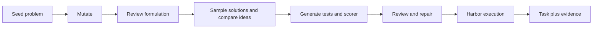

# FrontierSmith: optimization tasks

`optimization_synth / frontiersmith` turns a closed-ended programming problem into
an optimization challenge. Agents submit a reusable Python program; deterministic
private tests measure feasibility and solution quality on a continuous `[0,1]`
scale. A better solution can earn more reward without there being a known optimum.

**Status:** experimental; ten-task pilot in progress. This is an owned,
paper-inspired adaptation, not the unreleased upstream generation implementation.
See [RFC 0032](../rfcs/0032-frontiersmith-recipe.md) for exact differences.



## What each prompt does

Every call uses the configured OpenAI model in a separate context. All exact
requests and responses are retained in the campaign; the
[complete prompt reference](prompts/frontiersmith.md) is generated from source.

| Stage | Model receives | Required output and gate |
|---|---|---|
| Mutation | Seed problem and provenance | Public instruction, objective, feasibility, score and simple baseline |
| Formulation review | Design | Approve or list concrete ambiguities and triviality concerns |
| Baseline | Public instruction and simple strategy | Deterministic feasible program |
| Sampled solutions | Public instruction and strategy brief | Three independently authored programs by default |
| Idea divergence | Sample programs | One algorithmic-distinction judgment per pair |
| Test generation | Design and sampled strategies | Seeded generator with 8–16 edge, adversarial and larger cases |
| Scoring | Design and generated tests | Feasibility checker and exact public score calculation |
| Infrastructure review | Instruction, tests, scorer and programs | Approve or route concrete defects to bounded repair |
| Optional rollout | Learner-visible Harbor task only | Independent agent attempt, transcript and observed reward |

Harbor execution itself uses no LLM judge. The no-op must score zero; a sampled
reference must improve on the baseline and repeat its per-case scores. Sample
score vectors must differ (default mean absolute difference of at least 0.001
for at least 30% of sampled pairs). This is a sensitivity threshold on deterministic
scores, not a minimum task reward or a claim about training benefit. A reference score below one is normal. Generated but
rejected artifacts remain in the campaign for diagnosis.

## Run

Install the normal package with cloud and Harbor extras. Set `OPENAI_API_KEY` and
`DAYTONA_API_KEY` through your environment or `.env`. No upstream research package
is installed. Build the wheel after source changes so the remote runtime matches.

```bash
uv sync --extra daytona --extra harbor
uv build --wheel
repo2rlenv campaign init workspace/frontiersmith --budget-usd 30
repo2rlenv workers start --campaign workspace/frontiersmith \
  --provider daytona --name frontiersmith-pilot --reserve-usd 2 \
  --timeout-sec 14400
repo2rlenv pipelines describe optimization_synth --recipe frontiersmith
repo2rlenv generate --config examples/owned-frontiersmith.yaml
```

Use `--resume` only with unchanged settings and resolved prior provider operations.
The CLI shows named stage events; `--json` emits the same events as JSON Lines.
The ledger counts reservations as well as settled spend. Terminate the worker when
finished and reconcile its cost from provider evidence:

```bash
repo2rlenv workers stop workspace/frontiersmith/workers/frontiersmith-pilot.json
repo2rlenv campaign status workspace/frontiersmith
```

## Task and evidence layout

```text
tasks/frontiersmith-<seed>/
  task.toml                  # Harbor configuration, lineage and evaluation label
  instruction.md             # Complete public contract
  environment/Dockerfile     # CPU-only, offline Python runtime
  solution/solve.sh           # Installs the best sampled reference
  solution/solution.py
  tests/test.sh
  tests/grade.py              # Owned process isolation and reward writer
  tests/generator.py          # Private reproducible test instances
  tests/scorer.py             # Feasibility and graded objective
  tests/contract.json
```

The campaign separately retains model receipts, review findings, trial results,
per-case score vectors and a `quality.json` for each emitted task. The generic
evaluation label remains `unverified` until the broader review/probe/rollout
evidence required by the repository is established. Construction verification
must not be confused with full quality acceptance.

## Scope, economics and credit

This pilot supports Python standard-library algorithms, not GPU or service tasks.
The existing FrontierSmith release uses C++ and a privileged judge sidecar; this
adapter does not copy or require it. We use original seed descriptions and prompts.

Candidate filtering and repair can dominate cost. Report spend per attempted seed
and per exported task, including rejected candidates, and keep cloud billing
distinct from token estimates. Do not extrapolate ten-task cost without reporting
the observed acceptance fraction. Pilot results will be recorded after execution.

Method credit: [FrontierSmith paper](https://arxiv.org/abs/2605.14445),
[upstream repository](https://github.com/FrontierCS/FrontierSmith), and
[provenance](https://github.com/huggingface/Repo2RLEnv/blob/main/src/repo2rlenv/pipelines/recipes/frontiersmith/provenance.md).
