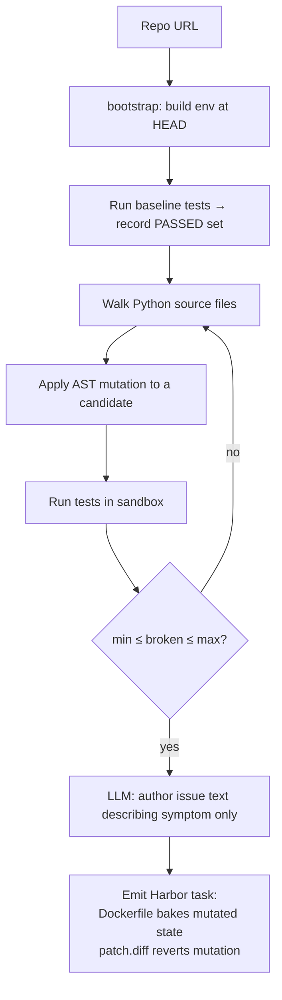

# `mutation_bugs`

SWE-smith-style: deliberately corrupt the code, keep mutations that break ≥1 test.

| | |
|---|---|
| Status | **shipped (v0.6)** — Python only |
| Sandbox required at gen | Yes |
| LLM required at gen | Yes (authors the issue text) |
| Reward kinds emitted | `test_execution`, `diff_similarity` (oracle = inverse mutation) |
| Inspiration | [SWE-smith](https://github.com/SWE-bench/SWE-smith) (NeurIPS '25 Spotlight) |

## Algorithm



1. Clone repo + reuse cached bootstrap image
2. Compute baseline test status once (set of PASSED test names)
3. Walk source files matching `file_glob`, minus `exclude_glob`
4. For each file, try `max_attempts_per_file` mutations (AST operators)
5. Run tests with each mutation applied; compute `broken_tests = pre_pass ∩ post_fail`
6. Accept if `min_tests_broken ≤ |broken| ≤ max_tests_broken`
7. **LLM authors issue text** describing the symptom; system prompt forbids revealing the fix
8. Emit Harbor task: env Dockerfile bakes the mutation (via base64-embedded diff), `solution/patch.diff` is the inverse mutation

## Mutation operators (v0.6)

Pure stdlib (`ast` + `ast.unparse`). Each operator walks the parsed module
and yields one `Mutation` candidate per applicable site.

| Operator | What it does |
|---|---|
| `flip_comparison` | `==` ↔ `!=`, `<` ↔ `>=`, `>` ↔ `<=` |
| `flip_boolean_literal` | `True` ↔ `False` |
| `flip_boolean_op` | `and` ↔ `or` |
| `negate_number` *(planned)* | numeric literal `n` → `-n` |
| `off_by_one` | int `n` → `n + 1` (small positive ints only) |
| `swap_arithmetic` | `+` ↔ `-`, `*` ↔ `/` |
| `invert_if` | `if cond:` → `if not cond:` (swap body/orelse) |

`ast.unparse` doesn't preserve formatting, so the resulting diff rewrites
the whole file. The gold patch.diff still applies cleanly because we
normalize trailing newlines on both sides before computing the diff.

Polyglot support (Java/JS/Go) is on the v0.7 roadmap — needs tree-sitter or
a per-language CST.

## Options

See `MutationBugsOptions` in `src/repo2rlenv/spec/options.py`. Key fields:

| Field | Default | Notes |
|---|---|---|
| `limit` | 50 | max emitted tasks |
| `file_glob` | `**/*.py` | source file glob |
| `exclude_glob` | tests/__init__.py/etc. | never mutate these |
| `operators` | `None` | `None` = use every operator |
| `seed` | `None` | RNG seed for reproducibility |
| `min_tests_broken` | 1 | reject mutations that break 0 tests |
| `max_tests_broken` | 5 | reject catastrophic mutations |
| `max_attempts_per_file` | 5 | give up on a stubborn file |
| `validation_timeout_sec` | 300 | per-candidate test run cap |
| `skip_validation` | `False` | debug; emits raw mutations without LLM call |
| `test_target` | `None` | scope pytest to one file (fast iteration) |

## End-to-end smoke

```bash
repo2rlenv generate \
  --repo pallets/click \
  --pipeline mutation_bugs \
  --pipeline-opt limit=1 \
  --pipeline-opt seed=42 \
  --pipeline-opt test_target=tests/test_arguments.py \
  --llm anthropic/claude-sonnet-4-6 \
  --out ./datasets/click-mut

harbor run -a oracle -p ./datasets/click-mut/<task-id>
# Mean reward 1.000
```

## What we adapted from `references/SWE-smith/`

- Operator naming + intent (CommonPMs enum in `swesmith/bug_gen/procedural/base.py`)
- The "keep mutations where ≥1 test fails AND ≥1 test passes" filter
  (`swesmith/harness/gather.py` lines 333–339)
- The "do not reveal the fix" emphasis in the LLM issue prompt
  (`configs/issue_gen/ig_v2.yaml`)

No code is copied. Implementations are independent Python-stdlib.
