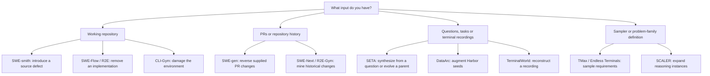
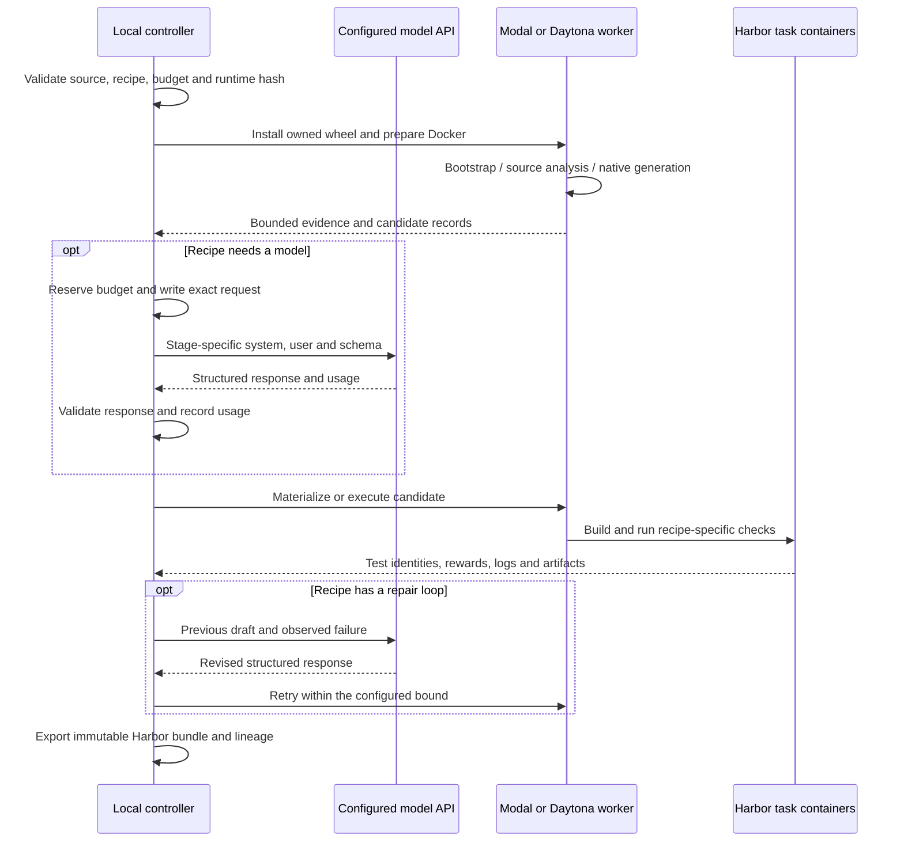
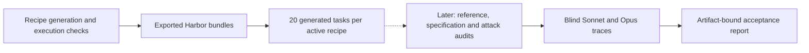

# Owned generation recipes

Owned recipes bring research methods into Repo2RLEnv without installing or cloning
the upstream research implementations at runtime. Each recipe has its own source
pin, notices, algorithm, options and RFC. Harbor and ordinary libraries remain
dependencies. Target repositories are input data and may be cloned remotely.

Start with the input you have. Each walkthrough below explains the algorithm,
numbers every model call, shows retry edges, and links to complete prompts.
The [prompt guide](prompt_reference.md) explains how templates become actual
requests recorded in a campaign.

## Choose a generation route



| Walkthrough | `pipeline.name / recipe` | Input | Reference source |
|---|---|---|---|
| [SWE-smith](repo_mutate.md) | `repo_mutate / swe_smith` | Healthy Python repo | Original source before mutation |
| [SWE-gen](pr_to_env.md) | `pr_to_env / swe_gen` | Explicit merged PR URLs | PR-head implementation |
| [SWE-Flow](repo_reconstruct.md) | `repo_reconstruct / swe_flow` | Healthy Python repo | Original scheduled functions |
| [R2E](r2e.md) | `equivalence_tests / r2e` | Documented repo functions | Original function in private verifier |
| [SWE-Next](swe_next.md) | `pr_runtime / swe_next` | Repository PR history | Post-change source at merge revision |
| [R2E-Gym](r2e_gym.md) | `commit_runtime / r2e_gym` | First-parent history | Post-change source |
| [CLI-Gym](env_repair.md) | `env_repair / cli_gym` | Healthy development environment | Generated, execution-checked recovery |
| [SETA Seed2Synth](terminal_synth.md) | `terminal_synth / seta_seed2synth` | Question/answer records | Generated shell reference |
| [SETA Evol](task_evolve.md) | `task_evolve / seta_evol` | Owned Harbor parents | Generated child reference |
| [DataArc](dataarc.md) | `terminal_synth / dataarc` | Harbor seed tasks | Generated strategy-specific reference |
| [TMax](tmax.md) | `terminal_synth / tmax` | Legacy taxonomy sampler | Generated reference guided by truth/tests |
| [Endless Terminals](endless_terminals.md) | `terminal_synth / endless_terminals` | Category/complexity/scenario sampler | Generated reference guided by truth/tests |
| [TerminalWorld](terminalworld.md) | `terminal_reconstruct / terminalworld` | Metadata and text transcript | Extracted, refined and replayed solution |
| [SCALER](scaler.md) | `reasoning_synth / scaler` | Released family JSON | Answer from supplied reference program |

`pipeline.name` describes the generation family; `recipe` selects its
research-inspired implementation. Existing native behavior remains available
without a recipe. These 14 recipes are experimental. SEC-bench is deferred and
excluded from the current campaign.

```bash
repo2rlenv pipelines list
repo2rlenv pipelines describe repo_mutate --recipe swe_smith --json
```

The catalog distinguishes **planned** methods from executable **experimental**
implementations. An executable recipe is not a claim of training-quality output.
The approved sequence and expansion policy are in [RFC 0011](../rfcs/0011-owned-recipes.md).

## Where each stage runs



This shows execution boundaries, not one universal stage order. Historical
recipes establish contrast before instruction writing; TerminalWorld replays
before test writing; SCALER has no model stage. SWE-smith's fresh Harbor checks
are a separate campaign step. Follow each method's diagram for its exact order.

The controller performs metadata acquisition, parsing, model calls, accounting
and file assembly. Image builds and target/generated-code execution happen
remotely. Repository profiles reuse `ensure_bootstrap` with an explicit Dockerfile
and its cache, without the bootstrap LLM agent. Terminal builders generate their
task-specific setup and fixtures as part of the recipe. Dependencies are installed
before the learner runs offline.

## What a task contains

```text
<task-name>/
  instruction.md             # Learner request
  task.toml                  # Harbor runtime, resources and artifacts
  environment/
    Dockerfile               # Starting state and build-time dependencies
    ...                      # Repository snapshot or fixtures
  solution/
    solve.sh                 # Private reference entrypoint
    ...                      # Original source, recovery script or answer
  tests/
    test.sh                  # Trusted verifier entrypoint
    ...                      # Tests, expected identities and reward code
    Dockerfile               # When using a separate verifier environment
```

The bundle is not copied wholesale into the learner container. Harbor uses its
environment, solution and tests in their respective phases. Model receipts and
generation traces stay outside it.

| Verification shape | Recipes | Current reward |
|---|---|---|
| Collect allowed source into a separate verifier | SWE-smith, SWE-gen, SWE-Flow, R2E, SWE-Next, R2E-Gym | Required tests pass with expected nonempty identities; binary 0/1 |
| Inspect terminal state with generated pytest tests | SETA, DataArc, TMax, Endless Terminals, TerminalWorld | All required tests pass; binary 0/1. Recorded weights do not make the current grader fractional. |
| Check environment restoration | CLI-Gym | Healthy tests restored and protected source preserved; binary 0/1 |
| Collect answer file into a separate verifier | SCALER | Native answer equivalence; −1/+1 |

Generation checks establish runnable tasks and references. Independent
instructional-quality and adversarial review remain a later phase.

## Accounting and workers

Initialize an explicit budget once. Reinitializing with a different amount is
rejected. Unknown model/provider outcomes retain their reservation; completed
calls are accounted using recorded usage estimates rather than counted twice.

```bash
repo2rlenv campaign init workspace/my-campaign --budget-usd 25
repo2rlenv workers start --campaign workspace/my-campaign --provider modal \
  --name my-worker --reserve-usd 3 --timeout-sec 3600
repo2rlenv workers probe workspace/my-campaign/workers/my-worker.json \
  --out workspace/my-campaign/probes/first
repo2rlenv campaign status workspace/my-campaign --json
repo2rlenv workers stop workspace/my-campaign/workers/my-worker.json
```

Stopping a worker confirms cleanup but does not invent a bill. Reconcile a
reservation with a usage/billing receipt or a clearly labelled conservative
estimate:

```bash
repo2rlenv campaign settle workspace/my-campaign --operation worker:modal:my-worker \
  --cost-usd 0.30 --evidence workspace/my-campaign/worker-usage.json
```

The amount above illustrates the command; it is not a price quotation. Include
failed requests, image builds and runtime in campaign accounting. Model receipts
record requests, responses, schema, usage and the cost basis. Keep these private
review artifacts outside learner-visible task directories.

Modal workers run Docker inside a VM. Daytona workers use its image build and
Docker-in-Docker facilities; account limits can differ. Modal's timeout is a
maximum lifetime. Daytona's configured auto-stop is an **idle** timeout, and the
owned controller additionally stops dispatch after the recorded execution window.
Always terminate workers explicitly after use; there is no local Docker fallback.

## Output and acceptance

The current integration milestone is **20 generated tasks per method**, with
remote execution and reference checks. Detailed attack and blind-rollout audits
follow that generation milestone; they do not block implementing the next recipe.
This sequencing does not change what a later quality-accepted label means.



Generation reports attempted and exported counts. Acceptance requires every
mandatory quality criterion to pass with evidence for the current bundle hash;
missing checks, failed checks and evidence for an older revision are not passes.
Solver failure alone does not invalidate a task. The initial owned implementation
is still collecting these audits; its generated tasks are labelled **exported**.

Harbor 0.20.0 parses the emitted schema 1.3 tasks. Some worker kernels do not
support Harbor's nftables-based dynamic firewall. The owned
`repo2rlenv.execution.harbor_offline:OfflineDockerEnvironment` adapter supports
Linux Dockerfile tasks that remain offline in every phase, using Docker's
`network_mode: none`. It rejects allowlists, network transitions and task-defined
extra services. Other task shapes require another verified runtime route.

Implemented recipe guides: [SWE-smith](repo_mutate.md), [SETA Seed2Synth](terminal_synth.md),
[SETA Evol](task_evolve.md), [SWE-gen](pr_to_env.md), [SWE-Flow](repo_reconstruct.md)
and [R2E](r2e.md), plus [TMax](tmax.md) and
[Endless Terminals](endless_terminals.md), [TerminalWorld](terminalworld.md),
[CLI-Gym](env_repair.md), [DataArc](dataarc.md), [SWE-Next](swe_next.md), and [R2E-Gym](r2e_gym.md).
[SCALER](scaler.md) adds algorithmic reasoning instances from released families.
The active campaign covers these 14 recipes. SEC-bench remains a deferred design
and is excluded from this integration milestone. Campaigns are still collecting
generated outputs.

## Contract references

- [Harbor tasks](https://www.harborframework.com/docs/tasks), validated against the installed 0.20.0 task models and trial implementation.
- [Modal VM sandboxes](https://modal.com/docs/guide/vm-sandboxes).
- [Daytona sandbox management](https://www.daytona.io/docs/en/sandbox-management/).
- [LiteLLM structured outputs](https://docs.litellm.ai/docs/completion/json_mode) and [Anthropic mapping](https://docs.litellm.ai/docs/providers/anthropic).
