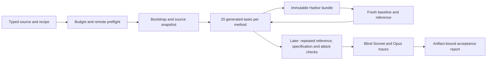

# Owned generation recipes

Owned recipes bring research methods into Repo2RLEnv without installing or cloning
the upstream research implementations at runtime. Each recipe has its own source
pin, notices, algorithm, options and RFC. Harbor and ordinary libraries remain
dependencies. Target repositories are input data and may be cloned remotely.

```bash
repo2rlenv pipelines list
repo2rlenv pipelines describe repo_mutate --recipe swe_smith --json
```

The catalog distinguishes **planned** methods from executable **experimental**
implementations. An executable recipe is not a claim of training-quality output.
The approved sequence and expansion policy are in [RFC 0011](../rfcs/0011-owned-recipes.md).

## Accounting and workers

Initialize an explicit budget once. Reinitializing with a different amount is
rejected. Unknown model/provider outcomes retain their reservation; completed
calls are accounted using recorded usage estimates rather than counted twice.

```bash
repo2rlenv campaign init workspace/my-campaign --budget-usd 25
repo2rlenv workers start --campaign workspace/my-campaign --provider modal \
  --name my-worker --reserve-usd 3 --timeout-sec 3600
repo2rlenv workers probe workspace/my-campaign/workers/my-worker.json \
  --out workspace/my-campaign/probes/first
repo2rlenv campaign status workspace/my-campaign --json
repo2rlenv workers stop workspace/my-campaign/workers/my-worker.json
```

Stopping a worker confirms cleanup but does not invent a bill. Reconcile a
reservation with a usage/billing receipt or a clearly labelled conservative
estimate:

```bash
repo2rlenv campaign settle workspace/my-campaign --operation worker:modal:my-worker \
  --cost-usd 0.30 --evidence workspace/my-campaign/worker-usage.json
```

The amount above illustrates the command; it is not a price quotation. Include
failed requests, image builds and runtime in campaign accounting. Model receipts
record requests, responses, schema, usage and the cost basis. Keep these private
review artifacts outside learner-visible task directories.

Modal workers run Docker inside a VM. Daytona workers use its image build and
Docker-in-Docker facilities; account limits can differ. Modal's timeout is a
maximum lifetime. Daytona's configured auto-stop is an **idle** timeout, and the
owned controller additionally stops dispatch after the recorded execution window.
Always terminate workers explicitly after use; there is no local Docker fallback.

## Output and acceptance

The current integration milestone is **20 generated tasks per method**, with
remote execution and reference checks. Detailed attack and blind-rollout audits
follow that generation milestone; they do not block implementing the next recipe.
This sequencing does not change what a later quality-accepted label means.



Generation reports attempted and exported counts. Acceptance requires every
mandatory quality criterion to pass with evidence for the current bundle hash;
missing checks, failed checks and evidence for an older revision are not passes.
Solver failure alone does not invalidate a task. The initial owned implementation
is still collecting these audits; its generated tasks are labelled **exported**.

Harbor 0.20.0 parses the emitted schema 1.3 tasks. Some worker kernels do not
support Harbor's nftables-based dynamic firewall. The owned
`repo2rlenv.execution.harbor_offline:OfflineDockerEnvironment` adapter supports
Linux Dockerfile tasks that remain offline in every phase, using Docker's
`network_mode: none`. It rejects allowlists, network transitions and task-defined
extra services. Other task shapes require another verified runtime route.

Implemented recipe guides: [SWE-smith](repo_mutate.md), [SETA Seed2Synth](terminal_synth.md),
[SETA Evol](task_evolve.md), [SWE-gen](pr_to_env.md), [SWE-Flow](repo_reconstruct.md)
and [R2E](r2e.md), plus [TMax](tmax.md) and
[Endless Terminals](endless_terminals.md), [TerminalWorld](terminalworld.md),
[CLI-Gym](env_repair.md), and [DataArc](dataarc.md).
Campaigns are still collecting generated outputs.

## Contract references

- [Harbor tasks](https://www.harborframework.com/docs/tasks), validated against the installed 0.20.0 task models and trial implementation.
- [Modal VM sandboxes](https://modal.com/docs/guide/vm-sandboxes).
- [Daytona sandbox management](https://www.daytona.io/docs/en/sandbox-management/).
- [LiteLLM structured outputs](https://docs.litellm.ai/docs/completion/json_mode) and [Anthropic mapping](https://docs.litellm.ai/docs/providers/anthropic).
