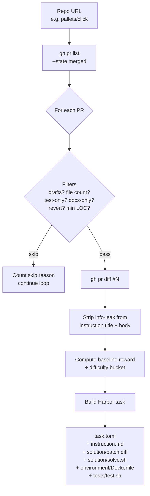

# `pr_diff`

**SWE-RL-inspired PR mining with a Harbor-runnable multi-component verifier.** Each emitted task is a real merged GitHub PR; the agent edits the repo and the verifier scores the diff with five deterministic components plus an LLM-as-judge.

| | |
|---|---|
| Status | **implemented** |
| Sandbox required at gen | No (text-only generation; verifier runs in a thin `python:3.12-slim` container) |
| LLM required at gen | No |
| LLM required at verify | Optional — falls back to deterministic-only when no API key |
| Reward kinds emitted | `diff_similarity` (scored via the 6-component verifier — see below) |
| Inspiration | [SWE-RL](https://github.com/facebookresearch/swe-rl) (Meta, NeurIPS '25) |
| Implementation | [`src/repo2rlenv/pipelines/pr_diff.py`](../../src/repo2rlenv/pipelines/pr_diff.py), [`src/repo2rlenv/pipelines/_pr_diff_verifier.py`](../../src/repo2rlenv/pipelines/_pr_diff_verifier.py) |
| Options model | [`PRDiffOptions`](../../src/repo2rlenv/spec/options.py) |
| Reference dataset | [`AdithyaSK/repo2rlenv-pr-diff`](https://huggingface.co/datasets/AdithyaSK/repo2rlenv-pr-diff) on HF Hub |

## What it does



For each merged PR within scope:

1. List PRs via `gh pr list`, apply structural filters (date, draft, file count) + quality filters (drop test-only, docs-only, reverts, trivially-small diffs).
2. Fetch the unified diff via `gh pr diff`.
3. Strip leakage patterns from the PR title + body (eight pattern families — see [Instruction info-leak strip](#instruction-info-leak-strip) below).
4. Compute the **calibration baseline** (the score an empty patch would get against this oracle) and the **difficulty bucket** by LOC changed.
5. Emit a Harbor-spec task: `instruction.md`, `solution/{patch.diff, solve.sh}`, `environment/Dockerfile`, `tests/test.sh`, `task.toml`.

The environment is a thin, **agent-agnostic** `python:3.12-slim` image with git + the repo checked out at `base_commit` — no agent CLI is pre-installed. Harbor's agent adapter (`-a claude-code`, `-a openhands`, `-a codex`, `-a aider`, …) drops in the runtime its agent needs when the container starts. The verifier (`tests/test.sh`) runs after the agent and computes the [multi-component reward](#multi-component-reward).

**Private repos** work the same way — the Dockerfile clones via an optional `GITHUB_TOKEN` build arg. Public repos need nothing; for a private source, the consumer passes `--build-arg GITHUB_TOKEN=$GITHUB_TOKEN` to `harbor run`. The token is used only for the clone and the remote is scrubbed afterward, so it never persists in the image. See [`reference/AUTH.md`](../reference/AUTH.md#private-repos-at-task-build-time).

## Multi-component reward

The verifier captures the agent's edits as a unified diff against `base_commit`, then scores it against the oracle (gold) diff using **six components, weighted sum**:

| Component | Range | Default weight | What it captures |
|---|:--:|--:|---|
| `format_valid` | 0 or 1 | 0.00 | Does the predicted text parse as a unified diff? Always 1 for the `claude-code` adapter — kept as a guard, weight 0 because it carries no discriminative signal. |
| `size_sanity` | [0, 1] | 0.08 | `min(oracle_loc, predicted_loc) / max(...)`. Catches "rampage through the codebase" and "no-op" failure modes. |
| `file_targeting` | [0, 1] | 0.12 | F1 over the changed-file sets (not Jaccard — missing an oracle file is worse than touching one extra). |
| `region_overlap` | [0, 1] | 0.20 | For each oracle hunk, did the predicted diff edit a line within 5 lines of that hunk in the same file? Strongest spatial-localization signal. |
| `similarity` | [0, 1] | 0.10 | `difflib.SequenceMatcher` ratio over `+`/`-` lines only (no free credit for unchanged context). |
| `llm_judge` | [0, 1] or null | 0.50 | Haiku rates "does this patch logically address the issue described?" Most informative semantic signal. Null on missing API key / network error → remaining weights are re-normalized. |

Final reward is clipped to `[0, 1]`. A **catastrophic-size hard cap** clamps the final to ≤ 0.40 when `size_sanity < 0.10` — stops a charitable judge from inflating scores on patches that are wildly the wrong size.

The verifier writes both `/logs/verifier/reward.txt` (single float, Harbor reads this) and `/logs/verifier/reward.json` (full breakdown for downstream inspection / re-weighting).

Weights are overridable per-task via `task.toml.metadata` or per-run via `R2E_W_{FORMAT,SIZE,FILE,REGION,SIM,JUDGE}` env vars passed to `harbor run --ve`.

### Calibration baseline

Each task carries `task.toml.metadata.repo2env.reward_calibration.baseline_reward` — the reward an empty predicted diff would get against this oracle. Consumers can normalize:

```
calibrated = (raw - baseline) / (1 - baseline)
```

`calibrated < 0` means the agent did *worse* than no-op. Useful for cross-task comparability since trivial 5-line fixes and 200-line refactors are no longer the same number.

### Difficulty bucketing

Each task carries `task.toml.metadata.difficulty` ∈ `{easy, small, medium, large}` based on oracle LOC changed (≤ 5, 6 – 20, 21 – 80, > 80 respectively), plus a raw `loc_changed` int. Lets training scripts weight or filter by difficulty.

## Instruction info-leak strip

PR descriptions often contain pointers to the answer. The pipeline strips eight pattern families from instructions before they reach the agent:

| Pattern | Example |
|---|---|
| Multi-issue closes | `Closes #42`, `Fixes #1, #2, #3` |
| `See` / `refs` / `follow-up to` linkbacks | `See #99`, `Follow-up to PR #42` |
| Markdown issue links | `[#1234](https://github.com/x/y/issues/1234)` |
| Closes with markdown-link refs | `Closes [#1234](url)` |
| Descriptive markdown links to GH URLs | `[my analysis](https://github.com/x/y/pull/1234)` |
| Bare GitHub URLs | `https://github.com/foo/bar/pull/42`, also `redirect.github.com` |
| Commit trailers | `Co-authored-by:`, `Signed-off-by:` |
| Title squash suffix | `Fix the bug (#1234)`, `(fixes #1800)` |

Composite patterns are stripped before piece-wise patterns so we don't leave orphaned `Closes ` keywords or empty `[text]()` markdown brackets behind.

## Options

```python
class PRDiffOptions(BaseModel):
    limit: int = 50
    since: date | None = None
    until: date | None = None
    state: Literal["merged", "all"] = "merged"
    diff_format: Literal["unified", "search_replace"] = "unified"
    max_files_per_pr: int = 5
    skip_drafts: bool = True
    emit_harbor_env: bool = True
    min_loc_changed: int = 3
```

| Field | Default | Notes |
|---|---|---|
| `limit` | `50` | Max tasks emitted (over-fetched ~3× client-side to allow filtering). |
| `since` / `until` | `None` | ISO date bounds applied to `mergedAt`. |
| `state` | `"merged"` | Currently only `merged` is supported. |
| `max_files_per_pr` | `5` | Drops sweeping refactors. |
| `skip_drafts` | `True` | Drops draft PRs. |
| `emit_harbor_env` | `True` | Emits `environment/Dockerfile` + `tests/test.sh` so `harbor run` works directly. Set False for the v0.1-style text-only output. |
| `min_loc_changed` | `3` | Reject PRs whose oracle diff has fewer `+`/`-` lines than this — too trivial to be a meaningful task. |

### Skip reasons

A PR may not become a task. The pipeline records counts per reason:

| Reason | Meaning |
|---|---|
| `draft` | `pr.is_draft and skip_drafts=True` |
| `no_files` / `too_many_files` | Outside `max_files_per_pr` |
| `not_merged` | No `mergedAt` timestamp |
| `empty_diff` | `gh pr diff` returned an empty string |
| `diff_fetch_failed` | `gh pr diff` raised |
| `test_only_diff` | 100% of touched files are test files |
| `docs_only_diff` | 100% of touched files are `.md` / `.rst` / `docs/` |
| `revert_pr` | Title starts with `Revert ` |
| `diff_too_small` | Fewer than `min_loc_changed` `+`/`-` lines |
| `instruction_too_thin` | Empty body + short title after info-leak strip |

## Example invocations

### CLI

```bash
# Generate one env from a single repo
repo2rlenv generate \
  --repo pallets/click \
  --pipeline pr_diff \
  --pipeline-opt limit=5 \
  --out ./datasets/click-prdiff

# Run it through harbor with the oracle adapter (must score reward=1.0)
harbor run -p ./datasets/click-prdiff -a oracle --env docker -n 1

# Run it through harbor with a real agent.
# The verifier's LLM judge also needs an API key — pass via --ve so it
# reaches the verifier container (the --ae key only reaches the agent).

# Example 1: claude-code + Sonnet 4.6 (what we used to verify the
# reference dataset).
harbor run \
  -p ./datasets/click-prdiff \
  -a claude-code -m anthropic/claude-sonnet-4-6 \
  --ak max_budget_usd=2.00 --ak max_turns=30 \
  --ae ANTHROPIC_API_KEY=$ANTHROPIC_API_KEY \
  --ve ANTHROPIC_API_KEY=$ANTHROPIC_API_KEY \
  --env docker -n 1

# Example 2: same env, different agent — openhands + GPT-4o.
harbor run \
  -p ./datasets/click-prdiff \
  -a openhands -m openai/gpt-4o \
  --ae OPENAI_API_KEY=$OPENAI_API_KEY \
  --ve ANTHROPIC_API_KEY=$ANTHROPIC_API_KEY \
  --env docker -n 1

# Harbor ships 25+ agent harnesses you can swap in here:
#   claude-code · openhands / openhands-sdk · codex · aider · gemini-cli
#   copilot-cli · opencode · cursor-cli · qwen-coder · kimi-cli · goose
#   mini-swe-agent · swe-agent · nemo-agent · terminus-2 · trae-agent · ...
# Each one expects its own provider env var via `--ae`. Run
# `harbor run --help` to see the full list.

# Generate locally, then push to HF Hub
repo2rlenv push ./datasets/click-prdiff <your-org>/<dataset-name>
```

### Python

```python
from pathlib import Path
from repo2rlenv.spec.input import (
    GenerationInput, RepoSpec, PipelineSpec, OutputSpec, PipelineName,
)
from repo2rlenv.spec.options import PRDiffOptions
from repo2rlenv.pipelines.pr_diff import PRDiffPipeline

g = GenerationInput(
    repo=RepoSpec(url="pallets/click", access="auto"),
    pipeline=PipelineSpec(name=PipelineName.PR_DIFF, options={}),
    output=OutputSpec(destination="./out", org="myorg", dataset_name="click-prdiff"),
)
options = PRDiffOptions(limit=5, max_files_per_pr=10)

pipeline = PRDiffPipeline(g, options)
result = pipeline.run(Path("./out"))

print(result.candidates, result.emitted, result.skip_reasons)
```

## Pulling the reference dataset

A verified reference dataset is published on HF Hub:

**<https://huggingface.co/datasets/AdithyaSK/repo2rlenv-pr-diff>**

```bash
repo2rlenv pull AdithyaSK/repo2rlenv-pr-diff /tmp/pr_diff-ref
repo2rlenv validate /tmp/pr_diff-ref

# Smoke-check with the oracle (must score reward=1.0)
harbor run -p /tmp/pr_diff-ref -a oracle --env docker -n 1
```

You can also browse it interactively via the Harbor Visualiser badge on the dataset card.

## `[metadata.repo2env]` schema

Each emitted task carries:

```toml
[metadata.repo2env]
pipeline = "pr_diff"
pipeline_version = "0.3.0"
repo = "pallets/click"
ref = "<base_commit_sha>"
reference = "https://github.com/pallets/click/pull/3508"
built_at = "2026-05-26T..."
reward_kinds = ["diff_similarity"]

[metadata.repo2env.pr_diff]
pr_merged_at = "2026-05-23T..."
diff_format = "unified"
context_files = ["src/click/shell_completion.py", "tests/test_shell_completion.py"]

[metadata.repo2env.reward_calibration]
baseline_reward = 0.0
loc_changed = 95
difficulty = "large"
```

## Consuming the reward at training time

Two paths:

**(a) Per-task reward via Harbor.** Use `harbor run` against the emitted task directory. The verifier writes `reward.txt` (single float) and `reward.json` (full breakdown). This is the production path for evals.

**(b) Pure-text reward for SWE-RL-style training rollouts.** Score a candidate prediction against the oracle directly:

```python
from repo2rlenv.reward import calculate_diff_similarity_reward

oracle = (task_dir / "solution" / "patch.diff").read_text()
reward, meta = calculate_diff_similarity_reward(oracle, prediction_diff)
```

This is the (single-component, dense) signal SWE-RL trained on. For higher fidelity, run the predicted diff through the same six-component verifier — it's a pure-stdlib module at [`_pr_diff_verifier.py`](../../src/repo2rlenv/pipelines/_pr_diff_verifier.py) that can be imported directly.

## Acknowledgments

The text-only PR-as-task formulation + the diff-similarity reward shape are inspired by **SWE-RL** (Wei et al., NeurIPS '25, arXiv:2502.18449). The LLM-as-judge component follows the constitutional-AI / RLAIF pattern. No code is copied from SWE-RL; the reward function is an independent reimplementation against the Python standard library and is released under Apache-2.0.
