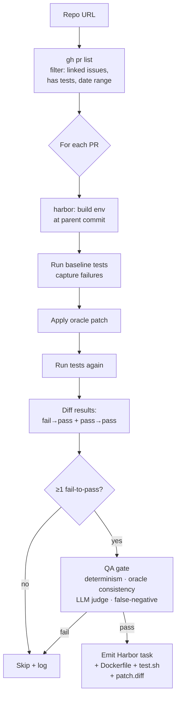

# `pr_mining`

Full SWE-bench-style PR mining. Builds a Docker env per task, runs the test suite, identifies fail-to-pass tests as the verifier oracle.

| | |
|---|---|
| Status | **planned** |
| Sandbox required at gen | Yes (Docker / Modal / E2B / Daytona) |
| LLM required at gen | Optional (instruction polish, QA judge) |
| Reward kinds emitted | `test_execution`, `diff_similarity` |
| Inspiration | [SWE-bench](https://github.com/SWE-bench/SWE-bench) (Princeton) |
| Reference clone | `references/SWE-bench/` |

## Algorithm sketch



1. Clone repo at base commit
2. List merged PRs (same `gh pr list` path as `pr_mining_lite`)
3. For each PR: build a Docker env at the parent commit using a per-language template
4. Apply the oracle patch in the container, run the test suite
5. Identify **fail-to-pass** tests (failed before the patch, pass after) and **pass-to-pass** tests (regression guard)
6. Emit a Harbor task: `task.toml` + `instruction.md` + `environment/Dockerfile` + `tests/test.sh` + `solution/patch.diff`
7. QA gate: determinism + oracle consistency + LLM judge + false-negative filter (the SWE-Bench++ four-layer recipe)

## Difference vs `pr_mining_lite`

`pr_mining_lite` skips steps 3–5 entirely. The full pipeline is what gives you `test_execution` reward — actually running the tests in a sandbox to get a binary pass/fail signal.

## Prerequisite: bootstrap

Before this pipeline runs, the **bootstrap phase** must have produced a working Docker image for the repo (an LLM agent iterates on the Dockerfile via [RepoLaunch](https://github.com/microsoft/RepoLaunch)). Bootstrap runs once per `(repo, ref)` and is cached. See [`docs/BOOTSTRAP.md`](../BOOTSTRAP.md) for the full design. Implicit: triggered automatically on cache miss. Explicit: run `repo2rlenv bootstrap --repo ... --out ./envs/foo/` first, then `repo2rlenv generate --pipeline pr_mining --env-from ./envs/foo/`.

## Options (planned)

```python
class PRMiningOptions(BaseModel):
    limit: int = 100
    since: date | None = None
    until: date | None = None
    require_linked_issue: bool = True
    min_test_count: int = 1
    languages: list[str] = ["python"]
    base_image_template: str | None = None  # override per-language Dockerfile template
```

## `[metadata.repo2env.pr_mining]` schema (planned)

```toml
[metadata.repo2env.pr_mining]
pr_merged_at = "..."
fail_to_pass = ["test_foo", "test_bar"]
pass_to_pass = ["test_baz"]
linked_issue = "https://github.com/.../issues/123"
```

## What we'd reuse from `references/SWE-bench/`

- `swebench/harness/` — the env-build + run-tests primitives
- The per-repo install scripts encoded in their dataset
- The instance-specification format (we map it to Harbor)

We won't depend on the `swebench` PyPI package directly — its harness is tightly coupled to their dataset format. We'd port the env-build logic and emit Harbor.

## Open questions

- How polyglot? v0.x ships Python; Multi-SWE-bench's templates are the obvious source for JS/TS/Go/Rust/Java/C/C++ extension.
- How much do we lean on `RepoLaunch` (Microsoft) for env-build vs roll our own?
