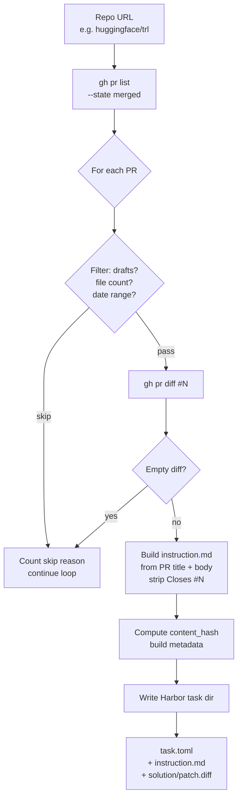

# `pr_mining_lite`

**SWE-RL-inspired text-only PR mining.** No Docker, no test execution at generation time.

| | |
|---|---|
| Status | **implemented** in v0.1 |
| Sandbox required at gen | No |
| LLM required at gen | No (LLM optional for instruction polish — not used in v0.1) |
| Reward kinds emitted | `diff_similarity` |
| Inspiration | [SWE-RL](https://github.com/facebookresearch/swe-rl) (Meta, NeurIPS '25) |
| Reference clone | `references/swe-rl/` |
| Implementation | [`src/repo2rlenv/pipelines/pr_mining_lite.py`](../../src/repo2rlenv/pipelines/pr_mining_lite.py) |
| Options model | [`PRMiningLiteOptions`](../../src/repo2rlenv/spec/options.py) |

## What it does



For each merged PR within scope:

1. List PRs via `gh pr list` (`gh` CLI), filter by date / draft / file count
2. For each candidate PR, fetch the unified diff via `gh pr diff`
3. Build instruction text from the PR title + description (strips `Closes #N` boilerplate)
4. Emit a Harbor task: `task.toml` + `instruction.md` + `solution/patch.diff`

No environment is built. No tests are run. Verification is purely diff-similarity against the stored oracle when consumers train or evaluate.

## Why "lite"

SWE-RL's key insight: you don't need to *execute* a PR's tests to get a useful training signal. The merged diff itself is high-quality ground truth — a sequence-similarity reward against the oracle is dense, fast, and scales to thousands of tasks per repo without provisioning containers.

Trade-off vs full `pr_mining`:

| | `pr_mining_lite` | `pr_mining` |
|---|---|---|
| Captures | code context + oracle diff | Dockerfile + tests + oracle + instruction |
| Reward at training | `diff_similarity` (dense, no exec) | `test_execution` (binary, exec required) |
| Cost per task | Low (text only) | High (Docker build + test run) |
| Yield per repo | High (any merged PR) | Lower (must build cleanly) |
| Use case | RL warm-up, large-scale signal | RL final-stage, eval |

## Options

```python
class PRMiningLiteOptions(BaseModel):
    limit: int = 50
    since: date | None = None
    until: date | None = None
    state: Literal["merged", "all"] = "merged"
    context_window_loc: int = 200
    diff_format: Literal["unified", "search_replace"] = "unified"
    max_files_per_pr: int = 5         # skip mega-PRs
    skip_drafts: bool = True
```

| Field | Default | Notes |
|---|---|---|
| `limit` | `50` | Max tasks emitted (over-fetched 3× client-side to allow filtering) |
| `since` / `until` | `None` | ISO date bounds applied to `mergedAt` |
| `state` | `"merged"` | Currently only `merged` is supported |
| `max_files_per_pr` | `5` | Drops sweeping refactors (heuristic for noise control) |
| `skip_drafts` | `True` | Drops PRs marked as drafts |
| `context_window_loc` | `200` | Reserved — not yet used in v0.1 |
| `diff_format` | `"unified"` | Reserved — `search_replace` reformatting not yet implemented |

## `[metadata.repo2env.pr_mining_lite]` schema

Each emitted task carries this subtable inside `task.toml`:

```toml
[metadata.repo2env.pr_mining_lite]
pr_merged_at = "2026-05-05T13:46:07Z"
diff_format = "unified"
context_files = ["trl/trainer/dpo_trainer.py", "trl/trainer/_utils.py"]
```

The standard `[metadata.repo2env]` parent subtable also carries `pipeline = "pr_mining_lite"`, `repo`, `ref` (base commit SHA), `reference` (PR URL), `source_access`, `built_at`, and `content_hash`.

## Skip reasons

A PR may not become a task. The pipeline records counts of each skip reason in the result:

| Reason | Meaning |
|---|---|
| `draft` | `pr.is_draft and skip_drafts=True` |
| `no_files` | PR touches zero files (rare) |
| `too_many_files` | Exceeds `max_files_per_pr` |
| `not_merged` | No `mergedAt` timestamp despite filter |
| `empty_diff` | `gh pr diff` returned an empty string |
| `diff_fetch_failed` | `gh pr diff` raised |

## Example invocations

### CLI

```bash
# Local generation
repo2rlenv generate \
  --repo huggingface/trl \
  --pipeline pr_mining_lite \
  --pipeline-opt limit=5 \
  --pipeline-opt max_files_per_pr=10 \
  --llm anthropic/claude-sonnet-4-6 \
  --out ./datasets/trl-r2e

# Generate AND push to HF Hub in one command
repo2rlenv generate \
  --repo huggingface/trl \
  --pipeline pr_mining_lite \
  --pipeline-opt limit=5 \
  --llm anthropic/claude-sonnet-4-6 \
  --out hf://AdithyaSK/trl-r2e-v0-1 \
  --org AdithyaSK --dataset-name trl-r2e-v0-1 \
  --visibility public
```

### Python

```python
from pathlib import Path
from repo2rlenv.spec.input import (
    GenerationInput, RepoSpec, PipelineSpec, LLMSpec, OutputSpec, PipelineName,
)
from repo2rlenv.spec.options import PRMiningLiteOptions
from repo2rlenv.pipelines.pr_mining_lite import PRMiningLitePipeline

g = GenerationInput(
    repo=RepoSpec(url="huggingface/trl", access="auto"),
    pipeline=PipelineSpec(name=PipelineName.PR_MINING_LITE, options={}),
    llm=LLMSpec(provider="anthropic", model="claude-sonnet-4-6"),
    output=OutputSpec(destination="./out", org="myorg", dataset_name="trl-r2e"),
)
options = PRMiningLiteOptions(limit=5, max_files_per_pr=10)

pipeline = PRMiningLitePipeline(g, options)
result = pipeline.run(Path("./out"))

print(result.candidates, result.emitted, result.skip_reasons)
```

## Consuming a `pr_mining_lite` dataset

The oracle is at `solution/patch.diff` in every task. Score a candidate prediction with:

```python
from repo2rlenv.reward import calculate_diff_similarity_reward

oracle = (task_dir / "solution" / "patch.diff").read_text()
reward, meta = calculate_diff_similarity_reward(oracle, prediction_diff)
```

Or via CLI:

```bash
repo2rlenv reward --task ./out/<task-id> --prediction ./candidate.diff
```

That's the full consumer-side loop for a lite task — no Docker, no sandbox needed. If you want to actually *exercise* an agent against the repo (clone, edit, capture diff), spin up your own sandbox or use `harbor run` once we ship the full `pr_mining` variant.

## Limitations (v0.1)

- LLM is wired but unused — instruction text is built deterministically from PR body
- `context_window_loc` and `search_replace` diff format aren't yet honored
- No token counting or LLM cost guardrails (irrelevant in v0.1 since LLM isn't called)
- Skipped PRs are counted but their diffs aren't logged anywhere

## Verified live

This pipeline shipped the dataset at [`AdithyaSK/trl-r2e-v0-1`](https://huggingface.co/datasets/AdithyaSK/trl-r2e-v0-1) — 5 tasks from `huggingface/trl`, both publicly served via Harbor's `registry.json` format and self-tested in E2B with reward = 1.0 (oracle vs oracle).
