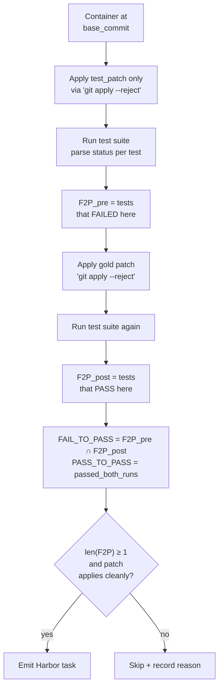

# `pr_runtime`

SWE-bench-style PR mining with sandbox-verified oracles. Each task carries a `FAIL_TO_PASS` set (the tests that prove the bug existed) and a `PASS_TO_PASS` set (regression guard); reward is binary on whether both pass after the model patch is applied.

| | |
|---|---|
| Status | **shipped (v0.3)** |
| Sandbox required at gen | Yes — Docker via the [bootstrap phase](../reference/BOOTSTRAP.md) |
| LLM required at gen | Optional (instruction polish, QA judge) |
| Reward kinds emitted | `test_execution` (primary), `diff_similarity` (fallback) |
| Inspiration | [SWE-bench](https://github.com/SWE-bench/SWE-bench) (Princeton) + [SWE-bench-Live](https://github.com/microsoft/SWE-bench-Live) (Microsoft) |
| Reference clones | `references/SWE-bench/` · `references/SWE-bench-Live/` |

## What we produce per PR

For each merged PR that has both a source-file diff (`patch`) and a test-file diff (`test_patch`), we emit a Harbor task with:

```
<owner>__<repo>-<pr_number>/
├── task.toml                 # Harbor metadata + [metadata.repo2env.pr_runtime]
├── instruction.md            # PR title + body, "Closes #N" stripped
├── environment/Dockerfile    # FROM <bootstrap_image>; the env is already built
├── tests/test.sh             # the eval script (see "Eval script" below)
└── solution/patch.diff       # the gold patch (source files only)
```

The `task.toml.metadata.repo2env.pr_runtime` carries the validation outcome:

```toml
[metadata.repo2env.pr_runtime]
pr_url            = "https://github.com/owner/repo/pull/123"
pr_merged_at      = "2026-03-12T08:15:22Z"
base_commit       = "a1b2c3d4..."
linked_issues     = ["https://github.com/owner/repo/issues/118"]
fail_to_pass      = ["tests/test_foo.py::test_a", "tests/test_foo.py::test_b"]
pass_to_pass      = ["tests/test_bar.py::test_legacy"]
test_patch_sha    = "sha256:..."
validation_status = "verified"   # verified | partial | failed
```

## How we mine (close to SWE-bench's recipe)

1. **List merged PRs.** Same `gh pr list` path as `pr_diff`. Filter: merged, has at least one linked issue (`Closes/Fixes/Resolves #N`), within `--since/--until`.
2. **Split the diff.** Walk `PatchSet(diff_url)`. Hunks whose paths contain `test`, `tests`, `e2e`, or `testing` go into `test_patch`; everything else into `patch`. PRs with empty `test_patch` are filtered out (no test signal ⇒ unverifiable).
3. **Validate.** This is the new work vs `pr_diff` — see next section.
4. **Emit + QA.** Tasks that pass validation become Harbor tasks; the rest are logged with a skip reason.

### Validation flow (the load-bearing step)

For each candidate PR, inside the bootstrapped Docker image at `base_commit`:



A few invariants we inherit from SWE-bench's harness (see `references/SWE-bench/swebench/harness/test_spec/utils.py:make_eval_script_list_common`):

- The test files are **always reset to `base_commit`** before applying `test_patch`. This prevents stale test artifacts from contaminating runs.
- The eval script is wrapped between `: 'START_TEST_OUTPUT'` and `: 'END_TEST_OUTPUT'` markers so the log parser knows where tests start.
- After the run, test files are reset again so the container is back to a known state if we reuse it.

### How we determine pass/fail per test

Per-language log parsers map raw test output to `{PASSED, FAILED, SKIPPED, ERROR}` per test name. We start with the same parsers SWE-bench ships (`references/SWE-bench/swebench/harness/log_parsers/`):

| Language | Parser | Notes |
|---|---|---|
| Python (pytest) | `log_parsers/python.py` | Handles `PASSED tests/foo.py::test_x` lines |
| Python (django) | same module, django variant | Django runs are slightly different |
| JS / TS (mocha, jest) | `log_parsers/javascript.py` | From SWE-bench-Live multi-language |
| Go (`go test`) | new (we write it) | `--- PASS:` / `--- FAIL:` |
| Rust (`cargo test`) | new | `test foo ... ok` / `FAILED` |

## Eval script (the one that ships in `tests/test.sh`)

Adapted from SWE-bench's `make_eval_script_list_common`:

```bash
#!/bin/bash
set -uxo pipefail

cd /workspace
git config --global --add safe.directory /workspace

# 1. Reset test files (in case re-run inside same container)
git checkout {base_commit} {test_files}

# 2. Apply the test_patch
git apply --verbose --reject - <<'EOF_R2E_TEST_PATCH'
{test_patch_content}
EOF_R2E_TEST_PATCH

# 3. Run tests — bracketed for the log parser
: 'START_TEST_OUTPUT'
{test_cmds from BootstrapResult}
: 'END_TEST_OUTPUT'

# 4. Reset test files (so container can be reused)
git checkout {base_commit} {test_files}
```

Harbor's runtime applies the model's predicted patch *before* running `test.sh`, so the model only ever sees source files — never the gold patch or the test_patch.

## Prerequisite: bootstrap

Before this pipeline can run, the bootstrap phase must have produced a working Docker image where `test_cmds` succeed against a base commit. `cmd_generate` triggers `ensure_bootstrap()` automatically when `Pipeline.requires_bootstrap = True`; the cache means subsequent runs are free. Explicit flow:

```bash
repo2rlenv bootstrap --repo owner/name --ref main
repo2rlenv generate --pipeline pr_runtime --repo owner/name ...
```

See [`reference/BOOTSTRAP.md`](../reference/BOOTSTRAP.md) for the bootstrap design.

## Options

```python
class PRRuntimeOptions(_BaseOptions):
    # Mining
    limit: int = 100
    since: date | None = None
    until: date | None = None
    require_linked_issue: bool = True
    languages: list[str] = ["python"]
    # Validation
    require_fail_to_pass: bool = True       # skip PRs with no F2P after validation
    min_fail_to_pass: int = 1
    validation_timeout_sec: int = 600       # per-PR cap on the two test runs
    # Quality (SWE-bench Lite-style sampling)
    lite_filter: bool = False               # require single-source-file diff + ≥40-word problem statement
    max_files_per_pr: int | None = None     # None = no cap; Lite ≈ 1
    min_problem_statement_words: int = 0    # Lite ≈ 40
```

## SWE-bench Lite-style filter

When `lite_filter=True`, we apply the same heuristics SWE-bench Lite uses to subsample 300 self-contained instances from the original 2,294:

- Single source file modified (PR `patch` touches exactly one non-test file)
- Problem statement ≥ 40 words
- No images / external hyperlinks / commit-SHA references / cross-PR references in the issue/PR body
- Runtime validation must succeed (no install/runtime errors)

This gives smaller, more focused tasks — most usable for trainers that need a tight feedback loop.

## Reward kinds

| Kind | When emitted | What the trainer/agent sees |
|---|---|---|
| `test_execution` | Always (this is the point of `pr_runtime`) | Binary: F2P all pass AND P2P all pass ⇒ resolved |
| `diff_similarity` | Always (cheap fallback for trainers that can't run code) | Float 0..1 vs the gold patch |

Resolution status (matches SWE-bench):
- **FULL**: F2P rate == 1 AND P2P rate == 1
- **PARTIAL**: 0 < F2P rate < 1 AND P2P rate == 1
- **NO**: anything else

## What we reuse from `references/SWE-bench/`

Studied, not vendored — see `bootstrap/__init__.py` for our acknowledgment posture:

| Their module | Our equivalent |
|---|---|
| `collect/build_dataset.py` (PR-to-instance, `extract_patches`) | `pipelines/pr_runtime.py` — same patch/test_patch split, same `is_valid_pull` filter |
| `harness/test_spec/utils.py:make_eval_script_list_common` | `pipelines/pr_runtime.py:_build_eval_script` |
| `harness/log_parsers/python.py` | `reward/log_parsers/python.py` (new module) |
| `harness/grading.py:get_resolution_status` | `reward.py:resolution_status` (extends our existing reward.py) |

We **don't** depend on the `swebench` PyPI package — its harness is tightly coupled to their dataset format and assumes their conda-managed envs.

## Open questions

- **Polyglot.** v0.3 ships Python only. JS/Go/Rust/Java in v0.4+ (each needs its own log parser + maybe special test-file path heuristics). SWE-bench-Live's multi-language extension is the obvious starting point.
- **Validation cost.** Each candidate PR triggers two full test runs. A 10-PR mining run could be 30+ minutes wall clock. Need a `--skip-validation` mode for fast iteration that emits the task without `fail_to_pass` (then re-validate later).
- **Flaky tests.** SWE-bench solves this by re-running 3× and majority voting. We should adopt the same when we add the QA gate.
- **Tasks where the test_patch adds new test files that don't exist at base_commit.** `git checkout base_commit <file>` fails. SWE-bench handles this; our reset step needs the same fallback.
