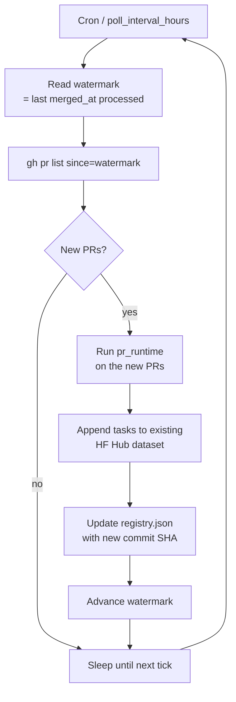

# `pr_stream`

`pr_runtime` with a scheduler. Continuously pulls post-cutoff PRs against any repo for contamination-resistant streams.

| | |
|---|---|
| Status | **shipped (v0.5)** |
| Sandbox required at gen | Yes (delegates to `pr_runtime`) |
| LLM required at gen | Optional |
| Reward kinds emitted | `test_execution`, `diff_similarity` |
| Inspiration | [SWE-bench-Live](https://github.com/microsoft/SWE-bench-Live) + [RepoLaunch](https://github.com/microsoft/RepoLaunch) (Microsoft, NeurIPS '25) |
| Reference clones | `references/SWE-bench-Live/`, `references/RepoLaunch/` |

## What "live" adds over `pr_runtime`

The per-PR pipeline is identical. The wrapper is a scheduler that:

- Tracks a `cutoff_date` so only PRs merged *after* a known model's training cutoff are eligible (contamination-resistant)
- Polls every `poll_interval_hours`, advancing a watermark
- Caps lookback via `max_age_days` to keep runs bounded

The result: any user can run a SWE-bench-Live-style continuous benchmark scoped to **their repo of interest**, not just the curated set.



## Why we depend on RepoLaunch

[RepoLaunch](https://github.com/microsoft/RepoLaunch) was split out of SWE-bench-Live specifically for reuse — it's an LLM-driven Docker-env-builder for arbitrary repos. We adopt it as a hard dependency for the env-build stage of every sandbox-required pipeline (not just live). This avoids us writing our own "agentic Dockerfile generator," which is the hard part of polyglot env synthesis.

## Options (planned)

Inherits `PRRuntimeOptions` plus:

```python
class LivePRRuntimeOptions(PRRuntimeOptions):
    poll_interval_hours: int = 24
    cutoff_date: date                    # only PRs merged after this
    max_age_days: int = 30
```

## What we'd reuse from `references/SWE-bench-Live/`

- The continuous-curation pipeline structure (Microsoft updates monthly with 50 new tasks; we generalize that pattern)
- Their PR-quality filter heuristics
- Multi-language env templates (their MultiLang and Windows variants)

## What we'd reuse from `references/RepoLaunch/`

- The LLM-driven env-build agent (whole thing — it's the dependency)
