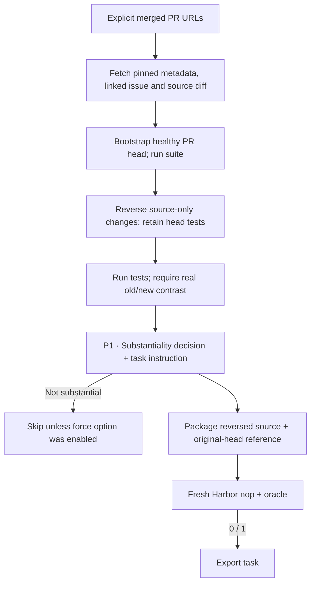

# `pr_to_env / swe_gen`

The owned SWE-gen recipe turns explicit public GitHub PR URLs into standalone
Harbor tasks. It retains the upstream substantiality/instruction prompt and
healthy-head reverse-patch workflow, with an explicit Python environment profile.

## Pipeline, step by step

`P1`, `P2`, … identify actual model calls. Unlabelled stages are code or remote execution.

**Recover the change.** The caller supplies PR URLs. The recipe fetches metadata and a bounded source diff; it does not mine arbitrary history.

**Create the problem state.** Bootstrap the PR head, then reverse only implementation edits in an otherwise healthy head snapshot. Head tests remain the private behavioral specification.

**Describe and package.** The author sees title, body, linked issue and test evidence, plus a source-file count. The solution patch is not sent to this call. The oracle restores the known head files.

## Every prompt and its data

One combined substantiality-and-instruction call after successful execution contrast.

| Call | System prompt composition | User / input material | Output | Retry or branch |
|---|---|---|---|---|
| P1 · Instruction | instruction_prompt.md + /workspace and JSON adaptations | title, body, linked_issue, test_evidence, source_file_count. | TaskInstruction: is_substantial, reason, instruction, three tags | force_generate_instruction changes only the substantiality instruction; it never bypasses execution checks. |

Read the [complete swe_gen prompt reference](prompts/swe_gen.md) for every retained template, appended instruction, substitution, example and output schema. The [shared prompt guide](prompt_reference.md) explains how to inspect the fully resolved request from a real run.

## Follow one task

Illustration: a PR adds an option to a parser. Reversing the implementation while retaining its new tests gives a concrete unsolved state; the task asks for the option’s behavior, and the merged implementation supplies the reference.

## What repeats, what is checked

Unsupported sources, unsuccessful reversal, unhealthy head tests and ineffective contrasts are recorded skips. This recipe has no iterative instruction-repair loop. Fresh Harbor failures reject the candidate rather than triggering an unbounded rewrite.

An exported bundle is a generation result. Independent leakage review, shortcut probes and blind solver traces belong to the later quality campaign.

## Implementation map

- [`swe_gen/source.py`](https://github.com/huggingface/Repo2RLEnv/blob/codex/owned-generation-pipelines/src/repo2rlenv/pipelines/recipes/swe_gen/source.py)
- [`swe_gen/worker.py`](https://github.com/huggingface/Repo2RLEnv/blob/codex/owned-generation-pipelines/src/repo2rlenv/pipelines/recipes/swe_gen/worker.py)
- [`swe_gen/instruction.py`](https://github.com/huggingface/Repo2RLEnv/blob/codex/owned-generation-pipelines/src/repo2rlenv/pipelines/recipes/swe_gen/instruction.py)
- [`repository/export.py`](https://github.com/huggingface/Repo2RLEnv/blob/codex/owned-generation-pipelines/src/repo2rlenv/pipelines/recipes/repository/export.py)
- [`swe_smith/grade.py`](https://github.com/huggingface/Repo2RLEnv/blob/codex/owned-generation-pipelines/src/repo2rlenv/pipelines/recipes/swe_smith/grade.py)

## Run and supported profile

Run `repo2rlenv generate --config examples/owned-swe-gen.yaml` after creating a
campaign ledger, a Modal or Daytona worker receipt, and a wheel of this checkout.
These use the same [owned recipe commands](owned_recipes.md) as SWE-smith and SETA.
The default UI shows source, bootstrap, instruction, Harbor and export stages;
`--no-ui` and `--json` provide durable machine-readable progress.

Inputs are merged public GitHub PRs and an explicit Python source/test profile.
All target code and image builds run remotely. Dependencies are installed during
build; task execution is offline. Source paths must identify existing Python
files or directories. Added/deleted source files and other languages need another
artifact collection profile and currently produce a recorded skip.

The reference restores the PR head's changed source files. The learner starts at
the head with those changes reversed, without Git history or the private tests.
It submits allowed Python source files into a fresh verifier environment.

`force_generate_instruction` is the upstream option for bypassing its complexity
filter. It does not bypass healthy-head, contrast or Harbor execution checks. The
20-task campaign may use it to measure generation from small functional changes.
An exported task is a generated artifact, **not quality acceptance**. Independent
reviews, attack checks and model rollouts are deferred until all recipe campaigns
reach 20 generated tasks. The current integration has not completed that review.

Credit: [SWE-gen](https://github.com/abundant-ai/SWE-gen), Apache-2.0, commit
`14e185f413f7bff03f8f9fec6fb246681bf61d74`. See [RFC 0015](../rfcs/0015-swe-gen-recipe.md)
and the packaged `recipes/swe_gen/provenance.md` for the source map and deviations.
