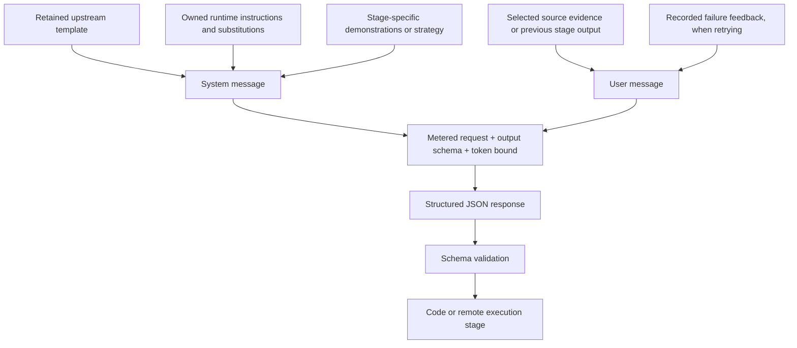
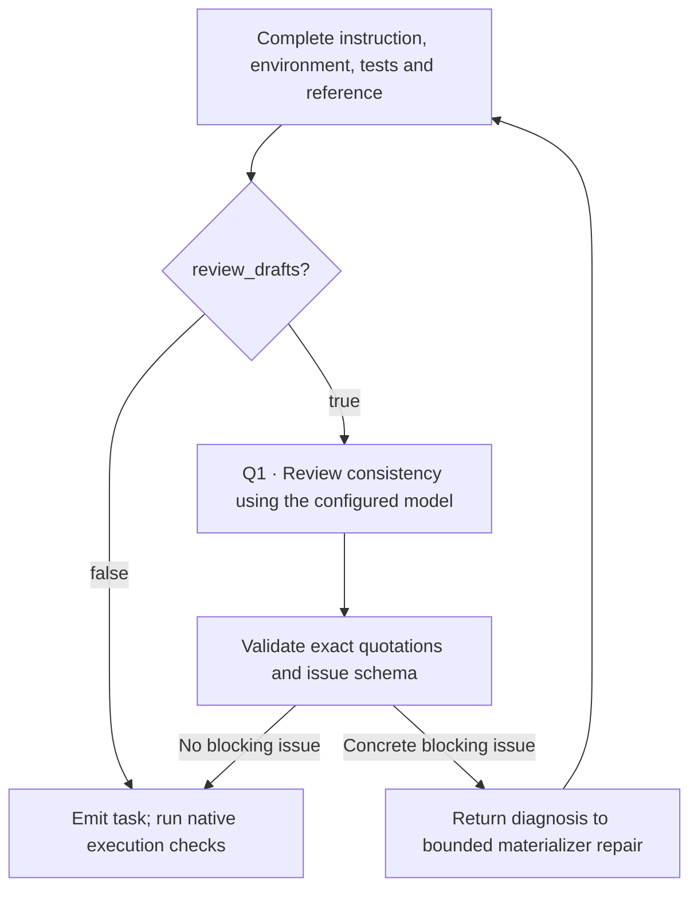

# Follow a task through its prompts

Each recipe guide numbers its actual model calls `P1`, `P2`, and so on. A role
such as “test author” is a stage in the controller, not necessarily a different
model or an autonomous coding agent. The current recipes send structured requests
through the configured `llm` and execute generated scripts on the remote worker.
They do not install an upstream research harness to do this work.

## What is sent to the model



The template is only one part of the request. For example, the retained TMax
environment prompt describes a native file format, but the owned additions ask
for `TerminalDraft` JSON and Docker setup. Reading only the retained template
would give the wrong picture of the running implementation.

The complete references below contain:

- The exact retained template text, including alternate templates and strategies.
- Demonstrations used by the call site, with any slice or selection documented.
- The Python that appends runtime instructions, substitutes variables and constructs
  the user message. This also shows inline prompts such as CLI-Gym's script author.
- Response models and the checks that decide whether a stage can continue.

| Recipe | Prompt sequence on the first successful attempt | Full reference |
|---|---|---|
| SWE-smith | Issue from failed-test evidence | [Templates and assembly](https://huggingface.github.io/Repo2RLEnv/pipelines/prompts/swe_smith/) |
| SETA Seed2Synth | Capability/design → complete task builder | [Templates and assembly](https://huggingface.github.io/Repo2RLEnv/pipelines/prompts/seta_seed2synth/) |
| SETA Evol | Strategy-specific child design → child builder | [Templates and assembly](https://huggingface.github.io/Repo2RLEnv/pipelines/prompts/seta_evol/) |
| SWE-gen | Substantiality and instruction in one call | [Templates and assembly](https://huggingface.github.io/Repo2RLEnv/pipelines/prompts/swe_gen/) |
| SWE-Flow | Function docstrings → test-based specification | [Templates and assembly](https://huggingface.github.io/Repo2RLEnv/pipelines/prompts/swe_flow/) |
| R2E | Differential tests → execution/coverage → refined specification | [Templates and assembly](https://huggingface.github.io/Repo2RLEnv/pipelines/prompts/r2e/) |
| TMax | Template → initial tests → final tests → environment/reference | [Templates and assembly](https://huggingface.github.io/Repo2RLEnv/pipelines/prompts/tmax/) |
| Endless Terminals | Template → initial tests → final tests → environment/reference | [Templates and assembly](https://huggingface.github.io/Repo2RLEnv/pipelines/prompts/endless_terminals/) |
| TerminalWorld | Score → extract → refine → instruction → environment → replay → tests | [Templates and assembly](https://huggingface.github.io/Repo2RLEnv/pipelines/prompts/terminalworld/) |
| CLI-Gym | Inversion goal → destruction/recovery scripts → symptoms instruction | [Templates and assembly](https://huggingface.github.io/Repo2RLEnv/pipelines/prompts/cli_gym/) |
| DataArc | Complete artifact variant from a selected seed and strategy | [Templates and assembly](https://huggingface.github.io/Repo2RLEnv/pipelines/prompts/dataarc/) |
| SWE-Next | Issue after historical old/new contrast | [Templates and assembly](https://huggingface.github.io/Repo2RLEnv/pipelines/prompts/swe_next/) |
| R2E-Gym | Issue after historical old/new contrast | [Templates and assembly](https://huggingface.github.io/Repo2RLEnv/pipelines/prompts/r2e_gym/) |
| SCALER | No model call; construct a concrete reasoning instruction | [Instruction construction](https://huggingface.github.io/Repo2RLEnv/pipelines/prompts/scaler/) |

[Shared terminal instructions and schemas](https://huggingface.github.io/Repo2RLEnv/pipelines/prompts/shared_terminal/) are included
where a recipe uses the common builder. TerminalWorld shares the output schema
but has its own environment/replay/test materializer. DataArc has no design-model
call: its `design()` function wraps input data before artifact generation.

## Optional review before execution

The six terminal recipes also support `review_drafts: true` under
`pipeline.options`; its default is `false`. This adds a **Q1 consistency-review
call** after a complete draft and before task emission or initial/final checks.
Later expansion batches enable it for SETA Seed2Synth, SETA Evol, TMax,
TerminalWorld and DataArc. Each batch retains its configuration and review
receipts; this option is not evidence that all earlier exports were reviewed.



Q1 receives the instruction, tests, reference, setup and bounded fixture contents.
It checks contradictions, unusable deliverables, missing behavioral verification,
essential assets and exposed solutions. Its response contains a short summary
and cited issues. Each quote must match a supplied document. Schema/citation
correction allows at most two model attempts, each capped at 2,500 output tokens;
materializer repair remains subject to `max_repairs`. A later materialized draft
gets its own Q1 call. Minor polish and unmeasured difficulty are not blockers.

The [shared prompt reference](https://huggingface.github.io/Repo2RLEnv/pipelines/prompts/shared_terminal/) includes the exact Q1
prompt, request assembly and correction code. The request is saved under
`review-<attempt>/model.request.json`, with a possible
`model-repair-1.request.json` correction. This review uses the
same configured model as generation, consumes model tokens and does not establish
independent quality acceptance. The task's reward still comes from its executable
verifier.

## Inspect the exact request from your run

Templates show the program. A saved request shows the actual input to one call.
`metered_complete` writes a companion `.request.json` containing `system`, `user`,
`max_tokens` and `response_schema` before dispatch. The corresponding model receipt
records the model, request hash, status and, when available, response and usage.

For a common terminal builder, the layout is:

```text
<campaign>/runs/<run-id>/
  run.json
  candidates/<candidate-id>/
    seed.json
    design-model.request.json
    design-model.json
    design.json
    builder-0.request.json
    builder-0.json
    attempt-0/<task-name>/
    trial-0-nop/
    trial-0-oracle/
    builder-1.request.json       # only if a repair was attempted
```

Repository recipes use `tasks/<candidate-id>/` for most per-task authoring;
SWE-smith uses `models/<candidate-id>.request.json`. The method reference shows
the exact receipt names, such as R2E's `test-model-0.request.json` or
TerminalWorld's `tests-0.request.json`. These are patterns, not a claim that every
stage ran for every candidate.

```bash
# Substitute the campaign, run and candidate identifiers from your run.
jq '{system, user, max_tokens, response_schema}' \
  workspace/my-campaign/runs/my-run/candidates/my-candidate/builder-0.request.json
```

Keep these receipts outside the learner bundle: authoring context can contain
hidden tests, reference code and solution details. `instruction.md` is the learner
request. A model's private `analysis`, `truth`, `reason` or `self_review` is not
automatically learner-facing and is not proof that execution succeeded.

## Which operations consume tokens

Only the model-call stages in the walkthrough consume generation-model tokens.
The current repository profiles call the existing bootstrap with an explicit
Dockerfile and `provider="none"`; they do not use the bootstrap LLM agent.
Repository cloning, image builds, mutation enumeration, tracing, test execution
and Harbor nop/oracle trials consume remote compute rather than model tokens.
SCALER's released-family expansion uses only those programmatic operations.

Repair calls are new requests with their own usage. Successful cached responses
are reused only when operation, model, input hash and ledger match. A dispatched
request with an uncertain outcome retains its reservation and is not blindly
retried. The recipe's bounded repair loop handles known task failures; it is not
a general retry mechanism for provider outages.

## Keep the reference in sync

The detailed prompt pages are generated from canonical source during each MkDocs
build and are ignored by Git. Each excerpt records its source
path and SHA-256. After changing prompt text, inline additions, examples or schemas:

```bash
uv run python docs/_tools/generate_prompt_reference.py
uv run python docs/_tools/generate_prompt_reference.py --check
```

CI generates the pages, checks their source agreement, and builds the site from a clean checkout. Edit the walkthroughs when control flow or stage meaning
changes; generated source excerpts cannot replace that explanation. Upstream
credits, source revisions, licenses and deviations remain in each recipe's guide,
RFC and packaged provenance file.
