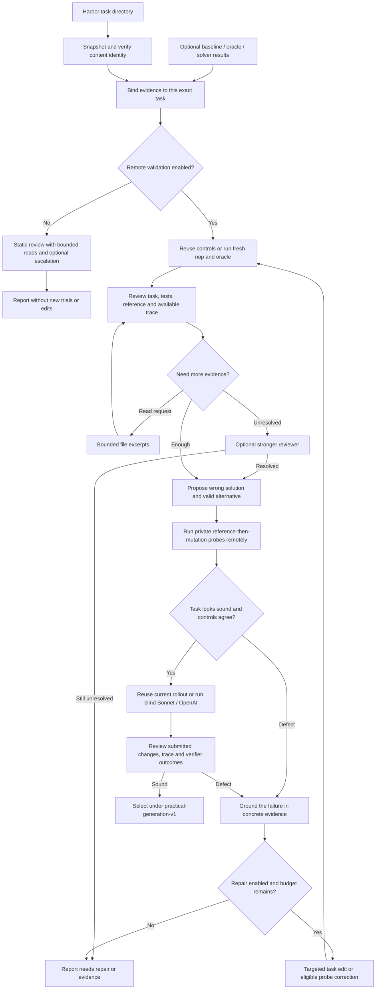

# Review and repair a Harbor task

`repo2rlenv quality run` reviews an existing Harbor task, optionally reuses its
rollout, and can run missing validation and repair the task remotely. It is a
component shared by generation recipes, not another generator. Original tasks are
preserved; each repair produces a separate Harbor directory.

This implements the practical review approach from the [quality pilots](quality_pilot.md).
It does **not** replace the older, stricter `QualityReport.accepted` contract.

## Execution and decisions



The diagram's execution steps require `--run-rollout` or `--repair`; a review-only
run makes model calls but creates no worker. A CPU loop reuses one worker and
its runtime and Docker build cache throughout the loop. Modal and Daytona use the
same CPU `RemoteWorker` contract. GPU tasks automatically select native Modal from
their Harbor resource declarations; both learner and separate verifier must request
one or two L4 GPUs with networking disabled. Native GPU trials do not need a runtime
wheel or Docker worker. Unsupported GPU/provider combinations fail before dispatch.
Target Docker builds, tests, probe scripts and solver
commands run remotely; the controller only reads, hashes and edits artifacts.

## Use it

Install the provider and Harbor extras and build the owned runtime from this checkout:

```bash
uv sync --extra modal --extra harbor
uv build --wheel
```

Use an existing campaign ledger. For a new campaign, explicitly allocate its budget:

```bash
repo2rlenv campaign init ./workspace/my-campaign --budget-usd 25
```

Review a task and a previously collected solver trial:

```bash
repo2rlenv quality run ./tasks/example \
  --campaign ./workspace/my-campaign \
  --out ./workspace/reviews/example \
  --rollout ./jobs/example/trial/result.json \
  --review-model openai/gpt-6-astra
```

`--baseline` and `--oracle` also accept existing evidence. Each argument accepts
one owned trial receipt/directory, one Harbor trial `result.json`, or a single-trial
job directory. A multi-task job is ambiguous and is rejected. Native Harbor results
must match the input's Harbor checksum. Owned receipts must match its bundle hash
and the collected result hash. These are content checks, not cryptographic
attestations that an external caller ran an honest experiment.

Run the controls, review, probes, solver and up to three targeted repairs:

```bash
repo2rlenv quality run ./tasks/example \
  --campaign ./workspace/my-campaign \
  --out ./workspace/reviews/example-repaired \
  --repair --provider modal \
  --runtime-wheel ./dist/repo2rlenv-0.8.8-py3-none-any.whl \
  --review-model anthropic/claude-sonnet-4-6 \
  --repair-model anthropic/claude-opus-4-6 \
  --solver-model anthropic/claude-sonnet-4-6 \
  --max-repairs 3 --max-spend-usd 15
```

For CPU tasks, switch to `--provider daytona` after installing `--extra daytona`. Alternatively,
pass `--worker-receipt` for an existing running worker in the same campaign. The
component terminates workers it creates; callers retain ownership of supplied
workers. A completed worker's compute reservation remains held until reconciled
through `repo2rlenv campaign settle`; model costs use recorded provider usage and
LiteLLM estimates. The budget is an accounting limit, not a provider-enforced bill cap.

Use `--run-rollout` without `--repair` to evaluate without editing. Supply an
existing rollout alongside either flag to avoid repeating it on the original
revision. A changed task always needs fresh controls, probes and a fresh rollout.
If the initial review blocks a rollout but the post-probe review resolves that
concern, the loop runs the now-eligible solver on the same revision and reviews
its trace. It does not require an unrelated task edit or a new campaign to finish
validation. Existing successful rollouts are reused; budget denial stops before
another paid review.

`--resume` reuses completed, identical model requests and trial evidence. It refuses
changed inputs, execution settings, prompts or evidence. Interrupted/uncertain
provider effects require reconciliation; they are never automatically retried.
For a native single-step solver that completed normally but whose private verifier
was denied an allocation, the controller seals the collected submission and trace.
On `--resume`, it may run **one verifier-only continuation**, preserving the original
model usage, timing and raw result. It checks the task, file contents and modes,
artifact manifest, result hash and allocation receipts before dispatch. It does not
call the solver again. A completed continuation is reused; failed or uncertain
continuations are retained, not repeatedly dispatched. Earlier unsealed receipts
remain for explicit reconciliation. Resumption still requires identical run inputs,
runtime identity and options, and an available campaign allowance; it cannot raise
the budget or resume an old runtime with changed code.
`repo2rlenv quality show OUTPUT_DIR` reads the report without model/cloud calls.
Both commands support `--json`; ordinary runs show stage progress and criterion scores.
Credentials come from the usual environment or `.env`; `--env-file PATH` can load
the original checkout's credentials when running from another worktree. Keys are
not copied into task bundles or model request receipts.

## Models and efficiency

Review, repair, escalation and solver models are independent `provider/model`
settings. The default review/solver is the previously tested Sonnet 4.6; repair uses
the reviewer unless overridden. `--escalation-model` makes at most one stronger
attempt when structured output or evidence retrieval remains unresolved. This is
explicit escalation, not a silent retry of a failed provider request.
An invalid JSON/text patch gets at most one separately metered correction with the
validation error and actual source excerpts. It consumes no execution revision
until a complete patch applies. The correction receives the rejected parsed draft
and explicit legal probe replacements. A task/verifier defect must be repaired
through task edits; it cannot justify replacing a retained probe. If fetching
additional repair source exceeds the context limit, the controller includes that
failure in the correction feedback instead of discarding the correction call.
Unknown provider outcomes are never retried this way.

For a mock return or argument mismatch, both prompts require the complete production
unpack/signature and fixture construction. They ask the model to expand starred
prefixes and map positions to fields before editing, preserving the real production
call and assertions. Fresh controls still decide whether the repair works; this
guidance adds no model calls or repair rounds.

When registering new cases in an existing `tests/contract.json`, a repair can use
`append_expected_passes` with only the new exact IDs. This preserves the old IDs,
their order and all other contract fields; it rejects duplicate/empty IDs, invalid
contracts and a simultaneous text edit of that contract. The append is a verifier
change: protected-path rules still apply, it creates a new unverified task hash,
and the usual controls, probes and rollout must validate that revision. Mechanical
correction recommends this operation within the existing two-call limit.

Before accepting a completed review, the controller checks that a legitimate
success or failure agrees with the latest supplied solver reward and configured
success threshold. Missing rewards or infrastructure exceptions cannot establish
either outcome; an agent timeout with a recorded reward retains the existing
failure/success semantics. Contradictions receive the exact evidence path and
reward through the existing bounded review correction or configured escalation.
This check does not infer whether a failure reveals a task defect or whether a
success exploits the verifier: those diagnoses still require the reviewer.

A wrong-solution probe whose mutation never finished can be corrected within the
same repair limit. The controller independently checks its exact variant, completed
execution receipt, result checksum, nonzero agent exit and absent completion marker.
Probe scripts run in a child shell so a successful `exit` cannot skip the trusted
change audit and completion marker. A nonzero exit still fails probe installation.
The reviewer must diagnose that specific attempt as a probe defect using its logs
or trial summary. Missing or mismatched evidence does not authorize replacement.
An append-only `probe-attempts/` journal preserves every attempt and log hash across
task revisions and resume. Once any installation under the same probe name completes,
the counterexample remains immutable, even when it exposes a verifier gap or a later
attempt fails. Eligible corrections preserve name, kind and focus, retain the old
receipts, and record authorization in `probe-replacement-evidence.json` beside the new
repair. A broken probe alone cannot justify task/verifier edits. The corrected probe
runs again; unchanged controls use the existing strict evidence importer. Neither
the default three repair rounds nor the two patch-proposal calls is increased.
Imported wrong-probe definitions remain immutable: a probe manifest alone does not
establish that no earlier installation completed in its original run.

The initial evidence pack places selected private assertions before large reference
patches and generic grading helpers. Reviews must assess those assertions, rather
than inferring coverage from test names or pass counts. All omitted files remain
addressable through exact inventory paths.
The compact context also lists exact selected verifier paths, even when the full
inventory is truncated. An unknown file read suggests matching basenames and those
selected paths; the reviewer must request the actual file before citing it.

Literal searches merge overlapping excerpts and keep complete matching windows
within the remaining context budget. Omitted windows are identified explicitly.
Already supplied evidence remains unchanged, and an oversized explicit line range
is rejected atomically with guidance to narrow it.

Current model examples include `openai/gpt-6-astra`, `openai/gpt-5.6-terra`,
`openai/gpt-5.6-luna`, `anthropic/claude-sonnet-5` and `anthropic/claude-opus-5`.
IDs are passed through, not selected from a frozen allowlist. Account access and SDK
compatibility still matter. See the official [OpenAI model catalog](https://developers.openai.com/api/docs/models)
and [Anthropic model catalog](https://platform.claude.com/docs/en/models/overview).

The shared OpenAI client sends `max_completion_tokens` for current GPT reasoning
models and omits unsupported temperature parameters; automatic SDK retries are
disabled. Every model request has a durable request hash, response receipt and
campaign reservation. Unknown usage retains its hold rather than becoming zero cost.

Defaults: three repairs, two extra file-reading rounds, two semantic probes, 100,000
characters of document context, 6,000 output tokens per review/repair call, and
24 solver turns at 4,096 tokens per call. Context includes a file inventory, selected
task files, trace excerpts and explicit omissions. Reviewers can request up to six
400-line excerpts or bounded literal searches in each reading round. Python tasks
start with matching function/test excerpts and their module headers. When a whole selected test file is at most 24 KB, the initial pack includes its complete body and fixture helpers if the context allowance permits; any truncation remains explicit. Individually selected nodes and larger modules keep targeted excerpts;
When trials are present, the initial task files use at most 35% of the document
allowance; execution evidence can fill the next 35%. Actual assertion failures
precede verbose baseline inventories and captured source. Probe scripts remain
individually readable instead of inflating every result summary. The remaining
30% is reserved for follow-up reads. Binary/large files remain recorded as
uninspected text; this is not a claim that every byte of every repository was reviewed.
Private PR context is also registered in the readable evidence inventory. Its initial
excerpt uses at most 32,000 characters or one quarter of the document allowance,
whichever is smaller. Large diffs remain available through bounded range/search
requests instead of requiring a hand-truncated campaign prompt. Saved campaign
repair guidance comes first in that same bounded excerpt, so a long source diff
cannot push the current diagnosis out of the initial review input. The full
context remains searchable and the document allowance does not increase.

## What the prompts ask

The full prompts ship with the package and are reproduced in the
[complete prompt and request-assembly reference](prompts/quality_loop.md):

| Stage | Input | Output | Prompt |
|---|---|---|---|
| Initial review | Public instruction, build inputs, private reference/tests, available controls/rollout | Task/verifier/leakage assessments, grounded issues, bounded read requests, semantic probes | [review.md](prompts/quality_loop.md#reviewmd) |
| Evidence read / escalation | Same evidence pack plus requested excerpts or protocol correction | Completed grounded review | Same review prompt |
| Post-execution review | Task plus actual control/probe/solver results, logs and captured artifacts | Legitimate success/failure, task defect, grading shortcut, infrastructure issue or insufficient evidence | Same review prompt |
| Repair | Grounded issues, execution failures, exact files and retained probes | Exact text replacements, appended expected case IDs, eligible probe corrections, and rationale | [repair.md](prompts/quality_loop.md#repairmd) |

Every citation must quote text actually supplied to the model. Scores range from
0–4 and are descriptive; code derives the final disposition from evidence. A
model's declaration of success cannot override a failed negative control or probe.
The controller can restore single-backtick formatting in a unique Markdown prose
excerpt without another model call. Words, case, punctuation and numbers must be
identical; code blocks, escaped delimiters and ambiguous matches remain rejected.
The corrected citation must pass normal grounding, and both forms are recorded.

Semantic probes create private variants: first run the reference, then install a
plausibly wrong submission or a valid alternative. Instruction, environment and
verifier files stay byte-identical. A completion marker and oracle exit code
distinguish probe-installation failures from verifier rejections. Wrong-solution
probes are retained across repairs. An alternative can be corrected only after a
grounded diagnosis identifies a bug in that probe; its name, kind and requirement
focus must stay the same. Original probe receipts remain available. A probe-only
repair reuses the unchanged task's controls and rollout, then replays both probes.
Their correctness still needs grounded
model review; they are not a comprehensive adversarial suite or privilege test.

Explicit lazy-output and numeric-tolerance requirements select focused probes.
A different wrong implementation cannot satisfy those coverage obligations. This
addresses a measured calibration failure: two generic probes initially missed the
R2E `collapse` verifier's missing laziness check. Probe focus is still a narrow
heuristic, not a complete natural-language requirement extractor.

Tasks can also declare an explicit, validated requirement:

```toml
[metadata.repo2env.quality_requirements]
probe_focus = ["compiled_execution"]
```

This field belongs to the executable task identity, outside the advisory
`evaluation` label. `compiled_execution` requires a wrong-solution probe that
preserves wrapper types, shapes and setup while corrupting an executed output or
gradient. The verifier must invoke the real compiled path and reject the mutation;
structural checks alone are insufficient. Option forwarding and integration checks
remain limited to the original PR's behavior. No fixed speedup or extra hardware
is required. Without the explicit field, historical tasks keep their existing
requirements. Tasksmith's `required_probe_focus` option annotates a new input copy
before controls and never transfers old evidence to the changed hash.

For neural model tasks, `model_behavior` targets a wrong implementation that keeps
valid interfaces and tensor shapes while changing a central promised computation,
such as register placement, pooling values, adapter output or sampling behavior.
The verifier must detect that change through independent numerical or behavioral
assertions. A dimension error or a missing import does not establish this coverage.
This requirement is opt-in and changes the task hash; previous evidence cannot be
carried onto the annotated copy. Probe focus remains a reviewed coverage constraint,
not an automatic proof that every mathematical requirement has been tested.

`model_behavior` and `compiled_execution` negative controls also have a deterministic
execution floor. New mutations cannot introduce unparseable Python into previously
parseable submitted files. The attempt journal binds the mutation audit and the
verifier's structured JSON/JUnit results; at least one failing test must reach beyond
collection, setup and import errors. Missing or changed evidence blocks acceptance,
reuse and publication. The reviewer must diagnose the failure as a blocking probe
issue within the existing review limits. Generic controls keep their existing policy.
Old journals remain unchanged and cannot acquire evidence bindings retroactively;
previously installed counterexamples retain their replacement protection.

Alternative implementations are judged by their public behavior. A failing test
that prescribes a private flag's representation may be a verifier defect; it is
not automatically proof that the alternative is invalid. Repairs must preserve
the actual behavioral assertions, including caching and recomputation guarantees.

Pass `--probes FILE.json` to retain known counterexamples or valid alternatives from
an earlier review. The manifest contains `bundle_hash` and a `probes` list; each
probe has `name`, `kind`, `focus`, `rationale`, `evidence` (`path`/`quote`) and `script`.
Its hash must match the task and its count must fit `--max-probes`. Known probes
are replayed against every revision. Fresh suggestions cannot displace them; only
the diagnosed valid-alternative correction described above can change a known probe.

## Live validation and calibration

The September 12 canaries used real model APIs and Modal-hosted Harbor trials.
They tested this component, not a new corpus-wide acceptance pass.

| Input | Models exercised | Observed result |
|---|---|---|
| Existing SCALER task | GPT-6 Astra reviewer | Structured review completed and flagged an unestablished numerical-tolerance contract; no new task execution or repair. |
| Small iterable-sum coding task with weak tests and a broken verifier image | Sonnet 4.6 review/solver, Opus 4.6 repair | One repair fixed the image packaging and added behavioral coverage. Fresh baseline 0, reference 1, wrong solution 0, valid alternative 1, Sonnet 1; `usable`. |
| Existing R2E `collapse` task, early generic probes | Sonnet 4.6 | **False acceptance during calibration:** ordinary wrong/valid implementations missed the promised lazy evaluation. This motivated explicit requirement-focused probes. |
| Same R2E task, focused probes | Sonnet 4.6 | The eager implementation earned 1, demonstrating a verifier defect. A generated test repair made it earn 0 while the reference still earned 1. A separate defective alternative remained unresolved, so the run was not selected. |
| Same R2E task, full repair attempt after context correction | Sonnet 4.6 review, Opus 4.6 repair | The reviewer identified the actual `base_type` failure. A generated laziness test had an undefined import; fresh oracle execution rejected it. The following patch did not match its target. The run ended `needs_evidence`, motivating bounded patch correction and module-header context. |
| Previously generated R2E laziness revision, with retained probes | GPT-6 Astra review/repair, Sonnet 4.6 solver | One additional revision clarified outer-container atomicity, strengthened partial-consumption grading and corrected the recursive alternative. Fresh baseline 0, reference 1, eager probe 0, recursive alternative 1 and Sonnet 1; final review classified the rollout as legitimate and returned `usable`. |

The iterable canary accounted for $0.224319 in model usage and a conservative
$1.038314 compute/build estimate. These are small-case measurements, not a general
per-task price. Cloud accounting uses the [Modal sandbox rate card](https://modal.com/pricing)
and recorded worker duration plus a $1 image-build allowance; it is not a provider
invoice. Existing SCALER evidence was reused, so that review's $0.583783 model cost
does not include its earlier execution.

The final R2E run used $3.477980 in API calls and a $1.075085 conservative
compute/build estimate. It started from an earlier generated repair and known
probes, so this is an incremental result, not a one-shot success-rate measurement.
Across all development canaries, recorded API usage was $8.218809 and conservative
cloud/build accounting was $6.274614 ($14.493423 combined). All six created workers
were terminated and their holds reconciled. Historical campaign reservations are
separate and unchanged.

Final component verification: 869 local tests passed, one opt-in GitLab test was
skipped, and external/live test suites were excluded from the local run. GitHub CI
passed lint, Python 3.12/3.13/3.14 tests, optional owned/Harbor contracts and package
builds. No original export was replaced or newly admitted by these canaries; all
291 original bundle hashes still match their recorded identities.

Calibration also caught two controller issues: current OpenAI models need the
completion-limit parameter supported by their API, and long baseline result files
must not hide later probe failures. Both have regression coverage. Invalid quotes,
truncated responses and unresolved execution evidence stop the loop instead of
becoming accepted tasks. Daytona uses the existing adapter but was not exercised
in these component canaries.

## Output and acceptance

| Status | Meaning |
|---|---|
| `usable` | All three review criteria pass; initial state fails; reference passes; wrong-solution probe fails; valid-alternative probe passes; blind rollout is reviewed as a legitimate success or failure. |
| `reviewed` | Review is sound but some execution evidence is absent or unresolved. This is not validated acceptance. |
| `needs_repair` | Concrete task, reference, packaging or verifier defects remain. |
| `needs_evidence` | Parsing, evidence binding/retrieval, provider execution or infrastructure needs diagnosis. |
| `budget_exhausted` | Per-run or campaign allowance prevented the next effect. |

Exit codes are 0 for `usable`/`reviewed`, 1 for other completed dispositions, and 2
for invocation/setup failures. Automation requiring validated tasks must check
`status == "usable"`, not only the process exit code.

```text
OUTPUT_DIR/
  result.json                 # Current disposition, scores, evidence, cost and task path
  run.json                    # Input/options/evidence identity
  events.jsonl                # Durable progress
  calls/                      # Exact prompts, responses and budget receipts
  reviews/                    # Structured review per revision/stage
  revisions/r0/TASK/           # Original snapshot
  revisions/r1/TASK/           # New Harbor task; adjacent repair.json has lineage
  probes/r0-probe0/TASK/       # Private control variant; never a published training task
  trials/                     # Harbor results, trajectories and artifacts
  workers/                    # Owned worker recovery/cleanup receipts
```

## Python integration and current boundaries

```python
from pathlib import Path
from repo2rlenv.campaigns.budget import BudgetLedger
from repo2rlenv.quality.loop import LoopOptions, QualityLoop

loop = QualityLoop(
    LoopOptions(), Path("workspace/review"),
    BudgetLedger(Path("workspace/campaign/budget.sqlite3")),
)
result = loop.run(Path("tasks/example"), rollout=Path("jobs/trial/result.json"))
```

For execution, supply `RemoteTrials` as `trial_runner`, or assign it to `loop.remote`
using `loop.budget`. Model/trial adapters are injectable for tests and Tasksmith
integration; this layer does not depend on any recipe or upstream research package.

The initial remote adapter supports Linux Dockerfile tasks with `no-network`,
including Harbor's separate verifier environment used by owned recipes. It does
not run multi-service, Windows, step-based or online tasks. Repairs are bounded text
edits to instruction/environment/solution/tests; task configuration, binary assets
and externally hosted artifacts require a separate explicit change. Invalid or
missing task contracts cannot be silently invented. Artifact visibility depends on
the input task's Harbor collection configuration; missing final files are a review
limitation, not evidence that no exploit occurred.
