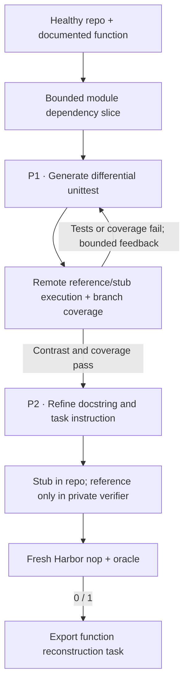

# `equivalence_tests / r2e`

The owned R2E recipe generates differential tests from real repository functions,
repairs them using execution and coverage feedback, then refines the task's
specification using the observed behavior.

## Pipeline, step by step

`P1`, `P2`, … identify actual model calls. Unlabelled stages are code or remote execution.

**Extract a real function.** Select supported documented top-level synchronous functions and their bounded module-level dependency context.

**Generate and execute tests.** Tests compare the function under test with reference_function through fut_module. Remote execution measures actual contrast and branch coverage attributable to generated tests. Existing tests run separately.

**Refine the public contract.** Only after a useful test exists does the specification call see function source, generated tests and observations. The learner gets the refined docstring and instruction, with the function body stubbed.

## Every prompt and its data

One to max_rounds test-author calls, then one specification call for a successful candidate.

| Call | System prompt composition | User / input material | Output | Retry or branch |
|---|---|---|---|---|
| P1 · Tests / repair | test_prompt.md + fut_module binding and offline adaptations | function_name, dependency context, prior test and execution/coverage feedback. | EquivalenceTest: test_code | Up to max_rounds; default three. Default minimum branch coverage is 0.8. |
| P2 · Specification | specification_prompt.md + behavioral-only instruction adaptation | Original function, generated tests, observed executions. | RefinedSpecification: docstring, instruction | One call after the test-generation loop succeeds. |

Read the [complete r2e prompt reference](prompts/r2e.md) for every retained template, appended instruction, substitution, example and output schema. The [shared prompt guide](prompt_reference.md) explains how to inspect the fully resolved request from a real run.

## Follow one task

Illustration: reconstruct a function that consumes iterators. The generated tests must compare equivalent fresh inputs and materialize finite iterators, so the verifier measures behavior rather than object identity.

## What repeats, what is checked

Syntax/schema errors and unsuccessful execution feed P1. Coverage below the configured threshold also feeds P1. The final Harbor check is separate from this loop; a failure there skips the task. The private Python reference is in the same process as the differential tests, a limitation for later adversarial review.

An exported bundle is a generation result. Independent leakage review, shortcut probes and blind solver traces belong to the later quality campaign.

## Implementation map

- [`r2e/extract.py`](https://github.com/huggingface/Repo2RLEnv/blob/codex/owned-generation-pipelines/src/repo2rlenv/pipelines/recipes/r2e/extract.py)
- [`r2e/pipeline.py`](https://github.com/huggingface/Repo2RLEnv/blob/codex/owned-generation-pipelines/src/repo2rlenv/pipelines/recipes/r2e/pipeline.py)
- [`r2e/worker.py`](https://github.com/huggingface/Repo2RLEnv/blob/codex/owned-generation-pipelines/src/repo2rlenv/pipelines/recipes/r2e/worker.py)
- [`r2e/reference.py`](https://github.com/huggingface/Repo2RLEnv/blob/codex/owned-generation-pipelines/src/repo2rlenv/pipelines/recipes/r2e/reference.py)
- [`repository/export.py`](https://github.com/huggingface/Repo2RLEnv/blob/codex/owned-generation-pipelines/src/repo2rlenv/pipelines/recipes/repository/export.py)

## Run and supported profile

Use `repo2rlenv generate --config examples/owned-r2e.yaml`. The existing native
`equivalence_tests` pipeline keeps its original options and behavior; selecting
`recipe: r2e` uses this owned execution loop and its separate options. Cloud
workers, budget accounting, resume receipts and Rich/JSON progress follow the
[shared interface](owned_recipes.md).

The first profile requires a working public GitHub Python repository with a
`tests/` directory. It selects documented module-level synchronous functions and
includes their bounded module-level dependency context. Classes, async functions,
nonstandard source roots and reconstructed cross-module import slices require
another extraction profile.

Generated tests use the native `function` / `reference_function` API. The reference
and test bindings are added only to the separate verifier image; the learner sees
a stub in the real repository and the refined requirements. Coverage is collected
only while generated tests execute. Existing repository tests run as well, without
contributing to that coverage score. The default is three rounds and 80% branch
coverage. These are native generation controls, separate from later quality review.

The current verifier loads the private Python reference in the same process as
the differential tests. Reference access during adversarial grading is still part
of the deferred audit; no quality-accepted claim is made. The first campaign aims
for **20 generated tasks** with fresh Harbor baseline/reference checks.

Options extend the Python source/build/test profile with `target`,
`max_candidates`, `seed`, `max_rounds` and `min_branch_coverage`. The default build
dependencies include pytest and Coverage.py; explicit dependency overrides must
include those libraries.

Credit: [R2E](https://github.com/r2e-project/r2e), MIT, commit
`bcbed156711bb939de14aa46b27eee15073f5272`. See [RFC 0017](../rfcs/0017-r2e-recipe.md)
and the packaged `recipes/r2e/provenance.md` for the source map and adaptations.
The execution report uses Coverage.py's [branch measurement](https://coverage.readthedocs.io/en/latest/branch.html)
and [JSON reporting](https://coverage.readthedocs.io/en/latest/commands/cmd_json.html).
