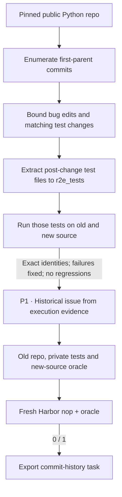

# `commit_runtime / r2e_gym`

R2E-Gym / SWEGEN turns real historical code changes into repository repair tasks.

## Pipeline, step by step

`P1`, `P2`, … identify actual model calls. Unlabelled stages are code or remote execution.

**Mine commits.** Traverse first-parent history rather than PR metadata. The default native-inspired filters require bug-like edits and test matches within bounded changes.

**Materialize comparison tests.** Selected post-change tests are extracted and renamed under r2e_tests. Both old and new implementations run that same test set.

**Package a repair.** The shared history author uses R2E-Gym’s own issue prompt and examples. The output restores selected new-source files in an otherwise old repository context.

## Every prompt and its data

One issue-author call after remote contrast succeeds; commit discovery and filtering use no LLM.

| Call | System prompt composition | User / input material | Output | Retry or branch |
|---|---|---|---|---|
| P1 · Historical issue | instruction_prompt.md + issue_examples.json + shared history adaptation | Evaluated candidate with commit context, private source diff and observed tests. | HistoricalIssue: analysis, instruction | Same call machinery as SWE-Next; different source and test layout. |

Read the [complete r2e_gym prompt reference](prompts/r2e_gym.md) for every retained template, appended instruction, substitution, example and output schema. The [shared prompt guide](prompt_reference.md) explains how to inspect the fully resolved request from a real run.

## Follow one task

Illustration: a commit changes a function and its regression test without a useful PR record. The commit pair supplies the old/new behavior, while the generated instruction explains the observed defect.

## What repeats, what is checked

require_bug_edit and require_test_match default to true. The initial profile supports ordinary pytest; repository-specific Pillow/NumPy/Datalad/Tornado heuristics are outside scope. Failed contrast or final Harbor checks skip the candidate. No interactive coding agent repairs the repository during this recipe.

An exported bundle is a generation result. Independent leakage review, shortcut probes and blind solver traces belong to the later quality campaign.

## Implementation map

- [`history/selection.py`](https://github.com/huggingface/Repo2RLEnv/blob/codex/owned-generation-pipelines/src/repo2rlenv/pipelines/recipes/history/selection.py)
- [`history/worker.py`](https://github.com/huggingface/Repo2RLEnv/blob/codex/owned-generation-pipelines/src/repo2rlenv/pipelines/recipes/history/worker.py)
- [`history/pipeline.py`](https://github.com/huggingface/Repo2RLEnv/blob/codex/owned-generation-pipelines/src/repo2rlenv/pipelines/recipes/history/pipeline.py)
- [`r2e_gym/pipeline.py`](https://github.com/huggingface/Repo2RLEnv/blob/codex/owned-generation-pipelines/src/repo2rlenv/pipelines/recipes/r2e_gym/pipeline.py)
- [`repository/export.py`](https://github.com/huggingface/Repo2RLEnv/blob/codex/owned-generation-pipelines/src/repo2rlenv/pipelines/recipes/repository/export.py)

## Run and supported profile

Run `repo2rlenv generate --config examples/owned-r2e-gym.yaml`.
The first profile supports public GitHub Python repositories and ordinary pytest
files. Source paths, dependency installation and test roots are explicit. All
repository execution and image builds run on the configured Modal or Daytona worker.

The native strict test identity comparison is retained. Test files are renamed under r2e_tests. Repository-specific Pillow, NumPy, Datalad and Tornado import/runner heuristics are not supported in the initial ordinary-pytest profile. The native optional bug-edit/test-match switches default on, as in the published generation guide.

`target`, `max_candidates`, `history_limit` and change-size bounds control the run.
`require_bug_edit` and `require_test_match` expose the native filter switches.
The first target is **20 generated tasks**. The runtime records source exclusions,
bootstrap failures and execution results. A reference success is a generation
check; detailed quality acceptance follows the full campaign.

The export carries the old repository context, private post-change tests, a
reference repair and deterministic test reward. Changed source files must already
exist; added/deleted implementation files and specialized test runners need a
separate supported profile. Dependencies are available before offline solving.

Credit: [R2E-Gym / SWEGEN](https://github.com/R2E-Gym/R2E-Gym), Apache-2.0,
commit `0d94c4eb9431cd195c55a7ea3abd54006c9a1735`. See
[RFC 0024](../rfcs/0024-r2e-gym-recipe.md), the packaged `recipes/r2e_gym/provenance.md`,
and the [shared CLI and cloud guide](owned_recipes.md).
