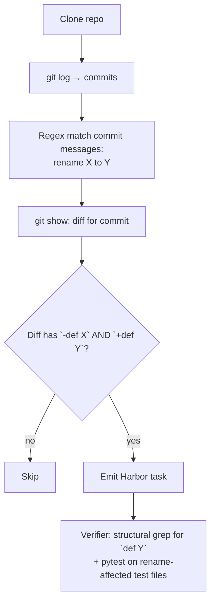

# `refactor_synthesis`

Mine real **rename refactors** from the target repo's commit history and
emit Harbor tasks of the form "rename `X` to `Y` throughout the codebase".
The verifier is **multi-criteria**:

1. **Structural** — the new symbol (`def Y` or `class Y`) is present in
   the source tree
2. **Behavioral** — the existing test suite still passes (scoped to the
   test files the original rename commit touched, when present)

| | |
|---|---|
| Status | **shipped (v0.8)** — Python rename refactors |
| Sandbox required at gen | Yes |
| LLM required at gen | env-only (bootstrap; pipeline itself makes no LLM calls) |
| Reward kinds emitted | `test_execution`, `diff_similarity` |
| Inspiration | (Python-native; drops the v1.0-planned [RefactoringMiner](https://github.com/tsantalis/RefactoringMiner) JVM dep) |

## Why we dropped RefactoringMiner

The original v1.0 spec called for [RefactoringMiner](https://github.com/tsantalis/RefactoringMiner)
— a JVM-based detector. We don't ship a JVM at runtime, and adding one
just for one pipeline is a high tax.

The v0.8 alternative is a **commit-message + diff-verification** recipe.
We miss refactors that weren't announced in commit messages (high
false-negative rate), but our detector has near-zero false-positive
rate because we always verify the diff actually performs the rename.

## Algorithm



### Commit message regex

Matches phrases (case-insensitive):

- `rename foo to bar`
- `renamed old_helper to new_helper`
- `Rename function do_thing to perform_action`
- `Rename class Foo to Bar`
- `rename method ``do_thing`` to ``perform_action``` (backticks tolerated)
- `rename arg x to value` / `rename param x to value` (normalized to "argument" / "parameter")

Skips matches where `old == new`.

### Diff verification

Required:

1. At least one **`-`-line** matching `def OLD(...) / class OLD ...` —
   proves this is a real symbol rename, not just a parameter or string
   change.
2. At least one **`+`-line** matching `def NEW(...) / class NEW ...`.

We **allow** `+def OLD(...)` to remain — mature Python libraries keep a
back-compat shim with the old name forwarding to the new
implementation. Rejecting those would filter out most real-world
rename refactors.

## Emitted task shape

```
<owner>__<repo>-rfn-<hash>/
├── task.toml
├── instruction.md            # "Rename `old_name` to `new_name` ..."
├── environment/Dockerfile    # FROM bootstrap; reset to parent of rename commit
├── tests/test.sh             # structural grep + behavioral pytest
└── solution/
    ├── patch.diff            # the historical rename commit's full diff
    └── solve.sh
```

The verifier `tests/test.sh`:

```bash
# 1. Structural — new name must be defined somewhere in source
grep -RnE --include='*.py' --exclude-dir=tests --exclude-dir=docs --exclude-dir=examples \
  '^[[:space:]]*(async[[:space:]]+def|def|class)[[:space:]]+NEW[[:space:]]*[(:]' .

# 2. Behavioral — pytest on the rename-touched test files
python -m pytest -v <test_files_from_commit>
```

Reward 1.0 = both pass. We use `python -m pytest` (not bare `pytest`) for
robustness against non-interactive shell PATH oddities.

## Options

See `RefactorSynthesisOptions` in `src/repo2rlenv/spec/options.py`.

| Field | Default | Notes |
|---|---|---|
| `limit` | 50 | max emitted tasks |
| `clone_depth` | 200 | shallow-clone depth (deeper = more candidates) |
| `branch` | `"HEAD"` | branch to walk |
| `since` / `until` | `None` | optional commit-date window |
| `skip_merge_commits` | `True` | drop merge commits (typically noise) |
| `exclude_authors` | `[]` | drop e.g. dependabot |
| `require_old_name_gone` | `False` | strict: old def must be fully removed |
| `require_new_name_present` | `True` | new def must exist after agent's patch |
| `validation_timeout_sec` | 300 | per-candidate cap |
| `skip_validation` | `False` | debug; emits without behavioral check |

## `[metadata.repo2env.refactor_synthesis]` schema

```toml
[metadata.repo2env.refactor_synthesis]
refactor_kind = "rename"
rename_kind = "function"        # or "method" / "class" / "argument" / "" if untyped
old_name = "resultcallback"
new_name = "result_callback"
commit_sha = "b1e7858cae169..."
parent_sha = "d2d3869525a4f..."
authored_at = "2021-04-12T20:12:04-07:00"
author_email = "..."
subject = "rename resultcallback to result_callback"
bootstrap_image = "local/r2e-bootstrap/pallets__click@sha256:..."
```

## End-to-end smoke

```bash
repo2rlenv generate \
  --repo pallets/click \
  --pipeline refactor_synthesis \
  --pipeline-opt limit=1 \
  --pipeline-opt clone_depth=1500 \
  --llm anthropic/claude-sonnet-4-6 \
  --out ./datasets/click-rfn

harbor run -a oracle -p ./datasets/click-rfn/<task-id>
# Mean reward 1.000
```

## v0.8 trade-offs (to revisit)

- **Misses unannounced renames** — commits without a "rename X to Y"
  phrase in the message aren't detected. (Most public renames in mature
  projects have the message; private utility renames often don't.)
- **Rename kind only** — Extract Method / Inline / Move-Class deferred
  to v0.9+. Those need either richer AST matching or a real refactor
  detector.
- **Single-commit renames only** — multi-step deprecate-then-remove
  cycles aren't tracked across commits.

## What we did NOT use

- RefactoringMiner — JVM dependency too heavy
- LLM-based refactor classification — not needed; the commit-message
  regex + diff verification is precise enough
