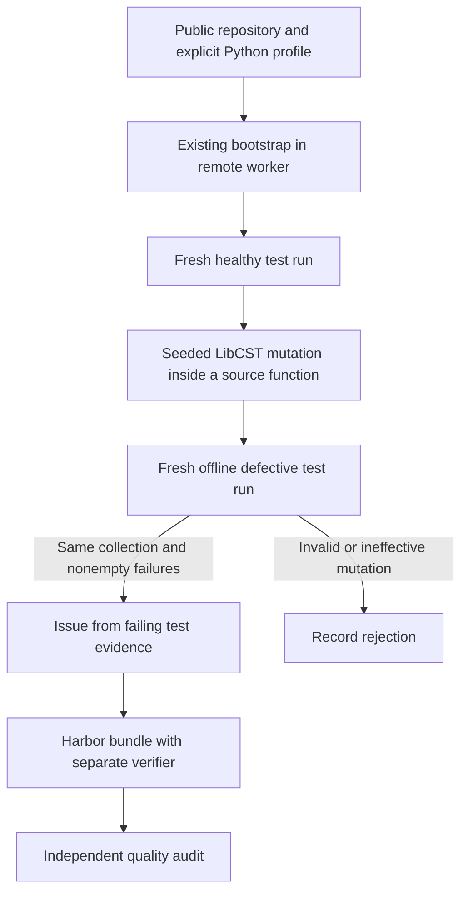

# repo_mutate: SWE-smith procedural recipe

**Status:** experimental; owned generation and Harbor execution pilot. No claim
of a completed 20/100-task quality campaign yet.

The `swe_smith` recipe starts from a healthy Python repository, introduces seeded
single-site defects, and keeps mutations that produce identifiable failures in
the existing test suite. An issue writer describes the observed behavior. The
original implementation supplies the reference repair.

## Method and attribution

Inspired by [SWE-smith](https://github.com/SWE-bench/SWE-smith), MIT, source commit
`9b74ac08118a85c39c356802f7961893af73e07f`. The owned code adapts the procedural
operator/control-flow mutations, execution contrast, and issue-from-test-evidence
stages. It does not implement the upstream LLM rewrite or multi-mutation
combination strategies. See [RFC 0012](../rfcs/0012-swe-smith-recipe.md) and the
packaged `pipelines/recipes/swe_smith/provenance.md` and `UPSTREAM_LICENSE`.



## Run

This experimental route requires a checkout to build the owned worker wheel.
It verifies that the wheel matches the controller's package before uploading it.
No generated code or Docker image is executed on the controller.

```bash
uv sync --extra modal --extra mutation --extra harbor
uv build
uv run repo2rlenv campaign init workspace/smith --budget-usd 25
uv run repo2rlenv workers start --campaign workspace/smith --provider modal \
  --name smith-worker --reserve-usd 3 --timeout-sec 3600
uv run repo2rlenv generate --config examples/owned-swe-smith.yaml
```

Use `--no-ui` before `generate` for plain progress, or `generate --json` for JSON
Lines. The same typed events drive the Rich display and durable journal.

The sample targets one execution-valid candidate before issue generation. It
uses a pinned revision of more-itertools, a public CPU-only pytest profile.
Change the source/test paths, build dependencies and installation command for a
different repository. The recipe currently supports public GitHub repositories;
private sources, non-Python mutations and GPU profiles are not implemented.

| Option | Default | Meaning |
|---|---|---|
| `source_paths` | required | Existing Python source files/directories to mutate and collect |
| `test_paths` | required | Trusted pytest files/directories, hidden in the learner image |
| `base_image` | `python:3.12-slim` | Explicit build base; use a digest for reproducibility |
| `dependencies` | `pytest==9.0.3` | Packages installed before the repository |
| `install_command` | `python -m pip install --no-cache-dir -e .` | Profile-specific installation |
| `seed` | `24` | Mutation ordering seed |
| `max_candidates` | `100` | Maximum mutation executions |
| `max_per_entity` | `2` | Maximum execution-valid mutations per function |
| `test_timeout_sec` | `90` | Deadline for each clean test run |
| `target` | `20` | Target execution-valid candidates; not accepted tasks |

## What grading receives

Both learner and verifier build contexts start with the defective source. The
learner image omits the configured test paths and has no Git history. The
reference lives only under `solution/`. Harbor collects the allowed Python source
files into a fresh verifier environment. Test files, interpreter, configuration
and reward writer are not copied from the learner.

The trusted parent launches pytest as an unprivileged user and checks a nonempty,
exact expected set of passing test identities. Empty reports, missing tests,
collection errors and contradictory exit codes cannot produce success. This
reduces common verifier shortcuts; arbitrary Python can still attack an in-process
test runner, so attack probes and trace review remain acceptance requirements.

## Recovery

Run receipts live at `execution.campaign_dir/runs/execution.run_id`. An explicit
`generate --resume --config ...` observes an already-dispatched remote job and
reuses matching completed model responses. It does not silently repeat an
uncertain model request. Changing configuration or worker code requires a new
run ID. An interrupted worker launch with no recoverable identity requires
provider reconciliation, not a blind retry.

Keep the worker running until generation evidence has been downloaded, then use
`workers stop`. Completed exports and quality reports have different identities
and lifecycles; editing a task invalidates its prior quality evidence.

## Pilot evidence

The first owned candidate at more-itertools revision
`9ed3dbb0ae527230cd156d91d0af305478558fba` caused an intended failure with 749
baseline passing test identities. Its emitted Harbor task returned 0 for nop and
1 for two fresh oracle trials through the remote offline adapter. The instruction
still required semantic review and repair; these results establish execution
contrast, not training-quality acceptance or population yield.

The first generation campaign now has 24 distinct exports from 29 mutation
attempts. Twenty exports have also passed fresh Harbor checks (nop 0, oracle 1)
on Modal. These are generation results; quality acceptance remains pending.
