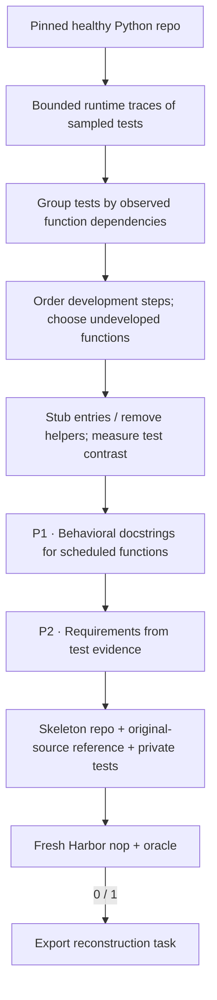

# `repo_reconstruct / swe_flow`

SWE-Flow creates reconstruction tasks from a working repository's execution
dependencies. It does not need PR history.

The September expansion completed **100 Harbor tasks** across seven Python
repositories (24 retained, 76 new). All 76 new exports have hash-matched baseline
reward 0 and reference reward 1. Expansion cost was **$22.91**, approximately
**$0.30 per new export**, including failed attempts and estimated worker/build
costs. Two pilot instructions retain known specification issues: published copies
carry `evaluation.status = "needs_repair"`, with the original exports preserved.
The [published manifest](https://huggingface.co/datasets/HuggingEnvs/repo2rlenv-swe-flow/resolve/main/manifest.json) records source
diversity, costs and both findings. These generation checks do not establish
independent quality acceptance for the collection.
The complete bundles are published as
[HuggingEnvs/repo2rlenv-swe-flow](https://huggingface.co/datasets/HuggingEnvs/repo2rlenv-swe-flow).

## Pipeline, step by step

`P1`, `P2`, … identify actual model calls. Unlabelled stages are code or remote execution.

**Observe dependencies.** Runtime traces collect which supported functions each sampled test uses. Incomplete traces are excluded; groups are ordered by dependency count.

**Choose a development step.** A task introduces only not-yet-developed functions. Entry points keep signatures; new helpers are removed. The full configured suite checks healthy and skeleton states.

**Write two views of the requirement.** P1 consumes scheduled function source. P2 receives those generated public docstrings, the complete scheduled functions and test evidence, including parametrization decorators. It reconciles public behavior and limits requirements to the missing functions. The generated docstrings are checked for exactly one entry per scheduled node_id before insertion.

## Every prompt and its data

Two author calls per candidate: docstrings and specification. Tracing and dependency scheduling use no LLM.

| Call | System prompt composition | User / input material | Output | Retry or branch |
|---|---|---|---|---|
| P1 · Docstrings | docstring_prompt.md + first two docstring demonstrations + adaptation | candidate.functions, indexed by node_id. | Docstrings: functions[{node_id, docstring}] | Names must match scheduled nodes exactly once. |
| P2 · Specification | specification_prompt.md + first two specification demonstrations + adaptation | candidate.test_evidence, P1 public docstrings, complete scheduled functions and scope constraints. | Specification: markdown | A separate call; bounded correction rejects private fixture/test references. |

Read the [complete swe_flow prompt reference](https://huggingface.github.io/Repo2RLEnv/pipelines/prompts/swe_flow/) for every retained template, appended instruction, substitution, example and output schema. The [shared prompt guide](prompt_reference.md) explains how to inspect the fully resolved request from a real run.

## Follow one task

Illustration: tests exercise a public iterator helper and two internal helpers. A development step removes the newly required implementations, retains the rest of the repository, and asks the learner to implement the specified behavior.

## What repeats, what is checked

Trace limits are trace_max_tests and trace_seed; no model repairs a failed trace. Authoring or Harbor failures skip the candidate. This profile does not loop back and rewrite the schedule after a failed solver rollout.

An exported bundle is a generation result. Independent leakage review, shortcut probes and blind solver traces belong to the later quality campaign.

## Implementation map

- [`swe_flow/worker.py`](https://github.com/huggingface/Repo2RLEnv/blob/main/src/repo2rlenv/pipelines/recipes/swe_flow/worker.py)
- [`swe_flow/schedule.py`](https://github.com/huggingface/Repo2RLEnv/blob/main/src/repo2rlenv/pipelines/recipes/swe_flow/schedule.py)
- [`swe_flow/author.py`](https://github.com/huggingface/Repo2RLEnv/blob/main/src/repo2rlenv/pipelines/recipes/swe_flow/author.py)
- [`repository/export.py`](https://github.com/huggingface/Repo2RLEnv/blob/main/src/repo2rlenv/pipelines/recipes/repository/export.py)
- [`swe_smith/grade.py`](https://github.com/huggingface/Repo2RLEnv/blob/main/src/repo2rlenv/pipelines/recipes/swe_smith/grade.py)

## Run and supported profile

Run `repo2rlenv generate --config examples/owned-swe-flow.yaml`. Cloud workers,
campaign budgets, resume receipts and the Rich/JSON CLI use the
[shared owned recipe interface](owned_recipes.md).

The first profile supports top-level synchronous Python functions in supplied
source paths. Tracing samples 128 tests with seed 24 by default. Each traced test
has a five-second profiling window; incomplete traces do not enter scheduling.
The healthy and skeleton states still run the complete configured test suite.
Additional threads, subprocesses, classes and asynchronous functions require
another tracing profile.

Tests with the same observed function dependencies form a group. Groups are
ordered by dependency count; each step introduces only previously undeveloped
functions. Entry points retain their signatures and receive generated behavioral
docstrings. Newly introduced helper implementations are removed. The reference
restores the original source. The remaining repository supplies realistic context.

Two separate model stages generate function docstrings and test-grounded task
requirements using the upstream prompts. Fresh Harbor checks establish an
unsolved baseline and working reference. The initial 20-task target has expanded to **100 generated tasks**;
independent quality review, attack checks and model rollouts come later.

Options extend the Python build/source/test profile with `target`,
`max_candidates`, `trace_max_tests` and `trace_seed`. Every trace, schedule, source
snapshot, model request and trial stays in the campaign evidence directory.

Credit: [SWE-Flow](https://github.com/Hambaobao/SWE-Flow), MIT, commit
`7da5b046fa1dc184674e4e94a9989be56c39e4e7`, and
[SWE-Flow-Trace](https://github.com/Hambaobao/SWE-Flow-Trace). See
[RFC 0016](../rfcs/0016-swe-flow-recipe.md) and the packaged
`recipes/swe_flow/provenance.md` for implementation differences.
