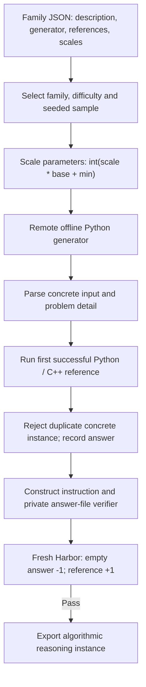

# `reasoning_synth / scaler`

SCALER expands released parameterized problem families into concrete reasoning
tasks. It uses the supplied generator and reference programs without an LLM call.

## Pipeline, step by step

**Expand a family.** Load native generator/reference definitions as data. Select a difficulty and random seed, map difficulty to a scale, and calculate each parameter. Supplied code is never executed on the controller.

**Compute a concrete answer.** Run the generator and reference in bounded offline remote containers. Record input, parameters, actual seed, code hash and answer. Duplicate concrete instances are rejected.

**Create the learner contract.** instruction_for combines the family description and concrete input. The learner writes a boxed answer to /workspace/answer.txt; a separate verifier applies the active native math-verify route.

## Every prompt and its data

Zero LLM calls. All task content comes from released family definitions and deterministic program execution.

| Call | System prompt composition | User / input material | Output | Retry or branch |
|---|---|---|---|---|
| No model prompt | instruction_for in scaler/families.py | Family description, concrete input dictionary and optional native instruction. | Learner instruction.md, assembled as text | This is task text, not an API call. |

Read the [complete scaler prompt reference](prompts/scaler.md) for every retained template, appended instruction, substitution, example and output schema. The [shared prompt guide](prompt_reference.md) explains how to inspect the fully resolved request from a real run.

## Follow one task

Illustration: a hotel-room allocation family generates one sequence of arrival/departure operations. The reference computes that instance’s final allocation. The task asks the learner to compute the concrete answer; it is not a repository patch task.

## What repeats, what is checked

The generator has at most max_generator_attempts (default three) per sampled instance. Supported references are Python and C++17. A reference timeout rejects the candidate. Harbor export requires native -1/+1 parity. This profile expands released families; it does not synthesize new families or reproduce adaptive training.

An exported bundle is a generation result. Independent leakage review, shortcut probes and blind solver traces belong to the later quality campaign.

## Implementation map

- [`scaler/families.py`](https://github.com/huggingface/Repo2RLEnv/blob/codex/owned-generation-pipelines/src/repo2rlenv/pipelines/recipes/scaler/families.py)
- [`scaler/worker.py`](https://github.com/huggingface/Repo2RLEnv/blob/codex/owned-generation-pipelines/src/repo2rlenv/pipelines/recipes/scaler/worker.py)
- [`scaler/pipeline.py`](https://github.com/huggingface/Repo2RLEnv/blob/codex/owned-generation-pipelines/src/repo2rlenv/pipelines/recipes/scaler/pipeline.py)
- [`scaler/export.py`](https://github.com/huggingface/Repo2RLEnv/blob/codex/owned-generation-pipelines/src/repo2rlenv/pipelines/recipes/scaler/export.py)
- [`scaler/grade.py`](https://github.com/huggingface/Repo2RLEnv/blob/codex/owned-generation-pipelines/src/repo2rlenv/pipelines/recipes/scaler/grade.py)

## Run and supported profile

Run `repo2rlenv generate --config examples/owned-scaler.yaml`. The input is a native
mapping such as the released `SCALER-data/train/SCALER-8.json`, or the same format
with user-supplied families. All supplied code executes inside offline containers
on Modal or Daytona. The controller only reads JSON and packages artifacts.

`difficulties`, `samples_per_difficulty`, `seed`, `target`, `max_candidates` and
execution bounds control the batch. Input hashes, actual random seeds, scaled
parameters and reference-code hashes are recorded. Duplicate concrete instances
are rejected. The first target is **20 distinct reasoning tasks**; this is not a
claim of twenty new families or twenty repository coding tasks.

The learner writes its boxed answer to `/workspace/answer.txt`. A separate
verifier applies the active upstream math-verify metric and preserves its native
−1/+1 reward. The reference answer never enters the learner image. Generation
checks confirm execution and packaging; detailed quality acceptance comes later.

This profile expands existing families. Fresh-family synthesis, adaptive
difficulty training and the verl training stack are outside its scope. See the
[shared CLI and cloud guide](owned_recipes.md).

Credit: [SCALER](https://github.com/ALEX-nlp/SCALER), Apache-2.0, commit
`60c6c5037866c718f4c001ea338f9c5a91cb01ae`.
[RFC 0026](../rfcs/0026-scaler-recipe.md) and packaged
`recipes/scaler/provenance.md` map the source and runtime adaptations.
