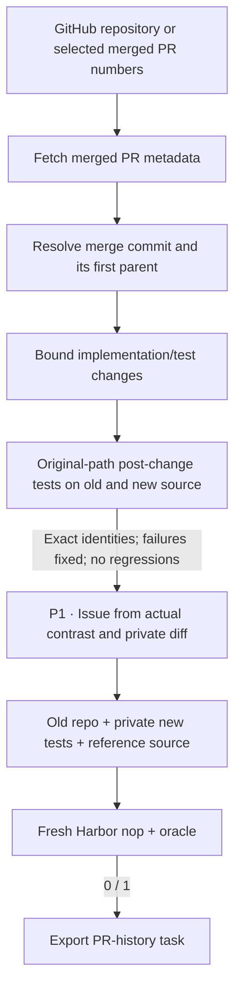

# `pr_runtime / swe_next`

SWE-Next turns real historical code changes into repository repair tasks.

## Pipeline, step by step

`P1`, `P2`, … identify actual model calls. Unlabelled stages are code or remote execution.

**Mine merged history.** Resolve each selected PR to the merge commit and its first parent. This is distinct from SWE-gen’s supplied-PR-head source reversal.

**Choose and run tests.** The supported profile uses bounded edits to existing Python implementation files and changed test files. Post-change tests keep their original paths. Healthy/new and old source must produce comparable nonempty test identities.

**Author from verified evidence.** The author receives the evaluated candidate, including private diff and failure evidence. Its analysis stays private; only the instruction is exposed to the learner.

## Every prompt and its data

One issue-author call after a candidate passes remote old/new execution contrast.

| Call | System prompt composition | User / input material | Output | Retry or branch |
|---|---|---|---|---|
| P1 · Historical issue | instruction_prompt.md + issue_examples.json + shared history adaptation | Evaluated candidate.json: metadata, source changes, profile and observed test contrast. | HistoricalIssue: analysis, instruction | One call; analysis is not copied into instruction.md. |

Read the [complete swe_next prompt reference](prompts/swe_next.md) for every retained template, appended instruction, substitution, example and output schema. The [shared prompt guide](prompt_reference.md) explains how to inspect the fully resolved request from a real run.

## Follow one task

Illustration: a merged PR fixes boundary behavior and adds tests. The old repository is the task state, the new tests are private, and the post-change source is the repair oracle.

## What repeats, what is checked

The shared history worker evaluates each eligible change. Bootstrap, unsupported paths and contrast failures reject a candidate before issue writing. This profile intentionally requires exact test identities rather than the native intersection/file-level fallback; the author is not asked to repair an unbuildable repository.

An exported bundle is a generation result. Independent leakage review, shortcut probes and blind solver traces belong to the later quality campaign.

## Implementation map

- [`history/source.py`](https://github.com/huggingface/Repo2RLEnv/blob/codex/owned-generation-pipelines/src/repo2rlenv/pipelines/recipes/history/source.py)
- [`history/selection.py`](https://github.com/huggingface/Repo2RLEnv/blob/codex/owned-generation-pipelines/src/repo2rlenv/pipelines/recipes/history/selection.py)
- [`history/worker.py`](https://github.com/huggingface/Repo2RLEnv/blob/codex/owned-generation-pipelines/src/repo2rlenv/pipelines/recipes/history/worker.py)
- [`history/pipeline.py`](https://github.com/huggingface/Repo2RLEnv/blob/codex/owned-generation-pipelines/src/repo2rlenv/pipelines/recipes/history/pipeline.py)
- [`repository/export.py`](https://github.com/huggingface/Repo2RLEnv/blob/codex/owned-generation-pipelines/src/repo2rlenv/pipelines/recipes/repository/export.py)

## Run and supported profile

Run `repo2rlenv generate --config examples/owned-swe-next.yaml`.
The first profile supports public GitHub Python repositories and ordinary pytest
files. Source paths, dependency installation and test roots are explicit. All
repository execution and image builds run on the configured Modal or Daytona worker.

The default original-path test layout is retained. Quarterly LLM environment profiles are replaced by an explicit dependency profile and the existing content-addressed bootstrap cache. The native intersection/file-level comparison fallback is deliberately replaced by exact nonempty test identity equality for this generation profile.

`target`, `max_candidates`, `history_limit` and change-size bounds control the run.
`max_prs` bounds API discovery; optional `pr_numbers` selects explicit merged PRs.
The first target is **20 generated tasks**. The runtime records source exclusions,
bootstrap failures and execution results. A reference success is a generation
check; detailed quality acceptance follows the full campaign.

The export carries the old repository context, private post-change tests, a
reference repair and deterministic test reward. Changed source files must already
exist; added/deleted implementation files and specialized test runners need a
separate supported profile. Dependencies are available before offline solving.

Credit: [SWE-Next](https://github.com/TIGER-AI-Lab/SWE-Next), Apache-2.0,
commit `b55c0841f364f9fe7363b2012cd0ae8d8afdf872`. See
[RFC 0023](../rfcs/0023-swe-next-recipe.md), the packaged `recipes/swe_next/provenance.md`,
and the [shared CLI and cloud guide](owned_recipes.md).
