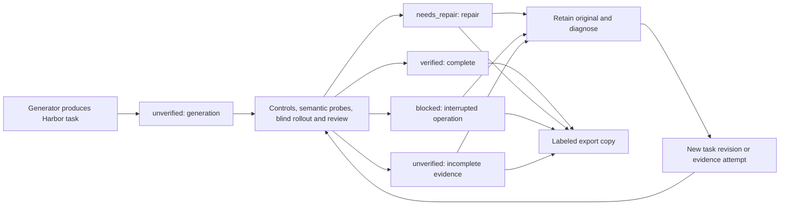

# Retain every generated task, with evidence labels

Every emitter writes the same `[metadata.repo2env.evaluation]` table in `task.toml`.
Generation starts at `unverified`; a saved quality result can promote the task to
`verified`. Defective and interrupted tasks remain available for diagnosis and
repair. A label describes the evidence currently retained for one executable
bundle. Reading a label alone does not prove that evidence is present or sound.



## Uniform meanings

| Status | Meaning | Typical reason codes |
| --- | --- | --- |
| `unverified` | Generated, partially checked, or missing decisive evidence. | `validation_not_run`, `validation_incomplete`, `evidence_missing` |
| `verified` | The retained quality result and execution evidence meet its stated profile. | `quality_verified` |
| `needs_repair` | Review or execution found a task, reference, verifier or probe defect. | `quality_defect` |
| `blocked` | An operational limit prevents completing the attempt. | `budget_exhausted`, `runtime_incompatible`, `provider_failure` |

`stage` is separate from status: `generation`, `bootstrap`, `construction`,
`review`, `controls`, `probes`, `rollout`, `repair`, `complete`, or `unknown`.
The quality importer reports its own last completed stage; a campaign controller
can record a more specific bootstrap or provider diagnosis when available.

`reason_codes` are unique `snake_case` identifiers for filtering. Use an existing
code when its meaning fits; add a specific code for a new diagnosis. `detail`
contains the actual finding and the next useful diagnostic step. Missing original
trial files add `evidence_unavailable`; they never imply a successful validation.

`provenance` describes human or supervising-agent involvement: `assisted`,
`unattended`, or `unknown`. The default is `unknown`. A missing intervention log is
insufficient to claim an unattended run. A legitimate solver failure can still
belong to a verified task; passing the solver is not the task quality criterion.

## What is stored

The initial table is deterministic, so repeatable generation produces the same
configuration bytes:

```toml
[metadata.repo2env.evaluation]
schema_version = "1"
status = "unverified"
stage = "generation"
reason_codes = ["validation_not_run"]
detail = "Generated task; validation has not been established."
provenance = "unknown"
evidence = []
```

After review, the same schema adds:

| Field | Purpose |
| --- | --- |
| `checked_at` | Timezone-aware timestamp of this evidence check. Omitted before a check. |
| `subject_bundle_hash` | Exact executable task identity to which the label applies. |
| `profile` | Quality policy used, currently `practical-generation-v1`. |
| `evidence` | Quality result and trial paths, SHA-256 digests, subject bundle hashes, and preserved original Harbor checksums when available. |
| `source_task_path` | The source of a labeled historical copy. |
| `source_task_toml_sha256` | Original configuration bytes before the annotation was added. |

Probe evidence retains its own variant hash and must have a preserved probe
manifest linking that variant to the reviewed task. It is never rewritten to
pretend that a deliberately mutated reference was the original task.

## Identity and evidence preservation

Repo2RLEnv excludes **only** `metadata.repo2env.evaluation` and the already excluded
`bundle_hash` field when computing its executable bundle identity. Existing
unlabeled hashes stay compatible. Changing instructions, tests, reference files,
environment configuration, permissions or other metadata changes the identity
and prevents reuse of old evidence.

Harbor's physical directory checksum includes `task.toml`, so it **does change**
after adding a label. Historical labeling writes an atomic copy to a new directory
and records the original configuration digest. It does not edit source tasks,
raw trial records, stored Harbor checksums or completed quality results. Keep the
original task and evidence alongside any labeled corpus export. Local evidence
paths must be packaged or deliberately remapped when distributing that corpus;
the referenced content hashes must remain unchanged.

The importer checks baseline/reference contrast, both wrong-solution and valid-
alternative probes, reviewed legitimate rollout outcomes, raw result digests,
recorded rewards and agent identities, controller receipt bindings and probe
creation/completion evidence. An apparently usable result with missing or altered
proof cannot produce a verified label. Nonaccepted attempts can still be retained
with an unavailable-evidence diagnosis.

## CLI

```bash
# Preserve an incomplete task and record an operational diagnosis.
repo2rlenv tasks label ./attempt/task --out ./catalog/task \
  --status blocked --stage bootstrap --reason-code runtime_incompatible \
  --detail "Verifier used the wrong interpreter; rebuild and rerun controls." \
  --provenance assisted

# Derive acceptance from the retained quality result and execution evidence.
repo2rlenv tasks label ./quality/revisions/r1/task --out ./catalog/reviewed-task \
  --quality-result ./quality/result.json --provenance assisted

repo2rlenv tasks show ./catalog/reviewed-task --json
repo2rlenv tasks list ./catalog --status needs_repair
repo2rlenv tasks list ./catalog --status unverified --json
```

`--status verified` is deliberately unavailable: import checked evidence with
`--quality-result`. Existing destinations are never overwritten. Publishing a
fresh labeled revision keeps the prior task and its diagnosis available.

## Pipeline integration

After a quality run saves `result.json`, it publishes a labeled copy under
`quality/labeled/<result-digest>/<task-name>` and writes `labeled-task.json` with
the output path. Repeating publication checks the same evidence and reuses that
copy. An export failure is recorded separately and preserves the completed
quality result. Tasksmith's CLI shows the labeled copy when it is available.

Repairs and semantic probes invalidate the inherited evaluation when their
executable identity changes. They begin as unverified revisions, with a
`task_changed` reason, until the current revision has been evaluated.

`emitter.evaluation.generated_evaluation()` supplies the shared initial table.
`quality.labels.label_from_quality()` checks a saved result without changing the
task. `write_labeled_copy()` publishes the annotation on a new copy and rechecks
verified evidence before publication. `read_evaluation()` provides a uniform
read API; historical unlabeled tasks read as unverified with unknown provenance.

These operations do not use an LLM, launch a sandbox, import target code or spend
generation budget. The executable task and its evidence remain the source of
truth; a corpus can preserve all generated revisions while separately counting
unique PRs that have verified environments.
