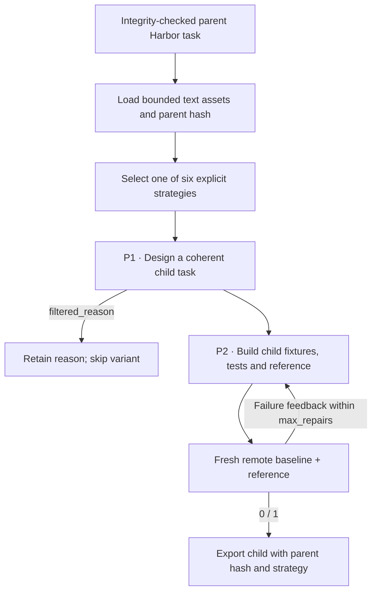

# `task_evolve` — SETA curriculum variants

`seta_evol` reads a complete parent Harbor task and applies an explicit evolution
strategy before rebuilding its fixtures, instruction, reference and tests. Parent
files remain unchanged. Child metadata records the parent bundle hash, strategy
and variant number. The workflow follows
[SETA's evolution pipeline](https://github.com/camel-ai/seta/blob/e4715b01174e6c9503fc46120d81dd692ced75e6/datasynth/evol_pipeline/evol_task_pipeline.py).

## Pipeline, step by step



`P1`, `P2`, … identify actual model calls. Unlabelled stages are code or remote execution.

**Read the complete parent.** The author sees the parent instruction, environment, private tests and reference as private source evidence. The parent bundle hash must still match.

**Select and apply a strategy.** Variants select strategies round-robin: increase, decrease, change context, combined increase/context change, slight increase or slight decrease. There is no model-based difficulty calibration here.

**Rebuild the child.** The builder generates a standalone child using the evolution design, then the common terminal runner validates and executes it. Parent files are not edited.

## Every prompt and its data

Two calls on the first successful attempt: evolution design, then builder. Strategy selection is deterministic.

| Call | System prompt composition | User / input material | Output | Retry or branch |
|---|---|---|---|---|
| P1 · Evolution | evolution_prompt.md + selected strategies/*_adapter.md + owned adaptation | Complete parent files, strategy, parent hash and ordinal variant. | EvolutionDesign: core_capabilities, draft_spec, filtered_reason | A reason filters the variant without building it. |
| P2 · Child builder | builder_prompt.md + shared materialization instructions | Child design and execution/schema feedback. | TerminalDraft | Default initial attempt plus two repairs. |

Read the [complete seta_evol prompt reference](prompts/seta_evol.md) for every retained template, appended instruction, substitution, example and output schema. The [shared prompt guide](prompt_reference.md) explains how to inspect the fully resolved request from a real run.

## Follow one task

Illustration: evolve a log-aggregation task by adding a time-window requirement. The child must change the requested behavior and tests coherently; changing only filenames is not a valid intended transformation.

## What repeats, what is checked

The strategy prompt is applied once per variant. Build retries repair the selected design rather than silently choosing a different strategy. Difficulty labels remain design intentions until later solver measurements.

An exported bundle is a generation result. Independent leakage review, shortcut probes and blind solver traces belong to the later quality campaign.

## Implementation map

- [`seta_evol/recipe.py`](https://github.com/huggingface/Repo2RLEnv/blob/codex/owned-generation-pipelines/src/repo2rlenv/pipelines/recipes/seta_evol/recipe.py)
- [`terminal/runner.py`](https://github.com/huggingface/Repo2RLEnv/blob/codex/owned-generation-pipelines/src/repo2rlenv/pipelines/recipes/terminal/runner.py)
- [`terminal/draft.py`](https://github.com/huggingface/Repo2RLEnv/blob/codex/owned-generation-pipelines/src/repo2rlenv/pipelines/recipes/terminal/draft.py)
- [`terminal/grade.py`](https://github.com/huggingface/Repo2RLEnv/blob/codex/owned-generation-pipelines/src/repo2rlenv/pipelines/recipes/terminal/grade.py)

## Run and supported profile

Use `source.kind: task` with either an owned task directory or a directory of
owned tasks. The current profile requires integrity-checked text assets totalling
at most 150 kB per parent. Binary-heavy and legacy unhashed tasks need a dedicated
input adapter; they are not silently accepted as equivalent inputs.

```bash
repo2rlenv generate --config examples/owned-seta-evol.yaml
```

The shared [terminal generation options](terminal_synth.md) apply, plus:

| Option | Default | Meaning |
|---|---|---|
| `variants_per_parent` | 1 | Distinct variant slots per parent, at most 20 |
| `strategies` | increase, context change, decrease | Round-robin strategy selection |

Exact strategy identifiers are `increase_difficulty`, `decrease_difficulty`,
`change_context`, `increase_difficulty_and_change_context`, `slight_increase` and
`slight_decrease`. The slight strategies are design directions; their effects on
model success rates are unmeasured until the later rollout campaign.

The owned recipe retains the upstream evolution, strategy and builder prompts,
with Apache-2.0 notices. Typed responses, offline execution and owned Harbor/JUnit
materialization replace the upstream agent filesystem interface and legacy task
templates. This is a workflow adaptation, not byte-identical reproduction.

The generation milestone is 20 children with baseline/reference evidence. It does
not imply difficulty calibration or independent quality acceptance. See
[RFC 0014](../rfcs/0014-seta-evol-recipe.md) and the packaged recipe's `provenance.md`.
