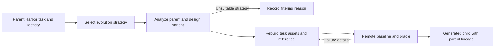

# `task_evolve` — SETA curriculum variants

`seta_evol` reads a complete parent Harbor task and applies an explicit evolution
strategy before rebuilding its fixtures, instruction, reference and tests. Parent
files remain unchanged. Child metadata records the parent bundle hash, strategy
and variant number. The workflow follows
[SETA's evolution pipeline](https://github.com/camel-ai/seta/blob/e4715b01174e6c9503fc46120d81dd692ced75e6/datasynth/evol_pipeline/evol_task_pipeline.py).



Use `source.kind: task` with either an owned task directory or a directory of
owned tasks. The current profile requires integrity-checked text assets totalling
at most 150 kB per parent. Binary-heavy and legacy unhashed tasks need a dedicated
input adapter; they are not silently accepted as equivalent inputs.

```bash
repo2rlenv generate --config examples/owned-seta-evol.yaml
```

The shared [terminal generation options](terminal_synth.md) apply, plus:

| Option | Default | Meaning |
|---|---|---|
| `variants_per_parent` | 1 | Distinct variant slots per parent, at most 20 |
| `strategies` | increase, context change, decrease | Round-robin strategy selection |

Exact strategy identifiers are `increase_difficulty`, `decrease_difficulty`,
`change_context`, `increase_difficulty_and_change_context`, `slight_increase` and
`slight_decrease`. The slight strategies are design directions; their effects on
model success rates are unmeasured until the later rollout campaign.

The owned recipe retains the upstream evolution, strategy and builder prompts,
with Apache-2.0 notices. Typed responses, offline execution and owned Harbor/JUnit
materialization replace the upstream agent filesystem interface and legacy task
templates. This is a workflow adaptation, not byte-identical reproduction.

The generation milestone is 20 children with baseline/reference evidence. It does
not imply difficulty calibration or independent quality acceptance. See
[RFC 0014](../rfcs/0014-seta-evol-recipe.md) and the packaged recipe's `provenance.md`.
