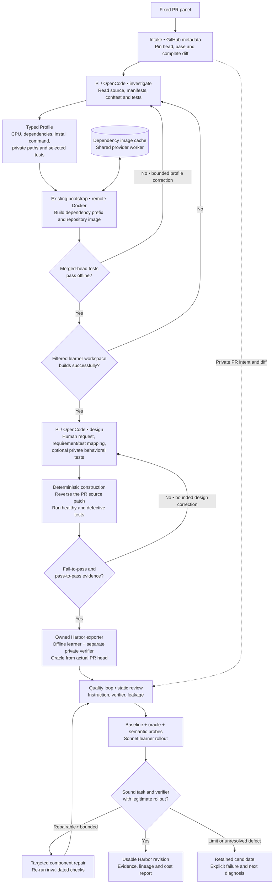

# Tasksmith: a PR to a runnable Harbor task

Tasksmith inspects a merged PR, builds its real repository on Modal or Daytona, designs a human-facing request and deterministic verifier, and runs the shared quality loop. The coding agent is Pi or OpenCode; LangGraph routes the stages. All pipeline and adapter code lives in Repo2RLEnv.

The first supported profile is CPU Python with changes to existing source files. Unsupported source changes are reported explicitly. The first development pilot covered five small PRs: two from `more-itertools`, one from `huggingface_hub`, one from `smolagents`, and one from Click. Its yield is not evidence of universal PR conversion.

The [completed pilot report](tasksmith_cpu_hf_pilot.md) records **5/5 generated and 5/5 usable**, with baseline/reference controls, semantic probes, Sonnet rollouts, repairs, costs and remaining coverage gaps.



The [HF bootstrap and scale campaign](tasksmith_hf_scale.md) extends this work to the supplied 114-PR inventory. All six repositories have passed CPU and GPU-host bootstrap checks; the initial ten-task generation panel is running. GPU-host readiness remains separate from the currently supported CPU task-generation profile.

## What each model is asked

There are two author prompts. Both use a typed `submit_artifact` tool and a smaller `revise_artifact` merge patch after rejected submissions. The only environment tool is a bounded remote shell. The runtimes do not discover controller files, instructions, skills or provider keys.

| Stage | Model receives | Model produces | Deterministic check |
|---|---|---|---|
| Investigation | Frozen source evidence, remote checkout, prior bootstrap error if any | Dependency/test profile with resource rationale | Every PR source file is included; selected tests are private; merged-head tests execute offline |
| Design | Source diff, accepted profile, readiness evidence, prior construction errors | Human request, requirement mapping, optional tests, wrong/valid implementation ideas | Real reference passes; source-reverted code fails comparable tests; adjacent behavior still passes |
| Quality review | Exact emitted task, bounded file reads, available trial traces | Task/verifier/leakage assessments, grounded issues and probes | Evidence hashes match; execution failures override optimistic reviews |
| Repair | Grounded component defects and evidence | Exact edits to an immutable new task revision | Re-run affected controls, probes and rollout under the existing quality policy |
| Sonnet rollout | Public instruction and learner workspace | A source change and complete attempt trace | Hidden verifier runs in a fresh, separate offline container |

Read the exact author prompts: [investigation](prompts/tasksmith.md#investigatemd) and [design](prompts/tasksmith.md#designmd). Review and repair prompts and their evidence selection are documented in [the shared quality loop](quality_loop.md).

## Source and verifier semantics

The learner starts from the pinned PR head with **only the PR's source patch reversed**. This preserves compatible head-era fixtures and dependencies. It is recorded as `head_minus_source_patch`, not represented as an exact base-commit checkout. The oracle restores the actual changed source files from the head.

Full test directories remain private even when pytest selects just a few classes or functions. Release notes and other answer-bearing files can also be excluded from the public workspace. Git history, bytecode and cache directories are stripped; symlinks are rejected. The verifier receives only the allowlisted submitted source files. Tasksmith can add a private behavioral test file, but cannot replace the original oracle with an invented solution.

Generation and acceptance are different counters. `generated` means execution contrast and a Harbor bundle exist. `usable` means `practical-generation-v1` found sound instructions and verification, a failing baseline, passing oracle, rejected wrong implementation, accepted valid alternative and a legitimate learner rollout. A legitimate model failure can still establish a useful task. The old strict acceptance policy is unchanged.

## Running the pilot

Install Python dependencies and the pinned agent runtimes, then build the owned worker wheel:

```bash
uv sync --extra tasksmith --extra modal --extra daytona --extra harbor
uv run repo2rlenv tasksmith install-runtime
uv build --wheel

uv run repo2rlenv tasksmith run configs/tasksmith/cpu-hf-pilot.json \
  --campaign workspace/my-existing-campaign \
  --output workspace/tasksmith-pilot \
  --runtime-wheel dist/repo2rlenv-0.8.8-py3-none-any.whl \
  --env-file .env
```

Use `--provider daytona` for the same remote execution contract, or `--author opencode` for the alternative coding runtime. An `--options` JSON file can set author stage limits and the nested `quality` options, including separate OpenAI/Anthropic review and repair models. The current author bridge routes Anthropic models; author-model support should not be confused with the broader quality-model support.

The tested runtime uses Harbor **0.20.0** and task schema **1.3**. Remote trials use the owned `OfflineDockerEnvironment`, which enforces permanent Docker network isolation and avoids Harbor's dynamic firewall dependency on `nft_fib`, unavailable in the tested Modal kernel. The emitted bundle contains its own Dockerfiles, reference and verifier scripts. This pilot exercises the Modal execution path; the shared Daytona provider and OpenCode runtime remain selectable, with their contracts covered by the repository tests.

`--stop-after 1` runs the first frozen input while keeping five as the report denominator. Repeating the same invocation reuses matching completed artifacts. `tasksmith show OUTPUT` reads the saved report without paid effects. `--json` provides structured CLI output.

For an independent review while retaining Sonnet authoring and rollouts, the example `configs/tasksmith/pilot-options.json` selects the already supported OpenAI reviewer/repair route. Pass it with `--options`; provider/author flags that conflict with that file are rejected.

When the generation is already sound and the review policy improves, reuse the previous artifacts:

```bash
uv run repo2rlenv tasksmith run configs/tasksmith/cpu-hf-pilot.json \
  --generation-run workspace/tasksmith-pilot \
  --options configs/tasksmith/pilot-options.json \
  --campaign workspace/my-existing-campaign \
  --output workspace/tasksmith-recheck \
  --runtime-wheel dist/repo2rlenv-0.8.8-py3-none-any.whl \
  --env-file .env
```

The previous panel must match exactly. Before paid work, the importer checks each task's hash, PR URL, head/base, source diff and containment within the original run directory. It retains previously executed semantic probes, so improving a review does not discard known counterexamples. Generated inputs are reused and the current quality loop runs again. Add `--reuse-evidence` to also import checksum-bound baseline, reference and matching-model solver results from the unchanged bundle. Infrastructure failures are rerun, semantic probes still execute, and an edited revision needs fresh controls. Without the flag, validation runs afresh. Inputs that never produced a task still enter normal generation. A draft with a blocking reference conflict also enters fresh generation; its old probes remain attached to the original draft and are not relabeled. Source and oracle paths remain immutable during Tasksmith quality repairs. Instructions and private verification can change in a new revision. The report retains the source run and task hash.

Tasksmith allows up to four semantic probes, while usually needing only one wrong solution and one valid alternative. Extra capacity preserves a discovered counterexample when a repair also needs a specific laziness or tolerance check. The reviewer sees which controls already exist and must reserve space for the missing control kinds. A blocking defect can be repaired before probe authoring; requests for missing code are serviced before demanding probe scripts.

The reviewer also receives the original PR intent and diff privately. This distinguishes a generated request that invents requirements from a faulty reference. A request that exceeds the PR's scope should be corrected; a real conflict between the PR intent and reference remains a reported defect. Full file hashes are retained in local review inventories, while model context contains compact file paths and sizes instead of repeated hashes and omission notices.

The campaign must already have an explicitly initialized budget. Tasksmith reserves model calls and workers on that same ledger. A per-pilot cap and nested quality cap further bound spending. A stopped worker's cost hold remains until explicitly reconciled; it is not silently counted as zero.

## Caching and recovery limits

Repository readiness uses the existing bootstrap implementation. A separate, source-independent Docker prefix identifies base image and dependency installation layers; subsequent PRs can reuse it on the same provider worker. Source readiness remains bound to the individual head. Bootstrap also builds the filtered public workspace, catching excluded README/build inputs before authoring or quality review. A normal cache survives for the worker lifetime. The HF bootstrap command can preserve the CPU Docker cache in a Modal filesystem snapshot; `worker_snapshot` restores it and `bootstrap_hints` supplies recorded source-free dependencies. Snapshot identity and expiry are recorded, and each PR still needs its own readiness check. The snapshot is an account-scoped cache rather than a public registry image.

LangGraph checkpoints stage state. Artifact receipts additionally bind the schema, prompt, source inputs and runtime. Remote jobs have durable supervisor paths and are observed rather than blindly relaunched after a lost response. An incomplete author call requires reconciliation. Changed configuration or worker code requires a new run directory; previous evidence remains available. Unknown worker creation or termination must be resolved before another worker is allocated.

Bootstrap/design retries receive the previous complete artifact alongside the failure, so they can preserve working fields. The author sees its remaining call allowance after each shell tool result. The last two model calls are reserved for artifact submission and correction; further shell exploration is declined. These limits bound investigation without spending the entire allowance before producing a usable profile.

## Code map and credit

| Responsibility | Owned code |
|---|---|
| CLI, graph, fixed panel and reports | `src/repo2rlenv/tasksmith/{cli,runner,models}.py` |
| Source pins and PR patch selection | `src/repo2rlenv/tasksmith/source.py` |
| Generation provenance and retained controls | `src/repo2rlenv/tasksmith/reuse.py` |
| Deterministic remote stages | `src/repo2rlenv/tasksmith/worker.py` |
| Coding runtime adapters and structured artifact protocol | `src/repo2rlenv/tasksmith/author/` |
| Docker readiness and snapshots | `src/repo2rlenv/bootstrap/`, `execution/python_repository.py` |
| Standalone Harbor packaging | `pipelines/recipes/repository/export.py` |
| Component review, probes, rollouts and repairs | `src/repo2rlenv/quality/loop/` |

This implementation builds on our earlier Tasksmith adapters, PR regression lessons from SWE-bench/SWE-gen and verification lessons from the [owned reproduction pilots](tasksmith_pilot_learnings.md). [LangGraph](https://github.com/langchain-ai/langgraph), [Pi](https://github.com/earendil-works/pi), [OpenCode](https://github.com/anomalyco/opencode) and [Harbor](https://github.com/laude-institute/harbor) provide essential libraries and execution contracts. No research pipeline repository is installed or imported. See [RFC 0028](../rfcs/0028-tasksmith-pr-pilot.md) for milestones and scope.
