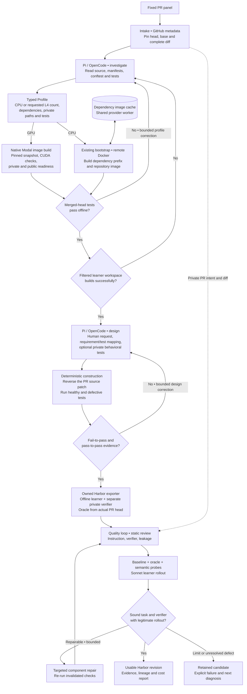

# Tasksmith: turn a PR into a Harbor environment

Tasksmith explores a merged PR, builds its repository remotely, designs a human
request and verifier, and produces a Harbor task with the merged code as its oracle.
LangGraph routes the stages; Pi or OpenCode performs investigation and design.
Pipeline and adapter code is owned by this repository.

Use it for added or modified Python source with behavior that can be tested
offline. Deleted/renamed source and non-Python changes remain unsupported.
CPU execution supports Daytona and Modal. The implemented GPU route uses native
Modal with one or two L4 GPUs; a CPU bootstrap alone does not establish GPU readiness.



## Stage contracts

| Stage | Model receives | Model produces | Deterministic check |
|---|---|---|---|
| Investigation | Frozen source evidence, remote checkout, prior bootstrap error if any | Dependency/test profile with resource rationale | Every PR source file is included; selected tests are private; merged-head tests execute offline |
| Design | Source diff, accepted profile, readiness evidence, prior construction errors | Human request, requirement mapping, optional tests, wrong/valid implementation ideas | Real reference passes; source-reverted code fails comparable tests; adjacent behavior still passes |
| Quality review | Exact emitted task, bounded file reads, available trial traces | Task/verifier/leakage assessments, grounded issues and probes | Evidence hashes match; execution failures override optimistic reviews |
| Repair | Grounded component defects and evidence | Exact edits to an immutable new task revision | Re-run affected controls, probes and rollout under the existing quality policy |
| Sonnet rollout | Public instruction and learner workspace | A source change and complete attempt trace | Hidden verifier runs in a fresh, separate offline container |

Read the exact author prompts: [investigation](https://huggingface.github.io/Repo2RLEnv/pipelines/prompts/tasksmith/#investigatemd) and [design](https://huggingface.github.io/Repo2RLEnv/pipelines/prompts/tasksmith/#designmd). Review and repair prompts and their evidence selection are documented in [the shared quality loop](quality_loop.md).

Read the [prompt stage map](prompt_reference.md) for the effective requests. The
built site also provides a [full source-generated reference](https://huggingface.github.io/Repo2RLEnv/pipelines/prompts/tasksmith/).
Canonical investigation/design prompts and runtime adapters live in
[`src/repo2rlenv/tasksmith`](https://github.com/huggingface/Repo2RLEnv/tree/main/src/repo2rlenv/tasksmith).

## Run one PR

The example panel contains one public PR. Replace it with a suitable merged PR;
use `examples/tasksmith-prs.json` for the same interface with multiple inputs.
Set provider and model credentials in `.env` using the [auth guide](../reference/AUTH.md).
Initialize a budget before any paid execution:

```bash
uv sync --extra tasksmith --extra daytona --extra harbor
uv run repo2rlenv tasksmith install-runtime
uv build --wheel
uv run repo2rlenv campaign init workspace/tasksmith --budget-usd 50
uv run repo2rlenv tasksmith run examples/tasksmith-pr.json \
  --options examples/tasksmith-options.json \
  --campaign workspace/tasksmith \
  --output workspace/tasksmith/run \
  --runtime-wheel dist/repo2rlenv-0.9.0-py3-none-any.whl \
  --env-file .env
uv run repo2rlenv tasksmith show workspace/tasksmith/run --json
```

Use the wheel matching your checkout's version. The $50 cap is an example limit,
not a task-price estimate. `--stop-after 1` stops after one frozen input without
changing the panel's size. Repeating the same invocation reuses matching completed
artifacts. For scheduling across workers, see [batch generation](tasksmith_parallel_campaigns.md).

| Choice | Configuration | Effect |
|---|---|---|
| Coding agent | `author_runtime: pi` or `opencode` | Choose the investigation/design adapter |
| CPU provider | `provider: daytona` or `modal` | Remote Docker build and Harbor execution |
| GPU execution | `examples/tasksmith-gpu-options.json` | Native Modal, one L4; install the `modal` extra |
| Authoring bound | `max_stage_attempts` | Bound profile/design corrections |
| Quality bound | `quality.max_repairs` | Bound review-driven revisions; default 3 |
| Model choice | `author_model` and nested `quality` model settings | Author bridge uses Anthropic; quality supports its broader configured providers |

## What the verifier sees

Task construction reverses the PR's source changes while retaining the merged
reference privately. Requirements must match the PR's behavior. Existing tests
are the starting point; design may supply private behavioral tests for missing
coverage. Added files are absent from the starting source and restored by the oracle.

The learner receives filtered source without Git history, private tests or
answer-bearing files. A separate verifier receives only allowlisted submitted
Python source; new Python helpers are allowed within declared roots. Symlinks,
special files and modifications to fixed non-Python assets are rejected. The
selected upstream test collection is not exposed to the learner.

Both environments execute offline. Required datasets/models must be pinned and
available during build; use small real fixtures or models when they preserve the
behavior. Do not replace a required model with a stub merely to pass readiness.
The generated behavioral-test check rejects direct source-code inspection such
as `inspect.getsource`; this narrow safeguard does not prove behavioral coverage.

## Review, repair and reuse

`generated` means execution contrast and a Harbor bundle exist. Under
`practical-generation-v1`, acceptance additionally needs a sound instruction and
verifier, failing baseline, passing reference, rejected wrong implementation,
accepted valid alternative and a legitimate rollout. The solver may legitimately
fail. See [review and repair](quality_loop.md) and [evaluation labels](task_evaluation_labels.md).

Review receives the PR intent privately, selected verifier evidence, and addressable
rollout tool calls and source changes. A repair creates a new immutable revision
and reruns invalidated checks. Quality repair cannot replace the original PR oracle
or rewrite the learner's starting source. Explicit probe requirements remain part
of the task identity; old trials do not validate a changed requirement.

Bootstrap reuses dependency layers on a provider worker, but still checks each PR's
pinned merged head and filtered learner source. Resource profiles, test selectors
and fixture paths must match the materialized source. Account-scoped snapshots
require recorded identities, expiry and successful restoration; they are not
portable public registry images. See [bootstrap design](../rfcs/0029-tasksmith-hf-scale.md).

Worker/model effects reserve spend before dispatch. Interrupted or ambiguous
requests retain their receipts and holds for reconciliation. They are not blindly
replayed. Native GPU builds and trials happen remotely; CPU fallback is rejected
when GPU execution was requested. The runtime uses Harbor 0.22.0 and emits schema 1.3 tasks.

## Observed results and limits

[HF_ML_Tasksmith](https://huggingface.co/datasets/HuggingEnvs/HF_ML_Tasksmith) contains
50 verified tasks from Accelerate (13), Diffusers (9), PEFT (10), Transformers (5)
and TRL (13). Thirty-nine use CPU, six request one GPU and five request two GPUs.
Sonnet fully solved 19. These results came from an assisted campaign and do not
establish unattended conversion yield. [Economics](economics.md) separates the
measured authoring, review, rollout and compute costs.

The method combines PR regression contrast inspired by SWE-bench/SWE-gen, source
reconstruction lessons from R2E, and execution-grounded behavioral probes.
[RFC 0028](../rfcs/0028-tasksmith-pr-pilot.md) records the design and source ownership.
