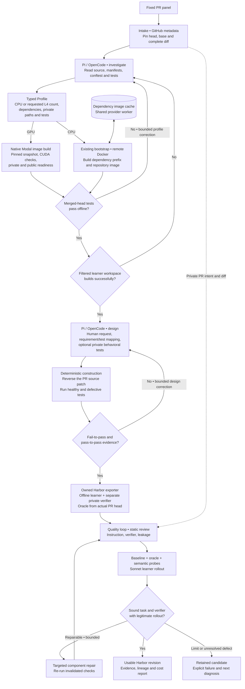

# Tasksmith: a PR to a runnable Harbor task

Tasksmith inspects a merged PR, builds its real repository on Modal or Daytona, designs a human-facing request and deterministic verifier, and runs the shared quality loop. The coding agent is Pi or OpenCode; LangGraph routes the stages. All pipeline and adapter code lives in Repo2RLEnv.

Tasksmith accepts added and modified Python source files. Deleted/renamed source and other languages remain explicit unsupported cases. CPU trials run on Modal or Daytona workers; the thirty-task campaign is testing native Modal execution on one or two L4 GPUs. The first development pilot covered five small PRs: two from `more-itertools`, one from `huggingface_hub`, one from `smolagents`, and one from Click. Its yield is not evidence of universal PR conversion.

The [completed pilot report](tasksmith_cpu_hf_pilot.md) records **5/5 generated and 5/5 usable**, with baseline/reference controls, semantic probes, Sonnet rollouts, repairs, costs and remaining coverage gaps.



The [HF bootstrap and scale campaign](tasksmith_hf_scale.md) extends this work to the supplied 114-PR inventory. All six repositories have passed CPU and GPU-host bootstrap checks, and the initial panel delivered ten accepted CPU tasks. The [audited plan for thirty tasks](tasksmith_scale30.md) records fresh cache restoration, two-GPU runtime checks and twenty additions being attempted. Repository readiness, native execution smoke tests and accepted PR tasks are separate counts.

## What each model is asked

There are two author prompts. Both use a typed `submit_artifact` tool and a smaller `revise_artifact` merge patch after rejected submissions. The only environment tool is a bounded remote shell. The runtimes do not discover controller files, instructions, skills or provider keys.

| Stage | Model receives | Model produces | Deterministic check |
|---|---|---|---|
| Investigation | Frozen source evidence, remote checkout, prior bootstrap error if any | Dependency/test profile with resource rationale | Every PR source file is included; selected tests are private; merged-head tests execute offline |
| Design | Source diff, accepted profile, readiness evidence, prior construction errors | Human request, requirement mapping, optional tests, wrong/valid implementation ideas | Real reference passes; source-reverted code fails comparable tests; adjacent behavior still passes |
| Quality review | Exact emitted task, bounded file reads, available trial traces | Task/verifier/leakage assessments, grounded issues and probes | Evidence hashes match; execution failures override optimistic reviews |
| Repair | Grounded component defects and evidence | Exact edits to an immutable new task revision | Re-run affected controls, probes and rollout under the existing quality policy |
| Sonnet rollout | Public instruction and learner workspace | A source change and complete attempt trace | Hidden verifier runs in a fresh, separate offline container |

Read the exact author prompts: [investigation](prompts/tasksmith.md#investigatemd) and [design](prompts/tasksmith.md#designmd). Review and repair prompts and their evidence selection are documented in [the shared quality loop](quality_loop.md).

## Source and verifier semantics

The learner starts from the pinned PR head with **only the PR's source patch reversed**. This preserves compatible head-era fixtures and dependencies. It is recorded as `head_minus_source_patch`, not represented as an exact base-commit checkout. The oracle restores the actual changed source files from the head.

Submission validation removes undeclared `.py.bak` and `.py~` editor backups
from the verifier's private staging directory after validating all collected
paths. The archived submission keeps those files. Backups cannot replace required
source, bypass file-size or symlink checks, or change immutable assets; other
non-Python additions remain invalid. Harmless backup files therefore do not
prevent the behavioral tests from running.

Full test directories remain private even when pytest selects just a few classes or functions. Release notes and other answer-bearing files can also be excluded from the public workspace. Git history, bytecode and cache directories are stripped; symlinks are rejected. The verifier receives only the allowlisted submitted source files. Tasksmith can add a private behavioral test file, but cannot replace the original oracle with an invented solution.

For added-source tasks, the new files are absent from both starting source snapshots. Oracle restoration creates their parent directories. Harbor collects the declared source directories, allowing independently implemented Python helper modules, plus any explicitly selected standalone Python files such as `example.py`. Selecting a file does not expand collection to its parent directory. These roots cannot overlap private tests/exclusions. An added standalone file may remain absent in the baseline; if supplied, it must pass the same regular-file and size checks as required files. The trusted grader rejects symlinks, unbounded/special files and changed non-Python assets before importing submitted code. Missing feature modules are checked inside behavioral test functions, so an unsolved task produces reward zero instead of a collection exception. Both `modeling_*.py` and `modular_*.py` additions are reversed when present in a Transformers PR.

Generation and acceptance are different counters. `generated` means execution contrast and a Harbor bundle exist. `usable` means `practical-generation-v1` found sound instructions and verification, a failing baseline, passing oracle, rejected wrong implementation, accepted valid alternative and a legitimate learner rollout. A legitimate model failure can still establish a useful task. The old strict acceptance policy is unchanged.

## Running the pilot

Install Python dependencies and the pinned agent runtimes, then build the owned worker wheel:

```bash
uv sync --extra tasksmith --extra modal --extra daytona --extra harbor
uv run repo2rlenv tasksmith install-runtime
uv build --wheel

uv run repo2rlenv tasksmith run configs/tasksmith/cpu-hf-pilot.json \
  --campaign workspace/my-existing-campaign \
  --output workspace/tasksmith-pilot \
  --runtime-wheel dist/repo2rlenv-0.8.8-py3-none-any.whl \
  --env-file .env
```

Use `--provider daytona` for the same remote execution contract, or `--author opencode` for the alternative coding runtime. An `--options` JSON file can set author stage limits and the nested `quality` options, including separate OpenAI/Anthropic review and repair models. The current author bridge routes Anthropic models; author-model support should not be confused with the broader quality-model support.

The tested runtime uses Harbor **0.20.0** and task schema **1.3**. Remote trials use the owned `OfflineDockerEnvironment`, which enforces permanent Docker network isolation and avoids Harbor's dynamic firewall dependency on `nft_fib`, unavailable in the tested Modal kernel. The emitted bundle contains its own Dockerfiles, reference and verifier scripts. This pilot exercises the Modal execution path; the shared Daytona provider and OpenCode runtime remain selectable, with their contracts covered by the repository tests.

Set `gpus` to `1` or `2` in the Tasksmith options JSON to select native Modal GPU execution; `0` retains CPU behavior. The investigator must return a matching GPU profile. A CPU worker inspects and exports the pinned source; target image builds, readiness tests, construction controls and Harbor trials run on native Modal. Both learner and separate verifier declare the L4 resource count in `task.toml`. Unsupported providers fail before dispatch; no CPU fallback is allowed. The CUDA base can use `use_system_site_packages: true` to retain preinstalled CUDA PyTorch in a writable virtual environment. The verifier uses that same interpreter and the provider's CUDA library/device environment.

Each native allocation has a unique provider name, a reservation before dispatch and an explicit termination receipt. An uncertain create is not retried blindly. A reservation denied by the budget stops the stage before provider dispatch and remains a budget failure; it does not become a request to repair the task or reconcile a nonexistent sandbox. A separate uncertain allocation still requires reconciliation. Build failures retain their cost estimate and image logs. Native trials use Harbor's own Modal execution and artifact transfer under an owned accounting adapter; the controller does not build images or execute target Python locally. This path is undergoing campaign validation; its presence in the code is not a claim that all selected GPU PRs already pass.

The [recorded execution checks](evidence/tasksmith-scale30-native-contract.json) passed on two L4s: baseline reward 0, reference 1, wrong solution 0 and a blind Sonnet rollout 1. Both learner and verifier allocations were offline and terminated. A separate native bootstrap check passed three CUDA/offline tests. The CPU added-module check also accepted a valid implementation using a new helper file. These are small harness fixtures, not additions to the accepted PR-task count.

GPU task exports collect each allowed source directory in one transfer. Transferring dozens of individual Python files caused substantial provider overhead in the first real PR trial. Directory transfer retains required original files and hashes of fixed non-Python assets, while allowing new Python helpers. Imported GPU bundles can enter review without starting a CPU inspection worker. Cancellation propagates out of the campaign even when an allocation needs reconciliation; uncertain provider costs remain reserved.

`--stop-after 1` runs the first frozen input while keeping five as the report denominator. Repeating the same invocation reuses matching completed artifacts. `tasksmith show OUTPUT` reads the saved report without paid effects. `--json` provides structured CLI output.

For an independent review while retaining Sonnet authoring and rollouts, the example `configs/tasksmith/pilot-options.json` selects the already supported OpenAI reviewer/repair route. Pass it with `--options`; provider/author flags that conflict with that file are rejected.

When the generation is already sound and the review policy improves, reuse the previous artifacts:

```bash
uv run repo2rlenv tasksmith run configs/tasksmith/cpu-hf-pilot.json \
  --generation-run workspace/tasksmith-pilot \
  --options configs/tasksmith/pilot-options.json \
  --campaign workspace/my-existing-campaign \
  --output workspace/tasksmith-recheck \
  --runtime-wheel dist/repo2rlenv-0.8.8-py3-none-any.whl \
  --env-file .env
```

The previous panel must match exactly. Before paid work, the importer checks each task's hash, PR URL, head/base, source diff and containment within the original run directory. It retains previously executed semantic probes, so improving a review does not discard known counterexamples. Generated inputs are reused and the current quality loop runs again. Add `--reuse-evidence` to also import checksum-bound baseline, reference and matching-model solver results from the unchanged bundle. Infrastructure failures are rerun, semantic probes still execute, and an edited revision needs fresh controls. Without the flag, validation runs afresh. Inputs that never produced a task still enter normal generation. A draft with a blocking reference conflict also enters fresh generation; its old probes remain attached to the original draft and are not relabeled. Source and oracle paths remain immutable during Tasksmith quality repairs. Instructions and private verification can change in a new revision. The report retains the source run and task hash.

Tasksmith allows up to four semantic probes, while usually needing only one wrong solution and one valid alternative. Extra capacity preserves a discovered counterexample when a repair also needs a specific laziness or tolerance check. The reviewer sees which controls already exist and must reserve space for the missing control kinds. A blocking defect can be repaired before probe authoring; requests for missing code are serviced before demanding probe scripts.

For a compilation PR, explicitly set `"required_probe_focus": ["compiled_execution"]`
in the Tasksmith options. The designer must exercise the compiled callable with
small deterministic inputs, numerical expectations and gradients where training is
in scope. Review requires a wrong implementation that retains valid wrappers and
shapes but corrupts runtime results. Merely constructing `OptimizedModule` objects
does not establish execution coverage.

The requirement is stored in
`metadata.repo2env.quality_requirements.probe_focus`, which participates in the task
hash. Adding it creates a separate `quality-input` snapshot and resets evaluation;
old trials and probes cannot validate that new identity. The original task and its
evidence remain available. Empty options preserve existing behavior and historical
acceptance; compilation coverage is not inferred from the word “lazy.”

The reviewer also receives the original PR intent and diff privately. This distinguishes a generated request that invents requirements from a faulty reference. A request that exceeds the PR's scope should be corrected; a real conflict between the PR intent and reference remains a reported defect. Full file hashes are retained in local review inventories, while model context contains compact file paths and sizes instead of repeated hashes and omission notices.

Every rollout also produces an addressable tool-call index and a diff computed from captured source artifacts against the starting workspace. The index retains middle-of-run edits even when the raw trajectory exceeds the initial context allowance. Large documents are explicitly marked partial and can be requested by range/search. Failed artifact collection is labeled as failed collection, not interpreted as a learner deletion.

The campaign must already have an explicitly initialized budget. Tasksmith reserves model calls and workers on that same ledger. A per-pilot cap and nested quality cap further bound spending. A stopped worker's cost hold remains until explicitly reconciled; it is not silently counted as zero.

## Caching and recovery limits

Repository readiness uses the existing bootstrap implementation. A separate, source-independent Docker prefix identifies base image and dependency installation layers; subsequent PRs can reuse it on the same provider worker. Source readiness remains bound to the individual head. Failed native snapshot preparation returns its original cleanup diagnostic while keeping the incomplete snapshot remote; archive-link rejection must not hide a repairable profile error. Initial inspection records every tracked symlink without following its target. Profile validation requires the identified document links before starting Docker, so omitted links can be corrected within authoring. Snapshot cleanup still validates actual targets and refuses unsupported links. Bootstrap also builds the filtered public workspace, catching excluded README/build inputs before authoring or quality review. A normal cache survives for the worker lifetime. The HF bootstrap command can preserve the CPU Docker cache in a Modal filesystem snapshot; `worker_snapshot` restores it and `bootstrap_hints` supplies recorded source-free dependencies. Snapshot identity and expiry are recorded, and each PR still needs its own readiness check. The snapshot is an account-scoped cache rather than a public registry image.

Before a dependency build or native GPU allocation, readiness selector file
prefixes are checked against the materialized, pinned source snapshot. Existing
files, directories and selectors with test node names are supported. A proposed
future test file is rejected with its exact profile field and missing path;
new private tests belong to the design stage. This check imports no target code.
Pytest later validates node names and executes the actual readiness tests.
CPU preflight uses a temporary snapshot that is removed before the build rather
than publishing a second repository copy.

To preserve an exact PR's successful build recipe, pass `prepared_profiles` through the existing `--options-json` file (or a batch candidate's options). Key each entry by its frozen source ID and include `url`, `head`, `base`, `source_diff_sha256`, `workspace_strategy`, and the complete `profile` object. Tasksmith validates this binding, CPU/GPU selection and source coverage before remote work, then skips the first investigation and runs a fresh bootstrap. It still checks document links, readiness, construction and quality; no earlier execution evidence is imported. A new bootstrap failure can enter the existing bounded profile-repair loop. A prepared profile also avoids unrelated repository-hint dependency preparation. The full profile participates in the frozen run configuration, so changing it requires a new output directory.

A batch candidate with a `prepared_task` can also provide `prepared_probes`: an
inline `ProbeManifest` containing that task's `bundle_hash` and semantic probe
definitions. This preserves useful incorrect implementations and valid
alternatives for fresh execution after an assisted repair. The manifest contains
definitions only; historical trial results and rewards are not accepted.
Tasksmith checks the task identity, unique probe names, probe count and required
focus before starting a provider worker. Required focus must already be annotated
on the prepared task before calculating the binding hash. The definitions are
frozen with the run configuration, so changing them requires a new output directory.

The experimental batch runner supports up to eight independent PR controllers
through `max_parallel`, with a separate `max_gpu_parallel` ceiling. These are
cloud job limits, independent of the number of interactive coding subagents.
Each job retains its own source, sandbox and evidence; all jobs share the campaign
ledger and nested spending limits. Initial worker affordability does not guarantee
enough remaining budget for later model calls or GPU trials. Allow room for those
stages when choosing concurrency. A running batch uses a frozen plan: to change
concurrency or runtime, write `drain-request.json` in its output directory, let
active jobs finish, reconcile their receipts, and create a new continuation.

LangGraph checkpoints stage state. Artifact receipts additionally bind the schema, prompt, source inputs and runtime. Remote jobs have durable supervisor paths and are observed rather than blindly relaunched after a lost response. An incomplete author call requires reconciliation. Changed configuration or worker code requires a new run directory; previous evidence remains available. Unknown worker creation or termination must be resolved before another worker is allocated.

Bootstrap/design retries receive the previous complete artifact alongside the failure, so they can preserve working fields. The author sees its remaining call allowance after each shell tool result. The last two model calls are reserved for artifact submission and correction; further shell exploration is declined. These limits bound investigation without spending the entire allowance before producing a usable profile.

Dependency and public-image builds retain private stdout and stderr on failure or
timeout as well as success. The retry feedback includes selected exception lines
alongside the beginning and end of each stream, so a long echoed Docker command
does not hide the underlying failure. Retained streams redact credentials and are
capped at 4 MiB each; a checksum receipt explicitly records any truncation. Build
commands, timeouts and cache identities are unchanged.

## Offline model and tokenizer assets

Choose the smallest faithful task fixture. Trainer bookkeeping, loss computation and
parameter updates usually need a real tiny locally initialized model and local
dataset. Tokenizer parsing or pretrained-weight behavior can instead require real
files. Declare those as `options.hub_assets` in the investigated profile: a public
`repo_id`, immutable 40-character `revision`, exact `filenames`, `max_bytes` and
`purpose`. Include a compatible `huggingface-hub==` pin in `dependencies`.

The remote image builder checks file sizes before downloading and fetches only the
declared model/tokenizer data, including standalone chat templates when required.
It records file hashes in `/opt/tasksmith-hf/hub/tasksmith-assets.json`. Its offline
`main` alias resolves to the declared commit, so upstream tests that omit a revision
can use the prepared cache. No provider token is forwarded to this public download.
Missing or gated assets require a different prepared fixture. Pinning and cache
lookup follow the [Hub download contract](https://huggingface.co/docs/huggingface_hub/en/guides/download).

Repository IDs are literal cache keys. When a test requests `gpt2` but the pinned
public asset belongs to `openai-community/gpt2`, add `"cache_aliases": ["gpt2"]` to
that asset. Declare the exact names used by the fixture; aliases are not inferred
from repository basenames. This distinction follows the
[Hub cache layout](https://huggingface.co/docs/huggingface_hub/en/guides/manage-cache).

The builder checks each alias's canonical model ID and pinned SHA through public
Hub metadata before changing the cache. It rejects name collisions, conflicting
existing paths and altered asset bytes, then creates a relative link inside the
managed cache. Both `main` and the pinned revision must resolve offline to the
same recorded files. The proof is saved in
`/opt/tasksmith-hf/hub/tasksmith-asset-aliases.json`. Failed lookup checks remove
new links. Alias setup is a separate Docker layer after canonical downloads, so
adding an alias preserves the existing asset-download layer. This changes asset
lookup only; repository source, behavior tests and runtime network isolation
remain intact.

The asset layer precedes repository source, so changing task instructions or tests
does not invalidate it. CPU workers key their dependency images by the rendered
recipe and resolved base image; native Modal builds reuse matching Docker layers
under [Modal's image caching rules](https://modal.com/docs/guide/images). New versions
or asset pins produce a different recipe. Cache evidence distinguishes an observed
CPU cache hit from native cache behavior that the provider does not report.
Bootstrap, learner and verifier images set `HF_HUB_OFFLINE`, `TRANSFORMERS_OFFLINE`
and `HF_DATASETS_OFFLINE`; the actual executions also retain their network isolation.

## Bounded repair and provider recovery

The independent quality component defaults to **three repair rounds**. Set
`quality.max_repairs` in Tasksmith options or `quality run --max-repairs N` in the
standalone CLI. Reviewers receive the remaining review calls and repair rounds;
repairers receive the current round and limit. Prompts require one consolidated
repair for all grounded blockers and a prompt conclusion once evidence is sufficient.
The limit never authorizes weakening a verifier or accepting an unfinished task.

An author response that completed, was metered, and then failed because it was
truncated or empty gets at most one recovery attempt. It uses the remaining original
turn, cost and time allowance and retains its trace and unvalidated draft. Partial
tool arguments never execute. Unknown transport outcomes stop for reconciliation
and retain reservations; they are not treated as free requests. The response handling
distinguishes [Claude stop reasons](https://platform.claude.com/docs/en/build-with-claude/handling-stop-reasons)
from interrupted provider requests. Already committed artifacts remain reusable.

## Code map and credit

| Responsibility | Owned code |
|---|---|
| CLI, graph, fixed panel and reports | `src/repo2rlenv/tasksmith/{cli,runner,models}.py` |
| Source pins and PR patch selection | `src/repo2rlenv/tasksmith/source.py` |
| Generation provenance and retained controls | `src/repo2rlenv/tasksmith/reuse.py` |
| Deterministic remote stages | `src/repo2rlenv/tasksmith/worker.py` |
| Coding runtime adapters and structured artifact protocol | `src/repo2rlenv/tasksmith/author/` |
| Docker readiness and snapshots | `src/repo2rlenv/bootstrap/`, `execution/python_repository.py` |
| Native GPU construction and accounting | `tasksmith/native_stages.py`, `execution/harbor_modal.py`, `quality/loop/native.py` |
| Standalone Harbor packaging | `pipelines/recipes/repository/export.py` |
| Component review, probes, rollouts and repairs | `src/repo2rlenv/quality/loop/` |

This implementation builds on our earlier Tasksmith adapters, PR regression lessons from SWE-bench/SWE-gen and verification lessons from the [owned reproduction pilots](tasksmith_pilot_learnings.md). [LangGraph](https://github.com/langchain-ai/langgraph), [Pi](https://github.com/earendil-works/pi), [OpenCode](https://github.com/anomalyco/opencode) and [Harbor](https://github.com/laude-institute/harbor) provide essential libraries and execution contracts. No research pipeline repository is installed or imported. See [RFC 0028](../rfcs/0028-tasksmith-pr-pilot.md) for milestones and scope.
