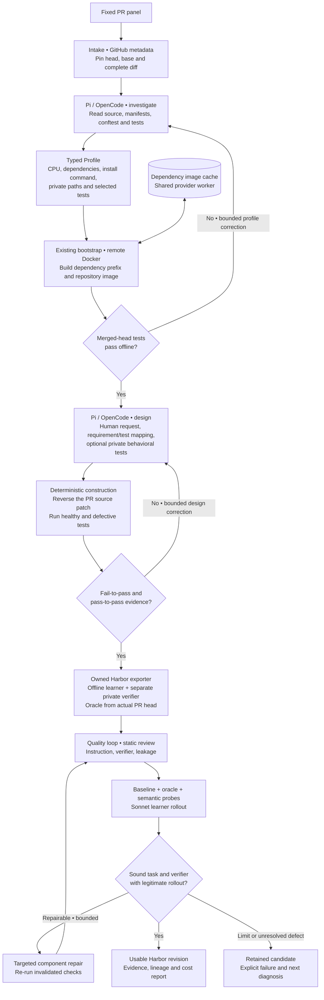

# Tasksmith: a PR to a runnable Harbor task

Tasksmith inspects a merged PR, builds its real repository on Modal or Daytona, designs a human-facing request and deterministic verifier, and runs the shared quality loop. The coding agent is Pi or OpenCode; LangGraph routes the stages. All pipeline and adapter code lives in Repo2RLEnv.

The first supported profile is CPU Python with changes to existing source files. Unsupported source changes are reported explicitly. The current pilot is five small PRs: two from `more-itertools`, one from `huggingface_hub`, one from `smolagents`, and one from Click. This is a development pilot, not evidence of universal conversion yield.



## What each model is asked

There are two author prompts. Both use a typed `submit_artifact` tool and a smaller `revise_artifact` merge patch after rejected submissions. The only environment tool is a bounded remote shell. The runtimes do not discover controller files, instructions, skills or provider keys.

| Stage | Model receives | Model produces | Deterministic check |
|---|---|---|---|
| Investigation | Frozen source evidence, remote checkout, prior bootstrap error if any | Dependency/test profile with resource rationale | Every PR source file is included; selected tests are private; merged-head tests execute offline |
| Design | Source diff, accepted profile, readiness evidence, prior construction errors | Human request, requirement mapping, optional tests, wrong/valid implementation ideas | Real reference passes; source-reverted code fails comparable tests; adjacent behavior still passes |
| Quality review | Exact emitted task, bounded file reads, available trial traces | Task/verifier/leakage assessments, grounded issues and probes | Evidence hashes match; execution failures override optimistic reviews |
| Repair | Grounded component defects and evidence | Exact edits to an immutable new task revision | Re-run affected controls, probes and rollout under the existing quality policy |
| Sonnet rollout | Public instruction and learner workspace | A source change and complete attempt trace | Hidden verifier runs in a fresh, separate offline container |

Read the exact author prompts: [investigation](prompts/tasksmith.md#investigatemd) and [design](prompts/tasksmith.md#designmd). Review and repair prompts and their evidence selection are documented in [the shared quality loop](quality_loop.md).

## Source and verifier semantics

The learner starts from the pinned PR head with **only the PR's source patch reversed**. This preserves compatible head-era fixtures and dependencies. It is recorded as `head_minus_source_patch`, not represented as an exact base-commit checkout. The oracle restores the actual changed source files from the head.

Full test directories remain private even when pytest selects just a few classes or functions. Release notes and other answer-bearing files can also be excluded from the public workspace. Git history, bytecode and cache directories are stripped; symlinks are rejected. The verifier receives only the allowlisted submitted source files. Tasksmith can add a private behavioral test file, but cannot replace the original oracle with an invented solution.

Generation and acceptance are different counters. `generated` means execution contrast and a Harbor bundle exist. `usable` means `practical-generation-v1` found sound instructions and verification, a failing baseline, passing oracle, rejected wrong implementation, accepted valid alternative and a legitimate learner rollout. A legitimate model failure can still establish a useful task. The old strict acceptance policy is unchanged.

## Running the pilot

Install Python dependencies and the pinned agent runtimes, then build the owned worker wheel:

```bash
uv sync --extra tasksmith --extra modal --extra daytona --extra harbor
uv run repo2rlenv tasksmith install-runtime
uv build --wheel

uv run repo2rlenv tasksmith run configs/tasksmith/cpu-hf-pilot.json \
  --campaign workspace/my-existing-campaign \
  --output workspace/tasksmith-pilot \
  --runtime-wheel dist/repo2rlenv-0.8.8-py3-none-any.whl \
  --env-file .env
```

Use `--provider daytona` for the same remote execution contract, or `--author opencode` for the alternative coding runtime. An `--options` JSON file can set author stage limits and the nested `quality` options, including separate OpenAI/Anthropic review and repair models. The current author bridge routes Anthropic models; author-model support should not be confused with the broader quality-model support.

`--stop-after 1` runs the first frozen input while keeping five as the report denominator. Repeating the same invocation reuses matching completed artifacts. `tasksmith show OUTPUT` reads the saved report without paid effects. `--json` provides structured CLI output.

For an independent review while retaining Sonnet authoring and rollouts, the example `configs/tasksmith/pilot-options.json` selects the already supported OpenAI reviewer/repair route. Pass it with `--options`; provider/author flags that conflict with that file are rejected.

When the generation is already sound and the review policy improves, reuse the previous artifacts:

```bash
uv run repo2rlenv tasksmith run configs/tasksmith/cpu-hf-pilot.json \
  --generation-run workspace/tasksmith-pilot \
  --options configs/tasksmith/pilot-options.json \
  --campaign workspace/my-existing-campaign \
  --output workspace/tasksmith-recheck \
  --runtime-wheel dist/repo2rlenv-0.8.8-py3-none-any.whl \
  --env-file .env
```

The previous panel must match exactly. Saved task hashes are checked before paid work; generated inputs are reused and the current quality loop runs again. Inputs that never produced a task still enter normal generation. Source and oracle paths remain immutable during Tasksmith quality repairs. Instructions and private verification can change in a new revision. The report retains the source run and task hash.

The campaign must already have an explicitly initialized budget. Tasksmith reserves model calls and workers on that same ledger. A per-pilot cap and nested quality cap further bound spending. A stopped worker's cost hold remains until explicitly reconciled; it is not silently counted as zero.

## Caching and recovery limits

Repository readiness uses the existing bootstrap implementation. A separate, source-independent Docker prefix identifies base image and dependency installation layers; subsequent PRs can reuse it on the same provider worker. Source readiness remains bound to the individual head. Bootstrap also builds the filtered public workspace, catching excluded README/build inputs before authoring or quality review. The current cache survives for the worker lifetime. It is **not yet a persistent cross-campaign registry or provider snapshot cache**.

LangGraph checkpoints stage state. Artifact receipts additionally bind the schema, prompt, source inputs and runtime. Remote jobs have durable supervisor paths and are observed rather than blindly relaunched after a lost response. An incomplete author call requires reconciliation. Changed configuration or worker code requires a new run directory; previous evidence remains available. Unknown worker creation or termination must be resolved before another worker is allocated.

## Code map and credit

| Responsibility | Owned code |
|---|---|
| CLI, graph, fixed panel and reports | `src/repo2rlenv/tasksmith/{cli,runner,models}.py` |
| Source pins and PR patch selection | `src/repo2rlenv/tasksmith/source.py` |
| Deterministic remote stages | `src/repo2rlenv/tasksmith/worker.py` |
| Coding runtime adapters and structured artifact protocol | `src/repo2rlenv/tasksmith/author/` |
| Docker readiness and snapshots | `src/repo2rlenv/bootstrap/`, `execution/python_repository.py` |
| Standalone Harbor packaging | `pipelines/recipes/repository/export.py` |
| Component review, probes, rollouts and repairs | `src/repo2rlenv/quality/loop/` |

This implementation builds on our earlier Tasksmith adapters, PR regression lessons from SWE-bench/SWE-gen and verification lessons from the [owned reproduction pilots](tasksmith_pilot_learnings.md). [LangGraph](https://github.com/langchain-ai/langgraph), [Pi](https://github.com/earendil-works/pi), [OpenCode](https://github.com/anomalyco/opencode) and [Harbor](https://github.com/laude-institute/harbor) provide essential libraries and execution contracts. No research pipeline repository is installed or imported. See [RFC 0028](../rfcs/0028-tasksmith-pr-pilot.md) for milestones and scope.
