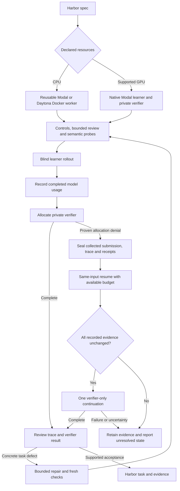

# Tasksmith: turning interventions into pipeline behavior

The current 24 accepted environments include direct engineering assistance. They
establish usable task artifacts with recorded checks; they do not establish an
unattended 24/30 yield. The next autonomy measurement must start from PR inputs and
run the owned CLI without edits or campaign-specific wrappers.

## What now happens automatically

| Observed problem | Owned pipeline behavior | Evidence and limits |
|---|---|---|
| Repeated model/tokenizer downloads or unavailable offline assets | Profiles declare exact Hub files, immutable commits and byte caps; remote dependency layers cache them and the grader preserves offline cache paths | Remote asset and unprivileged-grader smoke tests passed; asset selection still needs a suitable profile |
| Repository pytest defaults require absent coverage plugins | Bootstrap and grading clear `addopts` before applying explicit selections | Regression coverage and recovered repository runs |
| General quality CLI sends a GPU task through a CPU Docker worker | Select native Modal from the task's learner/verifier resources before dispatch | Routing tests; supported native profile is one or two L4 GPUs with a separate offline verifier |
| Large private PR context crowds out review evidence | Bound its initial excerpt to at most 32,000 characters or one quarter of the document allowance; retain full context in the readable inventory | Large-diff regression demonstrates retrieving an omitted contract through literal search |
| A reviewer omits an inline-code delimiter | Resolve a unique Markdown prose excerpt only when all non-backtick characters match; retain old and corrected citation and run normal grounding | Replayed the actual MetaCLIP review failure without a paid call; decisions, scores and probe scripts were unchanged |
| A solver's unused reservation blocks its verifier | Settle completed single-step model usage at Harbor's verification-start event | Live MetaCLIP receipt confirms the hook ran before verification |
| Completed solver, but private verifier allocation was denied | Seal submission, trace and allocation evidence at collection; on resume, perform one verifier-only continuation after integrity checks | Real Harbor controller regression with executor/model calls blocked; fresh remote unattended validation remains pending |
| A probe changes only comments, formatting or uncollected files | Compare collected mutable files and parseable Python syntax trees, and retain behavioral review | Regression tests; syntax changes alone do not prove a useful semantic control |
| Repair cycles repeat narrow edits | Default maximum three repair rounds, consolidated correction prompts, exact path resolution and reusable unchanged evidence | Tests and campaign use; unresolved defects remain explicitly unfinished |
| Provider creation or model billing is uncertain | Preserve the receipt and reservation; do not repeat an unknown effect | Lost-response, cancellation and budget-denial regression tests |

These behaviors live in the repository's shared `execution`, `quality/loop`,
`tasksmith` and repository-export modules. The new recovery implementation is
`quality/loop/native_recovery.py`; it uses the pinned Harbor 0.20 controller contract.
It does not import campaign scripts or require an assistant to inspect a log.

## Recovery flow

The continuation preserves the learner's original timing, model usage, trace and
raw interrupted result. It copies collected files byte for byte, including their
modes; it never calls `agent.run()` or collects a new submission. Completed
continuations are reused. Another failure is retained rather than silently launching
repeated verifier jobs. Old receipts without a collection-time seal, changed runtime
identities, changed tasks and uncertain provider effects require reconciliation.
The campaign cap remains unchanged.

## What still needs intervention

Some repository-specific task framings and verifier repairs remain campaign work:
using the actual TRL environment-pool production path, designing faithful coverage
for specialized GPU kernels, and completing unsupported runtime profiles. The
absolute-interpreter fix already exists in repository export, but repairing an
older verifier that was subsequently changed to bare `python` is still explicit
task repair. Raising a timeout or making a task easier for Sonnet is not a general
repair strategy.

The new components have local controller tests and saved-evidence replay. The
24-task archive predates these new autonomous recovery paths and includes assisted
work. A new paid canary was not started: the authorized campaign currently has
$3.47 unreserved, with $16.09 in unresolved historical holds.

## Next measurement

Run a small, frozen CPU/GPU PR set through the normal Tasksmith CLI using one pinned
runtime and a stated budget. Preserve every event and classify outcomes as:

- **Unattended accepted:** the pipeline completed the checks with no operator edit or wrapper.
- **Assisted accepted:** a person/model outside the pipeline changed configuration, code, fixtures or recovery state.
- **Unfinished:** resource, provider, budget or task-quality blockers remain.

Record model tokens, cloud allocation time, wall time, repair count, cache hits and
the failing stage for every input. Promote recurring interventions into owned code
with a saved-failure regression before claiming improved unattended yield. A genuine
solver failure may still be a good environment; the instruction and verifier are
judged against the intended behavior, not Sonnet's ability to solve it.

See the [current task and budget evidence](tasksmith_scale30_recovery_progress.md)
and [quality CLI contracts](quality_loop.md).
