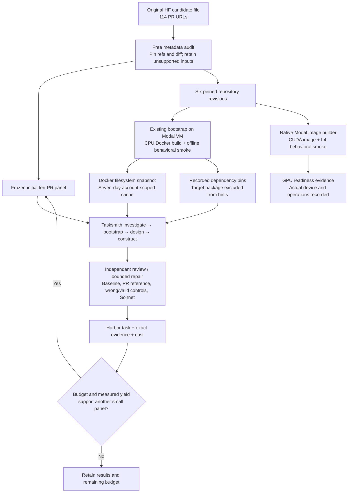

# Tasksmith: HF bootstrap and generation campaign

This campaign starts from the supplied **114 PRs** across Transformers, Accelerate, TRL, Diffusers, PEFT and Tokenizers. It bootstraps all six repositories for CPU and GPU hosts before scaling task generation. Repository readiness is measured separately from per-PR task quality.

The bootstrap phase is complete: **6/6 CPU and 6/6 GPU-host checks passed** on September 13, 2026. Five repositories exercised CUDA operations on an NVIDIA L4; Tokenizers exercised its CPU implementation and a separate CUDA host check. All bootstrap workers are terminated. The conservative estimate across successful and failed bootstrap attempts is **$13.082577**, with no outstanding bootstrap reservations. [Exact bootstrap evidence](evidence/tasksmith-hf-bootstrap.json).

The initial source audit found 45 PRs compatible with the current modified-Python-source profile. This is a structural intake result, not 45 validated CPU tasks. Added/deleted source and Rust/CUDA changes remain in the inventory with explicit reasons. After retrying transient GitHub errors, 68 inputs have an explicit structural exclusion and one remains an intake retrieval error. The first generation panel contains ten selected PRs from that original pool.

The [intake inventory](evidence/tasksmith-hf-intake.json) preserves all 114 URLs, structural exclusions, and complete source pins/diff hashes for the 45 supported inputs. The CPU snapshot was restored successfully, and a separate import-origin audit confirmed that all six target packages load from their pinned source checkout inside `/workspace`.



## What bootstrap proves

These small checks exercise real code without downloaded pretrained weights, datasets or model API calls. They are readiness checks, not complete upstream test suites or task verifiers.

| Repository | CPU check | GPU-host check |
|---|---|---|
| Transformers | Tiny BERT forward/backward with finite outputs/gradients | Same operations on CUDA |
| Accelerate | Device placement and optimizer step through `Accelerator` | Real CUDA placement and optimizer step |
| TRL | Log-probability and entropy equivalence plus autograd | Same numerical checks on CUDA |
| Diffusers | Tiny UNet forward/backward and DDPM scheduler step | Same operations on CUDA |
| PEFT | LoRA injection, adapter gradients and merge | Same operations on CUDA |
| Tokenizers | Compile Rust bindings, encode/decode and serialization | CPU tokenizer operations on a GPU host, plus a separate CUDA host check |

Tokenizers does not become GPU accelerated because a GPU is present. Similarly, a single L4 smoke test does not establish tensor parallelism, distributed training, FP8 or multi-GPU readiness.

CPU builds use the repository's existing `ensure_bootstrap` path with an explicit Dockerfile. They separately run the behavioral check under `docker --network none`, rather than trusting an image-build success as a smoke-test result. CUDA images are built remotely and tested in a native sandbox with network blocked. Modal VM Sandboxes cannot attach GPUs; using a native GPU sandbox is intentional. [Modal VM limitations](https://modal.com/docs/guide/vm-sandboxes).

The official PyTorch 2.11 CUDA runtime uses externally managed system Python. The GPU recipe creates a writable virtual environment with system packages visible, preserving its preinstalled CUDA PyTorch. Target dependencies install into that environment. The GPU configuration explicitly removes the bundled `spin` development tool from this disposable image: its Click upper bound conflicts with current Hub requirements. The full dependency check remains enabled.

## Commands and code

```bash
uv build --wheel
uv run repo2rlenv tasksmith bootstrap configs/tasksmith/hf-bootstrap.json \
  --resource cpu \
  --campaign workspace/my-existing-campaign \
  --output workspace/hf-bootstrap \
  --runtime-wheel dist/repo2rlenv-0.8.8-py3-none-any.whl \
  --env-file .env

uv run repo2rlenv tasksmith bootstrap configs/tasksmith/hf-gpu-bootstrap.json \
  --resource gpu \
  --campaign workspace/my-existing-campaign \
  --output workspace/hf-bootstrap \
  --runtime-wheel dist/repo2rlenv-0.8.8-py3-none-any.whl \
  --env-file .env
```

The command displays a compact readiness table; `--json` emits structured reports. A failed GPU attempt stops the batch before another allocation. Use `--resource both` when one matrix configuration is suitable for both sides. The shipped CPU and GPU matrices pin the same six repository revisions and record their distinct setup corrections through `extra_install`. Changed inputs require a new attempt directory. Failed and interrupted effects keep their receipts. Unknown sandbox creation is reconciled by its stable provider name before retrying.

Pass `--bootstrap-report workspace/hf-bootstrap/cpu/report.json` to import the recorded snapshot and dependency hints directly. The CLI checks source bindings, rejects conflicting explicit options and expired snapshots, and keeps your model and spending settings. The HF options preset allows a 160,000-character review context: the third task needed more targeted source evidence than the initial 100,000-character setting provided. This is a bounded maximum, and actual model usage remains metered. For manual configuration, the Tasksmith options file can include `worker_snapshot`, `worker_cpus`, `worker_memory_mb` and `bootstrap_hints`. Hints contain a source revision, base image, exact recorded dependency pins and their limited evidence scope. The investigator checks compatibility with each PR's own manifests; the per-PR bootstrap still runs its actual offline tests. Dependencies are warmed through the same source-free Docker prefix builder used by Tasksmith. Only compatible recipes can be cache hits.

```bash
uv run repo2rlenv tasksmith run configs/tasksmith/hf-first-ten.json \
  --options configs/tasksmith/hf-options.json \
  --bootstrap-report workspace/hf-bootstrap/cpu/report.json \
  --campaign workspace/my-existing-campaign \
  --output workspace/hf-first-ten \
  --runtime-wheel dist/repo2rlenv-0.8.8-py3-none-any.whl \
  --env-file .env
```

Snapshots are trusted builder caches containing repository images, not learner base images. Final Harbor bundles retain their ordinary portable Docker install recipe, private verifier and real PR reference. They do not require the private Modal snapshot or a worker-local image tag. The snapshot expires after seven days; readiness evidence and recipes remain. [Modal snapshot retention](https://modal.com/docs/guide/sandbox-snapshots).

| Responsibility | Owned implementation |
|---|---|
| Matrix schema, Dockerfiles, remote CPU build and dependency record | `src/repo2rlenv/tasksmith/bootstrap_matrix.py` |
| Actual CPU/GPU behavioral checks | `src/repo2rlenv/tasksmith/bootstrap_smoke.py` |
| Reservations, remote controller, snapshots and compute estimates | `src/repo2rlenv/tasksmith/matrix_runner.py` |
| Snapshot restoration | `src/repo2rlenv/execution/{base,modal}.py` |
| Hint validation, dependency warming and per-PR investigation | `src/repo2rlenv/tasksmith/{models,runner,worker}.py` |
| Exact investigation prompt | [Generated prompt reference](prompts/tasksmith.md#investigatemd) |

## Budget and reporting

The original reproduction campaign had **$253.313684 available** at intake. It retains the same ledger and cap. Bootstrap CPU/GPU operations share a **$30 cap**; the initial generation panel has a **$140 cap**. These allocations leave room for targeted repairs or measured expansion. Reserving the maximum per operation prevents an optimistic per-task average from authorizing uncontrolled work.

Model estimates come from recorded token usage. Compute estimates conservatively charge full allocations over the recorded interval, double that amount, and include an image-build allowance. Unknown model effects retain reservations. Workers are terminated and compute reservations reconciled after each run. These estimates are not provider invoices. [Modal rates](https://modal.com/pricing).

The initial three generated bundles exposed an evidence-packet overflow after rollouts: repeated full file paths filled the inventory allowance. The corrected reviewer groups paths by directory and uses a bounded searchable catalogue for larger inventories. Every file remains addressable; an oversized read leaves the previous context intact. Two saved bundles completed corrected review without additional task repairs. The remaining original panel resumes with the corrected runtime; all initial attempts and the interrupted fourth inspection remain recorded.

For a resumed generation, `--generation-run PREVIOUS_RUN --reuse-evidence` can reuse unchanged baseline, reference and matching-model rollout results. The importer checks both the task identity and original result checksum; infrastructure failures execute again. Semantic probes run under the current review policy. No old reward is attributed to an edited task revision. Omit `--reuse-evidence` when fresh trials are wanted.

The campaign report will distinguish repository smoke readiness, generated bundles and tasks usable under `practical-generation-v1`; count failed attempts; record cache restoration/hits; and show actual measured stage costs. The target is 10–50 environments subject to those results and the unchanged budget, not a promise to spend the full allowance to reach fifty.
