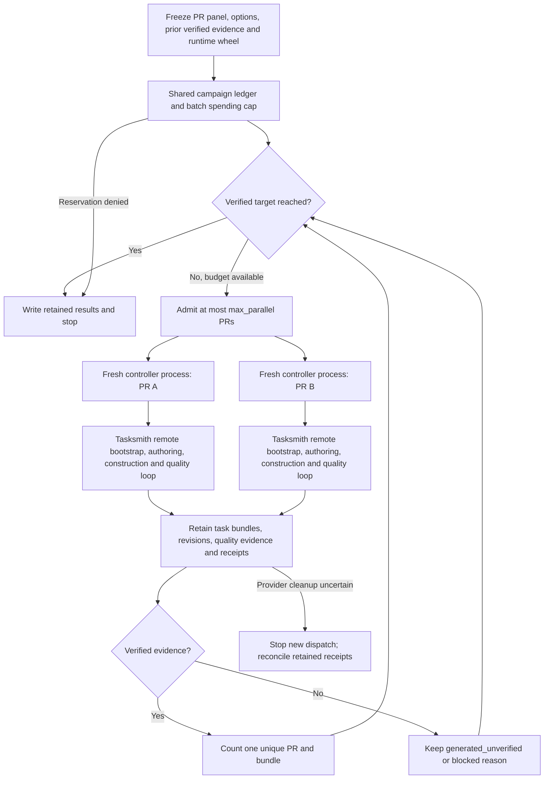

# Parallel Tasksmith campaigns

A batch runs independent PRs in separate controller processes. Each process owns
one Tasksmith instance and one remote builder; each target build, test and solver
still executes on Modal or Daytona. The controller retains every generated task
and every revision, including tasks whose verifier or rollout needs repair.



## Run a batch

The experimental entry point uses the same owned Tasksmith implementation and
options as individual runs:

```bash
uv build --wheel
uv run python -m repo2rlenv.tasksmith.batch plan.json workspace/tasksmith-batch \
  --campaign workspace/campaign \
  --runtime-wheel dist/repo2rlenv-VERSION-py3-none-any.whl
```

The campaign ledger must already exist with an explicitly authorized global
limit. This command never creates, raises or resets that limit. Use the actual
wheel filename produced by `uv build`; the runner refuses stale owned code.

A plan has this structure:

```json
{
  "name": "hf-next-batch",
  "target_verified": 50,
  "max_parallel": 2,
  "max_gpu_parallel": 2,
  "max_spend_usd": "200.00",
  "prior_verified": ["/absolute/path/to/previous/quality/result.json"],
  "candidates": [
    {
      "url": "https://github.com/huggingface/accelerate/pull/3075",
      "options": {
        "provider": "modal",
        "author_runtime": "pi",
        "author_stage_usd": "1.50",
        "max_spend_usd": "10.00",
        "worker_reservation_usd": "3.00",
        "quality": {
          "repair": true,
          "run_rollout": true,
          "max_repairs": 3,
          "max_probes": 4,
          "max_spend_usd": "6.00",
          "model_reservation_usd": "0.80",
          "solver_reservation_usd": "1.50"
        }
      }
    }
  ]
}
```

These numbers illustrate bounded allocation; they do not predict task costs or
guarantee fifty successes. Every candidate accepts the complete `Options`
contract, including GPU count, bootstrap hints, existing remote snapshots and
model selection. `source_record` optionally supplies a previously frozen PR
record; Tasksmith validates it before paid work. Without one, Tasksmith freezes
public PR evidence on initial intake before allocating its worker.

`max_parallel` bounds all active PR controllers; `max_gpu_parallel` separately
bounds controllers whose tasks require GPUs. Both default to two. For example,
four total controllers with two GPU controllers permits additional CPU work while
GPU capacity is occupied. A two-GPU PR counts as one GPU controller and still
requests its full device count. The scheduler can admit an eligible CPU candidate
later in the panel without exceeding either concurrency limit or the target.

A candidate may also specify `generation_run` and `reuse_evidence` to use
Tasksmith's existing checksum-bound generation import. For an existing generated
Harbor task, `prepared_task` plus its `source_record` runs fresh quality validation
without importing old trials; this route excludes `generation_run`. To preserve
specific counterexamples, optionally include `prepared_probes` inline in the batch
candidate. It uses the existing quality `ProbeManifest` schema:
`{"bundle_hash": "sha256:...", "probes": [...]}`. Each probe retains its `name`,
`kind`, `focus`, `rationale`, grounded `evidence`, and executable `script`.
Tasksmith freezes these definitions in the batch and generation configuration and
replays them through the quality loop. Prior rewards and trial receipts are never
imported through this field.

Prepared probes require a prepared task with the exact matching bundle hash,
unique probe names, and a count within `options.quality.max_probes`. These checks
run before provider work. The task must already contain any
`options.required_probe_focus` annotations; create that revision before binding
the definitions so an annotation cannot silently discard them. Changing the
definitions requires a new run directory. Without `prepared_probes`, the quality
review proposes controls as usual.

Pass a full existing
`LoopResult` for each prior verified task. The batch derives its PR URL from the
bound task metadata, checks its controls, probes, raw trial evidence and judged
rollout through the shared quality label validator, and skips duplicate PRs.

Campaign controllers can pass `expected_prior_verified` to `run_batch` with the
proof inventory bound during preparation. The runner validates the underlying
evidence once, compares the fresh result with that inventory, and rejects any
change before allocating work. Preparation can therefore check receipt identities
without repeatedly scanning every historical task tree. This option does not
replace fresh validation or introduce an evidence cache.
For coordinated campaigns, `preallocation_check` can recheck shared capacity and
budget after evidence validation finishes. An exception prevents dispatch; the
callback runs before the batch creates its allocation scope.

## Budget and ownership

Each paid operation carries a deterministic batch prefix and child prefix.
Worker, author, reviewer, repair, solver and native allocation reservations pass
through the same nested `RunBudget` scopes. The shared SQLite ledger checks the
global, batch, candidate and quality limits together inside one transaction.
A candidate cannot evade the batch cap by using a different execution stage.

Admission checks the first worker reservation before starting a child. This
check avoids obvious wasted launches; the transactional reservation at actual
dispatch is the enforcement boundary. A completed operation can report actual
cost above its reservation; that overrun remains recorded and blocks later work.
Uncertain outcomes keep their reservation.

Confirmed Modal builder termination is reconciled automatically with the
existing conservative allocation-time estimate, including build time and its
explicit allowance. Native Modal allocations already reconcile on termination.
These figures are estimates, not provider invoices. Other provider estimates
are not inferred from Modal prices; their unsettled reservations remain visible.

Each PR starts a fresh Python subprocess with isolated import settings (`-I`).
The owned controller package is extracted from the exact runtime wheel into a
read-only directory and inserted first on the child import path. This freezes
later imports as well as code loaded at startup, so edits to the working tree do
not change an active campaign. The bootstrap checks the imported package path.

Lightweight supervisor threads only launch and wait for these subprocesses; they
never create a Tasksmith instance or alter the parent environment. Model keys
are inherited without being written into the request. Child stdout and stderr
are saved with private file permissions. Essential third-party libraries still
come from the invoking Python environment. Process-wide environment changes and
Harbor accounting context remain isolated between Tasksmith controllers.

## What the batch retains

| File or directory | Purpose |
| --- | --- |
| `configuration.json` | Frozen plan, owned controller identity, runtime hash, prior verified identities and campaign path |
| `runtime/` | Exact wheel and read-only copy of its owned controller package |
| `report.json` | Verified total, new successes, generated unverified tasks, blocked candidates, pending PRs and budget totals |
| `candidates/<PR hash>/` | Complete individual Tasksmith output: tasks, revisions, graph state, events, logs and receipts |
| `candidates/<PR hash>/batch-result.json` | Child outcome and retained task paths, written after its owned work finishes |
| `candidates/<PR hash>/controller.stdout`, `controller.stderr` | Private subprocess diagnostics; failure reports contain only a generic error |

Batch outcome names describe scheduling: `verified`, `generated_unverified` and
`blocked`. The uniform evaluation metadata inside each `task.toml` describes the
task's detailed diagnosis. A failed construction without a Harbor task remains a
blocked candidate; it does not count as generated. Revisions and semantic probe
variants remain evidence for their source PR and never count as separate
verified environments.

## Resume and stop behavior

Run the identical command and plan to continue undispatched candidates. A changed
panel, options, controller or runtime requires a new output directory, preserving
old evidence. Previously completed candidates are not retried implicitly.
Completed child evidence is checked again when importing a saved success.

The scheduler reserves target slots for active children: with 49 verified tasks
and a target of 50 it admits only one more PR, even if parallelism is higher.
Failed candidates release that target slot, allowing another pending PR.

Creating `drain-request.json` in a batch directory stops further admission and
lets active children finish normally. The runner collects their results, retains
pending PRs and reports `stop_reason="drained"`. The request is latched for that
invocation and remains on disk; an unchanged command with that marker still
present does not admit work. This provides a clean boundary before freezing a
new runtime or concurrency configuration. Carry all earlier costs and unresolved
holds forward when allocating a continuation's budget.

If the controller was interrupted, a completed child result can be imported
without another dispatch. A child with no terminal result, or a provider with
uncertain cleanup, stops all new batch work until its receipts are reconciled.
The runner does not kill an unknown sandbox or relaunch an uncertain model call.
A normal spending stop leaves every pending PR and generated artifact available
for diagnosis or an explicitly configured later campaign.
