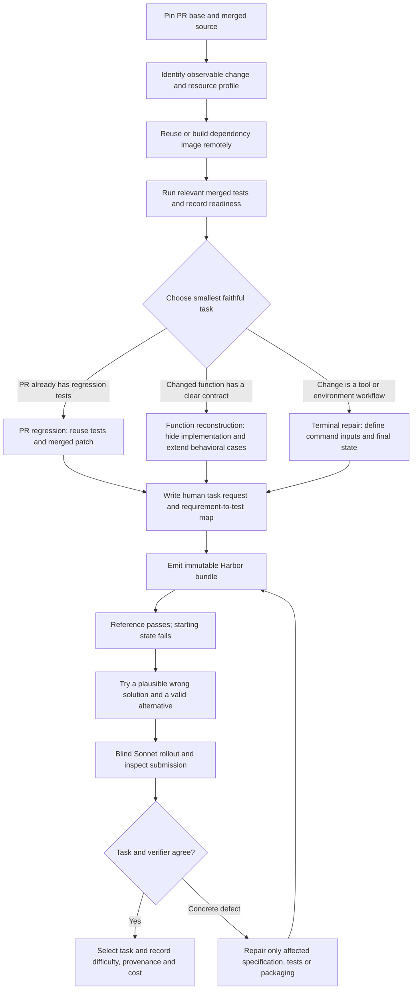

# What the reproduction pilots should change in Tasksmith

Analysis dated 12 September 2026. See [the quality report](quality_pilot.md) for final counts, costs and scaling decisions. This document distinguishes measured findings from proposed implementation work.

## Recommendation

Keep LangGraph and the Pi/OpenCode author boundary. Make Tasksmith a router over small, reliable construction strategies, followed by one common quality loop. Give the coding agent freedom to investigate and repair within a stage; let owned code handle packaging, controls, evidence and budget accounting.

Do not turn every PR into an unrelated random mutation. For a PR, preserve its useful observable change. Mutation generation is primarily a repository-input strategy; a changed function can support an R2E-style reconstruction when that preserves the PR's intended outcome.

A failure to install dependencies is an environment diagnosis. A Sonnet solution failing a sound regression is a learner result. Keep those outcomes separate in both routing and metrics.

## The lessons and the evidence

| Finding | Tasksmith change | Practical validation |
|---|---|---|
| SWE-smith and R2E produced useful small tasks at low model cost. Ten pilot01 originals all had reference success and starting failure; eight were usable directly, two were revised. | Prefer a tested repository fixture and narrow source edits over authoring the whole environment afresh. | Build once, run the exact merged test subset, then demonstrate source-dependent reward on each task. |
| R2E `collapse` accepted an eager list despite an explicit lazy-generator requirement. The focused added test rejected it. | Make requirement coverage executable. A nonempty mapping in JSON is not evidence that the check discriminates. | Pair each important requirement with a known wrong behavior; assert its targeted check fails. Start with one meaningful counterexample per task and add others for distinct material requirements. |
| Several historical prompts reveal the precise patch; SWE-Flow `difference` describes the wrong `initial` semantics. | Separate behavioral specification from implementation knowledge. Reconcile prompt examples against the actual reference before finalization. | Execute examples against the reference remotely; retain contradictions as repair feedback. Hints alone do not make an easy training task unusable. |
| Terminal probes accepted a no-op ShowVars function, a dead archive script, and a monitoring script that always exits 1. | Match the test to the deliverable: call an API, rerun a script from cleared outputs, or inspect a final artifact. Do not claim to assess a reusable script by checking stale files. | Delete generated outputs, invoke the required entry point, check its exit status and compare behavior on a small fresh fixture. |
| DataArc's calendar-integrity check computes its supposed baseline after the learner has edited the input. A changed-calendar counterexample passed. | Freeze protected input identities before the episode. Keep verifier inputs and expected values outside learner control. | Change one protected input byte and require rejection; valid output must still pass. |
| The SCALER floating-answer route rejected a rounded answer within its declared relative tolerance. | Choose grading by output type: exact integer, exact sequence/string, numeric tolerance, executable behavior, or artifact state. | Try a correct alternative representation and points just inside/outside the declared tolerance. |
| SWE-Next rejected a Sonnet patch that repaired the named split functions but also changed `split_at` unintentionally. | Preserve regression protection and inspect why a rollout failed. Do not demand every task be solved by Sonnet. | The incorrect extra edit should fail an existing regression, with a healthy reference still passing. |
| Six repository recipes currently use more-itertools, and history methods share underlying changes. | Track semantic source identity and task families, not just bundle hashes. Diversify repositories before calling a 100-task set representative. | Group by repository, PR/commit, changed behavior and normalized patch; deduplicate before mixing datasets or making splits. |
| A TerminalWorld crackme has a placeholder instead of its ELF binary, while a public test contains the password. Its reference can fabricate a substitute. | Establish required assets before design approval and audit the learner file view. | Check file identity/type and run the intended artifact; remove answer-bearing fixtures and forbid reference-only substitutions from validating the task. |
| CLI-Gym nop/oracle controls passed even though a blind offline solver could not start because tmux was absent. Packaging revisions fixed all five sampled tasks. | Include agent-runtime readiness in image validation alongside repository readiness. | Start the actual solver adapter offline before a batch; validate its shell and terminal tools without a paid model request when supported. |
| Generation spend varies considerably, and failed terminal authoring calls are a large part of it. | Route model effort by stage and record all attempt costs. Cache dependency work; do not restart a complete candidate for an editorial correction. | Report generation cost/export, cost/usable task, review cost and uncertain spend separately. |

## What already exists — retain it

Inspected the local `codex/dynamic-harbor-curation` branch at commit `c332962662cb0e5189fd380b00e38138a651a381`, rather than assuming that code is present on the owned-pipelines branch.

- [`tasksmith/pipeline.py`](https://github.com/huggingface/Repo2RLEnv/blob/c332962662cb0e5189fd380b00e38138a651a381/src/repo2rlenv/tasksmith/pipeline.py) already has a coarse LangGraph with discovery, construction, validation and repair; durable effects, leases and immutable revisions are useful.
- [`tasksmith/bootstrap.py`](https://github.com/huggingface/Repo2RLEnv/blob/c332962662cb0e5189fd380b00e38138a651a381/src/repo2rlenv/tasksmith/bootstrap.py) already has a content-based BootstrapCache with architecture, dependency inputs, provider receipts and a single-builder lock. Improve reuse and diagnosis around it; do not create another cache subsystem.
- [`tasksmith/models.py`](https://github.com/huggingface/Repo2RLEnv/blob/c332962662cb0e5189fd380b00e38138a651a381/src/repo2rlenv/tasksmith/models.py) already has Requirement, VerifierContract and a requirement-to-check map. The missing improvement is stronger executable evidence for those fields, not another schema for the same concept.
- [`tasksmith/validation.py`](https://github.com/huggingface/Repo2RLEnv/blob/c332962662cb0e5189fd380b00e38138a651a381/src/repo2rlenv/tasksmith/validation.py) already checks source materialization and pairs baseline/reference observations. Its independent review and control machinery should be reused.
- The old RFC's admission profile requires more evidence than this pragmatic quality pilot, including ordinary Sonnet/Opus and adversarial trials. Preserve historical results under their original profile. Introduce an explicit practical-generation profile rather than silently redefining `accepted`.

The owned terminal bundles currently declare no artifact collection. This pilot therefore retains their commands and verifier logs, but generally lacks complete final filesystem snapshots. Tasksmith already has collection contracts: preserve those when sharing recipe code, and add useful output/source capture to terminal emission.

## Concrete implementation order

1. **Add strategy selection to discovery/design.** Record a reason, changed behavior, source pins, available tests, resources and selected verifier type. Use PR regression as the default when existing tests cover the change; use function reconstruction or terminal repair when justified. Avoid generating many elaborate designs when one simple design is already supported by executable evidence.
2. **Share the owned repository execution primitives.** Integrate `pipelines/recipes/repository/`, `execution/python_repository.py`, `emitter/bundle.py` and the remote lifecycle/Harbor trial helpers through a small Tasksmith interface. Maintain separate generation semantics and upstream credits. No upstream research package should become a runtime dependency.
3. **Turn examples and counterexamples into small reusable controls.** Begin with generator laziness, boundary/exception behavior, output regeneration, protected-input integrity and numeric tolerance. Store the requested behavior and the reason each deliberately wrong implementation is wrong. A generic broken-syntax control is not enough to prove semantic coverage.
4. **Constrain prompt stages by evidence.** Specification receives public behavior and verified examples, construction receives source/tests, and review gets the exact task, tests and control evidence. User instructions should specify outcomes and interfaces; keep private expected answers and patch directions out of the learner view unless intentionally making a guided exercise.
5. **Give the solver an honest local testing workflow.** The SWE-gen pilots repeatedly searched for repository test directories that the bundle deliberately hides. Include safe preexisting smoke tests where possible and document an actually available command; keep private grading checks separate. Validate the advertised command during packaging.
6. **Use targeted repair with stage budgets.** Reuse a ready dependency image and the previous good artifacts. Rebuild only after dependency changes; rerun controls against a new bundle hash after verifier or source changes. Keep uncertainty/reconciliation rules for paid effects. Use Sonnet first and reserve Opus for unresolved semantic disagreement or a sampled stronger-solver calibration.
7. **Scale in repository-aware waves.** Start with ten new tasks from at least two new CPU Python repositories for SWE-smith/R2E, inspect them, then fill to 100 with family/repository caps. After terminal grader repairs, use the same pattern for other recipes. A proposed practical cap is no more than 25 tasks from one repository and no more than 10 near-identical defect/operation variants in a 100-task release; these are diversity targets, not retroactive acceptance rules.

## Suggested prompt questions

- **Discovery:** What observable capability changed? Which inputs expose it? Does the merged code and its relevant test subset run in this resource profile?
- **Design:** What would a human ask someone to implement? Which interface, edge cases and exclusions are necessary to make success unambiguous? What is the smallest faithful environment?
- **Verifier:** How can a plausible wrong implementation satisfy the current checks? What one fresh input exposes it? Can an alternative correct implementation pass without copying the reference?
- **Packaging:** Which files and dependencies must be present offline? What is the exact submission boundary? Are protected inputs, source origin and reference separation established by execution?
- **Rollout review:** Did the agent implement the requested behavior? Did it exploit grading or encounter a specification contradiction? Is failure due to a task defect, infrastructure, or an ordinary coding mistake?
- **Repair:** Which retained observation proves the defect? What is the smallest change that fixes it, and which exact controls must be repeated?

## Scope of the learning

These are findings from our current owned reproductions and small targeted pilots. They are not a claim that the upstream methods have these flaws, nor proof of training gains, cross-repository success or comprehensive adversarial robustness. The recommendation is to increase usable yield by removing diagnosed failures and reusing proven construction work, while keeping task difficulty and editorial polish descriptive.

These pilots do not compare Pi against OpenCode. Keeping that boundary follows the accepted architecture; the observed improvements concern task construction, packaging and reward quality, not a demonstrated advantage of one coding-agent harness.
