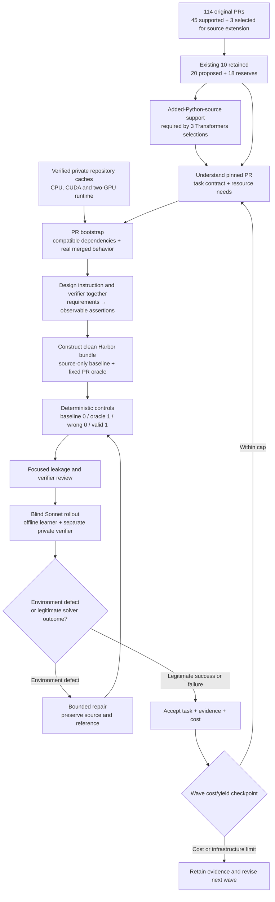

# Tasksmith: audited plan for 30 HF tasks

**Target: 30 total accepted tasks in this HF campaign — retain the existing ten and generate twenty more, including three Transformers tasks.** Earlier pilots and other reproduction pipelines do not count toward this target. The proposed additions are **12 CPU tasks, six single-L4 tasks and two tasks using two L4s**. This is a source-audited selection, not twenty completed PR-specific bootstraps.

Audit date: September 13, 2026. The [candidate manifest](evidence/tasksmith-scale30-panel.json) records every selected PR's source pin, source-diff hash, proposed task, verification idea and wave. Seventeen selections fit the existing source profile; three Transformers selections require the added-Python-source extension below. Eighteen other currently compatible candidates remain in reserve. The [bootstrap audit](evidence/tasksmith-scale30-bootstrap.json) records fresh execution, the failed first distributed launch, its correction, cleanup and cost. The [Transformers source audit](evidence/tasksmith-scale30-transformers.json) adds fresh merged-PR metadata, complete source-diff identities and test entry points.

The last unresolved intake, Tokenizers #1928, was retried successfully during this audit and classified as Rust source changes. All **114 inputs are now accounted for: 45 structurally supported and 69 outside the current source profile, with no unresolved retrieval errors**. The earlier intake file is retained as historical evidence.

## What is complete

| Area | Evidence and limit |
|---|---|
| Existing ten tasks | Fresh Harbor parsing, task identity, review checksum and all 54 native-result checksum checks passed. This audit did not rerun the solvers. |
| Six CPU repository images | Restored the existing remote Docker cache and reran all six behavioral checks with `docker --network none`. All passed and loaded their source from `/workspace`. |
| Six GPU-host images | Prior completed L4 bootstrap covers all six repositories; five exercise CUDA and Tokenizers remains CPU software. Those six checks were not needlessly rebuilt. |
| Two-GPU runtime | Fresh cached Accelerate and PEFT images passed NCCL all-reduce and real distributed training checks on two L4s, with outbound networking blocked. Accelerate verified equal model weights after an optimizer step; PEFT verified equal adapter gradients. |
| Cleanup/accounting | Four audit allocations, including the failed first GPU launch, are terminated; no audit reservations remain. Estimate: **$4.343529**, no model calls. Campaign available: **$148.644776**. Historical unresolved reservations remain intact. |

The original CPU cache was created September 12 at 22:27:23 UTC, with a seven-day TTL. Its nominal expiry is September 19 at 22:27:23 UTC. Restoration was checked today. Recheck expiry and dependency identity at dispatch; account-scoped snapshot IDs are accelerators for construction, not portable deliverables.

The first distributed attempt failed before worker-rank execution because `torchrun --standalone` advertised the hostname `modal`, which could not resolve with networking blocked. The corrected single-host launch uses a static rendezvous and loopback interfaces:

```bash
NCCL_SOCKET_IFNAME=lo GLOO_SOCKET_IFNAME=lo \
python -m torch.distributed.run \
  --rdzv-backend=static --master-addr=127.0.0.1 --master-port=29500 \
  --nnodes=1 --nproc-per-node=2 distributed_smoke.py accelerate
```

This establishes single-host collective/DDP readiness. It does **not** establish FSDP2, tensor-parallel adapters, Liger, FlashAttention, vLLM, or every historical PR's compatibility. Each selected PR must exercise its own actual implementation before authoring proceeds. Distributed timeouts are infrastructure failures, not task rewards.

## The implementation gap

Tasksmith currently declares `Profile.resource` as CPU-only, bootstraps through its Docker worker, and hardcodes `OfflineDockerEnvironment` for Harbor trials. Changing one resource string would leave construction and validation on the wrong execution path.

Transformers exposes another implementation gap: intake rejects added Python source, construction assumes every reversed source file still exists, and the exporter only transfers replacements of existing files. The selected Transformers PRs are still classified as unsupported by that current profile. They are promoted into the plan with an explicit prerequisite, not relabeled as already runnable.

Installed versions inspected during this audit: Harbor **0.20.0**, Modal **1.5.5**, Daytona **0.198.0**. Harbor already has GPU fields and a native Modal provider, plus separate verifier environments. Reuse those contracts through owned repository code. Modal VM Sandboxes do not support GPUs; GPU trials must use native sandboxes with a single-container image, not the existing VM/Docker composition. [Harbor task contract](https://www.harborframework.com/docs/tasks), [Modal VM limitations](https://modal.com/docs/guide/vm-sandboxes), [Modal GPU allocation](https://modal.com/docs/guide/gpu).

Daytona's SDK documents GPU resources, but no live Daytona GPU result is being claimed here. Keep provider selection explicit; use the proven Modal path for this campaign. A Daytona GPU path becomes usable after the same isolation, artifact-transfer and native-trial checks pass. Do not silently fall back to CPU. [Daytona SDK contract](https://www.daytona.io/docs/en/python-sdk/sync/sandbox/).

## Transformers additions

These three are from the original candidate file. Their merged source and tests were inspected directly; no pretrained checkpoints, GPU jobs or model calls were used for this selection audit.

| PR | Wave / resource | Task scope and verification |
|---|---|---|
| [Helium #35669](https://github.com/huggingface/transformers/pull/35669) | 1 / CPU | Model/config/Auto-class integration, causal LM and classification heads, plus the tokenizer conversion added in the PR. Tiny models test independent numerical expectations, causal masking, cached/full decoding agreement and local save/reload. A local SentencePiece/protobuf fixture covers converter normalization, special tokens and byte fallback. |
| [DINOv2 with registers #35348](https://github.com/huggingface/transformers/pull/35348) | 2 / CPU | Register-token vision encoder, backbone and classifier integration. Vary register counts and image dimensions; test token participation in attention, patch/backbone outputs, gradients and local serialization. Shape-only checks are insufficient: an implementation that merely appends dummy tokens must fail. |
| [MetaCLIP 2 #39826](https://github.com/huggingface/transformers/pull/39826) | 3 / 1 L4 | Text and vision towers, projections/classifier, model registration and the CLIPProcessor change accepting other tokenizer types. Tiny fixtures on CUDA test independently computed normalized similarity and contrastive loss, gradients, padding, local processor compatibility and save/reload. |

The upstream tests are starting points. Helium inherits model tests from Gemma, so preserve its private test dependencies. DINOv2 and MetaCLIP 2 already have small synthetic model testers; their downloaded-weight integration tests are separate. Supplement these tests with behavior-specific assertions and semantic controls rather than treating an import or output shape as sufficient validation. Architecture details needed by a developer must be stated in the instruction or public API documentation; knowing a model's name is not a complete task specification.

Implement added-source support before the first Helium run:

1. Record explicit added/modified file operations and complete diff identities. All three inspected PRs need additions and modifications; renamed/deleted source and Rust remain separate capabilities.
2. Reverse every selected source change, including both generated `modeling_*.py` and `modular_*.py` implementations. Newly added model files must actually be absent in the learner baseline. Remove answer-bearing docs and cached source; leaving the modular implementation would expose the solution.
3. Extend construction, export, oracle restoration and collection together. Create destination directories when restoring the PR reference, and transfer newly created regular Python files under the declared source roots. Represent absence explicitly; an empty file is not equivalent to a removed file. Verify baseline collection handles missing feature files as a task failure, not an infrastructure exception.
4. Check missing new APIs inside test functions so an unsolved task fails assertions rather than preventing collection. Keep passing tests for an unchanged neighboring model. Exercise real added-file submission through the separate verifier, including a valid implementation and rejected missing/incorrect implementations.
5. Bootstrap each historical PR head with compatible dependency pins. The current Transformers repository image is useful cache evidence but does not prove compatibility with these 2024/2025 revisions. Keep the actual PR reference fixed, use tiny local fixtures, and do not substitute a contemporary Transformers implementation.

To retain thirty total and the same resource mix, move **TRL #5501, Accelerate #3098 and TRL #6159** to reserve. Move KTO metrics #6150 and parallelism ownership #3720 to wave 3, bringing Helium and DINOv2 forward without changing the 6/7/7 wave sizes. The manifest preserves these selection changes explicitly; none of the displaced tasks had been generated in this campaign.

## Pipeline and stage gates



| Stage | Goal | Required evidence before proceeding |
|---|---|---|
| 1. Freeze and investigate | Understand the final diff, intended behavior, dependencies, and minimal useful task. | Pinned source, explicit CPU/GPU/topology choice and observable requirements. PR descriptions can be stale: TRL #5349's final diff differs from its original proposed API. |
| 2. PR bootstrap | Run the merged implementation with compatible dependencies and local fixtures. | Actual relevant behavior passes offline, source imports come from the selected checkout, expected tests execute, device and dtype are recorded. Empty collections/skips are not passes. |
| 3. Design | Pair a natural developer request with a verifier for each requirement. | Independent expected values, realistic fixtures, relevant edge cases and an unchanged-behavior check. Preserve PR scope; clarify externally visible behavior without dictating the reference's code structure. |
| 4. Package | Produce a portable Harbor task with a clean learner starting point. | No learner-visible PR diff, oracle, hidden tests, merged-source cache or Git history. Private builder images are never handed directly to the learner. Reuse source-free dependency layers; build fresh sanitized source layers. |
| 5. Establish controls | Show the task discriminates meaningful correctness. | Unsolved baseline fails behaviorally, actual PR oracle passes, at least one plausible wrong implementation fails, and an independent valid alternative passes. Additional controls follow concrete uncovered risks. |
| 6. Review and rollout | Judge the request/verifier and inspect a blind solver attempt. | A focused review grounded in code and assertions; one Sonnet rollout with full tool-call index, submitted diff, verifier outcomes and native receipts. Sonnet failure can be a good task outcome. |
| 7. Repair and accept | Correct environment defects and retain trustworthy evidence. | At most two automated repairs per candidate under a shared spending cap. Source and actual PR reference remain fixed. Any changed bundle reruns affected controls and gets a matching rollout; unchanged evidence is reused by hash. |

For GPU tasks, use small locally initialized models and packaged tokenizers/data. CUDA tests must assert device placement and execute the feature on the device; a CUDA import or mocked GPU does not suffice. For memory tasks, compare independently calculated values and gradients first, then measure peak allocation in fresh processes using fixed shapes, synchronization and a calibrated margin. Do not require a paper's headline speedup or grade noisy wall-clock timing. Check repeatability before using a memory threshold for reward.

Public diagnostics may help a developer run the task, while private tests and reference code stay in a separate grading environment. Model/provider credentials belong to the controller only. The artifact collector must validate allowlisted paths and reject symlink/path escapes before copying learner changes into the verifier. An edit cannot inherit an old bundle's reward.

## Twenty proposed additions

The resource column is a planned execution lane. Some tasks can also run on CPU; a GPU lane means actual CUDA validation is required for this campaign, not that every line of the feature is inherently GPU-only.

| Wave | PR | Lane | Task and key verification |
|---|---|---|---|
| 1 | [PEFT #3212](https://github.com/huggingface/peft/pull/3212) | CPU | Converted state-dict injection; independently valued tensors and actual loaded outputs. |
| 1 | [Transformers #35669](https://github.com/huggingface/transformers/pull/35669) | CPU | Helium model/tokenizer integration, causal behavior, classification and local serialization. |
| 1 | [TRL #6116](https://github.com/huggingface/trl/pull/6116) | CPU | Raw/tokenized/named evaluation datasets across affected trainers. |
| 1 | [TRL #6228](https://github.com/huggingface/trl/pull/6228) | CPU | Online DPO completion ordering and correct reward pairing with a deterministic transport. |
| 1 | [Accelerate #3674](https://github.com/huggingface/accelerate/pull/3674) | 1 L4 | Tensor placement, tied weights and transfer/cache controls on actual CUDA. |
| 1 | [TRL #5575](https://github.com/huggingface/trl/pull/5575) | 1 L4 | Chunked cross entropy; numerical/gradient equivalence and peak memory. |
| 2 | [Transformers #35348](https://github.com/huggingface/transformers/pull/35348) | CPU | DINOv2 register-token behavior, backbone/classifier outputs and gradients. |
| 2 | [TRL #6152](https://github.com/huggingface/trl/pull/6152) | CPU | Reference-model parameter synchronization and incompatible configurations. |
| 2 | [TRL #6206](https://github.com/huggingface/trl/pull/6206) | CPU | Stable dataset fingerprints and observed cache reuse. |
| 2 | [Diffusers #13921](https://github.com/huggingface/diffusers/pull/13921) | CPU | Tiny Ideogram4 LoRA loading, QKV conversion, scaling and unload behavior. |
| 2 | [Accelerate #3142](https://github.com/huggingface/accelerate/pull/3142) | 1 L4 | Gradient scaler selection with actual backward/optimizer behavior. |
| 2 | [PEFT #3055](https://github.com/huggingface/peft/pull/3055) | 1 L4 | Low-precision parameter handling, numerical correctness and dtype restoration. |
| 2 | [TRL #5349](https://github.com/huggingface/trl/pull/5349) | 1 L4 | Chunked LM-head probabilities, entropy, masks, gradients and memory. |
| 3 | [TRL #6150](https://github.com/huggingface/trl/pull/6150) | CPU | KTO margin accounting across multiple batches and evaluation modes. |
| 3 | [TRL #6001](https://github.com/huggingface/trl/pull/6001) | CPU | Lazy environment pool growth, reset/reuse and tool binding. |
| 3 | [TRL #5791](https://github.com/huggingface/trl/pull/5791) | CPU | Structured response parsing using compatible real local tokenizer APIs. |
| 3 | [Accelerate #3720](https://github.com/huggingface/accelerate/pull/3720) | CPU | Parallelism configuration ownership through initialization and state resets. |
| 3 | [Transformers #39826](https://github.com/huggingface/transformers/pull/39826) | 1 L4 | MetaCLIP 2 numerical text-image matching, gradients and processor compatibility. |
| 3 | [Accelerate #4015](https://github.com/huggingface/accelerate/pull/4015) | 2 L4 | Real FSDP2 embedding/final-layer sharding and numerical behavior. |
| 3 | [Accelerate #4022](https://github.com/huggingface/accelerate/pull/4022) | 2 L4 | Regional compilation preserving actual FSDP2 hooks and gradients. |

Wave 1 targets **16 total**, wave 2 **23**, wave 3 **30**. Wave 3 contains the larger compatibility risks and runs only after the first waves establish cost and reliability. A selected PR that needs more engineering stays in the attempt ledger; any substitution is explicit and does not count as conversion of that PR. Keep accepted/attempted yield alongside accepted/delivered totals.

Reserves include the three displaced tasks, PEFT tensor-parallel PRs #3079/#3091/#3096, Accelerate #4059 and Diffusers #13064. Hardware-specific exclusions include Accelerate Neuron #3935, AMD ROCm #4025, MXFP8 #3688 and specialized Diffusers attention-kernel work. These are limitations of this campaign's capabilities, not judgments that the PRs cannot become useful environments. The three Transformers selections explicitly depend on the added-source extension; Tokenizers still needs Rust support. Merely bootstrapping their repositories does not implement those source profiles.

## Changes to make, in order

| Work | Existing implementation to extend | Completion check |
|---|---|---|
| Added Python source and directory creation | `tasksmith/source.py`, `worker.py`; `execution/python_repository.py`; `pipelines/recipes/repository/export.py` and private grading/collection contracts | New files absent from baseline, unchanged root package still imports, actual PR recreates them, submitted new files reach grading, adjacent tests remain valid, and modular/generated source does not leak the answer. Preserve existing replacement-only behavior. |
| Explicit execution/resource profiles | `tasksmith/models.py`, `bootstrap_inputs.py`, `cli.py` | CPU, one-GPU and two-GPU requirements validate; unsupported provider/hardware combinations fail before paid dispatch. Existing CPU commands remain compatible. |
| GPU bootstrap/construction routing | `tasksmith/worker.py`, `runner.py`, `matrix_runner.py`; `execution/python_repository.py` | Reuse the verified CUDA recipe through a private build path, then run each PR's real offline checks. Record dependency lock, source revision, device, command and cache key. No local target execution. |
| Native GPU Harbor trials | `execution/harbor.py`, `quality/loop/remote.py`; Harbor's existing Modal provider | Baseline/reference/probe/Sonnet trials use native GPU sandboxes and separate private verifiers. A smoke task proves submitted-source transfer, network isolation, resource propagation, reward parsing and cleanup. No CPU fallback or same-directory hidden verifier. |
| Bounded review evidence | `quality/loop/context.py`, `runner.py`, `tasksmith/reuse.py` | Produce the complete tool-call index and actual submitted diff automatically; deterministic tests prove stable hash binding and stale-evidence rejection. Ask the model for targeted missing source rather than resending a whole repository. |
| Campaign reporting | Existing Tasksmith CLI and evidence packaging | Per PR: stage, cache use, device, artifact identity, baseline/reference/control rewards, rollout classification, repairs and cumulative cost. Distinguish generated, executable and accepted counts. |

Do this as small commits on the existing draft PR, with focused contract tests and appropriate CI. Freeze the runtime wheel for each live wave and archive its hash before changing code. Keep one owner for each worker lifecycle; do not share a worker between controllers that can independently terminate it. GPU time should cover execution, not idle author/reviewer deliberation.

## Spending plan and checkpoints

The previous phase cost **$100.33 for ten tasks**, including **$13.08** of shared repository bootstrap. Excluding that bootstrap, the observed cost was **$8.72 per accepted task**. Repeating that rate for twenty additions would cost about **$174.49**, already above the remaining **$148.64**, before new GPU integration work. Thirty is therefore a target to reach through measured efficiency improvements, not a budget-backed guarantee.

Propose an **additional $145 ceiling**, within the existing campaign cap:

| Allocation | Planning allowance |
|---|---:|
| Added-source/native GPU integration smoke and PR dependency corrections | $12 |
| Twelve CPU tasks, target average $4 | $48 |
| Six single-GPU tasks, target average $7 | $42 |
| Two two-GPU tasks, target average $10 | $20 |
| Repairs, failed attempts and contingency | $23 |
| Total | **$145** |

These are allocation targets, not new measured unit costs. The $4.34 bootstrap audit is already charged and is outside this future ceiling. The same ledger covers all models and providers; do not reset it, forgive historical reservations or overspend to hit the count.

The Transformers amendment spends no model or sandbox budget. It reallocates $2 from contingency to integration checks, keeping the $145 ceiling. New-model tasks have larger diffs than many bug fixes; the unchanged unit-cost targets remain hypotheses to test, especially on the first Helium run.

Keep Sonnet as the primary author/rollout model. Preserve the current reviewer until focused evidence proves cheaper; do not assume a model switch alone fixes cost. Review and repair consumed **$59.49** last phase, compared with **$3.88** for Sonnet rollouts. Automate complete evidence summaries, reuse identical receipts, avoid duplicate static reviews, and reserve additional model passes for actual defects. Do not save cost by accepting incorrect verifiers or deleting failures.

After wave 1, compute `(remaining campaign allowance - protected contingency) / remaining task count` and compare it with measured cost including failed attempts. Repeat after wave 2. If the next wave does not fit, reduce expensive setup through compatible fixtures/caches or move an explicitly recorded reserve forward. Do not silently reduce PR scope or make Sonnet's solution the answer key.

Current Modal L4 pricing is $0.000222/GPU-second. The existing estimator used for this audit remains conservative: its CPU/RAM rates exceed today's published rates, and it doubles full-allocation time and adds $1 per allocation even when reusing an image. Historical estimates were not rewritten. Future estimates should record the exact rate source/date and basis; provider invoices remain authoritative. [Modal pricing](https://modal.com/pricing).

## Completion standard

Deliver thirty distinct, standalone Harbor directories, the exact PR/source and runtime identities, private reference/verifier artifacts, deterministic controls, one reviewed blind Sonnet rollout per accepted revision, and costs including unsuccessful attempts. Report how many tasks were generated and executable even when quality review remains pending. Accept legitimate solver failures; repair ambiguous instructions, invalid fixtures, leakage and weak assertions. Quality is about a useful learning signal and faithful behavior, not maximizing Sonnet's pass rate.
