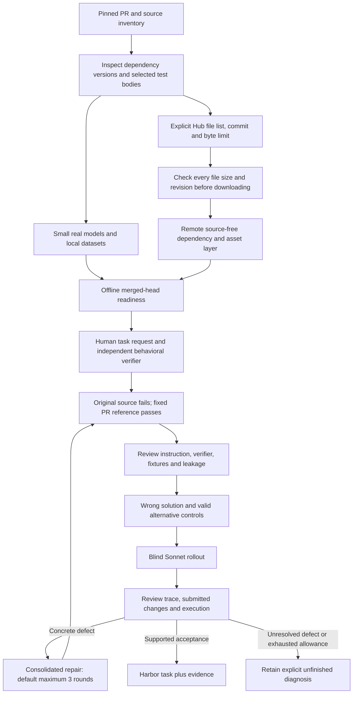

# Tasksmith recovery: offline assets and bounded repairs

September 13, 2026 recovery checkpoint. The user authorized an additional $100,
raising the total campaign cap to **$600**. Authorization preserves charged
operations and unresolved reservations.

**23 of 30 tasks have completed acceptance:** nine Accelerate, nine TRL, four PEFT,
and one Transformers. This includes the original ten tasks and thirteen additions.
The latest four additions cover TRL parsing and tokenization caching, chunked CUDA
log-probabilities, and Accelerate FSDP2 embedding/norm sharding. Generation and
recovery remain incomplete. The machine-readable timestamp and budget are in
[the checkpoint](evidence/tasksmith-scale30-recovery.json).

Sonnet 4.6 solved **10 of the 23 accepted tasks** in their recorded blind rollouts:
Accelerate 5/9, TRL 3/9, PEFT 2/4 and Transformers 0/1. The other thirteen were
reviewed as legitimate solver failures, with no infrastructure exception in their
final results. This is one observed rollout per task, not a repeated estimate of
solver success probability. See [the outcome records](evidence/tasksmith-sonnet-outcomes-23.json).

The 23-task archive contains **128 bound trial records** and preserves source and
reference trees from first construction. Its integrity audit scanned 55,457 files
for the seven configured credential values and found no matches. Verifier-only
continuations include original raw results, artifact hashes and portable provenance.
The archive checksum and receipt are in the machine-readable checkpoint.

The [full-list budget estimate](tasksmith_full_list_budget.md) covers the original
114 PRs. It is a proposal for additional work, not an increase to the current cap.

## Changes to the pipeline

The author can now declare `hub_assets` in a repository profile. Each entry specifies
one public model/tokenizer repository, an immutable commit, exact data filenames,
a maximum download size, and its purpose. Assets are fetched during remote image
construction. The layer is independent of repository source; revisions and file
lists affect its cache identity, while explanatory wording does not.

Both image readiness and exported tasks use this recipe. The private grader preserves
the image's cache paths and offline flags when switching to its unprivileged child.
It does not forward model-provider credentials. CPU and CUDA images retain their
existing separate build and execution paths.

The review-and-repair component defaults to three repairs, configurable through
`max_repairs` or the existing `--max-repairs` option. Prompts expose the remaining
rounds and request one consolidated correction of known defects. Wrong and valid
controls remain attached to subsequent revisions. The controller can deduplicate
identical proposed controls, rename a colliding probe without changing its script,
and resolve an omitted verifier directory only when one existing file contains
the exact requested old text once. These mechanical corrections are recorded;
ambiguous edits and changes to protected source/reference still fail. A shortened
test-result key can be resolved only when a complete JSON document contains one
matching test name with the identical value; the recorded citation then uses the
actual document bytes. Prose claims are not inferred or rewritten.

A complete, metered author response that is truncated or contains no usable output
can receive one new attempt. It shares the original stage's cost, turn and deadline
limits. Partial tool arguments are not executed. Unknown transport outcomes retain
their cost reservations and are not replayed automatically. Native Modal directory
uploads now verify the archive checksum before extraction and permit up to three
transfers of the same temporary file. A corrupt transfer does not trigger a new
sandbox allocation or solver run; cancellation is not retried.

Repository semantic controls now hash their explicitly collected mutable submission
before and after the probe. A script that only runs extra assertions, writes outside
the collection boundary or rewrites identical bytes cannot count as an installed
control. For parseable Python it also compares syntax trees, ignoring comments and
formatting; byte hashes remain recorded. Unsupported syntax falls back to byte
comparison. The audit does not import target code, and changed syntax alone does not
establish a meaningful alternative; the reviewer still checks semantics. Existing frozen
receipts are retained and are not retroactively relabeled by this new guard.

Bootstrap and private grading clear repository pytest `addopts` before applying
explicit test selections. This prevents optional coverage plugins from breaking an
isolated run with plugin autoload disabled. The native adapter releases a solver
hold only when all allocation receipts prove a pre-dispatch reservation denial and
Harbor explicitly records no agent execution or result. If the learner completed
and a subsequent verifier allocation was denied, the adapter retains its recorded
model cost instead of the full solver hold. This requires completed agent timing,
a finite nonnegative cost, and allocation receipts showing only verifier denials
and terminated environments. A timed-out provider call does not satisfy this proof.
Other unknown outcomes keep their reservations. For single-step native trials,
Harbor's verification-start hook now records and settles a normally completed
agent's usage before allocating the verifier. This releases unused model funds at
the phase boundary. Multi-step trials and agents with errors retain the existing
end-of-trial accounting path. The quality loop also stops on a budget-denied trial
before requesting a paid diagnosis or repair.

For TRL #5349, a recorded campaign continuation copied the completed learner's
collected artifacts byte for byte into a fresh private verifier. It retained the
original interrupted result and trace, recorded the separate continuation, and
performed no new solver call. This is an audited campaign recovery; automatic
verifier resumption is not yet exposed through the general CLI.

## What the remote checks establish

| Check | Observed result | Limit of the evidence |
|---|---|---|
| Pinned Qwen tokenizer preparation | Passed on Modal; second build reused the exact image | Does not establish every tokenizer or checkpoint is compatible |
| Offline tokenizer use | Passed with Docker networking disabled | Selected tokenizer files only; no pretrained weights downloaded |
| Unprivileged grader cache access | Passed as UID 1001 with the grader's child environment | Cache availability is separate from correctness of a repository's tests |
| Helium | Accepted with baseline/reference, four retained semantic controls and reviewed rollout | One frozen PR and tested small configurations |
| KTO margins | Accepted with local fixtures, semantic controls and reviewed rollout | No hosted dataset or pretrained checkpoint required |

The tokenizer-dependent TRL #5791 run exposed two upstream tests that call the
new parser without its required `prefix`. The accepted task retains the actual
TRL parsing tests and adds prefix-aware behavioral coverage. Its final valid
control changes the executable version comparison; a previous comment-only control
is explicitly held out. The cache task uses real dataset hashing and cache reuse
across trainer state, including an unpicklable trainer attribute.

The GPU investigations demonstrate why an oracle pass and a numerical quality
score are insufficient. Accelerate #3142 originally accepted a control that
removed FSDP dispatch information. Its final verifier rejects version-boundary and
FSDP-dispatch regressions. TRL #5575 isolates real CUDA training memory and rejects
retained dense vocabulary activations. TRL #5349 checks real CUDA values, gradients
and activation memory. Accelerate #4015 runs actual two-rank sharding. Each has a
reviewed blind rollout. Raising thresholds to match a failing reference is not an
acceptance method.

The remaining work includes MetaCLIP controls/rollout, a prepared interpreter fix
for the device-mesh verifier, Diffusers offline runtime repair, production-path
coverage for TRL environment pooling, and unfinished model/compile/FP8 tasks.
Prepared or partially passing candidates are not counted as accepted.

## Budget at the checkpoint

2026-09-13T14:33:44.109548+00:00:
**$579.01 accounted,
$20.59 reserved, $0.40 unreserved.**
The accounted figure includes the previously recorded $22.43 external cost.
Compute amounts are conservative estimates, not provider invoices. Reservations
include unresolved historical operations and active native trials; they are not
all charges. Every new operation is checked against the campaign ledger and its
recovery/run allowances.

An older four-dollar solver reservation was reconciled to $0.314850 after confirming
that the timeout occurred during a terminal command, with all completed model usage
recorded. Other interrupted provider calls retain their reservations. This released
$3.685150 within the existing cap. The MetaCLIP finishing attempt uses a $1.50 solver
reservation: across the 23 accepted trials, recorded solver costs range from $0.04 to
$0.77, with a $0.22 median. Turn/token limits and the three-dollar native allocation
reservation are unchanged; all actual usage is still accounted.

No target images, models or repository tests execute on the local machine.
