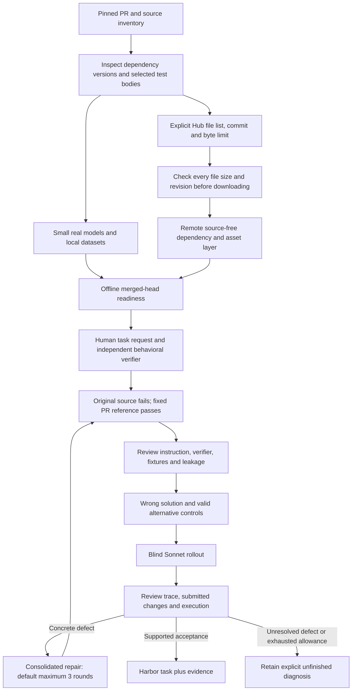

# Tasksmith recovery: offline assets and bounded repairs

September 13, 2026, 12:36 UTC checkpoint. The user authorized an additional $100,
raising the total campaign cap to **$600**. The authorization is recorded without
resetting any charged operation or unresolved reservation.

**16 of 30 tasks have completed acceptance.** This includes the ten original tasks,
the four additions in the preceding delivery, Transformers #35669 (Helium), and
TRL #6150 (KTO margins). Recovery and generation remain in progress. The existing
14-task archive remains an earlier delivery; a running task is not included in
the accepted count. The machine-readable checkpoint is
[tasksmith-scale30-recovery.json](evidence/tasksmith-scale30-recovery.json).

## Changes to the pipeline

The author can now declare `hub_assets` in a repository profile. Each entry specifies
one public model/tokenizer repository, an immutable commit, exact data filenames,
a maximum download size, and its purpose. Assets are fetched during remote image
construction. The layer is independent of repository source; revisions and file
lists affect its cache identity, while explanatory wording does not.

Both image readiness and exported tasks use this recipe. The private grader preserves
the image's cache paths and offline flags when switching to its unprivileged child.
It does not forward model-provider credentials. CPU and CUDA images retain their
existing separate build and execution paths.

The review-and-repair component defaults to three repairs, configurable through
`max_repairs` or the existing `--max-repairs` option. Prompts expose the remaining
rounds and request one consolidated correction of known defects. Wrong and valid
controls remain attached to subsequent revisions. The controller can deduplicate
identical proposed controls, rename a colliding probe without changing its script,
and resolve an omitted verifier directory only when one existing file contains
the exact requested old text once. These mechanical corrections are recorded;
ambiguous edits and changes to protected source/reference still fail. A shortened
test-result key can be resolved only when a complete JSON document contains one
matching test name with the identical value; the recorded citation then uses the
actual document bytes. Prose claims are not inferred or rewritten.

A complete, metered author response that is truncated or contains no usable output
can receive one new attempt. It shares the original stage's cost, turn and deadline
limits. Partial tool arguments are not executed. Unknown transport outcomes retain
their cost reservations and are not replayed automatically. Native Modal directory
uploads now verify the archive checksum before extraction and permit up to three
transfers of the same temporary file. A corrupt transfer does not trigger a new
sandbox allocation or solver run; cancellation is not retried.

## What the remote checks establish

| Check | Observed result | Limit of the evidence |
|---|---|---|
| Pinned Qwen tokenizer preparation | Passed on Modal; second build reused the exact image | Does not establish every tokenizer or checkpoint is compatible |
| Offline tokenizer use | Passed with Docker networking disabled | Selected tokenizer files only; no pretrained weights downloaded |
| Unprivileged grader cache access | Passed as UID 1001 with the grader's child environment | Cache availability is separate from correctness of a repository's tests |
| Helium | Accepted with baseline/reference, four retained semantic controls and reviewed rollout | One frozen PR and tested small configurations |
| KTO margins | Accepted with local fixtures, semantic controls and reviewed rollout | No hosted dataset or pretrained checkpoint required |

The tokenizer-dependent TRL #5791 run exposed a second, independent readiness problem:
two upstream tests call the new tokenizer parser without its required `prefix`.
The two actual TRL parsing tests pass offline. The next attempt retains those tests
and requests additional prefix-aware behavioral coverage. The original failed
readiness receipts remain available.

The ongoing GPU investigations also demonstrate why an oracle pass and a numerical
quality score are insufficient. Accelerate #3142 originally accepted a control
that discarded FSDP dispatch information. Accelerate #3720 used incompatible
distributed fixtures. TRL #5575's memory checks need to isolate the intended
training workload from unrelated attention and retained graph allocations.
These tasks remain unfinished until their concrete checks support acceptance;
raising thresholds to match a failing reference is not an acceptance method.

## Budget at the checkpoint

**$501.00 accounted, $59.58 reserved, $39.42 unreserved.** The accounted figure
includes the previously recorded $22.43 external cost. Compute amounts are
conservative estimates, not provider invoices. Reservations include unresolved
historical operations and currently owned workers/trials; they are not all charges.
Every new operation is checked against the campaign ledger and its recovery/run
allowances. No target images, models or repository tests execute on the local machine.
