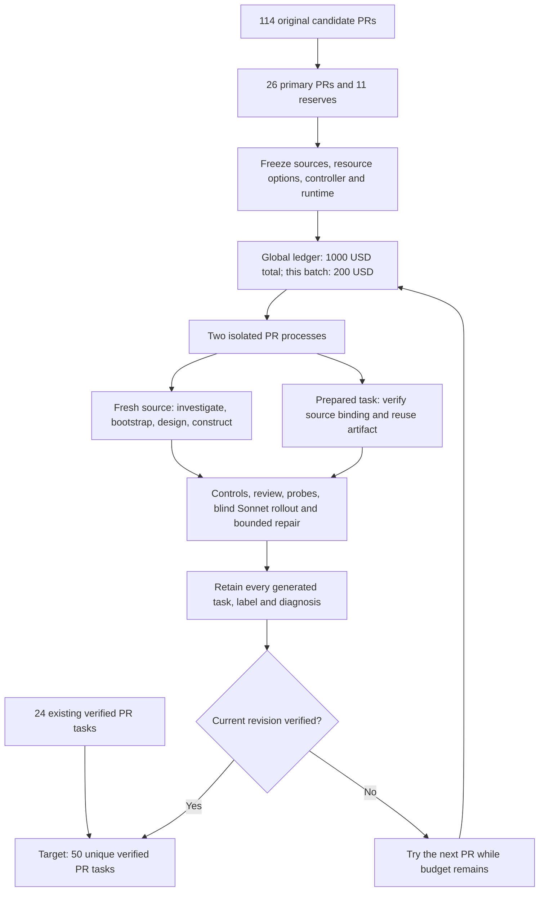

# Tasksmith: retain outputs and expand to 50 verified PR tasks

The September 13 expansion starts with **24 verified PR tasks** and targets **50**
from the original 114-PR list. A frozen panel contains 26 primary candidates and
11 reserves, with two independent PR controllers running concurrently. The first
eight candidates use small CPU workloads; later candidates include real GPU
execution. A task counts only after the shared quality profile verifies its exact
revision. Solver failure can be legitimate and does not by itself reject a task.

## Retain every generated environment

The initial historical catalog contains 319 Harbor task copies: 291 reproduction
outputs from 14 recipes and 28 Tasksmith PR outputs. It records 24 verified tasks,
27 tasks needing repair and 268 unverified tasks. Unverified does not mean bad:
historical controls and assistant ratings remain available, but do not establish
the complete quality profile for those exact originals.

Every copy carries the same `metadata.repo2env.evaluation` table in `task.toml`.
The original configurations, tasks and trial records remain unchanged. The
catalog also references 134 previous Tasksmith revisions, including a stale
intermediate task with an integrity failure; that revision is not accepted.

The local catalog lives at `workspace/tasksmith-scale50/catalog/`. Its
`SUMMARY.md`, `summary.json` and `index.json` provide counts and task paths.
These copies reference original evidence; they are not a portable replacement
for the complete archived task-and-evidence deliveries.

## Execution and budget



The overall authorization is **$1,000**, including historical costs. The next
batch has its own **$200 ceiling**, covering failed attempts as well as accepted
outputs. Historical unresolved reservations remain held. At launch, historical
accounted costs were $580.44 and unresolved holds were $16.09. Compute accounting
uses conservative allocation estimates rather than provider invoices.

Reservations for builders, authoring, review, repair, solvers and native GPU
allocations share the same SQLite transaction. Worker lifetimes are explicit:
3,600 seconds with a $3 reservation for the smaller CPU profile, and 4,800 seconds
with $4 for larger workers. Model reservations are based on observed costs;
reported overruns remain visible and reduce later headroom.

The coding runtime is Pi with Sonnet; review, repair and blind rollouts also use
Sonnet. Repairs remain capped at three. The three prepared-task recoveries are
Accelerate mesh ownership, TRL environment pooling and Diffusers LoRA loading.
Each receives fresh quality checks. New tasks may need more work than the batch
can fund; fifty successes within $200 is a target, not a measured guarantee.

## Inspect or resume

```bash
repo2rlenv tasksmith show workspace/tasksmith-scale50/batch-v1
repo2rlenv tasks list workspace/tasksmith-scale50/catalog --status needs_repair
repo2rlenv tasks show PATH_TO_TASK --json
```

The active batch uses `workspace/tasksmith-scale50/batch-plan-v1.json`; its
configuration, frozen runtime, subprocess logs and live report are under
`workspace/tasksmith-scale50/batch-v1/`. Completed attempts are not blindly
repeated. Provider or child-process uncertainty stops dispatch until receipts
are reconciled. The controller stops admitting work once the target or batch
allowance is reached.

See [parallel campaign contracts](tasksmith_parallel_campaigns.md),
[evaluation label semantics](task_evaluation_labels.md), and the
[autonomy audit](tasksmith_autonomy.md). Historical acceptance includes assisted
work; the new batch's unattended yield must be measured from its own receipts.
